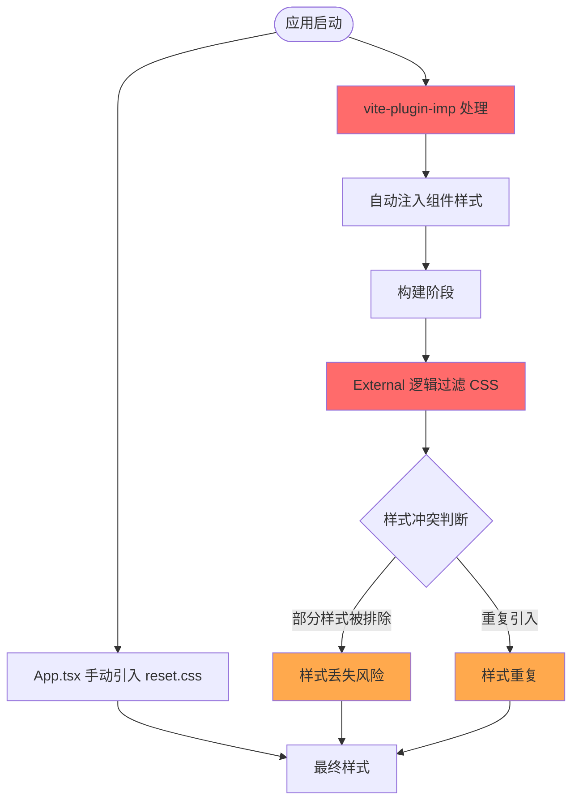
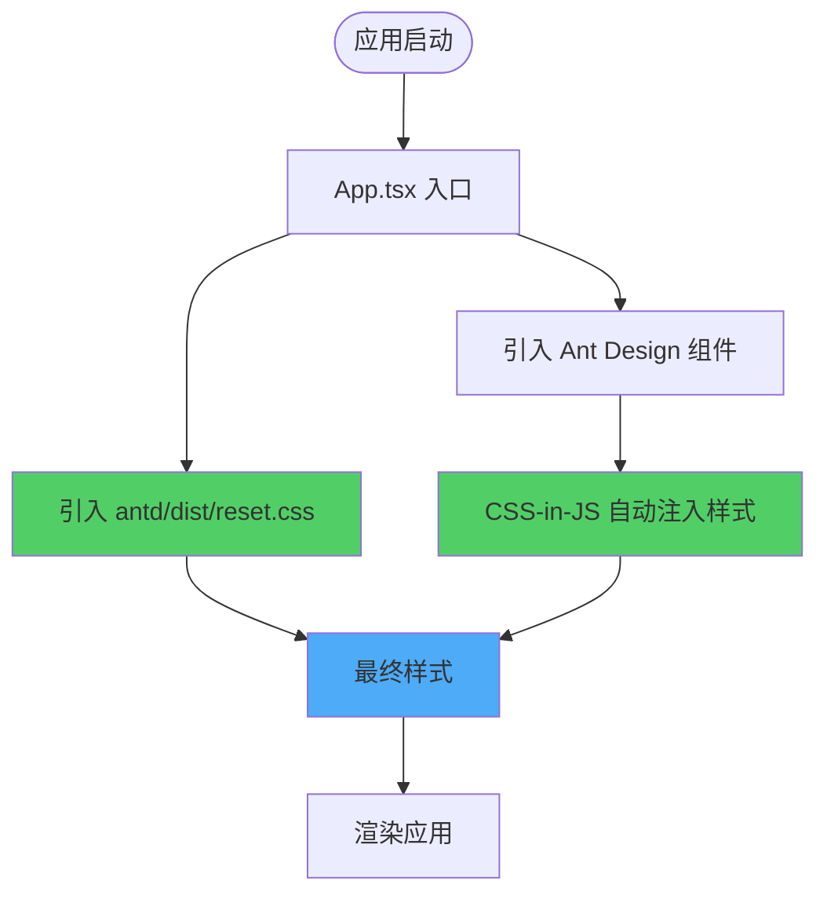
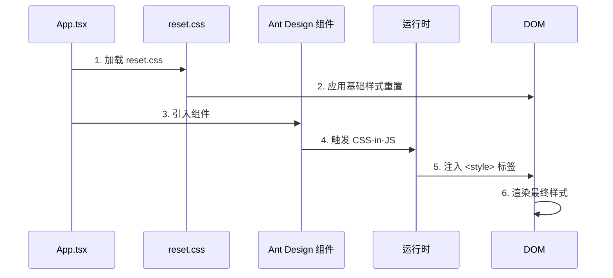
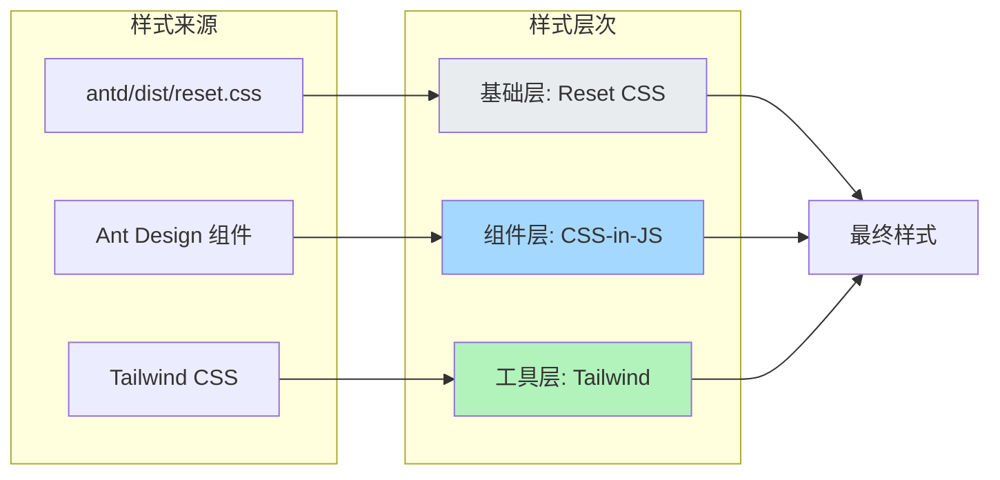
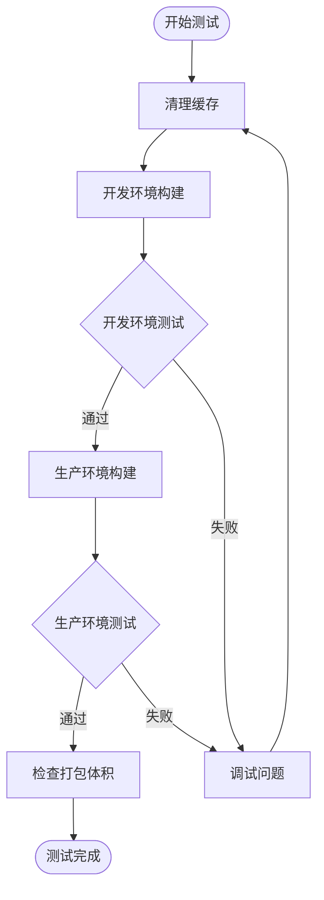
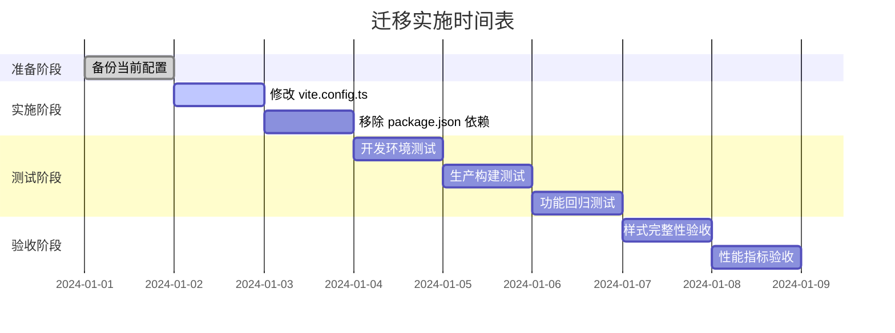
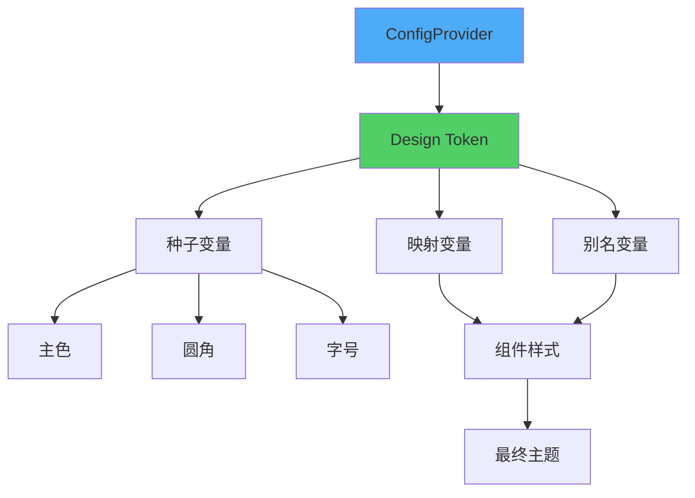

# 移除已废弃插件并更新样式引入方式

## 概述

### 背景

当前项目使用了已废弃的 `vite-plugin-imp` 插件来处理 Ant Design 的按需加载和样式处理，同时在 Vite 构建配置中对 Ant Design 组件的 CSS 导入做了 external 处理。这种方式存在以下问题：

- `vite-plugin-imp` 已不再维护，与现代构建工具链兼容性差
- 与 Ant Design v5 的 CSS-in-JS 架构不兼容
- external 样式逻辑可能导致打包混乱和样式加载问题
- 增加了构建配置的复杂度

### 目标

移除所有已废弃的插件和 external 逻辑，采用 Ant Design v5 推荐的样式引入方式，确保样式系统简洁、稳定且符合最佳实践。

### 价值

- **兼容性提升**：完全兼容 Ant Design v5 的 CSS-in-JS 架构
- **构建稳定性**：避免因插件废弃导致的潜在构建错误
- **样式加载可靠**：消除样式加载顺序和打包混乱问题
- **维护性增强**：简化构建配置，降低维护成本
- **性能优化**：Ant Design v5 的 CSS-in-JS 默认支持按需加载，无需额外插件

## 当前架构分析

### 现有配置结构

当前项目的样式处理涉及三个关键部分：

| 配置位置                  | 功能                                    | 问题                          |
| ------------------------- | --------------------------------------- | ----------------------------- |
| `vite.config.ts` 插件配置 | 使用 `vite-plugin-imp` 进行样式按需加载 | 插件已废弃，与 antd v5 不兼容 |
| `vite.config.ts` 构建配置 | external 排除 antd CSS 文件             | 可能导致样式丢失或打包错误    |
| `src/App.tsx`             | 手动引入 `antd/dist/reset.css`          | 正确做法，需保留              |

### 样式处理流程



### 存在的问题

#### 插件层问题

- `vite-plugin-imp` 尝试按组件名动态注入样式路径（如 `antd/es/button/style/index.js`）
- Ant Design v5 已采用 CSS-in-JS，不再提供独立的样式文件
- 插件注入逻辑失效，可能引发构建警告或错误

#### 构建配置问题

- `rollupOptions.external` 排除了 `antd/es/**/*.css.js` 文件
- 与实际的 CSS-in-JS 架构不匹配
- 可能导致打包产物不一致

#### 样式加载问题

- 混合使用自动注入和手动引入，逻辑不清晰
- 难以追踪样式来源和加载顺序
- 增加调试难度

## 目标架构设计

### 架构原则

| 原则         | 说明                            |
| ------------ | ------------------------------- |
| **简洁性**   | 移除所有不必要的插件和配置      |
| **官方推荐** | 遵循 Ant Design v5 官方最佳实践 |
| **显式引入** | 样式引入方式清晰可追踪          |
| **零配置**   | 利用 CSS-in-JS 自动按需加载特性 |

### 新的样式处理流程



### 配置简化对比

| 配置项        | 当前方式                | 目标方式                      |
| ------------- | ----------------------- | ----------------------------- |
| Vite 插件     | 包含 `vite-plugin-imp`  | 仅保留 `@vitejs/plugin-react` |
| 样式预处理    | 配置 Less 支持          | 移除（antd v5 不需要）        |
| 构建 external | 排除 antd CSS 文件      | 移除该逻辑                    |
| 样式引入      | 插件自动注入 + 手动引入 | 仅手动引入 reset.css          |

## 详细设计

### Vite 配置调整

#### 需移除的配置

**插件部分**

- 移除 `vite-plugin-imp` 导入声明
- 移除 `vitePluginImp()` 插件调用
- 删除整个 `libList` 配置块

**CSS 预处理器部分**

- 移除 `css.preprocessorOptions.less` 配置
- Ant Design v5 不再依赖 Less

**构建配置部分**

- 移除 `build.rollupOptions.external` 函数
- 移除对 antd CSS 文件的 external 判断逻辑

#### 保留的配置

| 配置项                 | 说明           | 原因         |
| ---------------------- | -------------- | ------------ |
| `@vitejs/plugin-react` | React 插件     | 核心功能必需 |
| `resolve.alias`        | 路径别名       | 项目开发体验 |
| `server.port`          | 开发服务器端口 | 开发环境配置 |

#### 简化后的配置结构

```mermaid
graph TD
    ViteConfig[Vite 配置] --> Plugins[plugins]
    ViteConfig --> Resolve[resolve]
    ViteConfig --> Server[server]

    Plugins --> ReactPlugin[@vitejs/plugin-react]

    Resolve --> Alias[alias: @]

    Server --> Port[port: 3123]

    style ViteConfig fill:#4dabf7
    style Plugins fill:#51cf66
    style Resolve fill:#51cf66
    style Server fill:#51cf66
```

### 样式引入策略

#### 应用入口样式管理

**保留的引入**

- `antd/dist/reset.css`：提供 Ant Design 的样式重置
  - 包含基础 CSS Reset
  - 统一浏览器默认样式
  - 为组件提供一致的基础样式环境

**引入位置**

- 在 `src/App.tsx` 中保持现有引入
- 位于组件导入之前，确保样式优先级正确

#### 组件样式加载机制

| 机制               | 说明                                                    |
| ------------------ | ------------------------------------------------------- |
| CSS-in-JS 自动注入 | Ant Design v5 组件在运行时自动注入样式到 `<style>` 标签 |
| 按需加载           | 仅注入实际使用组件的样式                                |
| 动态管理           | 组件卸载时自动清理样式                                  |
| 主题支持           | 通过 ConfigProvider 实现主题定制                        |



### 依赖包管理

#### 移除的依赖

| 包名              | 当前版本 | 移除原因               |
| ----------------- | -------- | ---------------------- |
| `vite-plugin-imp` | 2.4.0    | 已废弃，不兼容 antd v5 |

#### 保留的依赖

| 包名                         | 当前版本 | 说明       |
| ---------------------------- | -------- | ---------- |
| `antd`                       | 5.27.6   | 核心组件库 |
| `@ant-design/icons`          | ^6.0.0   | 图标库     |
| `@ant-design/pro-components` | ^2.8.10  | Pro 组件库 |

### 样式加载时序设计

```mermaid
gantt
    title 样式加载时序
    dateFormat X
    axisFormat %L

    section 初始化
    应用启动           :0, 100

    section 样式加载
    加载 reset.css    :100, 200
    应用基础样式      :200, 300

    section 组件渲染
    渲染组件          :300, 400
    CSS-in-JS 注入    :350, 450

    section 完成
    样式计算完成      :450, 500
    首次渲染完成      :500, 600
```



### 兼容性保障

#### Ant Design 版本兼容性

| 特性     | Ant Design v4    | Ant Design v5 | 本方案                |
| -------- | ---------------- | ------------- | --------------------- |
| 样式系统 | Less             | CSS-in-JS     | ✓ 完全兼容            |
| 按需加载 | 需插件支持       | 内置支持      | ✓ 无需配置            |
| 样式引入 | 需手动或插件处理 | reset.css     | ✓ 仅需引入 reset      |
| 主题定制 | Less 变量        | Design Token  | ✓ 支持 ConfigProvider |

#### 与 Tailwind CSS 集成

当前项目同时使用 Ant Design 和 Tailwind CSS，样式集成策略：



### 迁移影响分析

#### 变更范围

| 文件路径         | 变更类型 | 影响程度 |
| ---------------- | -------- | -------- |
| `vite.config.ts` | 配置简化 | 中       |
| `package.json`   | 移除依赖 | 低       |
| `src/App.tsx`    | 无变更   | 无       |
| 其他组件文件     | 无变更   | 无       |

#### 风险评估

| 风险项   | 概率 | 影响 | 缓解措施                     |
| -------- | ---- | ---- | ---------------------------- |
| 样式丢失 | 低   | 高   | 验证所有页面样式渲染正常     |
| 构建失败 | 低   | 中   | 清理缓存后重新构建           |
| 主题失效 | 极低 | 中   | 确认 ConfigProvider 配置正确 |
| 性能下降 | 极低 | 低   | CSS-in-JS 本身支持按需加载   |

## 测试策略

### 测试范围

#### 样式渲染验证

| 测试项     | 验证点                                        |
| ---------- | --------------------------------------------- |
| 基础组件   | Button、Input、Form 等常用组件样式正常        |
| 布局组件   | Layout、Grid、Space 等布局样式正确            |
| 复杂组件   | Table、Modal、Drawer 等复杂组件交互样式无异常 |
| 自定义主题 | ConfigProvider 配置的主题生效                 |

#### 构建验证



#### 功能回归测试

| 功能模块 | 测试重点                         |
| -------- | -------------------------------- |
| 登录页面 | 表单样式、按钮状态、错误提示样式 |
| 首页     | 布局样式、列表样式、卡片样式     |
| 设置页面 | 表单组件样式、提示信息样式       |
| 404 页面 | 错误页面样式展示                 |

### 测试环境

| 环境       | 验证内容                                 |
| ---------- | ---------------------------------------- |
| 开发环境   | HMR 热更新、样式实时刷新、控制台无警告   |
| 生产构建   | 构建成功、打包体积合理、无样式缺失       |
| 浏览器兼容 | Chrome、Firefox、Safari、Edge 样式一致性 |

### 验收标准

#### 必须满足的条件

- [ ] 所有页面样式渲染正常，无缺失或错乱
- [ ] 开发环境构建无警告和错误
- [ ] 生产环境构建成功
- [ ] 所有现有测试用例通过
- [ ] 浏览器控制台无样式相关错误
- [ ] 打包体积未明显增加（允许 ±5% 波动）

#### 性能指标

| 指标             | 目标                      |
| ---------------- | ------------------------- |
| 开发环境启动时间 | 与原有基本一致            |
| 生产构建时间     | 缩短或持平                |
| 首屏样式加载     | 无 FOUC（无样式内容闪烁） |
| 运行时内存       | 无明显增长                |

## 迁移步骤

### 阶段划分



### 详细步骤

#### 步骤 1：配置清理

**Vite 配置调整**

- 移除 `vite-plugin-imp` 的 import 语句
- 从 plugins 数组中移除 `vitePluginImp()` 调用
- 删除 `css.preprocessorOptions.less` 配置块
- 移除 `build.rollupOptions.external` 配置

**验证点**

- 配置文件语法正确
- 无未使用的 import

#### 步骤 2：依赖清理

**移除依赖包**

- 从 `package.json` 删除 `vite-plugin-imp`
- 执行依赖重新安装

**验证点**

- `package.json` 无多余依赖
- `yarn.lock` 或 `package-lock.json` 已更新

#### 步骤 3：样式引入验证

**检查清单**

- [ ] `src/App.tsx` 中保留 `import "antd/dist/reset.css"`
- [ ] 样式引入位于组件导入之前
- [ ] 无其他 antd 样式文件的手动引入
- [ ] Tailwind CSS 引入正常（`import "./styles/tailwind.css"`）

#### 步骤 4：构建测试

**开发环境测试**

- 清理 `node_modules` 和构建缓存
- 启动开发服务器
- 访问所有页面验证样式

**生产构建测试**

- 执行生产构建命令
- 检查构建产物
- 预览生产构建

**验证指标**

- 构建过程无错误和警告
- 样式文件正常生成
- 打包体积在合理范围

#### 步骤 5：回归测试

**自动化测试**

- 运行单元测试：`yarn test`
- 运行 E2E 测试：`yarn e2e:run`

**人工测试**

- 登录流程完整测试
- 首页功能测试
- 设置页面测试
- 异常页面测试

### 回滚方案

如遇到无法解决的问题，可按以下步骤回滚：

| 步骤 | 操作                       |
| ---- | -------------------------- |
| 1    | 恢复 `vite.config.ts` 备份 |
| 2    | 恢复 `package.json` 备份   |
| 3    | 重新安装依赖               |
| 4    | 清理构建缓存               |
| 5    | 验证应用正常运行           |

## 后续优化建议

### 样式性能优化

| 优化项              | 说明                                    | 优先级 |
| ------------------- | --------------------------------------- | ------ |
| 按需引入组件        | 仅引入实际使用的组件                    | 中     |
| ConfigProvider 优化 | 配置合理的主题 token                    | 低     |
| 样式提取            | 考虑使用静态 CSS 提取（未来 antd 支持） | 低     |

### 主题定制增强

利用 Ant Design v5 的 Design Token 系统进行深度定制：



### 监控与维护

| 监控项   | 方式                     |
| -------- | ------------------------ |
| 构建警告 | 定期检查构建日志         |
| 样式异常 | 浏览器控制台监控         |
| 依赖更新 | 跟踪 Ant Design 版本更新 |
| 性能指标 | 定期评估首屏加载时间     |
