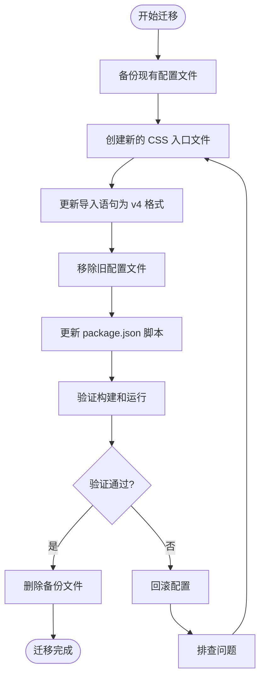
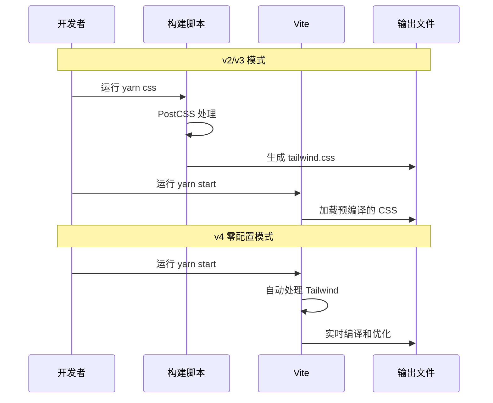

# Tailwind CSS 迁移到 v4 零配置方案设计文档

## 1. 概述

### 1.1 迁移目标

将项目中的 Tailwind CSS 从当前的 v2/v3 配置模式迁移到 v4 零配置方案，简化配置管理，提升开发体验和构建性能。

### 1.2 当前状态分析

项目已安装 `tailwindcss@4.1.15`，但配置文件仍采用 v2/v3 的传统模式，存在以下问题：

| 问题类型   | 具体表现                        | 影响                       |
| ---------- | ------------------------------- | -------------------------- |
| 配置冲突   | 使用已废弃的 `purge` 配置项     | 与 v4 版本不兼容           |
| 冗余配置   | PostCSS 配置中手动配置 purgecss | v4 内置优化，无需手动配置  |
| 构建复杂性 | 需要单独的 `css` 脚本预编译样式 | 增加构建步骤，降低开发效率 |
| 文件组织   | Tailwind 配置散落在多个文件中   | 维护成本高                 |

### 1.3 迁移收益

| 收益维度 | 具体价值                                                           |
| -------- | ------------------------------------------------------------------ |
| 配置简化 | 移除 `tailwind.config.js` 和 `postcss.config.js`，减少配置文件维护 |
| 构建性能 | 利用 v4 新引擎（Oxide）提升编译速度                                |
| 开发体验 | 无需手动运行 CSS 编译脚本，Vite 集成自动处理                       |
| 功能增强 | 支持 CSS 原生特性（容器查询、嵌套等）                              |
| 兼容性   | 与项目现有技术栈（React 19、Vite 7）完美适配                       |

## 2. 架构变更

### 2.1 文件结构变更

#### 现有结构

```
src/tailwind/
├── index.css           # Tailwind 入口文件（包含 @tailwind 指令）
├── tailwind.css        # 编译后的输出文件
├── tailwind.config.js  # Tailwind 配置文件
└── postcss.config.js   # PostCSS 配置文件
```

#### 目标结构

```
src/
└── styles/
    └── tailwind.css    # 统一的样式入口文件
```

### 2.2 配置模式转变

```mermaid
graph LR
    A[v2/v3 传统模式] --> B[v4 零配置模式]

    A --> A1[tailwind.config.js]
    A --> A2[postcss.config.js]
    A --> A3[独立 CSS 编译脚本]
    A --> A4[@tailwind 指令]

    B --> B1[CSS 原生 @import]
    B --> B2[Vite 内置处理]
    B --> B3[自动优化]
```

### 2.3 导入方式变更对比

| 配置项     | v2/v3 模式                     | v4 零配置模式               |
| ---------- | ------------------------------ | --------------------------- |
| 基础样式   | `@tailwind base;`              | `@import "tailwindcss";`    |
| 组件样式   | `@tailwind components;`        | 已整合到 `tailwindcss` 中   |
| 工具类样式 | `@tailwind utilities;`         | 已整合到 `tailwindcss` 中   |
| 自定义主题 | 在 `tailwind.config.js` 中配置 | 在 CSS 中使用 `@theme` 指令 |
| PurgeCSS   | 手动配置 content 路径          | 自动检测项目文件            |

## 3. 迁移策略

### 3.1 迁移原则

1. **无破坏性**：确保现有 Tailwind 类名和样式不受影响
2. **渐进式**：先验证配置兼容性，再删除冗余文件
3. **可回滚**：保留备份，确保可快速回退
4. **最小化改动**：仅修改配置层，不涉及业务代码

### 3.2 迁移流程



### 3.3 迁移步骤详解

#### 步骤 1：备份现有配置

- 备份目标文件：
  - `src/tailwind/tailwind.config.js`
  - `src/tailwind/postcss.config.js`
  - `src/tailwind/index.css`
  - `src/tailwind/tailwind.css`

#### 步骤 2：创建新的样式入口

在 `src/styles/tailwind.css` 中使用 v4 新语法：

```
@import "tailwindcss";
```

#### 步骤 3：更新应用入口引用

修改 `src/index.tsx` 中的导入路径：

- 原路径：`./tailwind/tailwind.css`
- 新路径：`./styles/tailwind.css`

#### 步骤 4：移除冗余配置

删除以下文件和目录：

- `src/tailwind/` 整个目录
- 无需删除 `tailwindcss` 依赖包（版本保持 4.x）

#### 步骤 5：清理构建脚本

从 `package.json` 中移除 `css` 脚本：

```
"css": "postcss --config src/tailwind src/tailwind/index.css -o src/tailwind/tailwind.css"
```

#### 步骤 6：验证和测试

- 启动开发服务器，确认样式正常加载
- 执行生产构建，验证 CSS 优化和压缩
- 运行单元测试和 E2E 测试，确保功能完整

## 4. 自定义配置迁移

### 4.1 当前配置分析

当前 `tailwind.config.js` 配置：

```
{
  purge: ["./src/**/*.{js,jsx,ts,tsx}", "./public/index.html"],
  darkMode: false,
  theme: { extend: {} },
  variants: { extend: {} },
  plugins: []
}
```

### 4.2 配置迁移映射

| v2/v3 配置项   | 当前值       | v4 迁移方案                                                   |
| -------------- | ------------ | ------------------------------------------------------------- |
| `purge`        | 指定扫描路径 | 无需配置，v4 自动检测                                         |
| `darkMode`     | `false`      | 若需启用，在 CSS 中使用 `@media (prefers-color-scheme: dark)` |
| `theme.extend` | 空对象       | 若需扩展，使用 `@theme` 指令                                  |
| `variants`     | 空对象       | v4 默认启用所有变体                                           |
| `plugins`      | 空数组       | 无需迁移                                                      |

### 4.3 主题自定义示例（如需扩展）

若未来需要自定义主题，在 `src/styles/tailwind.css` 中使用：

```
@import "tailwindcss";

@theme {
  --color-primary: #1890ff;
  --spacing-custom: 1.5rem;
}
```

## 5. 构建集成变更

### 5.1 Vite 集成方式

#### 现有方式

1. 通过 `postcss.config.js` 手动配置 Tailwind 和 PurgeCSS
2. 需要运行独立的 `css` 脚本生成样式文件
3. Vite 加载已编译的 `tailwind.css`

#### v4 零配置方式

1. Vite 直接处理 `@import "tailwindcss"` 语句
2. 开发模式和生产构建自动优化
3. 无需额外配置或脚本

### 5.2 构建流程对比



### 5.3 构建性能提升

| 指标       | v2/v3 模式          | v4 零配置模式           | 提升幅度         |
| ---------- | ------------------- | ----------------------- | ---------------- |
| 冷启动时间 | 需要先运行 css 脚本 | 无需预编译              | 减少一个构建步骤 |
| 热更新速度 | 依赖 PostCSS 处理   | Oxide 引擎加速          | 约 2-5 倍提升    |
| 生产构建   | 手动 PurgeCSS 优化  | 自动优化和 Tree-shaking | 相当或更优       |

## 6. 兼容性考量

### 6.1 现有代码兼容性

| 代码类型        | 兼容性   | 说明                                    |
| --------------- | -------- | --------------------------------------- |
| Tailwind 工具类 | 完全兼容 | 如 `flex`、`text-2xl`、`bg-blue-500` 等 |
| 响应式前缀      | 完全兼容 | 如 `md:`、`lg:`                         |
| 状态变体        | 完全兼容 | 如 `hover:`、`focus:`                   |
| 自定义类名      | 完全兼容 | 项目中未使用自定义主题                  |

### 6.2 依赖兼容性

| 依赖项     | 当前版本         | v4 兼容性       | 备注                |
| ---------- | ---------------- | --------------- | ------------------- |
| Vite       | 7.1.9            | ✅ 完全支持     | Vite 5+ 原生支持 v4 |
| React      | 19.1.1           | ✅ 无影响       | 纯样式层变更        |
| Ant Design | 5.27.6           | ✅ 无冲突       | 独立样式系统        |
| PostCSS    | 依赖中无显式版本 | ✅ 无需手动配置 | v4 内置处理         |

### 6.3 浏览器兼容性

Tailwind CSS v4 要求的浏览器支持：

- Chrome >= 90
- Firefox >= 88
- Safari >= 14.1
- Edge >= 90

## 7. 风险评估与缓解

### 7.1 风险识别

| 风险类型     | 风险描述                        | 概率 | 影响 |
| ------------ | ------------------------------- | ---- | ---- |
| 样式丢失     | 迁移后某些样式未正确加载        | 低   | 中   |
| 构建失败     | v4 配置与 Vite 集成问题         | 低   | 高   |
| 开发工具失效 | IDE Tailwind 插件不识别 v4 语法 | 中   | 低   |
| 性能回退     | 在特定场景下构建速度变慢        | 极低 | 中   |

### 7.2 缓解措施

| 风险         | 缓解策略                                             |
| ------------ | ---------------------------------------------------- |
| 样式丢失     | 迁移前备份所有配置文件；迁移后逐页面验证样式         |
| 构建失败     | 在开发分支进行验证；保留回滚方案                     |
| 开发工具失效 | 更新 VSCode Tailwind CSS IntelliSense 插件到最新版本 |
| 性能回退     | 监控构建时间指标；必要时调整 Vite 配置               |

### 7.3 回滚方案

若迁移后出现不可接受的问题，执行以下回滚步骤：

1. 恢复备份的 `src/tailwind/` 目录
2. 恢复 `src/index.tsx` 中的导入路径
3. 恢复 `package.json` 中的 `css` 脚本
4. 删除 `src/styles/` 目录
5. 运行 `yarn css` 重新生成样式文件

## 8. 验证标准

### 8.1 功能验证清单

| 验证项         | 验证方法             | 通过标准                 |
| -------------- | -------------------- | ------------------------ |
| 开发服务器启动 | 运行 `yarn start`    | 无报错，样式正常加载     |
| 样式热更新     | 修改组件类名         | 浏览器自动刷新，样式生效 |
| 生产构建       | 运行 `yarn build`    | 构建成功，生成优化的 CSS |
| 样式一致性     | 对比迁移前后页面截图 | 视觉效果完全一致         |
| 单元测试       | 运行 `yarn test`     | 所有测试通过             |
| E2E 测试       | 运行 `yarn e2e:run`  | 所有测试通过             |

### 8.2 性能验证指标

| 指标                 | 测量方法                    | 预期结果         |
| -------------------- | --------------------------- | ---------------- |
| 开发服务器冷启动时间 | 从运行命令到浏览器可访问    | 不高于迁移前     |
| CSS 文件大小（生产） | 检查 dist 目录中的 CSS 文件 | 不大于迁移前     |
| HMR 响应时间         | 修改样式到浏览器更新        | 快于或等于迁移前 |

### 8.3 代码质量验证

| 验证项         | 工具            | 通过标准         |
| -------------- | --------------- | ---------------- |
| 代码规范       | `yarn eslint`   | 无新增错误或警告 |
| 类型检查       | TypeScript 编译 | 无类型错误       |
| 构建产物完整性 | 检查 dist 目录  | 包含所有必要资源 |

## 9. 迁移后优化建议

### 9.1 开发工具配置

#### VSCode Tailwind CSS IntelliSense

确保插件版本支持 v4 语法，在 `.vscode/settings.json` 中配置：

```
{
  "tailwindCSS.experimental.classRegex": [
    ["className\\s*=\\s*['\"`]([^'\"`]*)['\"`]"]
  ]
}
```

### 9.2 按需加载 Ant Design 样式优化

当前 `vite.config.ts` 中的 `vite-plugin-imp` 配置已过时（Ant Design 5 使用 CSS-in-JS），建议在迁移 Tailwind 后同步优化：

| 当前配置                          | 优化方案                          |
| --------------------------------- | --------------------------------- |
| 使用 `vite-plugin-imp` 插件       | 移除该插件（Ant Design 5 不需要） |
| 手动配置样式导入路径              | 依赖 Ant Design 5 的自动按需加载  |
| 在 build.rollupOptions 中排除样式 | 移除该配置                        |

### 9.3 未来扩展方向

| 扩展场景       | 实现方式                                                 |
| -------------- | -------------------------------------------------------- |
| 深色模式支持   | 在 CSS 中添加 `@media (prefers-color-scheme: dark)` 规则 |
| 自定义设计令牌 | 使用 `@theme` 指令定义品牌色彩和间距                     |
| 组件样式封装   | 利用 CSS 嵌套和 `@layer components`                      |
| 条件样式应用   | 使用 CSS 容器查询（v4 原生支持）                         |

## 10. 测试策略

### 10.1 测试范围

| 测试类型     | 测试重点                            | 执行时机       |
| ------------ | ----------------------------------- | -------------- |
| 单元测试     | 确认组件渲染不受影响                | 迁移完成后     |
| 集成测试     | 验证 Tailwind 类名在真实 DOM 中生效 | 迁移完成后     |
| E2E 测试     | 核心业务流程的视觉和功能验证        | 迁移完成后     |
| 视觉回归测试 | 对比迁移前后页面截图                | 可选，推荐执行 |

### 10.2 测试用例设计

#### 样式加载测试

- 验证开发环境中 Tailwind 类名正确应用
- 验证生产构建中 CSS 正确压缩和优化
- 验证未使用的样式被正确移除

#### 响应式测试

- 验证响应式断点（`sm:`、`md:`、`lg:` 等）正常工作
- 验证不同视口下样式正确切换

#### 交互状态测试

- 验证状态变体（`hover:`、`focus:`、`active:` 等）正常工作
- 验证过渡动画类正常应用

### 10.3 测试环境

| 环境     | 验证内容                      |
| -------- | ----------------------------- |
| 本地开发 | HMR、样式实时更新             |
| 预览构建 | `yarn serve` 查看生产构建效果 |
| CI/CD    | 自动化测试通过率              |

## 11. 文档更新

### 11.1 需要更新的文档

| 文档类型  | 更新内容                                |
| --------- | --------------------------------------- |
| README.md | 移除 `css` 脚本说明；更新技术栈版本信息 |
| 开发指南  | 更新 Tailwind 配置说明为 v4 零配置      |
| 构建指南  | 移除手动编译 CSS 的步骤                 |

### 11.2 示例代码更新

若项目文档中包含 Tailwind 配置示例，需更新为 v4 语法：

- 移除 `tailwind.config.js` 配置示例
- 添加 CSS `@import` 语法示例
- 更新主题自定义示例为 `@theme` 指令

## 12. 依赖管理

### 12.1 保留的依赖

| 依赖包      | 版本    | 说明                   |
| ----------- | ------- | ---------------------- |
| tailwindcss | ^4.1.15 | 核心依赖，保持当前版本 |

### 12.2 可移除的依赖

当前项目中未显式安装以下依赖，但若 `package.json` 中存在，可考虑移除：

| 依赖包       | 移除原因                    |
| ------------ | --------------------------- |
| postcss      | v4 不再需要单独配置 PostCSS |
| autoprefixer | v4 内置自动前缀功能         |
| cssnano      | Vite 内置 CSS 压缩          |

### 12.3 版本锁定建议

为确保团队成员使用一致的依赖版本，建议：

- 在 `package.json` 中锁定 `tailwindcss` 主版本号为 `4.x`
- 提交 `yarn.lock` 文件到版本控制
