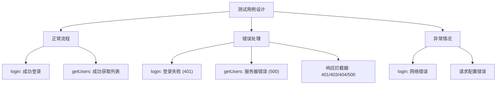
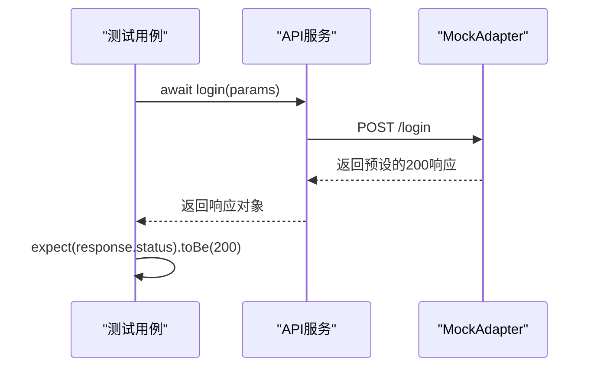
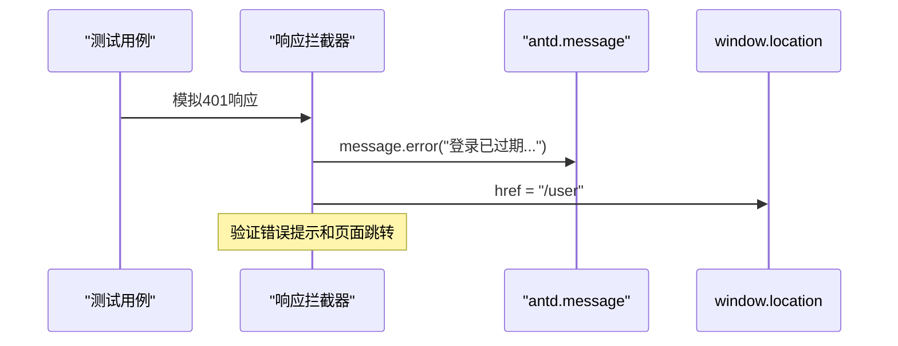

# API测试策略

<cite>
**Referenced Files in This Document**   
- [src/__tests__/services.test.tsx](file://src/__tests__/services.test.tsx)
- [src/services/index.ts](file://src/services/index.ts)
- [jest.config.ts](file://jest.config.ts)
- [jest.setup.ts](file://jest.setup.ts)
</cite>

## 目录
1. [引言](#引言)
2. [项目结构与测试配置](#项目结构与测试配置)
3. [核心API服务与测试用例](#核心api服务与测试用例)
4. [测试环境与Mock配置](#测试环境与mock配置)
5. [请求与响应拦截器测试](#请求与响应拦截器测试)
6. [最佳实践与测试设计模式](#最佳实践与测试设计模式)
7. [结论](#结论)

## 引言
本文档详细阐述了项目中针对API服务层的单元测试策略。基于`src/services/index.ts`中定义的API函数和`src/__tests__/services.test.tsx`中的测试用例，本文将深入分析如何利用Jest框架和`axios-mock-adapter`库来模拟API响应，确保服务层逻辑的健壮性和可靠性。文档将涵盖测试用例的设计方法、拦截器的验证、异常处理以及异步调用的最佳实践。

## 项目结构与测试配置
项目的测试文件遵循约定俗成的结构，位于`src/__tests__`目录下。API服务的测试文件`services.test.tsx`与被测代码`src/services/index.ts`在逻辑上紧密关联。测试框架采用Jest，其配置文件`jest.config.ts`定义了代码转换、模块映射和测试环境等关键设置。`jest.setup.ts`文件则负责在测试运行前进行全局配置，如引入`@testing-library/jest-dom`以支持DOM断言，并对`console.error`和`console.log`进行静音处理，以过滤掉非关键的警告信息，确保测试输出的清晰度。

**Section sources**
- [jest.config.ts](file://jest.config.ts#L1-L23)
- [jest.setup.ts](file://jest.setup.ts#L1-L107)

## 核心API服务与测试用例
`src/services/index.ts`文件定义了核心的API服务函数，如`login`和`getUsers`。这些函数封装了对后端API的HTTP请求，使用`axios`实例进行通信。`src/__tests__/services.test.tsx`文件则为这些服务函数编写了详尽的单元测试。

测试用例的设计遵循了全面覆盖的原则，主要分为以下几类：
1.  **正常流程测试**：验证API在成功响应时的行为。例如，`login`函数的测试会模拟一个成功的登录请求，检查返回的响应状态码、数据内容和业务成功标志。
2.  **错误处理测试**：验证API在遇到各种错误时的处理机制。这包括服务器返回的业务逻辑错误（如401未授权）、HTTP状态码错误（如404、500）以及网络连接错误。测试用例通过模拟这些错误场景，确保错误信息能被正确捕获并传递给上层。
3.  **异常情况测试**：验证API在极端或非预期情况下的行为，例如网络中断或请求配置错误。

**Diagram sources**
- [src/__tests__/services.test.tsx](file://src/__tests__/services.test.tsx#L45-L278)

**Section sources**
- [src/services/index.ts](file://src/services/index.ts#L204-L208)
- [src/__tests__/services.test.tsx](file://src/__tests__/services.test.tsx#L45-L278)

## 测试环境与Mock配置
测试的核心是使用`axios-mock-adapter`库来拦截真实的HTTP请求并返回预定义的Mock数据，从而实现对API的隔离测试。

### MockAdapter的初始化与重置
在`services.test.tsx`中，测试套件开始前会创建一个全局的`MockAdapter`实例来拦截`axios`的所有请求。为了确保每个测试用例的独立性，`beforeEach`钩子函数会在每个测试开始前调用`mock.reset()`和`mock.restore()`，然后重新创建一个新的`MockAdapter`实例。这种做法避免了测试用例之间的相互干扰。

### Mock数据的准确性验证
`index.ts`文件中直接配置了`MockAdapter`，为`/login`和`/users`等接口定义了详细的Mock响应逻辑。例如，`/users`接口的Mock会根据请求体中的分页参数（`current`, `pageSize`）动态地从一个预设的用户列表中切片返回数据。测试用例通过调用`getUsers`函数并传入不同的分页参数，可以验证Mock数据的准确性和分页逻辑的正确性。

### 异步API调用的测试
所有API调用都是异步的，因此测试用例均使用`async/await`语法。通过`await`关键字等待异步函数的完成，然后使用`expect`断言来验证返回的Promise结果。对于预期会抛出错误的场景（如登录失败），测试用例会使用`try/catch`块来捕获被拒绝的Promise，并断言错误对象的存在。

**Diagram sources**
- [src/__tests__/services.test.tsx](file://src/__tests__/services.test.tsx#L20-L40)
- [src/services/index.ts](file://src/services/index.ts#L148-L198)

**Section sources**
- [src/__tests__/services.test.tsx](file://src/__tests__/services.test.tsx#L20-L40)
- [src/services/index.ts](file://src/services/index.ts#L148-L198)

## 请求与响应拦截器测试
`index.ts`中定义了全局的请求和响应拦截器，用于在请求发出前自动添加认证Token，以及在响应返回后统一处理错误和业务状态。

### 请求拦截器测试
`services.test.tsx`中的测试用例通过`Object.defineProperty`劫持`document.cookie`，模拟浏览器中存在Token的场景。当发起一个测试请求时，拦截器会读取这个Mock的Cookie并将其添加到请求头中。测试通过在`MockAdapter`的回复函数中检查`config.headers.Authorization`来验证拦截器是否正确工作。

### 响应拦截器测试
响应拦截器的测试是其核心。测试用例会模拟各种HTTP状态码（401, 403, 404, 500）和业务失败响应（`success: false`）。通过验证`antd`的`message.error`方法是否被调用，以及在401情况下`window.location.href`是否被修改，可以确认拦截器的错误处理逻辑和重定向功能是否按预期执行。

**Diagram sources**
- [src/__tests__/services.test.tsx](file://src/__tests__/services.test.tsx#L216-L278)
- [src/services/index.ts](file://src/services/index.ts#L100-L146)

**Section sources**
- [src/__tests__/services.test.tsx](file://src/__tests__/services.test.tsx#L216-L278)
- [src/services/index.ts](file://src/services/index.ts#L100-L146)

## 最佳实践与测试设计模式
该项目的API测试体现了多项最佳实践：
- **高内聚的测试文件**：`services.test.tsx`专注于服务层的逻辑，不涉及UI渲染。
- **全面的Mock覆盖**：不仅Mock了API响应，还Mock了`antd`的`message`、`window.location`和`document.cookie`等全局对象，确保测试的纯净性。
- **清晰的生命周期管理**：使用`beforeAll`、`beforeEach`、`afterEach`和`afterAll`钩子函数精确地管理测试环境的搭建和清理。
- **异步测试的规范写法**：统一使用`async/await`处理异步操作，代码清晰易懂。
- **边界条件覆盖**：测试用例涵盖了正常、错误、异常和边界情况，如默认分页参数。

## 结论
通过对`src/services/index.ts`和`src/__tests__/services.test.tsx`的分析，可以看出该项目建立了一套成熟、可靠的API单元测试体系。通过`axios-mock-adapter`进行精准的请求拦截和响应模拟，结合Jest强大的断言和Mock功能，能够有效验证API服务的正确性、健壮性和错误处理能力。这种测试策略为前端应用的稳定运行提供了坚实的质量保障。