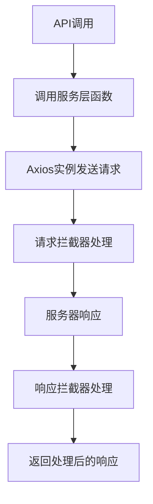
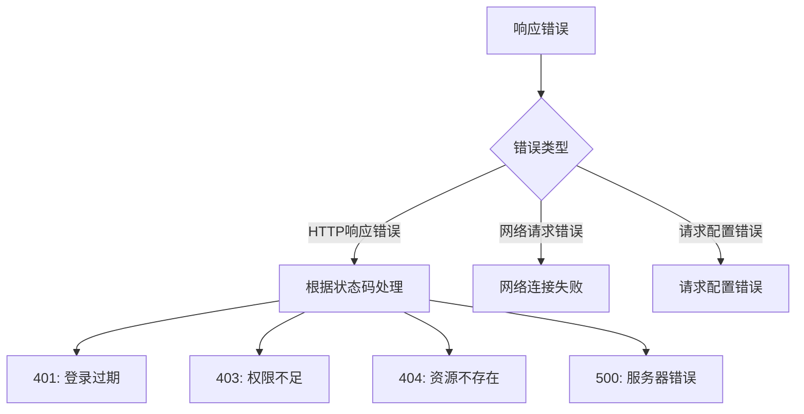
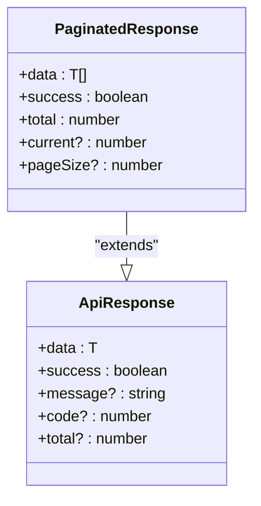
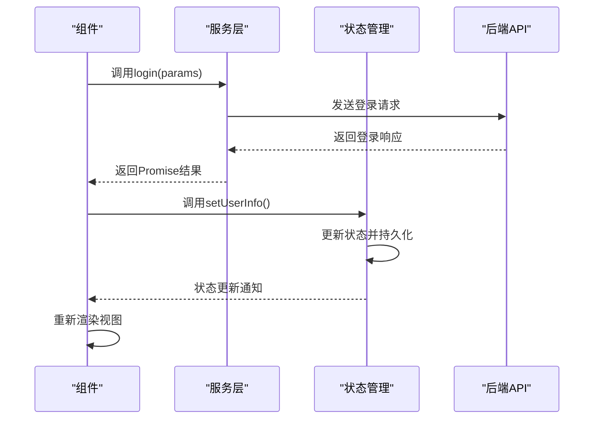
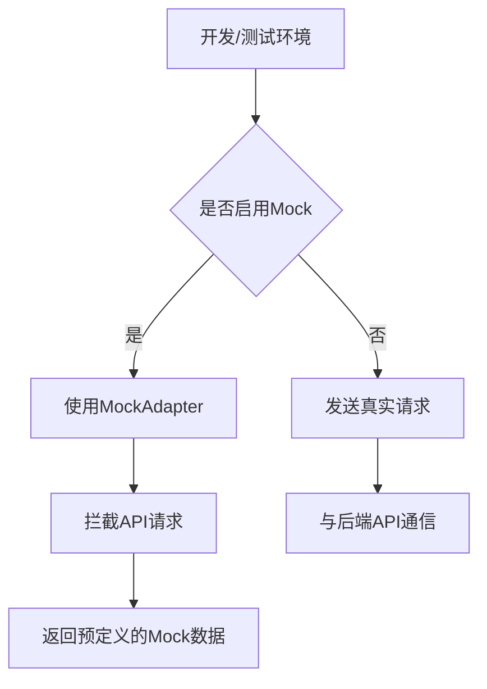
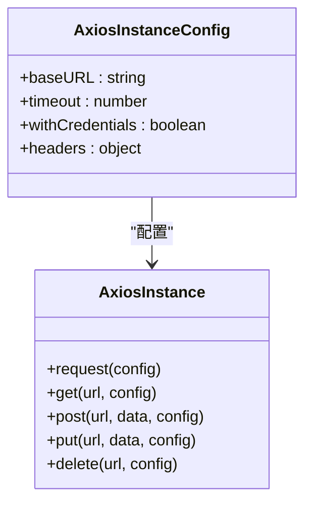
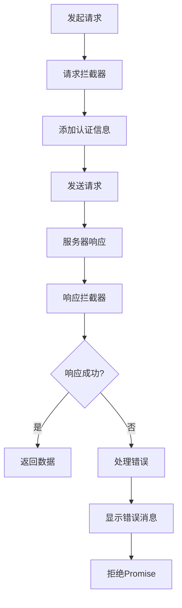
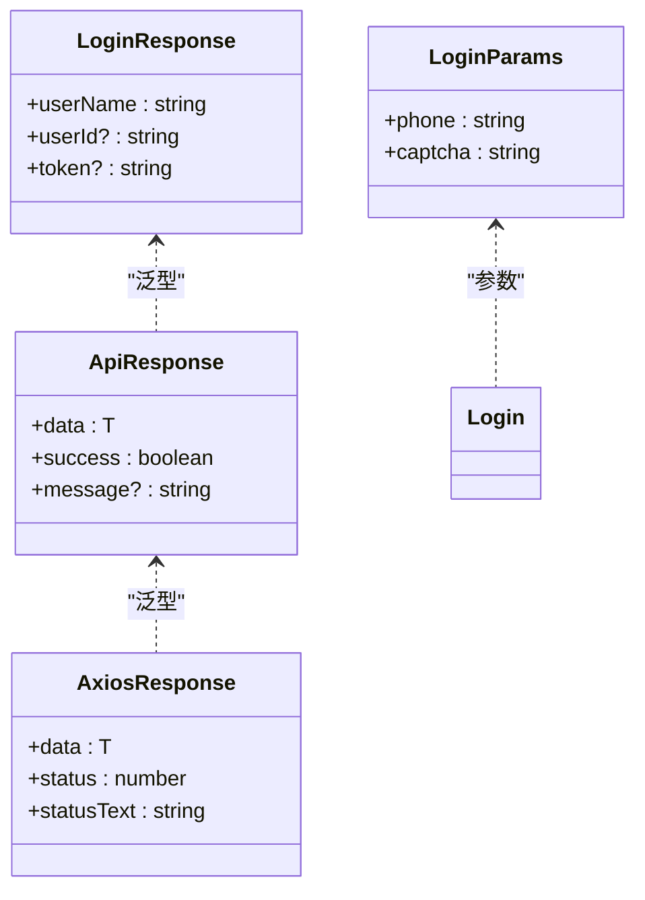
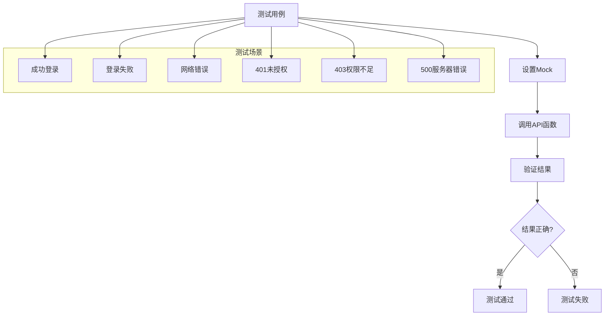

# API集成

<cite>
**Referenced Files in This Document**   
- [index.ts](file://src/services/index.ts)
- [index.ts](file://src/store/index.ts)
- [Login.tsx](file://src/pages/User/Login.tsx)
- [home.tsx](file://src/pages/home.tsx)
- [matchMedia.mock.ts](file://src/pages/User/matchMedia.mock.ts)
- [services.test.tsx](file://src/__tests__/services.test.tsx)
- [store.test.tsx](file://src/__tests__/store.test.tsx)
</cite>

## 目录
1. [服务层设计](#服务层设计)
2. [API请求封装](#api请求封装)
3. [错误处理机制](#错误处理机制)
4. [响应格式化](#响应格式化)
5. [状态管理协作](#状态管理协作)
6. [Mock数据实现](#mock数据实现)
7. [API客户端配置](#api客户端配置)
8. [拦截器使用](#拦截器使用)
9. [类型安全请求](#类型安全请求)
10. [测试策略](#测试策略)

## 服务层设计

项目中的API集成通过`src/services/index.ts`文件中的服务层进行组织和管理。该服务层采用Axios作为HTTP客户端，提供了统一的API调用接口。服务层的设计遵循模块化原则，将API请求、响应处理、错误处理和Mock数据配置集中管理。

服务层通过创建Axios实例并配置基础URL、超时时间、凭据携带等选项来初始化HTTP客户端。这种设计模式使得API调用的配置集中化，便于维护和修改。同时，服务层导出了类型定义，包括`ApiResponse`、`User`、`LoginParams`等，为API调用提供了类型安全保证。

**Section sources**
- [index.ts](file://src/services/index.ts#L1-L212)

## API请求封装

API请求的封装通过定义具体的API函数来实现，这些函数封装了具体的HTTP请求细节。在`src/services/index.ts`中，定义了`login`、`getUsers`和`getCompany`等API函数，每个函数都返回一个Promise，类型为`AxiosResponse`的泛型。

API函数的封装遵循一致的模式：接收参数对象，调用Axios实例的相应方法（如`post`或`get`），并返回Promise。这种封装方式使得组件中调用API变得简单直接，同时保持了类型安全。

**Section sources**
- [index.ts](file://src/services/index.ts#L204-L208)

## 错误处理机制

项目的错误处理机制通过Axios的响应拦截器实现，能够处理不同类型的HTTP错误和业务逻辑错误。响应拦截器检查响应数据中的`success`字段，如果为`false`，则显示相应的错误消息并拒绝Promise。

对于HTTP状态码，项目实现了详细的错误处理策略：
- 401状态码：处理登录过期，清除token并重定向到登录页
- 403状态码：提示没有权限访问资源
- 404状态码：提示请求的资源不存在
- 500状态码：提示服务器内部错误
- 网络连接错误：提示网络连接失败

**Diagram sources**
- [index.ts](file://src/services/index.ts#L108-L158)

**Section sources**
- [index.ts](file://src/services/index.ts#L108-L158)

## 响应格式化

响应格式化通过定义统一的响应类型来实现，确保所有API响应具有一致的结构。项目定义了`ApiResponse`接口，包含`data`、`success`、`message`、`code`和`total`等字段，为API响应提供了标准化的格式。

对于分页数据，项目定义了`PaginatedResponse`接口，扩展了`ApiResponse`以包含分页相关的信息，如`current`、`pageSize`和`total`。这种设计使得前端能够一致地处理分页数据，简化了分页逻辑的实现。

**Diagram sources**
- [index.ts](file://src/services/index.ts#L4-L25)

**Section sources**
- [index.ts](file://src/services/index.ts#L4-L25)

## 状态管理协作

服务层与状态管理的协作通过Zustand实现，`src/store/index.ts`文件定义了应用的状态管理。当API调用成功后，服务层的调用方（通常是组件）会使用状态管理的action来更新应用状态。

例如，在用户登录成功后，`Login.tsx`组件调用`setUserInfo` action来更新用户信息状态。这种模式实现了数据流的单向流动：API调用 → 响应处理 → 状态更新 → 视图更新。状态管理还实现了持久化，用户信息会自动保存到localStorage中。

**Diagram sources**
- [index.ts](file://src/services/index.ts#L204-L204)
- [index.ts](file://src/store/index.ts#L50-L60)
- [Login.tsx](file://src/pages/User/Login.tsx#L50-L99)

**Section sources**
- [index.ts](file://src/services/index.ts#L204-L204)
- [index.ts](file://src/store/index.ts#L50-L60)
- [Login.tsx](file://src/pages/User/Login.tsx#L50-L99)

## Mock数据实现

Mock数据的实现通过`axios-mock-adapter`库完成，在`src/services/index.ts`中配置了登录和用户列表接口的Mock数据。Mock数据在开发和测试环境中启用，使得前端开发可以独立于后端进行。

Mock数据的实现包括：
- 登录接口Mock：验证手机号和验证码，返回相应的用户信息或错误
- 用户列表接口Mock：实现分页功能，返回预定义的用户数据
- 响应延迟：通过`delayResponse`配置模拟网络延迟

Mock数据在开发测试中的作用包括：
1. 允许前端开发独立于后端进行
2. 提供稳定的测试数据环境
3. 模拟各种业务场景和错误情况
4. 提高开发效率，减少对后端服务的依赖

**Diagram sources**
- [index.ts](file://src/services/index.ts#L160-L202)

**Section sources**
- [index.ts](file://src/services/index.ts#L160-L202)
- [matchMedia.mock.ts](file://src/pages/User/matchMedia.mock.ts#L1-L15)

## API客户端配置

API客户端的配置在`src/services/index.ts`中通过Axios的`create`方法完成。配置包括：
- `baseURL`：根据环境变量设置基础URL
- `timeout`：设置请求超时时间为10秒
- `withCredentials`：启用凭据携带，用于跨域请求
- `headers`：设置默认的Content-Type为application/json

这种配置方式使得API客户端的行为可以根据环境进行调整，例如在生产环境中使用不同的基础URL。同时，通过导出配置好的Axios实例，其他模块可以直接使用而无需重复配置。

**Diagram sources**
- [index.ts](file://src/services/index.ts#L50-L65)

**Section sources**
- [index.ts](file://src/services/index.ts#L50-L65)

## 拦截器使用

拦截器的使用通过Axios的`interceptors`属性实现，包括请求拦截器和响应拦截器。请求拦截器在发送请求前自动添加认证token到请求头中，从cookie中读取token并设置到`Authorization`头。

响应拦截器负责统一处理响应数据和错误，包括业务逻辑错误和HTTP错误。响应拦截器检查响应数据中的`success`字段，如果为`false`则显示错误消息并拒绝Promise。对于HTTP错误，根据状态码显示相应的错误提示。

**Diagram sources**
- [index.ts](file://src/services/index.ts#L70-L158)

**Section sources**
- [index.ts](file://src/services/index.ts#L70-L158)

## 类型安全请求

类型安全请求通过TypeScript的泛型和接口定义实现。项目定义了详细的类型接口，如`LoginParams`、`LoginResponse`、`User`等，为API参数和响应提供了类型定义。

API函数使用这些类型定义作为泛型参数，确保类型安全。例如，`login`函数的返回类型为`Promise<AxiosResponse<ApiResponse<LoginResponse>>>`，这确保了调用方能够获得正确的类型提示和编译时检查。

这种类型安全的设计减少了运行时错误，提高了代码的可维护性，并为开发者提供了更好的开发体验。

**Diagram sources**
- [index.ts](file://src/services/index.ts#L27-L48)

**Section sources**
- [index.ts](file://src/services/index.ts#L27-L48)

## 测试策略

项目的测试策略包括服务层的单元测试和状态管理的测试，测试文件位于`src/__tests__`目录下。服务层测试使用Jest和`axios-mock-adapter`来模拟API响应，验证各种场景下的行为。

测试覆盖了以下方面：
- 成功的API调用
- 业务逻辑错误处理
- HTTP状态码错误处理
- 网络连接错误
- 请求拦截器功能
- 响应拦截器功能

状态管理的测试验证了状态更新、计算属性和异步方法的正确性。通过`renderHook`和`act`，测试能够模拟用户交互并验证状态变化。

**Diagram sources**
- [services.test.tsx](file://src/__tests__/services.test.tsx#L1-L354)
- [store.test.tsx](file://src/__tests__/store.test.tsx#L1-L227)

**Section sources**
- [services.test.tsx](file://src/__tests__/services.test.tsx#L1-L354)
- [store.test.tsx](file://src/__tests__/store.test.tsx#L1-L227)