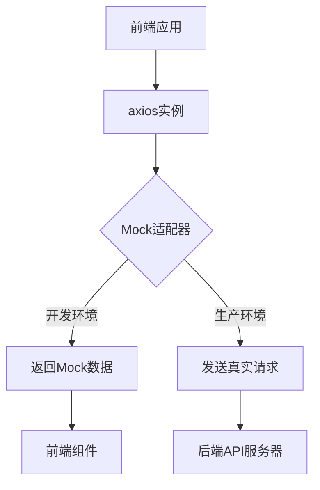
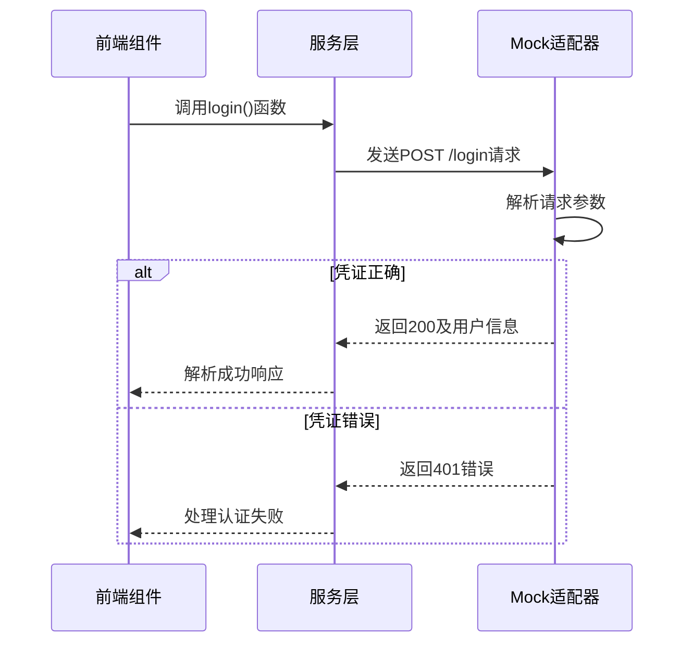
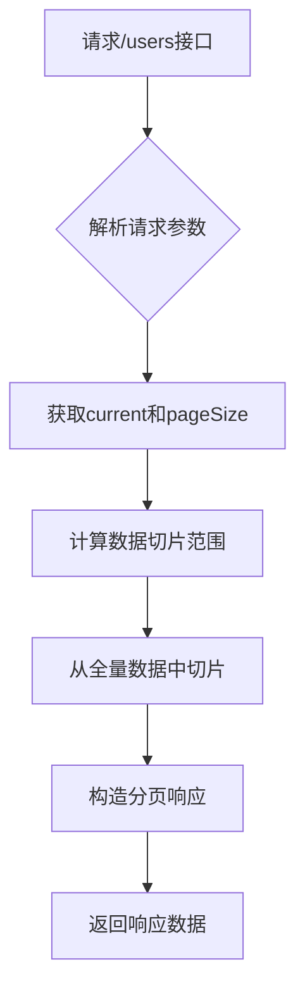
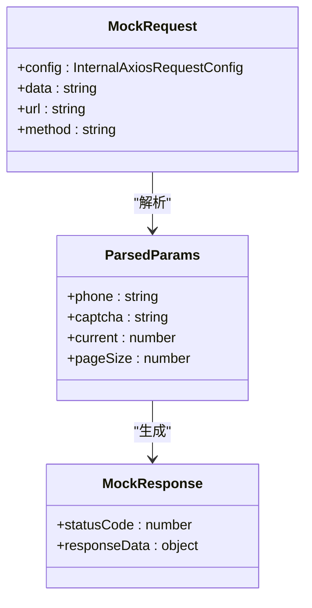
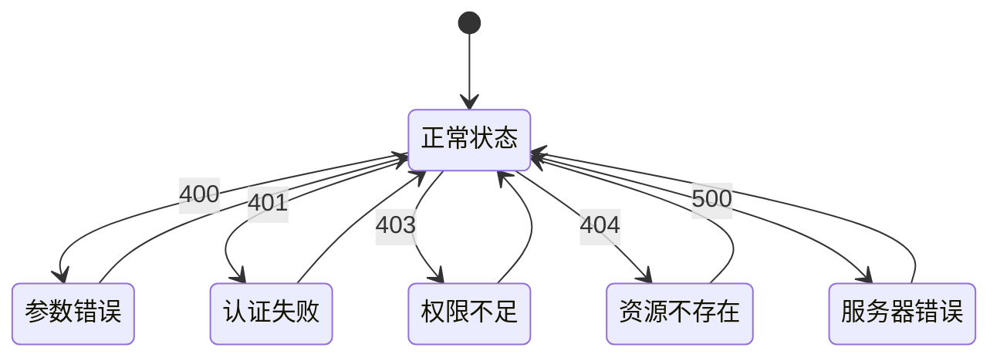
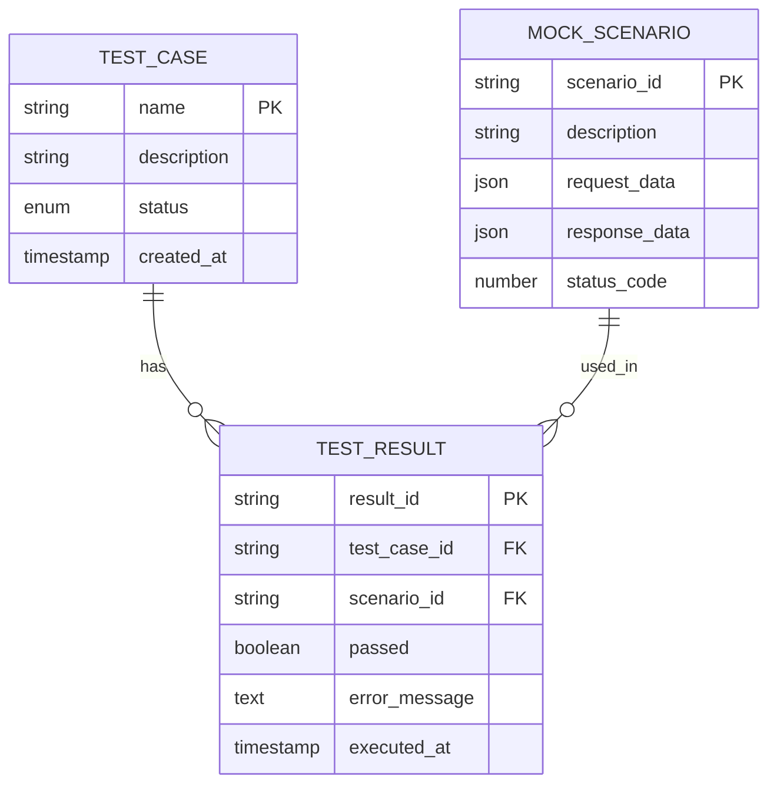

# Mock数据实现

<cite>
**Referenced Files in This Document**   
- [src/services/index.ts](file://src/services/index.ts)
- [src/pages/User/Login.tsx](file://src/pages/User/Login.tsx)
- [src/__tests__/services.test.tsx](file://src/__tests__/services.test.tsx)
</cite>

## 目录
1. [简介](#简介)
2. [Mock服务配置](#mock服务配置)
3. [核心Mock接口实现](#核心mock接口实现)
4. [请求处理与响应逻辑](#请求处理与响应逻辑)
5. [错误场景模拟](#错误场景模拟)
6. [添加新Mock接口的步骤](#添加新mock接口的步骤)
7. [最佳实践](#最佳实践)
8. [测试验证](#测试验证)

## 简介
本文档详细说明了项目中如何使用axios-mock-adapter实现前端Mock服务。通过在开发环境中拦截HTTP请求并返回预定义的Mock数据，实现了前后端并行开发，无需依赖后端API的实时可用性。文档重点分析了登录接口和用户列表接口的Mock规则定义，以及相关的延迟响应配置、请求参数解析和响应数据生成逻辑。

## Mock服务配置

项目通过axios-mock-adapter库在前端实现完整的Mock服务。Mock适配器被配置为拦截所有发送到axios实例的请求，并根据预定义的规则返回相应的Mock响应。

**Diagram sources**
- [src/services/index.ts](file://src/services/index.ts#L1-L212)

**Section sources**
- [src/services/index.ts](file://src/services/index.ts#L1-L212)

## 核心Mock接口实现

### 登录接口Mock
登录接口的Mock规则定义了两种主要场景：成功登录和认证失败。系统通过解析请求体中的手机号和验证码参数，根据预设的凭证进行验证。

**Diagram sources**
- [src/services/index.ts](file://src/services/index.ts#L150-L168)
- [src/pages/User/Login.tsx](file://src/pages/User/Login.tsx#L30-L162)

### 用户列表接口Mock
用户列表接口实现了完整的分页功能，能够根据请求参数中的current和pageSize返回相应的数据子集。该Mock数据集包含四个预定义的用户信息。

**Diagram sources**
- [src/services/index.ts](file://src/services/index.ts#L170-L196)

**Section sources**
- [src/services/index.ts](file://src/services/index.ts#L150-L196)

## 请求处理与响应逻辑

### 请求参数解析
Mock服务通过解析config.data属性获取请求体内容。系统使用JSON.parse()方法将字符串化的请求体转换为JavaScript对象，然后提取所需的参数。

**Diagram sources**
- [src/services/index.ts](file://src/services/index.ts#L152-L153)
- [src/services/index.ts](file://src/services/index.ts#L172-L173)

### 响应数据生成
响应数据的生成遵循预定义的接口规范。对于成功响应，返回包含data、success和message字段的标准格式；对于错误响应，则返回相应的HTTP状态码和错误信息。

**Section sources**
- [src/services/index.ts](file://src/services/index.ts#L155-L168)
- [src/services/index.ts](file://src/services/index.ts#L175-L196)

## 错误场景模拟

### HTTP状态码模拟
系统模拟了多种HTTP状态码来测试不同的错误处理场景：
- **400 Bad Request**: 请求参数格式错误
- **401 Unauthorized**: 认证失败
- **403 Forbidden**: 权限不足
- **404 Not Found**: 资源不存在
- **500 Internal Server Error**: 服务器内部错误

### 业务错误模拟
除了HTTP状态码，系统还模拟了业务层面的错误，如手机号或验证码错误等。这些错误通过设置响应体中的success字段为false来表示。

**Diagram sources**
- [src/services/index.ts](file://src/services/index.ts#L158-L166)
- [src/services/index.ts](file://src/services/index.ts#L180-L188)

## 添加新Mock接口的步骤

1. **定义接口类型**: 在services/index.ts中定义请求参数和响应数据的TypeScript接口
2. **配置Mock规则**: 使用mock.on[method]("/endpoint")方法配置新的Mock接口
3. **实现请求处理**: 在reply回调函数中实现请求参数解析和响应数据生成逻辑
4. **导出API函数**: 创建对应的API函数供前端组件调用
5. **编写测试用例**: 在services.test.tsx中添加相应的单元测试

**Section sources**
- [src/services/index.ts](file://src/services/index.ts#L150-L196)

## 最佳实践

### 数据验证
- 始终使用try-catch块包裹JSON.parse()操作，防止无效JSON导致的运行时错误
- 验证必要的请求参数是否存在
- 对参数类型进行基本验证

### 错误模拟
- 模拟真实的错误场景，包括网络错误、服务器错误和业务逻辑错误
- 使用适当的HTTP状态码和错误消息
- 在响应拦截器中统一处理错误显示

### 动态数据生成
- 使用随机数生成器创建动态数据
- 实现数据分页和过滤功能
- 支持不同请求参数返回不同结果

**Section sources**
- [src/services/index.ts](file://src/services/index.ts#L150-L196)
- [src/__tests__/services.test.tsx](file://src/__tests__/services.test.tsx#L1-L354)

## 测试验证

项目包含完整的单元测试来验证Mock服务的正确性。测试用例覆盖了正常场景和各种错误场景，确保Mock逻辑的可靠性。

**Diagram sources**
- [src/__tests__/services.test.tsx](file://src/__tests__/services.test.tsx#L1-L354)

**Section sources**
- [src/__tests__/services.test.tsx](file://src/__tests__/services.test.tsx#L1-L354)