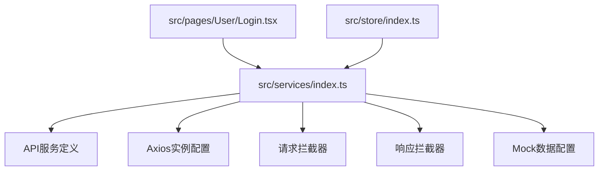
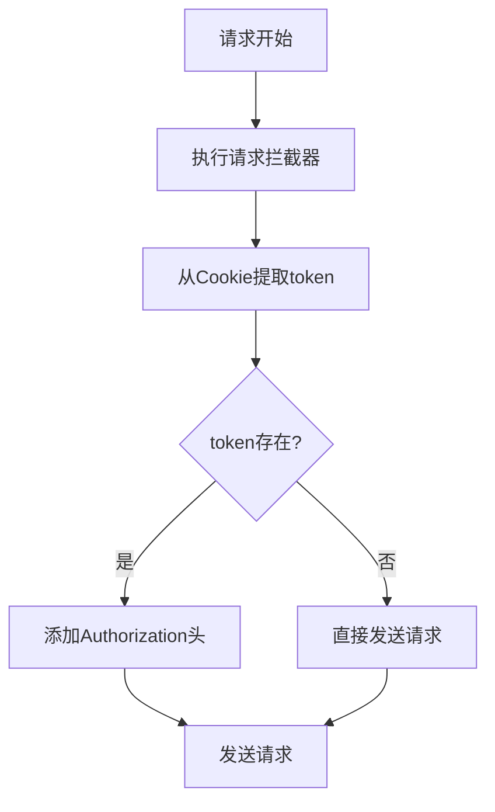
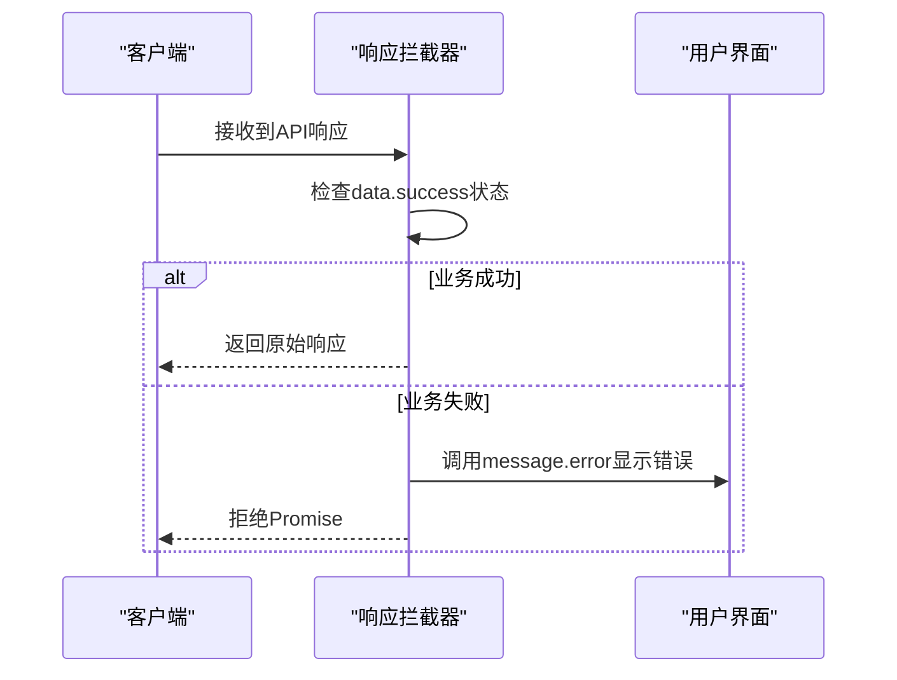
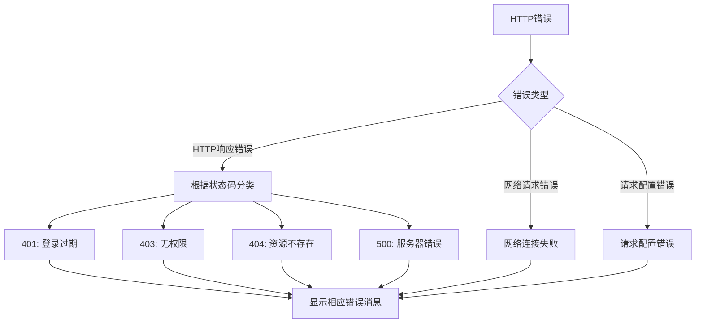
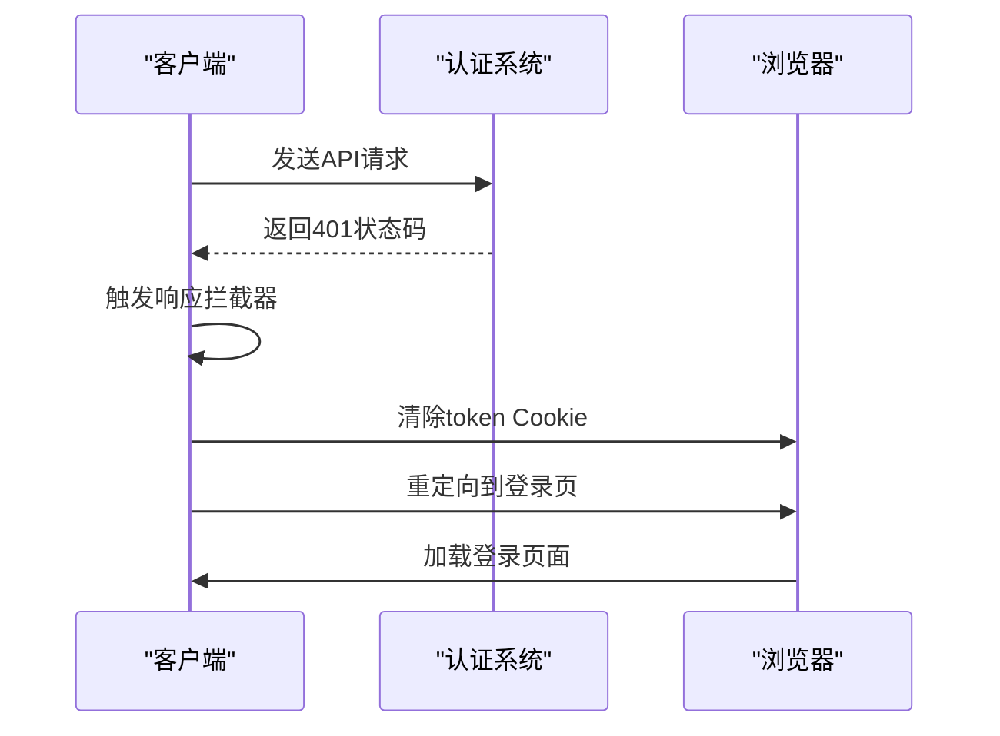

# 服务层设计

<cite>
**Referenced Files in This Document**   
- [src/services/index.ts](file://src/services/index.ts)
- [src/pages/User/Login.tsx](file://src/pages/User/Login.tsx)
</cite>

## 目录
1. [项目结构](#项目结构)
2. [核心服务模块](#核心服务模块)
3. [Axios实例配置](#axios实例配置)
4. [请求拦截器实现](#请求拦截器实现)
5. [响应拦截器实现](#响应拦截器实现)
6. [错误处理与用户提示](#错误处理与用户提示)
7. [认证失败处理机制](#认证失败处理机制)
8. [服务层扩展最佳实践](#服务层扩展最佳实践)

## 项目结构

项目的服务层主要位于`src/services/index.ts`文件中，该文件集中管理所有API服务相关的配置和实现。服务层与UI组件（如`src/pages/User/Login.tsx`）通过导入方式建立依赖关系，实现了关注点分离的设计原则。

**Diagram sources**
- [src/services/index.ts](file://src/services/index.ts#L1-L213)
- [src/pages/User/Login.tsx](file://src/pages/User/Login.tsx#L1-L163)

**Section sources**
- [src/services/index.ts](file://src/services/index.ts#L1-L213)
- [src/pages/User/Login.tsx](file://src/pages/User/Login.tsx#L1-L163)

## 核心服务模块

服务层的核心功能包括API响应类型定义、用户数据类型定义、登录参数与响应类型定义，以及分页相关类型的定义。这些类型系统为前后端交互提供了类型安全保证。

服务层导出了多个API函数，包括`login`、`getUsers`和`getCompany`等，这些函数封装了具体的HTTP请求逻辑，为上层组件提供了简洁的调用接口。

**Section sources**
- [src/services/index.ts](file://src/services/index.ts#L8-L50)

## Axios实例配置

Axios实例通过`axios.create`方法创建，配置了以下关键参数：
- `baseURL`：根据环境变量NODE_ENV决定使用生产环境API前缀或开发环境空前缀
- `timeout`：设置10秒超时限制，防止请求无限等待
- `withCredentials`：启用跨域请求时携带Cookie
- `headers`：默认设置Content-Type为application/json

这种配置方式确保了请求的一致性和可维护性，同时适应了不同环境的部署需求。

**Section sources**
- [src/services/index.ts](file://src/services/index.ts#L54-L63)

## 请求拦截器实现

请求拦截器在每个请求发送前执行，主要功能是从浏览器Cookie中提取认证token并注入到Authorization请求头中。

实现逻辑如下：
1. 通过`document.cookie.split("; ")`将Cookie字符串分割成数组
2. 使用`find`方法查找以"token="开头的Cookie项
3. 如果找到token，将其值提取出来并以"Bearer"格式添加到Authorization头中

这种设计确保了所有API请求都自动携带认证信息，无需在每个请求中手动添加。

**Diagram sources**
- [src/services/index.ts](file://src/services/index.ts#L65-L78)

**Section sources**
- [src/services/index.ts](file://src/services/index.ts#L65-L78)

## 响应拦截器实现

响应拦截器负责处理所有API响应，包括成功响应和错误响应的统一处理。

对于成功响应，拦截器会检查业务状态码（data.success），如果为false则显示错误消息并拒绝Promise，这有助于前端统一处理业务逻辑错误。

**Diagram sources**
- [src/services/index.ts](file://src/services/index.ts#L80-L95)

**Section sources**
- [src/services/index.ts](file://src/services/index.ts#L80-L95)

## 错误处理与用户提示

服务层与Ant Design的message组件深度集成，实现了优雅的用户提示机制。

当发生HTTP错误时，响应拦截器会根据不同的HTTP状态码显示相应的错误消息：
- 401状态码：提示"登录已过期，请重新登录"
- 403状态码：提示"没有权限访问该资源"
- 404状态码：提示"请求的资源不存在"
- 500状态码：提示"服务器内部错误"

此外，对于网络连接失败和请求配置错误也提供了友好的用户提示，提升了用户体验。

**Diagram sources**
- [src/services/index.ts](file://src/services/index.ts#L96-L138)

**Section sources**
- [src/services/index.ts](file://src/services/index.ts#L96-L138)

## 认证失败处理机制

当用户认证失败（HTTP 401状态码）时，系统会执行自动重定向机制：

1. 显示"登录已过期，请重新登录"的错误消息
2. 通过设置Cookie的过期时间为过去时间来清除本地token
3. 使用`window.location.href`将用户重定向到登录页面

这种机制确保了用户在token失效后能够及时重新登录，同时清除了无效的认证信息，提高了应用的安全性。

**Diagram sources**
- [src/services/index.ts](file://src/services/index.ts#L115-L122)

**Section sources**
- [src/services/index.ts](file://src/services/index.ts#L115-L122)

## 服务层扩展最佳实践

### 添加新的拦截器

可以通过`instance.interceptors.request.use`和`instance.interceptors.response.use`方法添加自定义拦截器。建议将复杂的拦截逻辑封装成独立的函数，提高代码可读性。

### 自定义请求配置

对于特定API需要特殊配置的情况，可以在调用API函数时传递配置对象，覆盖默认的axios实例配置。

### 错误处理策略扩展

可以扩展错误处理逻辑，例如：
- 添加错误日志记录
- 实现错误重试机制
- 集成第三方监控服务
- 支持多语言错误消息

### Mock数据管理

当前的Mock数据配置可以直接在开发环境中使用，建议将复杂的Mock逻辑迁移到独立的文件中，便于维护和团队协作。

**Section sources**
- [src/services/index.ts](file://src/services/index.ts#L1-L213)