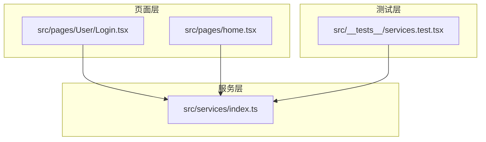
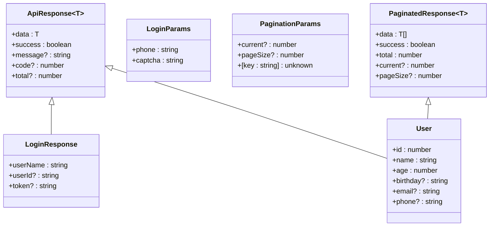
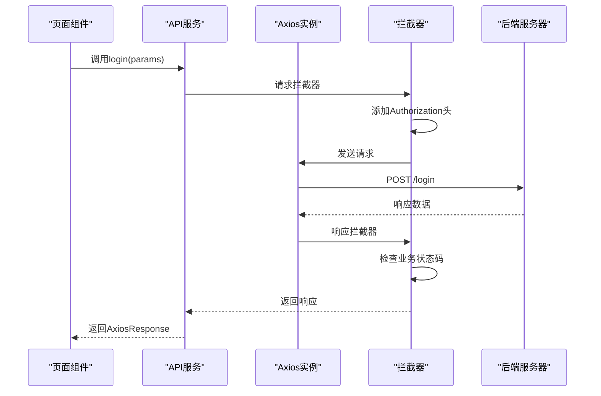
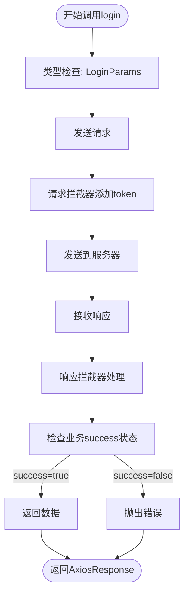
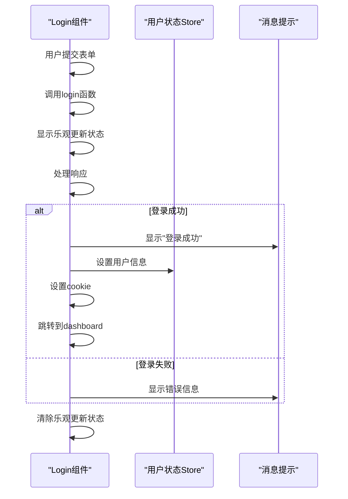
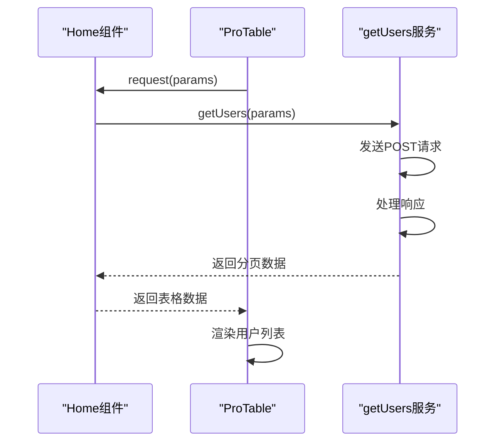
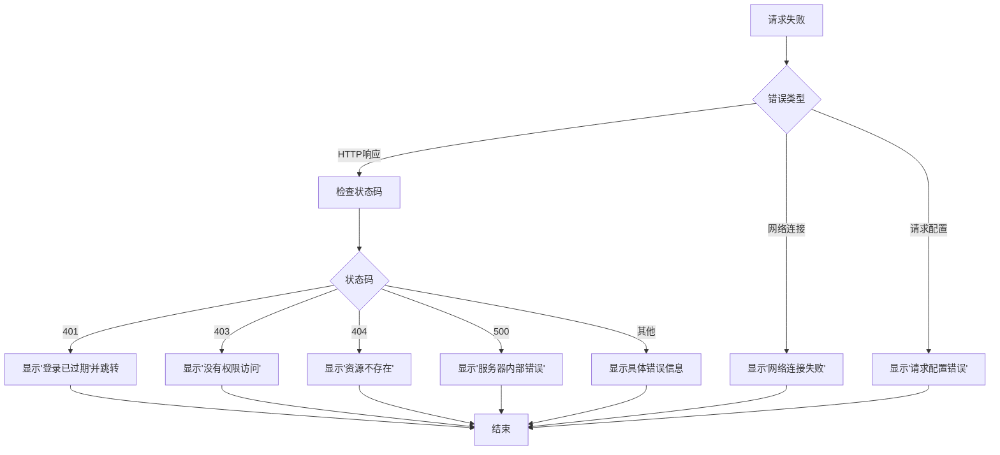
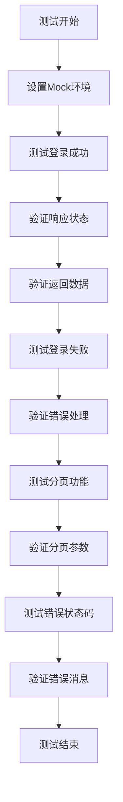

# 请求处理与类型安全

<cite>
**Referenced Files in This Document**   
- [src/services/index.ts](file://src/services/index.ts)
- [src/pages/User/Login.tsx](file://src/pages/User/Login.tsx)
- [src/pages/home.tsx](file://src/pages/home.tsx)
- [src/__tests__/services.test.tsx](file://src/__tests__/services.test.tsx)
</cite>

## 目录
1. [项目结构](#项目结构)
2. [核心类型定义](#核心类型定义)
3. [API服务实现](#api服务实现)
4. [类型安全的请求处理](#类型安全的请求处理)
5. [组件中的服务调用](#组件中的服务调用)
6. [分页请求处理](#分页请求处理)
7. [错误处理机制](#错误处理机制)
8. [测试验证](#测试验证)

## 项目结构

项目采用模块化结构，将服务逻辑集中管理。`src/services/index.ts` 文件作为API服务的统一入口，定义了所有与后端交互的函数和相关类型。页面组件位于 `src/pages` 目录下，通过导入服务函数实现数据获取和提交。

**Diagram sources**
- [src/services/index.ts](file://src/services/index.ts#L1-L212)
- [src/pages/User/Login.tsx](file://src/pages/User/Login.tsx#L1-L162)
- [src/pages/home.tsx](file://src/pages/home.tsx#L1-L295)

**Section sources**
- [src/services/index.ts](file://src/services/index.ts#L1-L212)
- [src/pages/User/Login.tsx](file://src/pages/User/Login.tsx#L1-L162)
- [src/pages/home.tsx](file://src/pages/home.tsx#L1-L295)

## 核心类型定义

在 `src/services/index.ts` 中定义了关键的TypeScript接口，为API调用提供类型安全保证。这些接口确保了请求参数和响应数据的结构一致性。

**Diagram sources**
- [src/services/index.ts](file://src/services/index.ts#L5-L45)

**Section sources**
- [src/services/index.ts](file://src/services/index.ts#L5-L45)

## API服务实现

`src/services/index.ts` 文件创建了Axios实例并配置了请求和响应拦截器，实现了统一的请求处理逻辑。该文件导出了多个API函数，如 `login` 和 `getUsers`，这些函数都使用泛型来确保类型安全。

**Diagram sources**
- [src/services/index.ts](file://src/services/index.ts#L47-L212)

**Section sources**
- [src/services/index.ts](file://src/services/index.ts#L47-L212)

## 类型安全的请求处理

通过TypeScript泛型，API函数能够确保请求和响应数据的类型安全。`login` 函数接受 `LoginParams` 类型的参数，并返回 `AxiosResponse<ApiResponse<LoginResponse>>` 类型的Promise。

**Diagram sources**
- [src/services/index.ts](file://src/services/index.ts#L204-L204)

**Section sources**
- [src/services/index.ts](file://src/services/index.ts#L204-L204)
- [src/pages/User/Login.tsx](file://src/pages/User/Login.tsx#L27-L162)

## 组件中的服务调用

在页面组件中，通过导入服务函数并正确处理返回的 `AxiosResponse` 对象来实现API调用。`Login.tsx` 组件展示了如何使用 `login` 函数进行用户登录。

**Diagram sources**
- [src/pages/User/Login.tsx](file://src/pages/User/Login.tsx#L27-L162)

**Section sources**
- [src/pages/User/Login.tsx](file://src/pages/User/Login.tsx#L27-L162)

## 分页请求处理

`getUsers` 函数展示了如何处理分页请求。通过传递 `PaginationParams` 参数，可以实现分页数据的获取，并使用 `PaginatedResponse<User>` 类型确保响应数据的结构正确。

**Diagram sources**
- [src/pages/home.tsx](file://src/pages/home.tsx#L104-L134)

**Section sources**
- [src/pages/home.tsx](file://src/pages/home.tsx#L104-L134)

## 错误处理机制

系统实现了全面的错误处理机制，包括请求拦截器、响应拦截器和组件级别的错误处理。当发生错误时，系统会根据HTTP状态码显示相应的错误消息。

**Diagram sources**
- [src/services/index.ts](file://src/services/index.ts#L108-L158)

**Section sources**
- [src/services/index.ts](file://src/services/index.ts#L108-L158)

## 测试验证

通过单元测试验证了API服务的正确性。`src/__tests__/services.test.tsx` 文件包含了对 `login` 和 `getUsers` 函数的测试用例，确保它们在各种情况下都能正确工作。

**Diagram sources**
- [src/__tests__/services.test.tsx](file://src/__tests__/services.test.tsx#L1-L354)

**Section sources**
- [src/__tests__/services.test.tsx](file://src/__tests__/services.test.tsx#L1-L354)