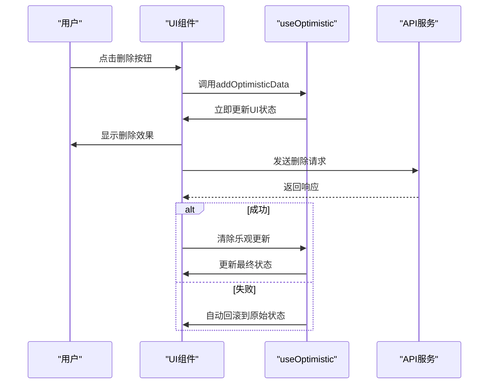

# 开发规范

<cite>
**Referenced Files in This Document**   
- [README.md](file://README.md)
- [eslint.config.mjs](file://eslint.config.mjs)
- [package.json](file://package.json)
- [tsconfig.json](file://tsconfig.json)
- [vite.config.ts](file://vite.config.ts)
- [src/pages/home.tsx](file://src/pages/home.tsx)
- [src/pages/Settings/index.tsx](file://src/pages/Settings/index.tsx)
- [src/pages/User/Login.tsx](file://src/pages/User/Login.tsx)
</cite>

## 目录
1. [Git提交规范](#git提交规范)
2. [代码规范与ESLint配置](#代码规范与eslint配置)
3. [React 19 useOptimistic最佳实践](#react-19-useoptimistic最佳实践)
4. [分支策略与代码审查](#分支策略与代码审查)
5. [质量保证措施](#质量保证措施)
6. [贡献指南](#贡献指南)

## Git提交规范

本项目遵循约定式提交（Conventional Commits）规范，确保提交历史清晰、可追溯。提交消息的类型标识了变更的性质，便于自动生成变更日志和版本管理。

**提交类型说明：**
- `feat`：新增功能，适用于用户可见的新特性或功能模块
- `fix`：修复缺陷，解决bug或错误行为
- `docs`：文档更新，包括README、注释、API文档等
- `style`：代码格式调整，不影响功能的空格、分号、格式化等变更
- `refactor`：代码重构，功能不变但内部结构优化
- `perf`：性能优化，提升代码执行效率的改进
- `test`：测试相关，新增或修改测试用例
- `chore`：构建工具或辅助工具的变动，如依赖更新、配置修改

**提交消息格式：**
```
<类型>: <描述>
```

**示例：**
```
feat: 添加用户登录功能
fix: 修复登录页面显示异常
docs: 更新API文档
style: 格式化用户管理页面代码
refactor: 重构用户服务模块
perf: 优化表格数据加载性能
test: 增加用户管理单元测试
chore: 更新项目依赖版本
```

**Section sources**
- [README.md](file://README.md#L130-L150)

## 代码规范与ESLint配置

项目采用严格的代码规范，通过ESLint和Prettier确保代码质量和一致性。ESLint配置基于Airbnb规范，并针对项目需求进行定制。

**核心规则配置：**
- **引号规范**：统一使用双引号（"）包裹字符串
- **React JSX文件扩展名**：强制使用`.jsx`或`.tsx`扩展名
- **导入路径**：忽略包的扩展名，支持`js`、`jsx`、`ts`、`tsx`文件
- **全局变量**：预定义浏览器、Node.js、ES2021和Jest的全局变量
- **TypeScript支持**：集成tsconfig.json进行类型检查
- **路径别名**：支持`@`指向`src/`目录的别名导入

**TypeScript配置（tsconfig.json）：**
- **严格模式**：启用`strict`、`noImplicitAny`、`strictNullChecks`等严格类型检查
- **模块解析**：使用`bundler`模式，支持现代打包工具
- **路径映射**：配置`@/*`指向`src/*`的别名系统
- **JSX支持**：使用`react-jsx`编译模式，支持最新的React特性
- **实验性功能**：启用装饰器支持

**构建工具配置（vite.config.ts）：**
- **React插件**：集成Vite的React插件支持JSX和HMR
- **路径别名**：配置`@`别名指向`src`目录
- **Ant Design按需加载**：通过`vite-plugin-imp`实现组件和样式的按需引入
- **开发服务器**：配置端口为3123

**Section sources**
- [eslint.config.mjs](file://eslint.config.mjs#L1-L74)
- [tsconfig.json](file://tsconfig.json#L1-L100)
- [vite.config.ts](file://vite.config.ts#L1-L52)

## React 19 useOptimistic最佳实践

项目充分利用React 19的`useOptimistic` Hook实现乐观更新，提升用户体验。该Hook允许在异步操作完成前立即更新UI，失败时自动回滚。

**核心实现模式：**
```typescript
const [optimisticData, addOptimisticData] = useOptimistic<DataType[]>(
  [] // 初始状态
);

const handleSubmit = async (data: DataType) => {
  // 乐观更新：立即更新UI
  startTransition(() => {
    addOptimisticData((prev) => [...prev, data]);
  });

  try {
    await apiCall(data);
    // 成功：清除乐观更新状态
    startTransition(() => {
      addOptimisticData((prev) => prev.filter((item) => item.id !== data.id));
    });
  } catch (error) {
    // 失败：自动回滚到原始状态
    startTransition(() => {
      addOptimisticData((prev) => prev.filter((item) => item.id !== data.id));
    });
  }
};
```

**应用场景：**

### 用户管理页面（src/pages/home.tsx）
- **用户删除**：点击删除按钮后立即从列表中移除用户
- **用户添加**：点击添加按钮后立即在列表中显示新用户
- **状态指示**：显示"正在进行中..."的乐观更新状态提示

### 设置页面（src/pages/Settings/index.tsx）
- **表单提交**：提交后立即显示新的表单值
- **按钮状态**：动态显示"保存中..."的加载状态
- **实时反馈**：在API调用完成前提供即时的用户反馈

### 登录页面（src/pages/User/Login.tsx）
- **登录状态**：提交后立即显示登录状态
- **按钮文本**：动态更新为"登录中..."的提示
- **用户体验**：减少用户等待感知，提升交互流畅性

**优势：**
1. **即时反馈**：用户操作后立即看到界面变化，无需等待API响应
2. **自动回滚**：操作失败时自动恢复到原始状态，无需手动处理
3. **类型安全**：完整的TypeScript支持，确保类型正确性
4. **并发安全**：与React的并发特性完全兼容，避免竞态条件



**Diagram sources**
- [src/pages/home.tsx](file://src/pages/home.tsx#L1-L296)
- [src/pages/Settings/index.tsx](file://src/pages/Settings/index.tsx#L1-L122)
- [src/pages/User/Login.tsx](file://src/pages/User/Login.tsx#L1-L163)

**Section sources**
- [README.md](file://README.md#L20-L93)
- [src/pages/home.tsx](file://src/pages/home.tsx#L1-L296)
- [src/pages/Settings/index.tsx](file://src/pages/Settings/index.tsx#L1-L122)
- [src/pages/User/Login.tsx](file://src/pages/User/Login.tsx#L1-L163)

## 分支策略与代码审查

项目采用标准化的分支管理策略，确保代码质量和协作效率。

**分支命名规范：**
- `main`：主分支，保护分支，仅通过PR合并
- `feature/功能名`：功能开发分支，如`feature/user-authentication`
- `fix/问题描述`：缺陷修复分支，如`fix/login-bug`
- `hotfix/紧急问题`：紧急修复分支，直接从main创建

**代码审查流程：**
1. 创建特性分支并推送代码
2. 提交Pull Request，关联相关issue
3. 至少一名团队成员进行代码审查
4. 审查通过后合并到main分支
5. 删除已合并的特性分支

**审查重点：**
- 代码是否符合ESLint规范
- 是否包含必要的单元测试
- 是否遵循React最佳实践
- 是否有潜在的性能问题
- 文档和注释是否完整

**Section sources**
- [README.md](file://README.md#L152-L168)

## 质量保证措施

项目建立了全面的质量保证体系，确保代码稳定性和可靠性。

**测试策略：**
- **单元测试**：使用Jest和Testing Library测试组件和工具函数
- **集成测试**：测试组件间的交互和数据流
- **端到端测试**：使用Cypress模拟用户操作流程

**CI/CD流程：**
1. 代码推送触发CI流水线
2. 执行ESLint代码检查
3. 运行单元测试和覆盖率检查
4. 执行端到端测试
5. 通过后自动部署到预发布环境

**质量指标：**
- 代码覆盖率≥80%
- 零ESLint错误
- 所有测试用例通过
- 性能指标达标

**Section sources**
- [README.md](file://README.md#L10-L15)
- [package.json](file://package.json#L1-L60)

## 贡献指南

欢迎贡献者参与项目开发，遵循以下流程确保贡献质量。

**贡献流程：**
1. Fork本仓库到个人账户
2. 创建特性分支（`git checkout -b feature/AmazingFeature`）
3. 实现功能并编写测试
4. 提交更改（`git commit -m 'feat: 添加新特性'`）
5. 推送到分支（`git push origin feature/AmazingFeature`）
6. 创建Pull Request并描述变更

**社区参与：**
- 报告bug时提供详细的复现步骤
- 提出新功能建议时说明使用场景
- 参与代码审查，提供 constructive feedback
- 更新文档，帮助新成员快速上手

**Section sources**
- [README.md](file://README.md#L170-L173)