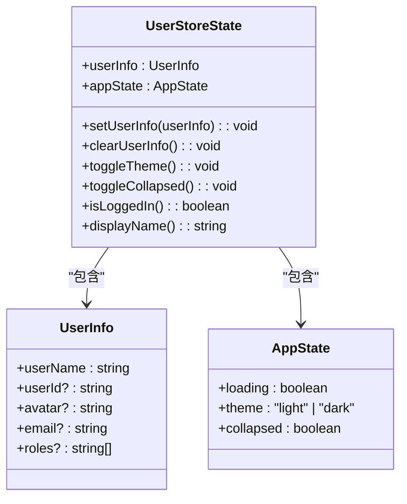
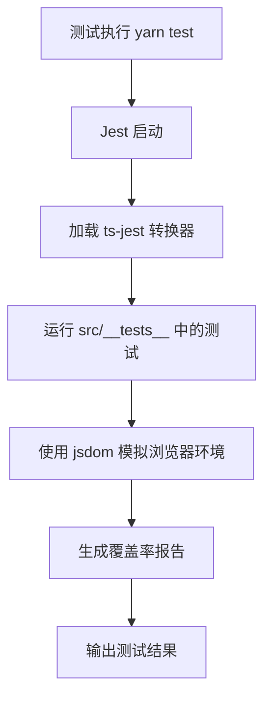
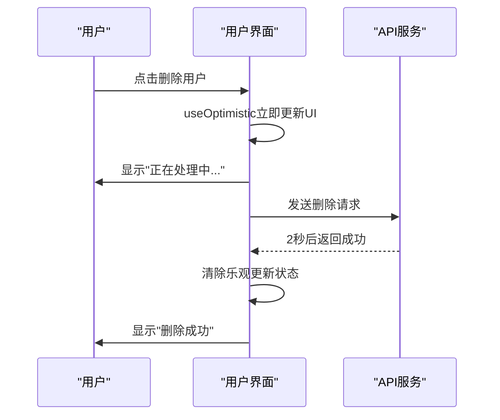

# 技术栈与依赖

<cite>
**Referenced Files in This Document**   
- [package.json](file://package.json)
- [README.md](file://README.md)
- [vite.config.ts](file://vite.config.ts)
- [jest.config.ts](file://jest.config.ts)
- [cypress.config.ts](file://cypress.config.ts)
- [src/store/index.ts](file://src/store/index.ts)
- [src/pages/home.tsx](file://src/pages/home.tsx)
- [src/pages/User/Login.tsx](file://src/pages/User/Login.tsx)
- [src/pages/Settings/index.tsx](file://src/pages/Settings/index.tsx)
- [src/services/index.ts](file://src/services/index.ts)
</cite>

## 目录
1. [技术栈概览](#技术栈概览)
2. [核心前端技术](#核心前端技术)
3. [状态管理](#状态管理)
4. [构建工具](#构建工具)
5. [UI组件库](#uicomponent-library)
6. [测试框架](#测试框架)
7. [开发与生产依赖](#开发与生产依赖)
8. [版本选择与React 19特性](#版本选择与react-19特性)
9. [工具链集成](#工具链集成)

## 技术栈概览

本项目采用现代化的前端技术栈，集成了最新的开发工具和最佳实践。技术选型基于性能、开发效率和可维护性三个核心原则，构建了一个高效、可靠且易于扩展的前端开发环境。

**Section sources**
- [README.md](file://README.md#L1-L173)
- [package.json](file://package.json#L1-L60)

## 核心前端技术

### React 19

作为项目的核心框架，React 19 提供了最新的并发渲染能力和现代化的开发体验。项目充分利用了 React 19 的新特性，特别是 `useOptimistic` Hook，实现了流畅的用户体验。

`useOptimistic` Hook 用于实现乐观更新（Optimistic Updates），允许在异步操作完成前立即更新 UI，如果操作失败则自动回滚到原始状态。这种模式提供了即时的用户反馈，显著提升了应用的响应性。

**Section sources**
- [README.md](file://README.md#L20-L93)
- [src/pages/home.tsx](file://src/pages/home.tsx#L1-L295)
- [src/pages/User/Login.tsx](file://src/pages/User/Login.tsx#L1-L162)
- [src/pages/Settings/index.tsx](file://src/pages/Settings/index.tsx#L1-L121)

### TypeScript

TypeScript 为项目提供了完整的类型安全保证。通过静态类型检查，有效减少了运行时错误，提高了代码质量和可维护性。项目中的所有组件、服务和状态都经过严格的类型定义，确保了代码的一致性和可靠性。

**Section sources**
- [package.json](file://package.json#L1-L60)
- [tsconfig.json](file://tsconfig.json#L1-L10)

## 状态管理

### Zustand

项目采用 Zustand 作为状态管理解决方案，替代了传统的 Redux。Zustand 以其轻量级、简单易用和高性能的特点，成为现代化 React 应用的理想选择。

通过 `src/store/index.ts` 文件，项目实现了用户状态的集中管理，包括用户信息、应用主题和侧边栏状态。Zustand 的中间件系统（`persist` 和 `subscribeWithSelector`）提供了状态持久化和选择性订阅功能，确保了状态管理的灵活性和效率。

**Diagram sources**
- [src/store/index.ts](file://src/store/index.ts#L1-L123)

**Section sources**
- [src/store/index.ts](file://src/store/index.ts#L1-L123)

## 构建工具

### Vite

Vite 作为项目的构建工具，提供了极速的开发服务器启动和热模块替换（HMR）功能。通过 `vite.config.ts` 配置文件，项目集成了 React 插件、Ant Design 按需加载和路径别名等功能。

Vite 的配置优化了开发体验，包括：
- 使用 `@` 别名指向 `src` 目录，简化模块导入
- 集成 `vite-plugin-imp` 实现 Ant Design 组件的按需加载
- 配置开发服务器端口为 3123

**Section sources**
- [vite.config.ts](file://vite.config.ts#L1-L51)
- [package.json](file://package.json#L1-L60)

## UI组件库

### Ant Design

Ant Design 为企业级应用提供了丰富的 UI 组件。项目通过 `@ant-design/pro-components` 扩展了基础组件，实现了高级表格、表单和布局功能。Ant Design 的设计系统确保了界面的一致性和专业性。

### Tailwind CSS

Tailwind CSS 作为原子化 CSS 框架，与 Ant Design 协同工作，提供了灵活的样式定制能力。通过 `tailwind.config.js` 配置，项目实现了自定义主题和样式扩展，满足了特定的设计需求。

**Section sources**
- [package.json](file://package.json#L1-L60)
- [src/tailwind/tailwind.config.js](file://src/tailwind/tailwind.config.js#L1-L10)

## 测试框架

### Jest

Jest 作为单元测试框架，提供了完整的测试环境。通过 `jest.config.ts` 配置，项目集成了 TypeScript 支持、JS DOM 环境和模块映射功能。测试文件位于 `src/__tests__` 目录，覆盖了组件、服务和状态管理的各个方面。

**Diagram sources**
- [jest.config.ts](file://jest.config.ts#L1-L22)
- [package.json](file://package.json#L1-L60)

**Section sources**
- [jest.config.ts](file://jest.config.ts#L1-L22)
- [src/__tests__](file://src/__tests__#L1-L10)

### Cypress

Cypress 用于端到端（E2E）测试，确保应用的整体功能正确性。通过 `cypress.config.ts` 配置，项目定义了测试的基地址和规范模式。E2E 测试位于 `cypress/e2e` 目录，模拟真实用户操作流程。

**Section sources**
- [cypress.config.ts](file://cypress.config.ts#L1-L23)
- [package.json](file://package.json#L1-L60)

## 开发与生产依赖

### 依赖分类

项目严格区分开发依赖和生产依赖，确保生产环境的轻量化和安全性。

**生产依赖**（dependencies）包含运行应用必需的库：
- React 核心库及其 DOM 渲理器
- Ant Design UI 组件库
- Zustand 状态管理
- Axios HTTP 客户端
- React Router 路由管理

**开发依赖**（devDependencies）包含开发和测试工具：
- TypeScript 编译器
- ESLint 代码检查
- Jest 测试框架
- Cypress E2E 测试
- 构建工具相关插件

### 依赖管理

项目使用 Yarn 作为包管理器，通过 `yarn.lock` 文件锁定依赖版本，确保团队成员间的环境一致性。`package.json` 中的 `scripts` 字段定义了标准化的开发流程，包括启动、构建、测试等常用命令。

**Section sources**
- [package.json](file://package.json#L1-L60)

## 版本选择与React 19特性

### React 19 新特性应用

项目充分利用了 React 19 的新特性，特别是 `useOptimistic` Hook，实现了现代化的用户体验模式。

#### 乐观更新实现

在多个关键页面中实现了乐观更新模式：

1. **用户管理页面** (`src/pages/home.tsx`)
   - 用户删除：点击删除后立即从列表中移除
   - 用户添加：点击添加后立即显示新用户
   - 显示操作状态指示器

2. **设置页面** (`src/pages/Settings/index.tsx`)
   - 表单提交：立即显示新值
   - 按钮状态：动态显示"保存中..."文本

3. **登录页面** (`src/pages/User/Login.tsx`)
   - 登录提交：立即显示登录状态
   - 按钮文本：动态更新为"登录中..."

**Diagram sources**
- [src/pages/home.tsx](file://src/pages/home.tsx#L1-L295)
- [src/pages/Settings/index.tsx](file://src/pages/Settings/index.tsx#L1-L121)
- [src/pages/User/Login.tsx](file://src/pages/User/Login.tsx#L1-L162)

**Section sources**
- [README.md](file://README.md#L20-L93)
- [src/pages/home.tsx](file://src/pages/home.tsx#L1-L295)
- [src/pages/Settings/index.tsx](file://src/pages/Settings/index.tsx#L1-L121)
- [src/pages/User/Login.tsx](file://src/pages/User/Login.tsx#L1-L162)

### 版本选择考量

技术选型基于以下原则：
- **稳定性**：选择经过验证的稳定版本
- **社区支持**：优先选择活跃维护的库
- **性能优化**：考虑库的体积和运行效率
- **类型支持**：优先选择提供完整 TypeScript 类型定义的库

## 工具链集成

### 代码质量工具

项目集成了 ESLint 和 Prettier，确保代码风格的一致性。通过 `.eslintrc` 配置，项目遵循 Airbnb 代码规范，并针对 React 和 TypeScript 进行了优化。

### 服务层设计

通过 `src/services/index.ts` 实现了统一的 API 服务层，包含：
- Axios 实例配置和拦截器
- 请求/响应拦截处理
- 错误统一处理
- Mock 数据配置

服务层的设计模式提高了代码的可维护性和可测试性。

**Section sources**
- [src/services/index.ts](file://src/services/index.ts#L1-L212)
- [eslint.config.mjs](file://eslint.config.mjs#L1-L10)