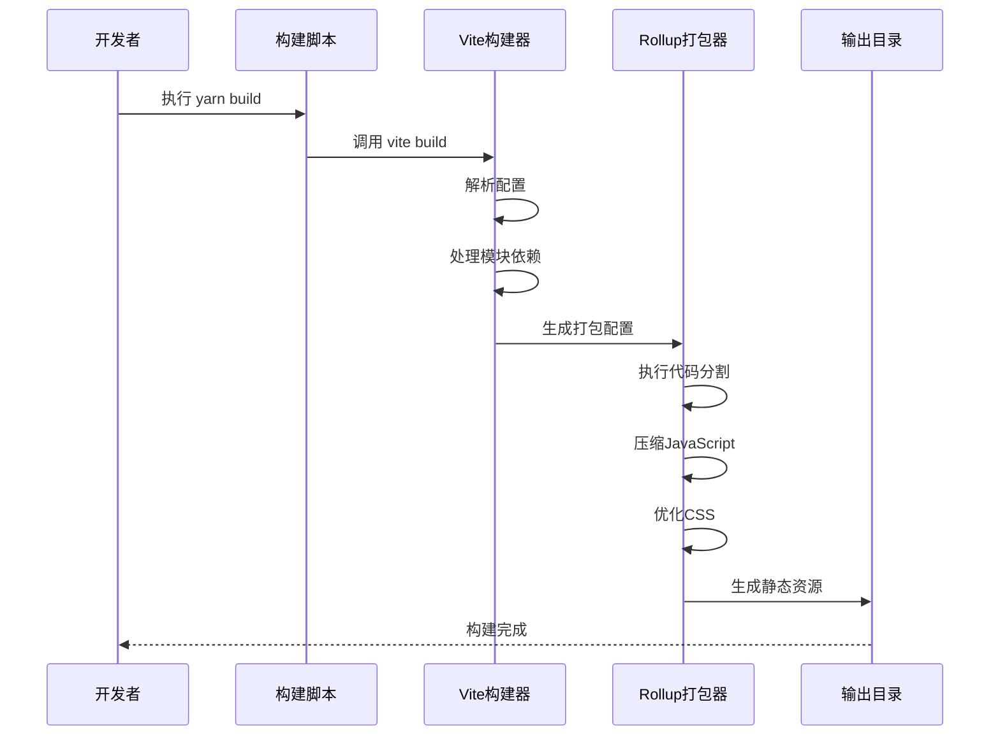
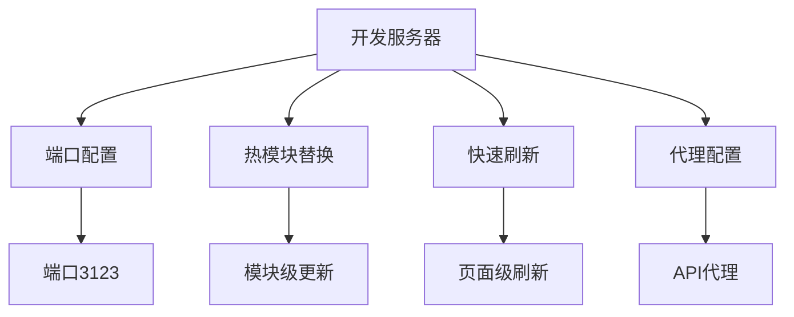

# 构建与部署

<cite>
**Referenced Files in This Document**   
- [vite.config.ts](file://vite.config.ts)
- [package.json](file://package.json)
- [index.html](file://index.html)
- [tsconfig.json](file://tsconfig.json)
- [tailwind.config.js](file://src/tailwind/tailwind.config.js)
- [postcss.config.js](file://src/tailwind/postcss.config.js)
</cite>

## 目录
1. [构建流程概述](#构建流程概述)
2. [Vite配置详解](#vite配置详解)
3. [生产构建过程](#生产构建过程)
4. [输出结构分析](#输出结构分析)
5. [性能优化策略](#性能优化策略)
6. [部署指南](#部署指南)
7. [开发服务器配置](#开发服务器配置)

## 构建流程概述

本项目采用现代化的前端构建流程，基于Vite构建工具和Yarn包管理器。构建流程主要通过package.json中的脚本命令进行管理，涵盖了开发、测试、构建和预览等各个阶段。

**Section sources**
- [package.json](file://package.json#L10-L20)

## Vite配置详解

Vite配置文件(vite.config.ts)定义了项目的核心构建行为和开发服务器设置。配置中包含了插件集成、路径别名、CSS预处理和构建选项等关键设置。

```mermaid
flowchart TD
A[Vite配置] --> B[插件系统]
A --> C[解析配置]
A --> D[CSS配置]
A --> E[构建配置]
A --> F[服务器配置]
B --> B1[React插件]
B --> B2[vite-plugin-imp]
C --> C1[路径别名@]
D --> D1[Less预处理器]
D --> D2[javascriptEnabled]
E --> E1[Rollup外部化]
F --> F1[端口3123]
```

**Diagram sources**
- [vite.config.ts](file://vite.config.ts#L1-L50)

### 插件配置

项目配置了多个Vite插件来增强构建功能。React插件用于支持JSX语法和热模块替换，vite-plugin-imp插件用于按需加载Ant Design组件库，减少打包体积。

**Section sources**
- [vite.config.ts](file://vite.config.ts#L8-L18)

### 路径别名

通过resolve.alias配置了路径别名，将@符号映射到src目录，简化了模块导入路径，提高了代码可读性和维护性。

**Section sources**
- [vite.config.ts](file://vite.config.ts#L20-L24)

### CSS预处理

配置了Less预处理器选项，启用了javascriptEnabled，允许在Less文件中使用JavaScript表达式，增强了样式处理的灵活性。

**Section sources**
- [vite.config.ts](file://vite.config.ts#L26-L31)

## 生产构建过程

生产版本的构建通过执行yarn build命令触发，该命令调用Vite的构建功能生成优化的静态资源。



**Diagram sources**
- [package.json](file://package.json#L15-L16)
- [vite.config.ts](file://vite.config.ts#L33-L40)

### 构建优化

构建过程中实施了多项优化策略，包括代码分割、资源压缩和依赖外部化。特别针对Ant Design组件库的CSS导入进行了外部化处理，避免了不必要的打包。

**Section sources**
- [vite.config.ts](file://vite.config.ts#L33-L40)

## 输出结构分析

构建过程生成的输出结构遵循标准的Web应用布局，包含JavaScript、CSS、静态资源等文件，组织清晰，便于部署和维护。

```mermaid
erDiagram
DIST ||--o{ JS : "包含"
DIST ||--o{ CSS : "包含"
DIST ||--o{ ASSETS : "包含"
DIST ||--o{ INDEX : "包含"
class DIST {
dist/
}
class JS {
assets/*.js
}
class CSS {
assets/*.css
}
class ASSETS {
assets/*.*
}
class INDEX {
index.html
}
```

**Diagram sources**
- [index.html](file://index.html#L1-L14)

## 性能优化策略

项目实施了多层次的性能优化策略，从构建配置到代码层面，全面提升应用性能。

### 代码分割

利用Vite内置的Rollup打包器实现自动代码分割，将代码拆分为多个bundle，实现按需加载，减少初始加载时间。

**Section sources**
- [vite.config.ts](file://vite.config.ts#L33-L40)

### 资源处理

配置了高效的资源处理流程，包括CSS优化、JavaScript压缩和静态资源优化，确保生成的资源文件体积最小化。

**Section sources**
- [vite.config.ts](file://vite.config.ts#L26-L31)

### 环境变量管理

通过Vite的环境变量机制管理不同环境的配置，支持开发、测试和生产环境的差异化设置，确保应用在不同环境下的正确行为。

**Section sources**
- [vite.config.ts](file://vite.config.ts#L1-L50)

## 部署指南

### 静态资源服务

生产构建生成的dist目录包含所有静态资源，可直接部署到任何静态文件服务器或CDN上。推荐使用Nginx、Apache或云存储服务进行部署。

**Section sources**
- [package.json](file://package.json#L17-L18)

### CDN集成

通过配置适当的缓存策略和资源路径，可以轻松将静态资源托管到CDN上，提高全球用户的访问速度和体验。

**Section sources**
- [vite.config.ts](file://vite.config.ts#L1-L50)

### 缓存策略

建议实施以下缓存策略：
- HTML文件：不缓存或短时间缓存
- JavaScript和CSS文件：长期缓存（1年），通过文件名哈希实现版本控制
- 静态资源：长期缓存

## 开发服务器配置

开发服务器配置了专用端口3123，提供热模块替换和快速刷新功能，确保开发过程中的高效迭代。



**Diagram sources**
- [vite.config.ts](file://vite.config.ts#L42-L45)

### 预览模式

通过yarn serve命令可以启动预览服务器，用于在本地查看生产构建后的效果，确保部署前的最终验证。

**Section sources**
- [package.json](file://package.json#L19-L20)