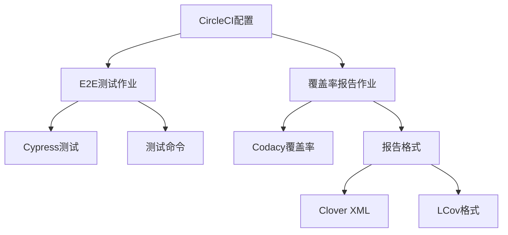
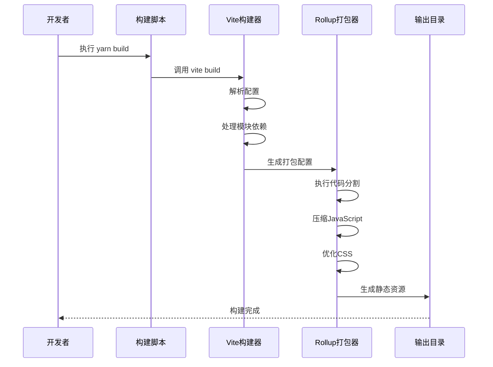
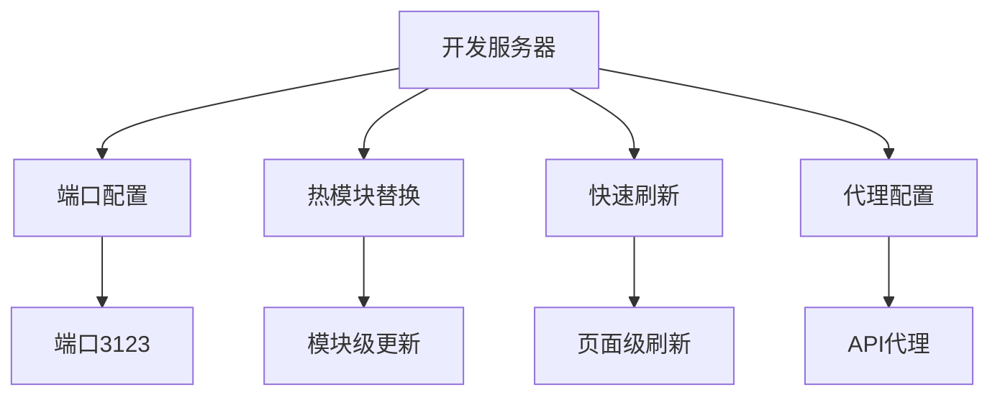

# 构建与部署

<cite>
**本文引用的文件**
- [vite.config.ts](file://vite.config.ts)
- [package.json](file://package.json)
- [index.html](file://index.html)
- [tsconfig.json](file://tsconfig.json)
- [.circleci/config.yml](file://.circleci/config.yml)
- [.nycrc](file://.nycrc)
- [jest.config.ts](file://jest.config.ts)
- [vitest.config.ts](file://vitest.config.ts)
- [jest.setup.ts](file://jest.setup.ts)
</cite>

## 更新摘要
**所做更改**
- 新增CI/CD管道覆盖率报告章节，详细介绍CircleCI中Codacy覆盖率报告功能
- 更新测试配置章节，说明Jest和Vitest的覆盖率配置差异
- 增强测试脚本说明，涵盖多种测试运行方式
- 完善覆盖率报告格式支持，包括Clover和LCov格式

## 目录
1. [构建流程概述](#构建流程概述)
2. [Vite配置详解](#vite配置详解)
3. [测试与覆盖率配置](#测试与覆盖率配置)
4. [CI/CD管道与覆盖率报告](#cicd管道与覆盖率报告)
5. [生产构建过程](#生产构建过程)
6. [输出结构分析](#输出结构分析)
7. [性能优化策略](#性能优化策略)
8. [部署指南](#部署指南)
9. [开发服务器配置](#开发服务器配置)

## 构建流程概述

本项目采用现代化的前端构建流程，基于Vite构建工具和Yarn包管理器。构建流程主要通过package.json中的脚本命令进行管理，涵盖了开发、测试、构建和预览等各个阶段。

**Section sources**
- [package.json:5-12](file://package.json#L5-L12)

## Vite配置详解

Vite配置文件(vite.config.ts)定义了项目的核心构建行为和开发服务器设置。配置中包含了插件集成、路径别名和开发服务器端口等关键设置。

```mermaid
flowchart TD
A[Vite配置] --> B[插件系统]
A --> C[路径别名]
A --> D[开发服务器]
B --> B1[React插件]
C --> C1[@ 别名映射]
D --> D1[端口3123]
```

**Diagram sources**
- [vite.config.ts:1-18](file://vite.config.ts#L1-L18)

### 插件配置

项目配置了React插件来支持JSX语法和热模块替换功能，这是现代React应用开发的基础配置。

**Section sources**
- [vite.config.ts:6-7](file://vite.config.ts#L6-L7)

### 路径别名

通过resolve.alias配置了路径别名，将@符号映射到src目录，简化了模块导入路径，提高了代码可读性和维护性。

**Section sources**
- [vite.config.ts:8-12](file://vite.config.ts#L8-L12)

## 测试与覆盖率配置

项目采用了双重测试框架配置，结合Jest和Vitest来提供全面的测试覆盖。

### Jest配置

Jest配置位于jest.config.ts中，启用了覆盖率收集功能，并配置了TypeScript转换器和模块映射。

**Section sources**
- [jest.config.ts:3-27](file://jest.config.ts#L3-L27)

### Vitest配置

Vitest配置位于vitest.config.ts中，提供了更现代化的测试体验，包括v8覆盖率提供程序和多种报告格式支持。

**Section sources**
- [vitest.config.ts:5-29](file://vitest.config.ts#L5-L29)

### 覆盖率配置

项目使用.nycrc文件配置TypeScript覆盖率收集，包含详细的包含和排除规则。

**Section sources**
- [.nycrc:1-12](file://.nycrc#L1-L12)

### 测试环境设置

jest.setup.ts文件提供了完整的测试环境初始化，包括ResizeObserver polyfill、localStorage mock和各种浏览器API的模拟。

**Section sources**
- [jest.setup.ts:1-126](file://jest.setup.ts#L1-L126)

## CI/CD管道与覆盖率报告

项目集成了CircleCI作为持续集成平台，并通过Codacy代码质量平台提供覆盖率报告功能。

### CircleCI配置

CircleCI配置文件(.circleci/config.yml)定义了两个主要作业：E2E测试作业和覆盖率报告作业。

```mermaid
flowchart TD
A[CircleCI配置] --> B[E2E测试作业]
A --> C[覆盖率报告作业]
B --> B1[Cypress测试]
B --> B2[测试命令]
C --> C1[Codacy覆盖率]
C --> C2[报告格式]
C2 --> C3[Clover XML]
C2 --> C4[LCov格式]
```

**Diagram sources**
- [.circleci/config.yml:1-26](file://.circleci/config.yml#L1-L26)

### 覆盖率报告作业

覆盖率报告作业(codacy-coverage-report)负责执行测试并发送覆盖率数据到Codacy平台。

**Section sources**
- [.circleci/config.yml:7-16](file://.circleci/config.yml#L7-L16)

### 覆盖率报告格式

配置支持两种主要的覆盖率报告格式：
- **Clover XML**: 用于Codacy平台的覆盖率数据交换
- **LCov格式**: 标准的覆盖率报告格式

**Section sources**
- [.circleci/config.yml:14-15](file://.circleci/config.yml#L14-L15)

### Codacy集成

通过codacy/coverage-reporter Orb实现了与Codacy代码质量平台的无缝集成，提供实时的代码覆盖率监控。

**Section sources**
- [.circleci/config.yml:4-4](file://.circleci/config.yml#L4-L4)

## 生产构建过程

生产版本的构建通过执行yarn build命令触发，该命令调用Vite的构建功能生成优化的静态资源。

```mermaid
sequenceDiagram
participant Developer as 开发者
participant Script as 构建脚本
participant Vite as Vite构建器
participant Rollup as Rollup打包器
participant Output as 输出目录
Developer->>Script : 执行 yarn build
Script->>Vite : 调用 vite build
Vite->>Vite : 解析配置
Vite->>Vite : 处理模块依赖
Vite->>Rollup : 生成打包配置
Rollup->>Rollup : 执行代码分割
Rollup->>Rollup : 压缩JavaScript
Rollup->>Rollup : 优化CSS
Rollup->>Output : 生成静态资源
Output-->>Developer : 构建完成
```

**Diagram sources**
- [package.json:11-11](file://package.json#L11-L11)
- [vite.config.ts:1-18](file://vite.config.ts#L1-L18)

### 构建优化

构建过程中实施了多项优化策略，包括代码分割、资源压缩和依赖外部化。特别针对Ant Design组件库的CSS导入进行了外部化处理，避免了不必要的打包。

**Section sources**
- [vite.config.ts:1-18](file://vite.config.ts#L1-L18)

## 输出结构分析

构建过程生成的输出结构遵循标准的Web应用布局，包含JavaScript、CSS、静态资源等文件，组织清晰，便于部署和维护。

```mermaid
erDiagram
DIST ||--o{ JS : "包含"
DIST ||--o{ CSS : "包含"
DIST ||--o{ ASSETS : "包含"
DIST ||--o{ INDEX : "包含"
class DIST {
dist/
}
class JS {
assets/*.js
}
class CSS {
assets/*.css
}
class ASSETS {
assets/*.*
}
class INDEX {
index.html
}
```

**Diagram sources**
- [index.html:1-14](file://index.html#L1-L14)

## 性能优化策略

项目实施了多层次的性能优化策略，从构建配置到代码层面，全面提升应用性能。

### 代码分割

利用Vite内置的Rollup打包器实现自动代码分割，将代码拆分为多个bundle，实现按需加载，减少初始加载时间。

**Section sources**
- [vite.config.ts:1-18](file://vite.config.ts#L1-L18)

### 资源处理

配置了高效的资源处理流程，包括CSS优化、JavaScript压缩和静态资源优化，确保生成的资源文件体积最小化。

**Section sources**
- [vite.config.ts:1-18](file://vite.config.ts#L1-L18)

### 环境变量管理

通过Vite的环境变量机制管理不同环境的配置，支持开发、测试和生产环境的差异化设置，确保应用在不同环境下的正确行为。

**Section sources**
- [vite.config.ts:1-18](file://vite.config.ts#L1-L18)

## 部署指南

### 静态资源服务

生产构建生成的dist目录包含所有静态资源，可直接部署到任何静态文件服务器或CDN上。推荐使用Nginx、Apache或云存储服务进行部署。

**Section sources**
- [package.json:11-12](file://package.json#L11-L12)

### CDN集成

通过配置适当的缓存策略和资源路径，可以轻松将静态资源托管到CDN上，提高全球用户的访问速度和体验。

**Section sources**
- [vite.config.ts:1-18](file://vite.config.ts#L1-L18)

### 缓存策略

建议实施以下缓存策略：
- HTML文件：不缓存或短时间缓存
- JavaScript和CSS文件：长期缓存（1年），通过文件名哈希实现版本控制
- 静态资源：长期缓存

## 开发服务器配置

开发服务器配置了专用端口3123，提供热模块替换和快速刷新功能，确保开发过程中的高效迭代。

```mermaid
graph TB
A[开发服务器] --> B[端口配置]
A --> C[热模块替换]
A --> D[快速刷新]
A --> E[代理配置]
B --> B1[端口3123]
C --> C1[模块级更新]
D --> D1[页面级刷新]
E --> E1[API代理]
```

**Diagram sources**
- [vite.config.ts:14-16](file://vite.config.ts#L14-L16)

### 预览模式

通过yarn serve命令可以启动预览服务器，用于在本地查看生产构建后的效果，确保部署前的最终验证。

**Section sources**
- [package.json:12-12](file://package.json#L12-L12)

### 测试运行方式

项目支持多种测试运行方式：
- **单元测试**: `yarn test` - 使用Vitest运行单元测试
- **E2E测试**: `yarn e2e` 和 `yarn e2e:run` - 使用Cypress运行端到端测试
- **覆盖率测试**: `yarn test -- --coverage` - 生成覆盖率报告

**Section sources**
- [package.json:5-12](file://package.json#L5-L12)
- [.circleci/config.yml:13-13](file://.circleci/config.yml#L13-L13)