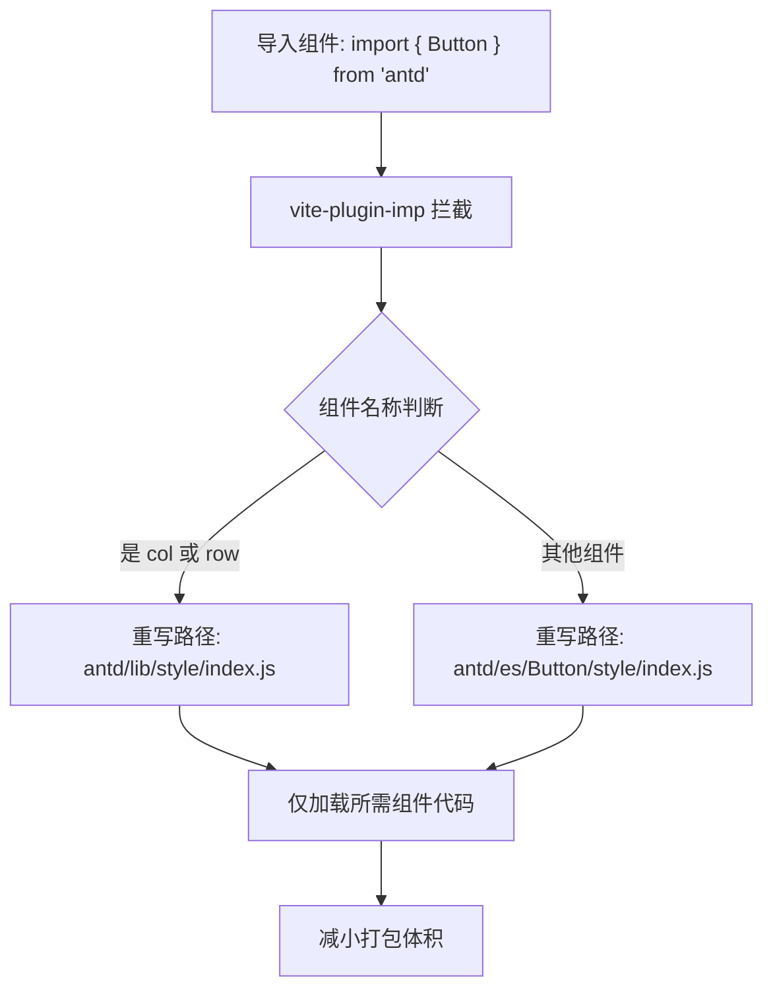
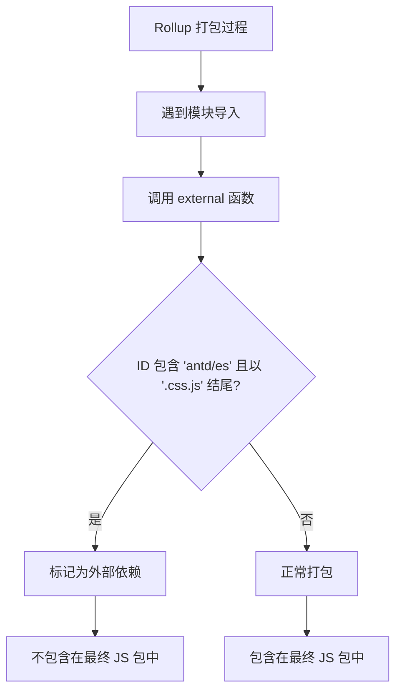

# 构建配置

<cite>
**Referenced Files in This Document**   
- [vite.config.ts](file://vite.config.ts)
- [package.json](file://package.json)
</cite>

## 目录
1. [项目构建配置概述](#项目构建配置概述)
2. [Vite 插件配置分析](#vite-插件配置分析)
3. [路径别名与模块解析](#路径别名与模块解析)
4. [CSS 预处理器配置](#css-预处理器配置)
5. [打包优化配置](#打包优化配置)
6. [构建脚本与工作流](#构建脚本与工作流)

## 项目构建配置概述

本项目采用 Vite 作为核心构建工具，通过 `vite.config.ts` 文件进行详细的构建配置。配置文件定义了开发服务器、插件系统、模块解析、CSS 处理和生产构建优化等关键功能。结合 `package.json` 中的脚本命令，形成了完整的开发与构建工作流。配置重点在于提升开发体验、实现按需加载和优化最终打包结果。

**Section sources**
- [vite.config.ts](file://vite.config.ts#L1-L52)
- [package.json](file://package.json#L1-L60)

## Vite 插件配置分析

配置文件中集成了两个核心 Vite 插件：`@vitejs/plugin-react` 和 `vite-plugin-imp`。`@vitejs/plugin-react` 负责 React 项目的开发支持，包括 JSX 转换、Fast Refresh 热更新等功能，确保了高效的开发体验。`vite-plugin-imp` 是一个按需导入（Import on Demand）插件，其核心作用是避免在引入大型 UI 库时进行全量导入，从而显著减小打包体积。

该插件针对 Ant Design (`antd`) 库进行了专门配置，通过 `libList` 定义了按需加载规则。当项目中导入 Ant Design 的某个组件（如 `Button` 或 `Table`）时，插件会自动将导入路径转换为该组件的独立模块路径（`antd/es/${name}/style/index.js`），并仅加载该组件及其样式，而不是整个 Ant Design 库。对于 `col` 和 `row` 这类特殊情况，配置了独立的样式路径 `antd/lib/style/index.js`。

**Diagram sources**
- [vite.config.ts](file://vite.config.ts#L8-L18)

**Section sources**
- [vite.config.ts](file://vite.config.ts#L8-L18)

## 路径别名与模块解析

`resolve.alias` 配置定义了模块导入的路径别名，其中 `@` 被映射到 `src` 目录的绝对路径。这一配置极大地简化了模块导入语句，提升了代码的可读性和可维护性。在项目中，开发者可以使用 `@/components/Button` 这样的简洁路径来导入位于 `src/components/Button` 的组件，而无需编写冗长的相对路径（如 `../../../../components/Button`）。

此配置不仅作用于源代码，也影响了构建工具的模块解析过程。Vite 在解析 `@` 开头的导入时，会自动将其替换为 `src` 目录的完整路径，确保模块能够被正确加载。这在大型项目中尤为重要，因为它消除了因文件移动而导致的导入路径错误。

**Diagram sources**
- [vite.config.ts](file://vite.config.ts#L19-L23)

**Section sources**
- [vite.config.ts](file://vite.config.ts#L19-L23)

## CSS 预处理器配置

项目使用 Less 作为 CSS 预处理器，并在 `css.preprocessorOptions.less` 中配置了 `javascriptEnabled: true` 选项。此选项允许在 Less 文件中使用 JavaScript 表达式，为样式开发提供了极大的灵活性。Ant Design 的主题定制功能正是依赖于这一特性，它通过 JavaScript 动态计算和注入主题变量（如主色调、圆角大小等）。

如果禁用此选项，Ant Design 的主题变量将无法被正确解析，导致自定义主题失效或样式编译错误。因此，此配置是实现 Ant Design 深度主题定制的必要条件。

**Section sources**
- [vite.config.ts](file://vite.config.ts#L24-L32)

## 打包优化配置

`build.rollupOptions.external` 配置用于优化生产构建过程。它定义了一个函数，用于判断哪些模块应该被排除在最终的打包文件之外。在此项目中，该函数专门针对 Ant Design 组件的 CSS 模块进行排除。

当 Rollup 在构建过程中遇到一个模块 ID 时，此函数会检查该 ID 是否同时包含 `antd/es` 路径且以 `.css.js` 结尾。如果条件满足，则返回 `true`，指示 Rollup 将该模块视为外部依赖，不将其打包进最终的 JavaScript 文件中。这一策略可以有效避免将 Ant Design 的 CSS 代码打包进 JS 文件，通常这些 CSS 会被单独提取成 `.css` 文件，从而优化资源加载和缓存策略。

**Diagram sources**
- [vite.config.ts](file://vite.config.ts#L33-L42)

**Section sources**
- [vite.config.ts](file://vite.config.ts#L33-L42)

## 构建脚本与工作流

`package.json` 文件中的 `scripts` 字段定义了项目的标准化工作流。`start` 脚本通过 `vite` 命令启动开发服务器，利用 Vite 的快速冷启动和热更新特性。`build` 脚本执行 `vite build`，触发生产环境的构建流程，应用 `vite.config.ts` 中的所有优化配置，生成用于部署的静态文件。`serve` 脚本则通过 `vite preview` 启动一个本地服务器来预览已构建的产物，用于在部署前验证构建结果。

这些脚本与 `vite.config.ts` 中的配置项紧密协作：开发服务器的端口由 `server.port` 指定；插件配置决定了开发和构建时的代码转换行为；路径别名和 CSS 配置确保了开发时的正确解析；而打包优化配置则直接影响 `build` 脚本的输出结果。整个工作流形成了一个从开发到部署的完整闭环。

**Section sources**
- [package.json](file://package.json#L5-L15)
- [vite.config.ts](file://vite.config.ts#L44-L47)