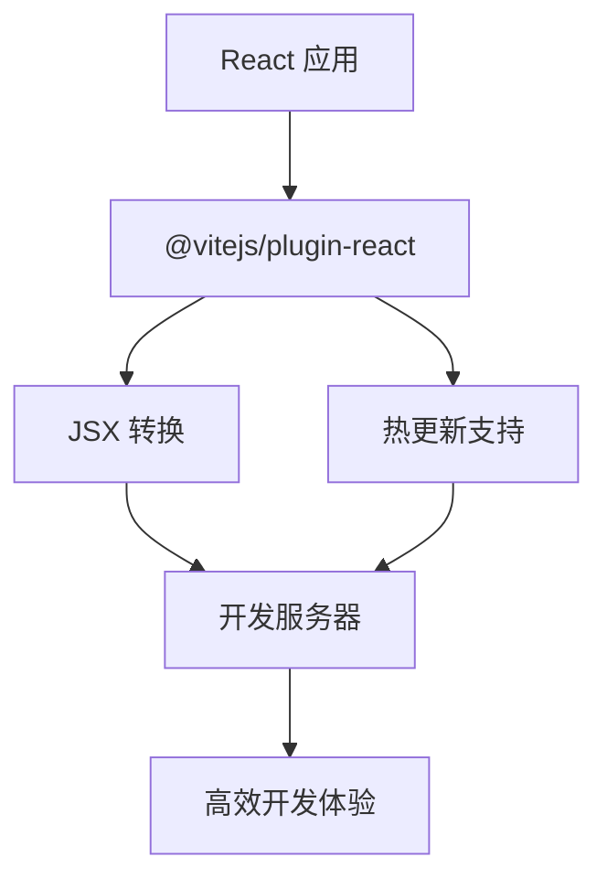

# 构建配置

<cite>
**本文引用的文件**
- [vite.config.ts](file://vite.config.ts)
- [package.json](file://package.json)
- [tsconfig.json](file://tsconfig.json)
- [src/styles/tailwind.css](file://src/styles/tailwind.css)
</cite>

## 更新摘要
**所做更改**
- 更新了Vite插件配置部分，反映从复杂配置简化为基本React插件配置
- 重新组织了路径别名配置说明，强调TypeScript路径映射的作用
- 移除了关于vite-plugin-imp插件和按需加载的详细说明
- 简化了CSS预处理器配置说明，不再涉及Less配置
- 移除了打包优化配置的相关内容
- 更新了构建脚本与工作流的说明，反映简化的配置架构

## 目录
1. [项目构建配置概述](#项目构建配置概述)
2. [Vite 插件配置分析](#vite-插件配置分析)
3. [路径别名与模块解析](#路径别名与模块解析)
4. [CSS 预处理器配置](#css-预处理器配置)
5. [构建脚本与工作流](#构建脚本与工作流)

## 项目构建配置概述

本项目采用 Vite 作为核心构建工具，通过 `vite.config.ts` 文件进行基础的构建配置。配置文件定义了开发服务器、React插件支持和模块解析等关键功能。结合 `package.json` 中的脚本命令，形成了完整的开发与构建工作流。当前配置架构相对简化，专注于提供高效的开发体验和基本的构建功能。

**章节来源**
- [vite.config.ts:1-18](file://vite.config.ts#L1-L18)
- [package.json:1-58](file://package.json#L1-L58)

## Vite 插件配置分析

配置文件中集成了 `@vitejs/plugin-react` 插件，这是当前唯一的构建插件。该插件负责 React 项目的开发支持，包括 JSX 转换、Fast Refresh 热更新等功能，确保了高效的开发体验。相比之前的复杂配置，当前版本移除了 `vite-plugin-imp` 按需导入插件和其他高级优化配置，简化了构建流程。

```mermaid
flowchart TD
A["React 应用"] --> B["@vitejs/plugin-react"]
B --> C["JSX 转换"]
B --> D["热更新支持"]
C --> E["开发服务器"]
D --> E
E --> F["高效开发体验"]
```

**图表来源**
- [vite.config.ts:6-7](file://vite.config.ts#L6-L7)

**章节来源**
- [vite.config.ts:6-7](file://vite.config.ts#L6-L7)

## 路径别名与模块解析

`resolve.alias` 配置定义了模块导入的路径别名，其中 `@` 被映射到 `src` 目录的绝对路径。这一配置极大地简化了模块导入语句，提升了代码的可读性和可维护性。在项目中，开发者可以使用 `@/components/Button` 这样的简洁路径来导入位于 `src/components/Button` 的组件。

需要注意的是，TypeScript 也在 `tsconfig.json` 中配置了类似的路径映射（`"@/*": ["src/*"]`），确保了开发工具和构建工具的一致性。这种双重配置确保了在开发环境中无论是通过 Vite 还是 TypeScript 编译器，都能正确解析路径别名。

```mermaid
flowchart LR
A["源代码: import Layout from '@/layout/BasicLayout'"] --> B["Vite 解析"]
B --> C["resolve.alias: '@' -> './src'"]
C --> D["TypeScript 路径映射"]
D --> E["实际路径: ./src/layout/BasicLayout"]
E --> F["成功加载模块"]
```

**图表来源**
- [vite.config.ts:8-12](file://vite.config.ts#L8-L12)
- [tsconfig.json:42-49](file://tsconfig.json#L42-L49)

**章节来源**
- [vite.config.ts:8-12](file://vite.config.ts#L8-L12)
- [tsconfig.json:42-49](file://tsconfig.json#L42-L49)

## CSS 预处理器配置

项目使用 Tailwind CSS 作为 CSS 框架，并通过 `src/styles/tailwind.css` 文件进行配置。该文件简单地导入了 tailwindcss，实现了基础的样式框架功能。相比之前的 Less 配置，当前版本采用了更简洁的样式处理方式。

Tailwind CSS 提供了实用优先的 CSS 框架，通过原子化的类名来快速构建用户界面，减少了手写 CSS 的需求。配合 Vite 的快速构建能力，为开发者提供了高效的样式开发体验。

**章节来源**
- [src/styles/tailwind.css:1-2](file://src/styles/tailwind.css#L1-L2)

## 构建脚本与工作流

`package.json` 文件中的 `scripts` 字段定义了项目的标准化工作流。`start` 脚本通过 `vite` 命令启动开发服务器，利用 Vite 的快速冷启动和热更新特性。`build` 脚本执行 `vite build`，触发生产环境的构建流程。`serve` 脚本则通过 `vite preview` 启动一个本地服务器来预览已构建的产物。

这些脚本与 `vite.config.ts` 中的配置项协作：开发服务器的端口由 `server.port` 指定；插件配置决定了开发和构建时的代码转换行为；路径别名和 CSS 配置确保了开发时的正确解析。整个工作流形成了一个从开发到部署的完整闭环，但相比之前的复杂配置，当前版本更加简洁高效。

**章节来源**
- [package.json:5-12](file://package.json#L5-L12)
- [vite.config.ts:14-16](file://vite.config.ts#L14-L16)