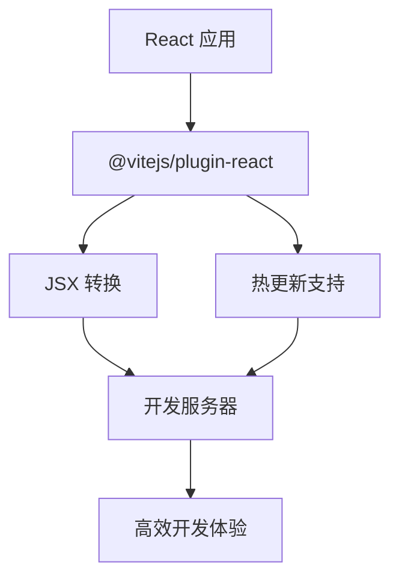

# 构建配置

<cite>
**本文引用的文件**
- [vite.config.ts](file://vite.config.ts)
- [package.json](file://package.json)
- [tsconfig.json](file://tsconfig.json)
- [jest.config.ts](file://jest.config.ts)
- [jest.setup.ts](file://jest.setup.ts)
- [src/styles/tailwind.css](file://src/styles/tailwind.css)
</cite>

## 更新摘要
**所做更改**
- 更新了TypeScript配置部分，反映TypeScript 6的配置更新
- 移除了baseUrl配置，采用新的模块解析策略
- 更新了moduleResolution为bundler，提升构建性能
- 完善了路径映射配置，包括新增的组件和工具路径
- 更新了Jest配置，反映TypeScript 6的兼容性要求
- 强化了构建工具链的一致性配置

## 目录
1. [项目构建配置概述](#项目构建配置概述)
2. [Vite 插件配置分析](#vite-插件配置分析)
3. [TypeScript 配置更新](#typescript-配置更新)
4. [路径别名与模块解析](#路径别名与模块解析)
5. [CSS 预处理器配置](#css-预处理器配置)
6. [构建脚本与工作流](#构建脚本与工作流)

## 项目构建配置概述

本项目采用 Vite 作为核心构建工具，通过 `vite.config.ts` 文件进行基础的构建配置。配置文件定义了开发服务器、React插件支持和模块解析等关键功能。结合 `package.json` 中的脚本命令，形成了完整的开发与构建工作流。

**章节来源**
- [vite.config.ts:1-18](file://vite.config.ts#L1-L18)
- [package.json:1-61](file://package.json#L1-L61)

## Vite 插件配置分析

配置文件中集成了 `@vitejs/plugin-react` 插件，这是当前唯一的构建插件。该插件负责 React 项目的开发支持，包括 JSX 转换、Fast Refresh 热更新等功能，确保了高效的开发体验。


```mermaid
flowchart TD
A["React 应用"] --> B["@vitejs/plugin-react"]
B --> C["JSX 转换"]
B --> D["热更新支持"]
C --> E["开发服务器"]
D --> E
E --> F["高效开发体验"]
```

**图表来源**
- [vite.config.ts:6-7](file://vite.config.ts#L6-L7)

**章节来源**
- [vite.config.ts:6-7](file://vite.config.ts#L6-L7)

## TypeScript 配置更新

项目已升级到 TypeScript 6，采用了现代化的配置策略。主要更新包括：

### 模块解析策略
- **moduleResolution**: 更新为 `"bundler"`，提供更好的打包性能和兼容性
- **移除 baseUrl**: 简化路径解析，减少配置复杂度
- **增强的模块系统**: 支持现代 ES 模块和 CommonJS 的混合使用

### 路径映射配置
TypeScript 配置了全面的路径映射，支持多种模块结构：
- `@/*`: 根目录映射到 `./src/*`
- `@/components/*`: 组件目录映射
- `@/pages/*`: 页面目录映射  
- `@/services/*`: 服务层映射
- `@/store/*`: 状态管理映射
- `@/utils/*`: 工具函数映射
- `@/types/*`: 类型定义映射

### TypeScript 6 特性
- **ESNext 模块**: 使用最新的 ECMAScript 模块语法
- **严格类型检查**: 启用了全面的类型安全检查
- **实验性装饰器**: 支持装饰器语法
- **增量编译**: 提升编译性能

**章节来源**
- [tsconfig.json:12](file://tsconfig.json#L12)
- [tsconfig.json:40-49](file://tsconfig.json#L40-L49)
- [tsconfig.json:55-58](file://tsconfig.json#L55-L58)
- [tsconfig.json:95](file://tsconfig.json#L95)

## 路径别名与模块解析

`resolve.alias` 配置定义了模块导入的路径别名，其中 `@` 被映射到 `src` 目录的绝对路径。这一配置极大地简化了模块导入语句，提升了代码的可读性和可维护性。

### Vite 路径映射
```typescript
resolve: {
  alias: {
    "@": path.resolve(__dirname, "src"),
  },
},
```

### TypeScript 路径映射
TypeScript 在 `tsconfig.json` 中配置了更详细的路径映射：
```json
"paths": {
  "@/*": ["./src/*"],
  "@/components/*": ["./src/components/*"],
  "@/pages/*": ["./src/pages/*"],
  "@/services/*": ["./src/services/*"],
  "@/store/*": ["./src/store/*"],
  "@/utils/*": ["./src/utils/*"],
  "@/types/*": ["./src/types/*"]
}
```

### Jest 路径映射
Jest 配置中也包含了相应的路径映射：
```typescript
moduleNameMapper: {
  "@/(.*)": "<rootDir>/src/$1",
}
```

这种多层配置确保了在开发、构建、测试等不同环境中都能正确解析路径别名。

**章节来源**
- [vite.config.ts:8-12](file://vite.config.ts#L8-L12)
- [tsconfig.json:40-49](file://tsconfig.json#L40-L49)
- [jest.config.ts:18-21](file://jest.config.ts#L18-L21)

## CSS 预处理器配置

项目使用 Tailwind CSS 作为 CSS 框架，并通过 `src/styles/tailwind.css` 文件进行配置。该文件简单地导入了 tailwindcss，实现了基础的样式框架功能。

Tailwind CSS 提供了实用优先的 CSS 框架，通过原子化的类名来快速构建用户界面，减少了手写 CSS 的需求。配合 Vite 的快速构建能力，为开发者提供了高效的样式开发体验。

**章节来源**
- [src/styles/tailwind.css:1-2](file://src/styles/tailwind.css#L1-L2)

## 构建脚本与工作流

`package.json` 文件中的 `scripts` 字段定义了项目的标准化工作流。`start` 脚本通过 `vite` 命令启动开发服务器，利用 Vite 的快速冷启动和热更新特性。`build` 脚本执行 `vite build`，触发生产环境的构建流程。`serve` 脚本则通过 `vite preview` 启动一个本地服务器来预览已构建的产物。

### 开发环境配置
- **端口**: 3123
- **热更新**: Fast Refresh
- **TypeScript 支持**: 即时类型检查

### 测试环境配置
项目同时支持 Jest 和 Vitest 测试框架：
- **Jest**: 用于组件测试和集成测试
- **Vitest**: 用于单元测试和组件测试
- **测试环境**: jsdom，模拟浏览器环境

### 构建优化
- **模块解析**: 使用 bundler 模式提升性能
- **路径映射**: 多层配置确保一致性
- **TypeScript 6**: 利用最新语言特性和性能优化

**章节来源**
- [package.json:5-12](file://package.json#L5-L12)
- [vite.config.ts:14-16](file://vite.config.ts#L14-L16)
- [jest.config.ts:3](file://jest.config.ts#L3-L3)