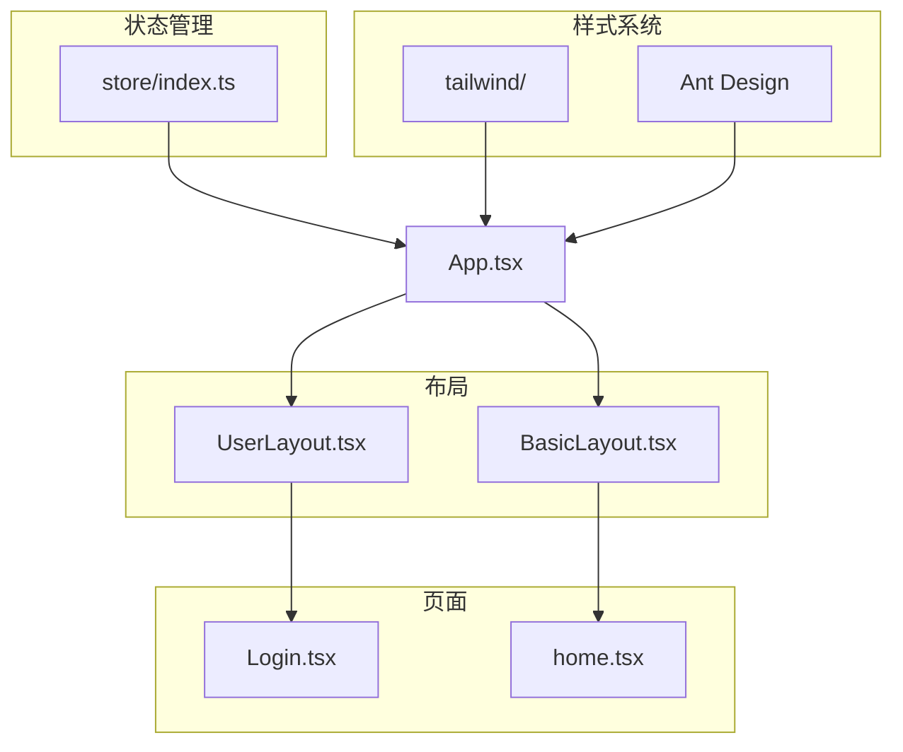
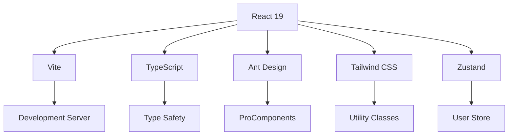
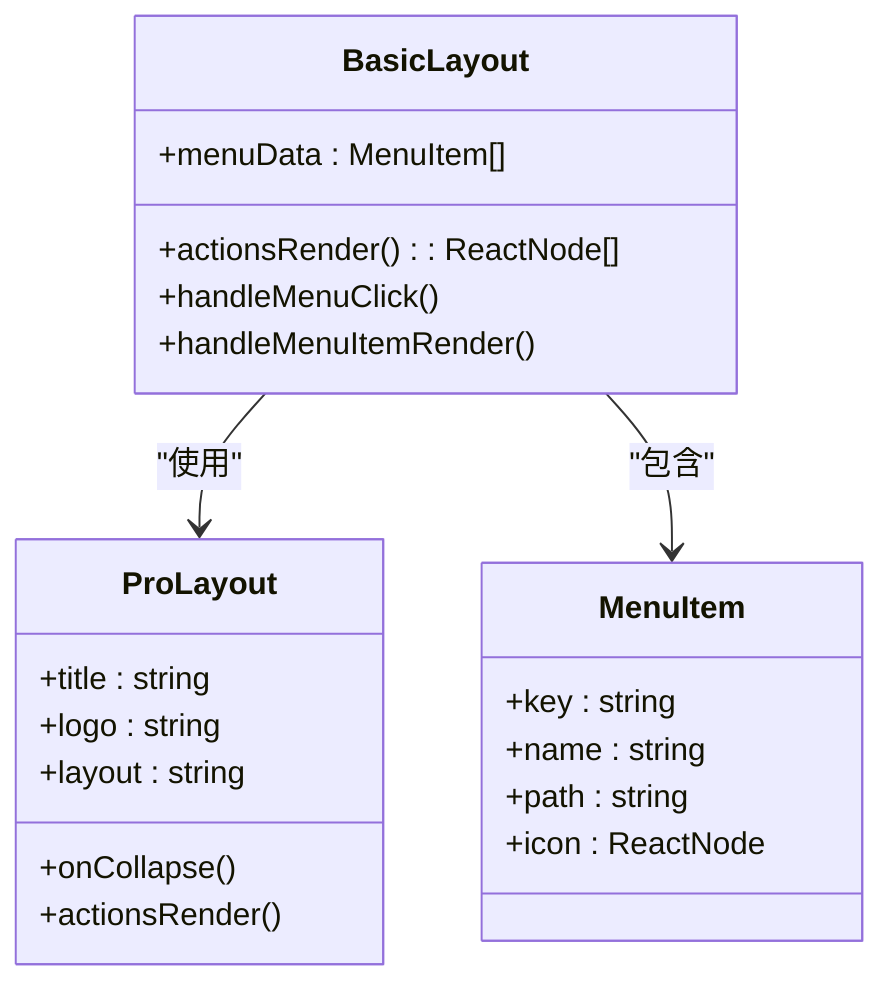
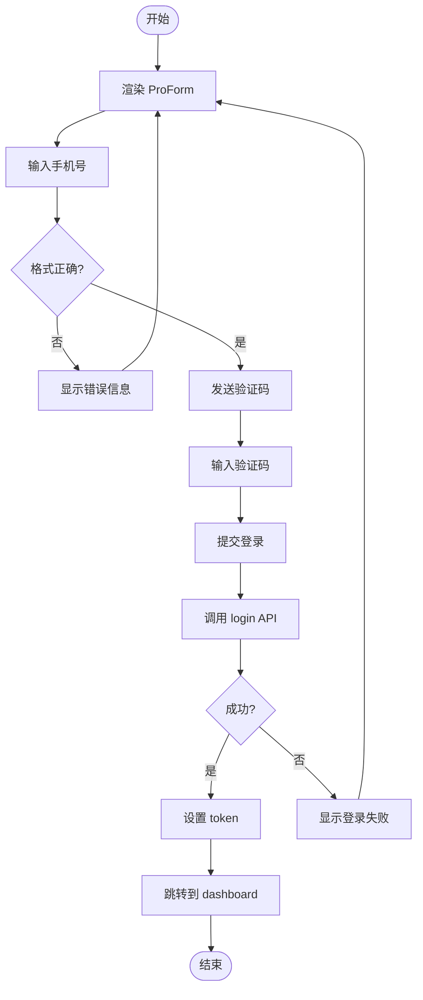
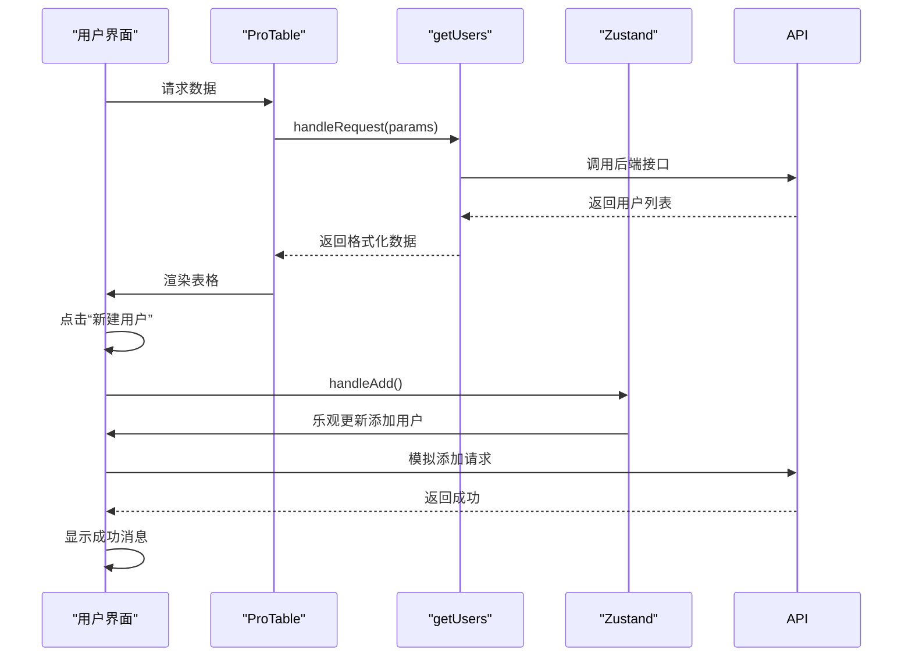

# Ant Design 集成

<cite>
**本文档引用文件**  
- [App.tsx](file://src/App.tsx)
- [BasicLayout.tsx](file://src/layout/BasicLayout.tsx)
- [Login.tsx](file://src/pages/User/Login.tsx)
- [home.tsx](file://src/pages/home.tsx)
- [tailwind.config.js](file://src/tailwind/tailwind.config.js)
- [index.css](file://src/tailwind/index.css)
- [tailwind.css](file://src/tailwind/tailwind.css)
- [package.json](file://package.json)
</cite>

## 目录
1. [简介](#简介)
2. [项目结构](#项目结构)
3. [核心组件](#核心组件)
4. [架构概览](#架构概览)
5. [详细组件分析](#详细组件分析)
6. [依赖分析](#依赖分析)
7. [性能考虑](#性能考虑)
8. [故障排除指南](#故障排除指南)
9. [结论](#结论)

## 简介
本文档旨在详细说明如何在使用 Tailwind CSS 的项目中集成 Ant Design 组件库，确保两者共存且协同工作。重点在于避免样式冲突、合理利用 Tailwind 进行布局微调，并实现主题同步。通过实际代码示例和最佳实践，帮助开发者高效构建现代化 React 应用。

## 项目结构
本项目采用模块化结构，主要分为布局、页面、服务、状态管理及样式配置等部分。Tailwind CSS 与 Ant Design 并行使用，通过合理的配置实现样式隔离与协同。



**Diagram sources**
- [App.tsx](file://src/App.tsx#L1-L25)
- [tailwind.config.js](file://src/tailwind/tailwind.config.js#L1-L12)

**Section sources**
- [App.tsx](file://src/App.tsx#L1-L25)
- [tailwind.config.js](file://src/tailwind/tailwind.config.js#L1-L12)

## 核心组件
项目核心包括使用 Ant Design 的 `ProLayout`、`ProTable`、`ProForm` 等高级组件，结合 Tailwind 的实用类进行布局控制。通过 `useOptimistic` 实现乐观更新，提升用户体验。

**Section sources**
- [BasicLayout.tsx](file://src/layout/BasicLayout.tsx#L1-L224)
- [home.tsx](file://src/pages/home.tsx#L1-L295)
- [Login.tsx](file://src/pages/User/Login.tsx#L1-L162)

## 架构概览
整体架构基于 React 19 + Vite + TypeScript，采用 Zustand 进行状态管理，Ant Design 提供 UI 组件，Tailwind 负责细粒度样式控制。通过 `ConfigProvider` 统一配置 Ant Design 主题，Tailwind 则通过 `tailwind.config.js` 进行定制。



**Diagram sources**
- [package.json](file://package.json#L1-L59)
- [App.tsx](file://src/App.tsx#L1-L25)

## 详细组件分析

### 布局组件分析
`BasicLayout` 使用 Ant Design 的 `ProLayout` 提供侧边栏和导航，同时通过 Tailwind 的 `flex`、`h-full` 等类控制容器样式。右侧操作栏使用 Ant Design 组件，布局由 Tailwind 控制。

#### 组件关系图


**Diagram sources**
- [BasicLayout.tsx](file://src/layout/BasicLayout.tsx#L1-L224)

**Section sources**
- [BasicLayout.tsx](file://src/layout/BasicLayout.tsx#L1-L224)

### 登录页面分析
`Login` 页面使用 Ant Design 的 `ProForm` 构建表单，输入框使用 `ProFormText` 和 `ProFormCaptcha`。整体居中布局通过 Tailwind 的 `flex`、`text-center`、`text-2xl` 实现。

#### 表单流程图


**Diagram sources**
- [Login.tsx](file://src/pages/User/Login.tsx#L1-L162)

**Section sources**
- [Login.tsx](file://src/pages/User/Login.tsx#L1-L162)

### 首页分析
`Home` 页面使用 `ProTable` 展示用户数据，工具栏按钮使用 Ant Design 的 `Button` 和 `Space`，配合 Tailwind 的 `mb-4`、`flex` 等类进行布局。乐观更新状态通过自定义样式展示。

#### 数据流图


**Diagram sources**
- [home.tsx](file://src/pages/home.tsx#L1-L295)

**Section sources**
- [home.tsx](file://src/pages/home.tsx#L1-L295)

## 依赖分析
项目依赖清晰，Ant Design 与 Tailwind CSS 各司其职。通过 `package.json` 管理版本，确保兼容性。

```mermaid
graph LR
A[react-vscode-template] --> B[antd@5.27.6]
A --> C[tailwindcss@4.1.15]
A --> D[@ant-design/pro-components]
B --> E[React]
C --> F[PostCSS]
D --> B
A --> G[vite]
G --> H[TypeScript]
```

**Diagram sources**
- [package.json](file://package.json#L1-L59)

**Section sources**
- [package.json](file://package.json#L1-L59)

## 性能考虑
- 使用 `React.memo` 避免不必要的重渲染
- `useMemo` 和 `useCallback` 优化计算和函数引用
- 乐观更新减少用户等待感知
- Ant Design 的 `ProTable` 支持分页和搜索，避免一次性加载大量数据

## 故障排除指南
- **样式冲突**：确保 `antd/dist/reset.css` 在 Tailwind 之前导入
- **图标不显示**：检查 `@ant-design/icons` 是否正确安装
- **表单验证失败**：确认 `ProForm` 的 `rules` 配置正确
- **状态未持久化**：检查 Zustand 的持久化配置

**Section sources**
- [App.tsx](file://src/App.tsx#L1-L25)
- [store/index.ts](file://src/store/index.ts#L1-L10)

## 结论
通过合理配置和组件分工，Tailwind CSS 与 Ant Design 可以完美共存。Ant Design 提供高质量的 UI 组件，Tailwind 提供灵活的布局控制，两者结合可快速构建现代化、响应式的 Web 应用。