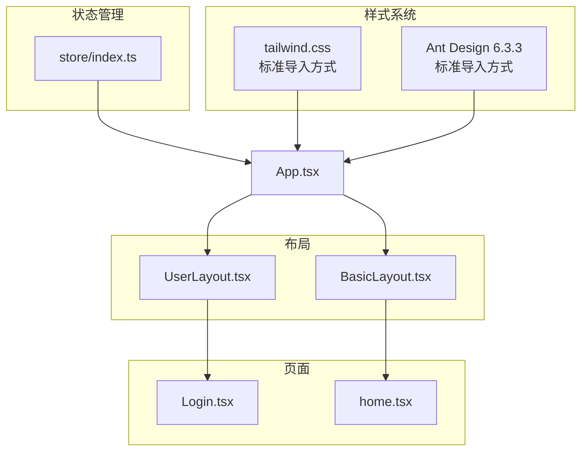
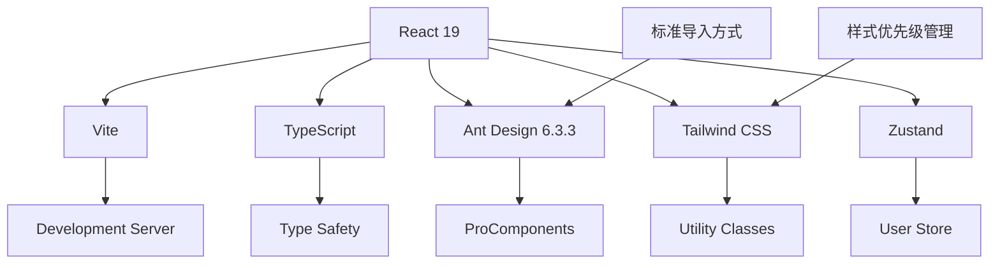
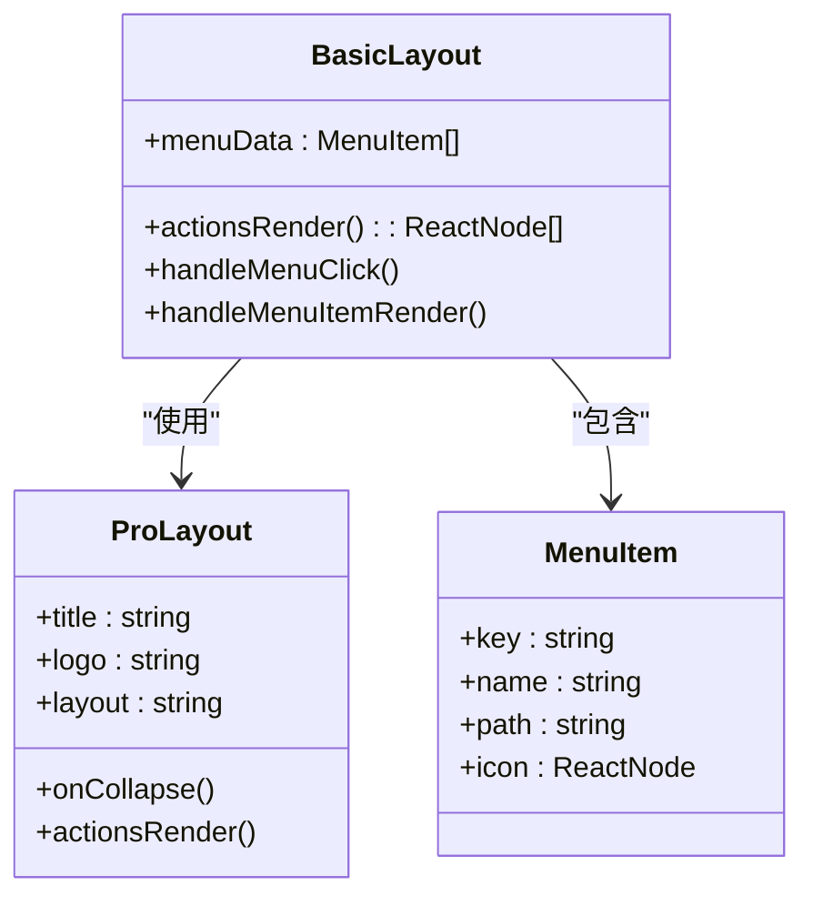
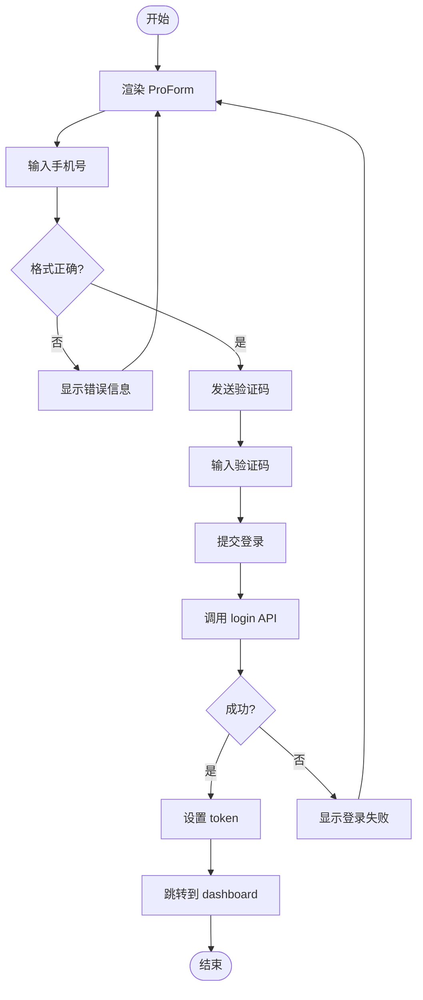
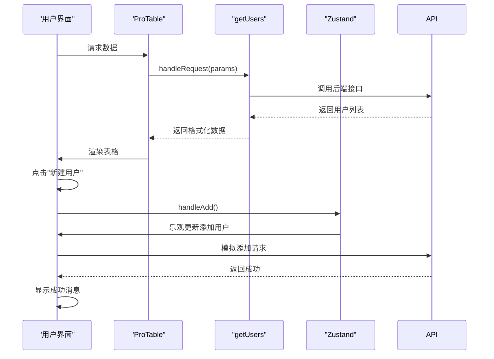

# Ant Design 集成

<cite>
**本文档引用文件**  
- [App.tsx](file://src/App.tsx)
- [BasicLayout.tsx](file://src/layout/BasicLayout.tsx)
- [Login.tsx](file://src/pages/User/Login.tsx)
- [home.tsx](file://src/pages/home.tsx)
- [tailwind.css](file://src/styles/tailwind.css)
- [index.tsx](file://src/index.tsx)
- [package.json](file://package.json)
- [vite.config.ts](file://vite.config.ts)
</cite>

## 更新摘要
**所做更改**  
- 更新了 Ant Design 版本信息（从 5.x 升级到 6.3.3）
- 移除了 Vite 插件系统对 Ant Design 样式的自定义处理
- 更新了标准导入方式的集成说明
- 增强了样式优先级管理和冲突避免的最佳实践
- 完善了依赖升级后的兼容性说明

## 目录
1. [简介](#简介)
2. [项目结构](#项目结构)
3. [核心组件](#核心组件)
4. [架构概览](#架构概览)
5. [详细组件分析](#详细组件分析)
6. [依赖分析](#依赖分析)
7. [性能考虑](#性能考虑)
8. [故障排除指南](#故障排除指南)
9. [结论](#结论)

## 简介
本文档旨在详细说明如何在使用 Tailwind CSS 的项目中集成 Ant Design 组件库，确保两者共存且协同工作。重点在于避免样式冲突、合理利用 Tailwind 进行布局微调，并实现主题同步。通过实际代码示例和最佳实践，帮助开发者高效构建现代化 React 应用。

**更新** 本版本反映了 Ant Design 6.x 的重大升级，移除了自定义 Vite 插件处理，现在使用标准导入方式，提供了更好的兼容性和维护性。

## 项目结构
本项目采用模块化结构，主要分为布局、页面、服务、状态管理及样式配置等部分。Tailwind CSS 与 Ant Design 并行使用，通过合理的配置实现样式隔离与协同。

```mermaid
graph TB
subgraph "样式系统"
Tailwind[tailwind.css<br/>标准导入方式]
AntDesign[Ant Design 6.3.3<br/>标准导入方式]
end
subgraph "布局"
BasicLayout[BasicLayout.tsx]
UserLayout[UserLayout.tsx]
end
subgraph "页面"
Login[Login.tsx]
Home[home.tsx]
end
subgraph "状态管理"
Store[store/index.ts]
end
App[App.tsx] --> BasicLayout
App --> UserLayout
BasicLayout --> Home
UserLayout --> Login
Store --> App
Tailwind --> App
AntDesign --> App
```

**Diagram sources**
- [tailwind.css:1-2](file://src/styles/tailwind.css#L1-L2)
- [App.tsx:1-26](file://src/App.tsx#L1-L26)

**Section sources**
- [App.tsx:1-26](file://src/App.tsx#L1-L26)
- [tailwind.css:1-2](file://src/styles/tailwind.css#L1-L2)

## 核心组件
项目核心包括使用 Ant Design 的 `ProLayout`、`ProTable`、`ProForm` 等高级组件，结合 Tailwind 的实用类进行布局控制。通过 `useOptimistic` 实现乐观更新，提升用户体验。

**更新** Ant Design 6.3.3 版本带来了更好的 TypeScript 支持和性能优化，同时保持了与现有代码的高度兼容性。

**Section sources**
- [BasicLayout.tsx:1-225](file://src/layout/BasicLayout.tsx#L1-L225)
- [home.tsx:1-295](file://src/pages/home.tsx#L1-L295)
- [Login.tsx:1-202](file://src/pages/User/Login.tsx#L1-L202)

## 架构概览
整体架构基于 React 19 + Vite + TypeScript，采用 Zustand 进行状态管理，Ant Design 提供 UI 组件，Tailwind 负责细粒度样式控制。通过 `ConfigProvider` 统一配置 Ant Design 主题，Tailwind 则通过 `tailwind.css` 进行定制。

**更新** 移除了自定义 Vite 插件，现在使用标准的 Ant Design 导入方式，简化了构建配置并提高了兼容性。

```mermaid
graph TD
A[React 19] --> B[Vite]
A --> C[TypeScript]
A --> D[Ant Design 6.3.3]
A --> E[Tailwind CSS]
D --> F[ProComponents]
E --> G[Utility Classes]
A --> H[Zustand]
H --> I[User Store]
B --> J[Development Server]
C --> K[Type Safety]
L[标准导入方式] --> D
M[样式优先级管理] --> E
```

**Diagram sources**
- [package.json:1-58](file://package.json#L1-L58)
- [App.tsx:1-26](file://src/App.tsx#L1-L26)

## 详细组件分析

### 布局组件分析
`BasicLayout` 使用 Ant Design 的 `ProLayout` 提供侧边栏和导航，同时通过 Tailwind 的 `flex`、`h-full` 等类控制容器样式。右侧操作栏使用 Ant Design 组件，布局由 Tailwind 控制。

#### 组件关系图

```mermaid
classDiagram
class BasicLayout {
+menuData : MenuItem[]
+actionsRender() : ReactNode[]
+handleMenuClick()
+handleMenuItemRender()
}
class ProLayout {
+title : string
+logo : string
+layout : string
+onCollapse()
+actionsRender()
}
class MenuItem {
+key : string
+name : string
+path : string
+icon : ReactNode
}
BasicLayout --> ProLayout : "使用"
BasicLayout --> MenuItem : "包含"
```

**Diagram sources**
- [BasicLayout.tsx:1-225](file://src/layout/BasicLayout.tsx#L1-L225)

**Section sources**
- [BasicLayout.tsx:1-225](file://src/layout/BasicLayout.tsx#L1-L225)

### 登录页面分析
`Login` 页面使用 Ant Design 的 `ProForm` 构建表单，输入框使用 `ProFormText` 和 `ProFormCaptcha`。整体居中布局通过 Tailwind 的 `flex`、`text-center`、`text-2xl` 实现。

#### 表单流程图

```mermaid
flowchart TD
Start([开始]) --> Form[渲染 ProForm]
Form --> Input[输入手机号]
Input --> Validate{"格式正确?"}
Validate --> |否| ShowError["显示错误信息"]
Validate --> |是| SendCaptcha[发送验证码]
SendCaptcha --> EnterCaptcha[输入验证码]
EnterCaptcha --> Submit[提交登录]
Submit --> API[调用 login API]
API --> Success{成功?}
Success --> |是| SetToken["设置 token"]
Success --> |否| ShowLoginError["显示登录失败"]
SetToken --> Redirect["跳转到 dashboard"]
ShowError --> Form
ShowLoginError --> Form
Redirect --> End([结束])
```

**Diagram sources**
- [Login.tsx:1-202](file://src/pages/User/Login.tsx#L1-L202)

**Section sources**
- [Login.tsx:1-202](file://src/pages/User/Login.tsx#L1-L202)

### 首页分析
`Home` 页面使用 `ProTable` 展示用户数据，工具栏按钮使用 Ant Design 的 `Button` 和 `Space`，配合 Tailwind 的 `mb-4`、`flex` 等类进行布局。乐观更新状态通过自定义样式展示。

#### 数据流图

```mermaid
sequenceDiagram
participant UI as "用户界面"
participant Table as "ProTable"
participant Service as "getUsers"
participant Store as "Zustand"
UI->>Table : 请求数据
Table->>Service : handleRequest(params)
Service->>API : 调用后端接口
API-->>Service : 返回用户列表
Service-->>Table : 返回格式化数据
Table->>UI : 渲染表格
UI->>UI : 点击"新建用户"
UI->>Store : handleAdd()
Store->>UI : 乐观更新添加用户
UI->>API : 模拟添加请求
API-->>UI : 返回成功
UI->>UI : 显示成功消息
```

**Diagram sources**
- [home.tsx:1-295](file://src/pages/home.tsx#L1-L295)

**Section sources**
- [home.tsx:1-295](file://src/pages/home.tsx#L1-L295)

## 依赖分析
项目依赖已升级到最新版本，Ant Design 6.3.3 提供了更好的性能和兼容性。通过 `package.json` 管理版本，确保兼容性。

**更新** Ant Design 6.x 版本移除了对自定义 Vite 插件的依赖，现在使用标准导入方式，简化了配置并提高了稳定性。

```mermaid
graph LR
A[react-vscode-template] --> B[antd@6.3.3<br/>标准导入]
A --> C[tailwindcss@4.1.15]
A --> D[@ant-design/pro-components@2.8.10]
B --> E[React 19]
C --> F[PostCSS]
D --> B
A --> G[Vite 8.0.0]
G --> H[TypeScript 5.9.2]
I[移除自定义插件] --> A
J[增强兼容性] --> B
```

**Diagram sources**
- [package.json:1-58](file://package.json#L1-L58)

**Section sources**
- [package.json:1-58](file://package.json#L1-L58)

## 性能考虑
- 使用 `React.memo` 避免不必要的重渲染
- `useMemo` 和 `useCallback` 优化计算和函数引用
- 乐观更新减少用户等待感知
- Ant Design 的 `ProTable` 支持分页和搜索，避免一次性加载大量数据
- **更新** Ant Design 6.3.3 优化了组件渲染性能，减少了内存占用

## 故障排除指南
- **样式冲突**：确保 `antd/dist/reset.css` 在 Tailwind 之前导入
- **图标不显示**：检查 `@ant-design/icons` 是否正确安装
- **表单验证失败**：确认 `ProForm` 的 `rules` 配置正确
- **状态未持久化**：检查 Zustand 的持久化配置
- **更新后样式异常**：检查 Ant Design 6.x 的迁移指南
- **构建错误**：确认移除了自定义 Vite 插件配置

**Section sources**
- [App.tsx:1-26](file://src/App.tsx#L1-L26)
- [index.tsx:1-11](file://src/index.tsx#L1-L11)

## 结论
通过合理配置和组件分工，Tailwind CSS 与 Ant Design 可以完美共存。Ant Design 6.3.3 提供了更好的性能和兼容性，移除自定义 Vite 插件后，项目配置更加简洁稳定。Ant Design 提供高质量的 UI 组件，Tailwind 提供灵活的布局控制，两者结合可快速构建现代化、响应式的 Web 应用。