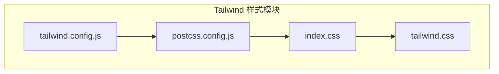
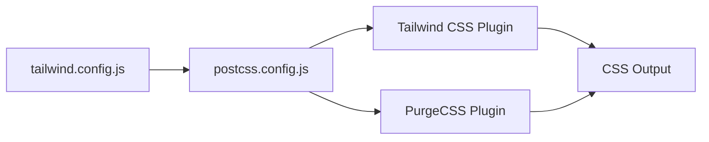
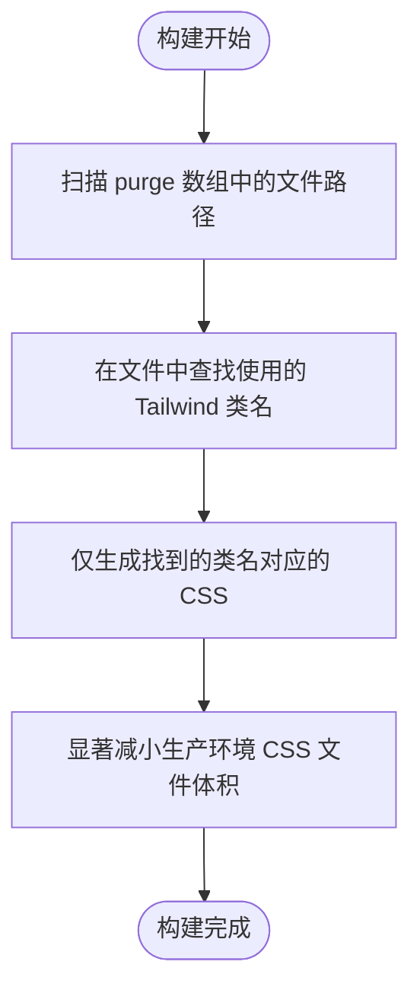
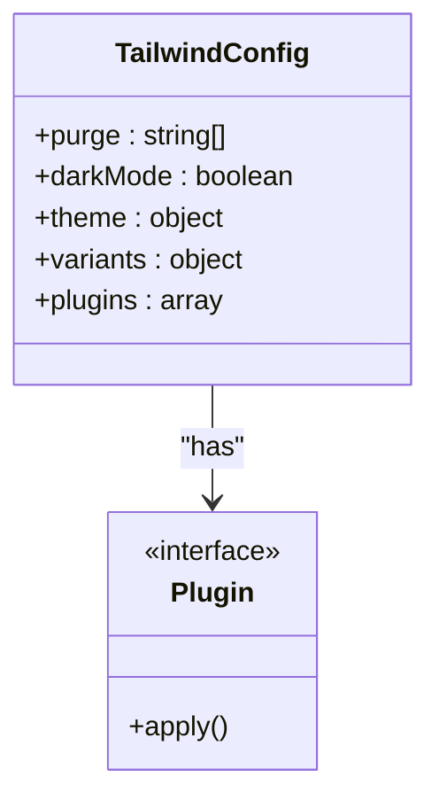
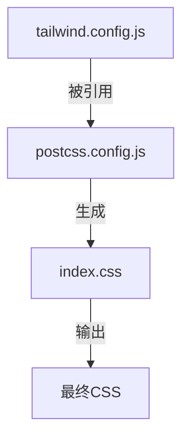

# Tailwind 配置

<cite>
**Referenced Files in This Document**   
- [tailwind.config.js](file://src/tailwind/tailwind.config.js)
- [postcss.config.js](file://src/tailwind/postcss.config.js)
- [index.css](file://src/tailwind/index.css)
</cite>

## 目录
1. [简介](#简介)
2. [项目结构](#项目结构)
3. [核心组件](#核心组件)
4. [架构概述](#架构概述)
5. [详细组件分析](#详细组件分析)
6. [依赖分析](#依赖分析)
7. [性能考量](#性能考量)
8. [故障排除指南](#故障排除指南)
9. [结论](#结论)
10. [附录](#附录)（如有必要）

## 简介
本文档详细阐述了项目中 Tailwind CSS 的配置机制，重点解析 `tailwind.config.js` 文件中的关键配置项。文档涵盖 PurgeCSS 清除规则、主题扩展、变体扩展和插件系统的实现方式，分析 `darkMode` 设置为 `false` 的设计考量，并说明配置如何在生产环境中优化 CSS 体积，同时确保开发环境的样式完整性。此外，提供修改主题、添加自定义样式变体和集成第三方插件的实践指导。

## 项目结构
Tailwind CSS 相关配置文件集中存放在 `src/tailwind/` 目录下，形成独立的样式管理模块。该目录包含核心配置文件、PostCSS 集成配置和入口 CSS 文件，实现了样式配置与应用代码的分离。

**Diagram sources**
- [tailwind.config.js](file://src/tailwind/tailwind.config.js#L0-L12)
- [postcss.config.js](file://src/tailwind/postcss.config.js#L0-L16)

**Section sources**
- [tailwind.config.js](file://src/tailwind/tailwind.config.js#L0-L12)

## 核心组件
核心配置由 `tailwind.config.js` 文件驱动，通过 `postcss.config.js` 集成到构建流程，并由 `index.css` 作为样式入口点。`purge` 配置项定义了需要扫描的文件路径，以确定最终生成的 CSS 中保留哪些样式类。

**Section sources**
- [tailwind.config.js](file://src/tailwind/tailwind.config.js#L0-L12)
- [postcss.config.js](file://src/tailwind/postcss.config.js#L0-L16)

## 架构概述
Tailwind CSS 的配置与构建流程通过 PostCSS 插件链进行集成。`tailwind.config.js` 提供配置，`postcss.config.js` 加载 Tailwind 插件并传入配置文件路径，同时集成 PurgeCSS 插件以优化生产环境下的 CSS 体积。

**Diagram sources**
- [tailwind.config.js](file://src/tailwind/tailwind.config.js#L0-L12)
- [postcss.config.js](file://src/tailwind/postcss.config.js#L0-L16)

## 详细组件分析

### PurgeCSS 清除规则分析
PurgeCSS 的清除规则通过 `purge` 数组和 `content` 数组双重定义。`tailwind.config.js` 中的 `purge` 数组指定了需要扫描的源文件路径模式，确保所有 `.js`, `.jsx`, `.ts`, `.tsx` 文件以及 `index.html` 被纳入分析范围。

**Diagram sources**
- [tailwind.config.js](file://src/tailwind/tailwind.config.js#L2-L3)
- [postcss.config.js](file://src/tailwind/postcss.config.js#L2-L8)

**Section sources**
- [tailwind.config.js](file://src/tailwind/tailwind.config.js#L2-L3)

### 主题与变体扩展机制
配置文件通过 `theme.extend` 和 `variants.extend` 对象提供扩展点。开发者可以在此添加自定义颜色、间距、字体等主题变量，或扩展新的响应式变体（如 hover、focus）。

**Section sources**
- [tailwind.config.js](file://src/tailwind/tailwind.config.js#L6-L9)

### 插件系统与 darkMode 设置
插件系统通过 `plugins` 数组实现，允许集成第三方功能或自定义生成器。`darkMode` 设置为 `false` 表示项目不启用暗色模式，这简化了样式逻辑并减少了生成的 CSS 体积。

**Diagram sources**
- [tailwind.config.js](file://src/tailwind/tailwind.config.js#L0-L12)

**Section sources**
- [tailwind.config.js](file://src/tailwind/tailwind.config.js#L4-L5)
- [tailwind.config.js](file://src/tailwind/tailwind.config.js#L11-L12)

### 开发与生产环境优化
通过 `index.css` 文件中的 `/* purgecss start ignore */` 和 `/* purgecss end ignore */` 注释指令，可以保护 `@tailwind base` 和 `@tailwind components` 指令不被 PurgeCSS 清除，确保基础样式和组件样式的完整性，同时允许 PurgeCSS 安全地清除未使用的工具类。

**Section sources**
- [index.css](file://src/tailwind/index.css#L0-L5)

## 依赖分析
`tailwind.config.js` 被 `postcss.config.js` 作为参数传入 Tailwind 插件，形成直接依赖。`index.css` 依赖于 Tailwind 的构建输出，但其内容通过 PostCSS 处理后生成最终的 CSS。

**Diagram sources**
- [tailwind.config.js](file://src/tailwind/tailwind.config.js#L0-L12)
- [postcss.config.js](file://src/tailwind/postcss.config.js#L12-L13)

**Section sources**
- [postcss.config.js](file://src/tailwind/postcss.config.js#L12-L13)

## 性能考量
配置的核心性能优化在于 PurgeCSS 的使用。通过精确的路径匹配模式，确保只生成项目中实际使用的样式类，极大地减小了生产环境的 CSS 文件体积，从而加快页面加载速度。

## 故障排除指南
若发现样式未生效，首先检查 `purge` 数组中的路径是否覆盖了所有使用 Tailwind 类名的文件。若自定义插件未工作，请确认其已正确添加到 `plugins` 数组中，并检查插件的导出格式。

**Section sources**
- [tailwind.config.js](file://src/tailwind/tailwind.config.js#L2-L3)
- [tailwind.config.js](file://src/tailwind/tailwind.config.js#L11-L12)

## 结论
本项目的 Tailwind 配置通过合理的清除规则、可扩展的主题机制和清晰的插件系统，实现了开发效率与生产性能的平衡。`darkMode` 的禁用和 `purge` 路径的精确配置体现了对项目需求的精准把握。