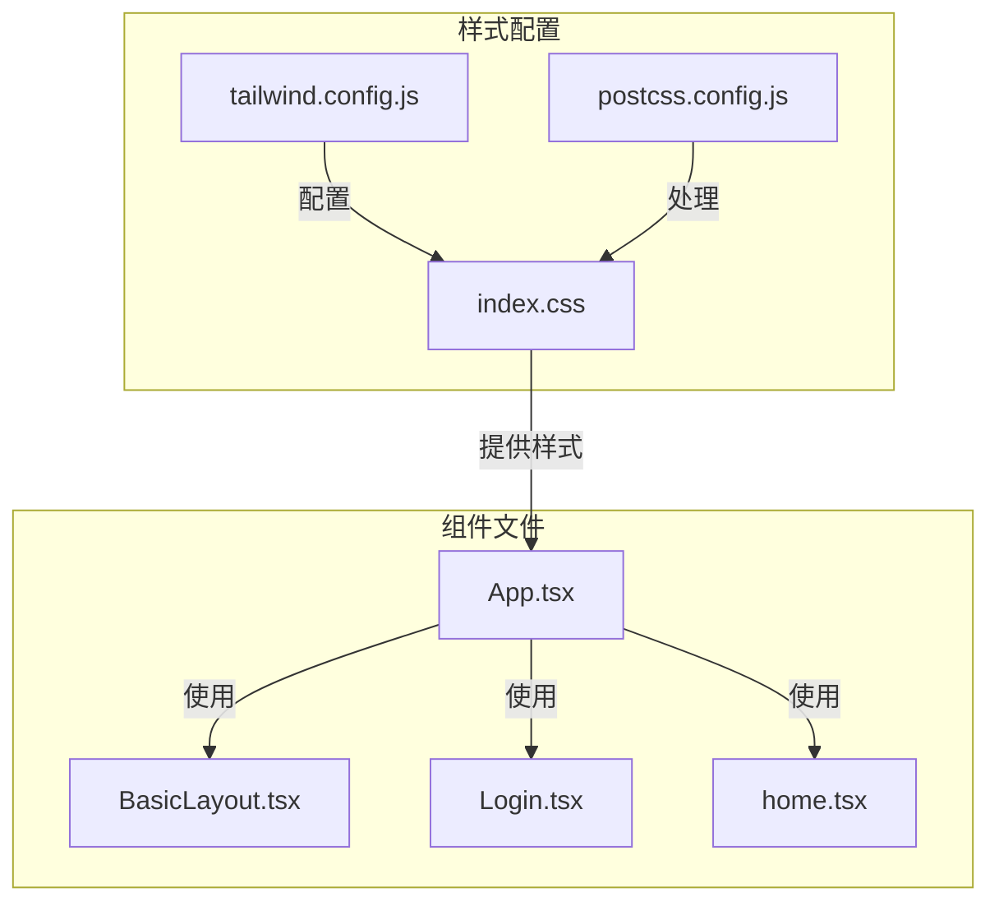
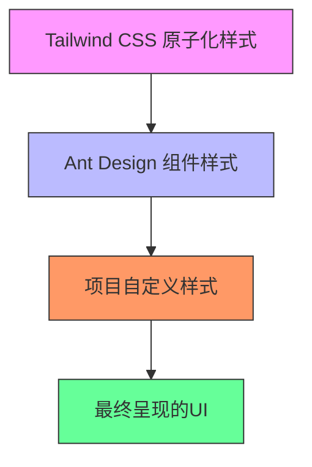
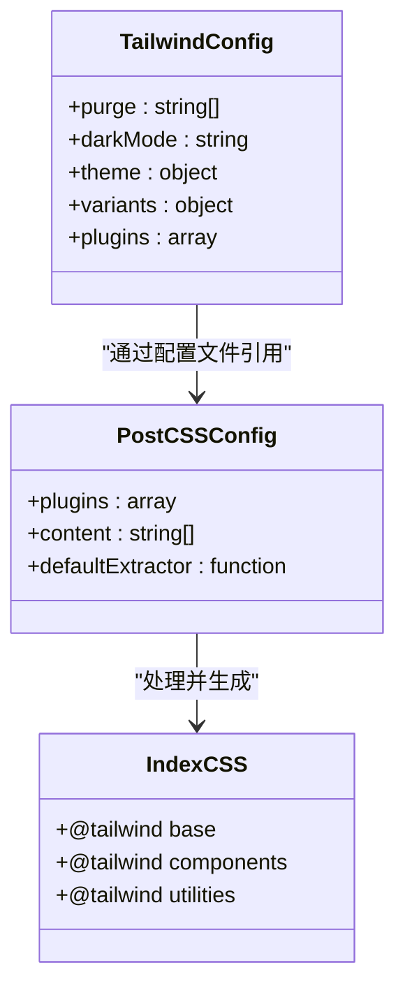
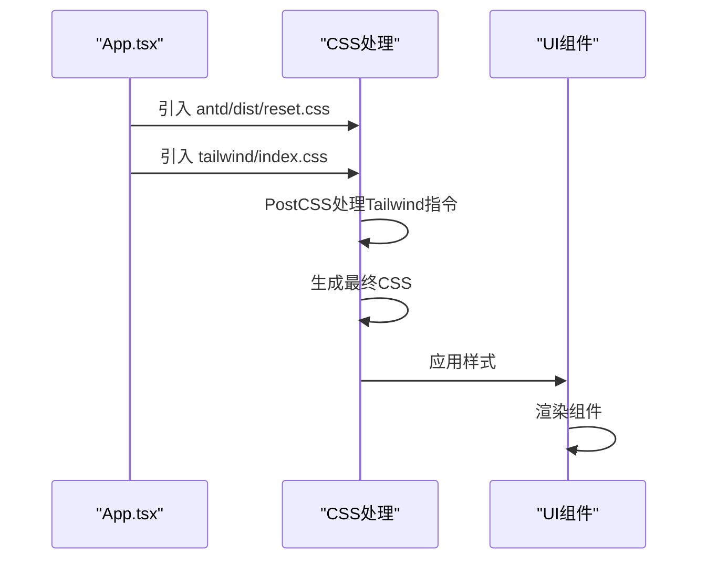
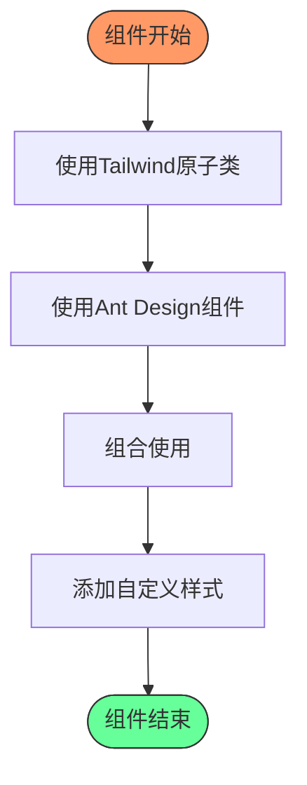
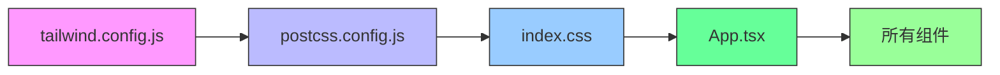

# 样式方案

<cite>
**本文档引用的文件**
- [tailwind.config.js](file://src/tailwind/tailwind.config.js)
- [index.css](file://src/tailwind/index.css)
- [postcss.config.js](file://src/tailwind/postcss.config.js)
- [App.tsx](file://src/App.tsx)
- [BasicLayout.tsx](file://src/layout/BasicLayout.tsx)
- [Login.tsx](file://src/pages/User/Login.tsx)
- [home.tsx](file://src/pages/home.tsx)
</cite>

## 目录
1. [简介](#简介)
2. [项目结构](#项目结构)
3. [核心组件](#核心组件)
4. [架构概览](#架构概览)
5. [详细组件分析](#详细组件分析)
6. [依赖分析](#依赖分析)
7. [性能考虑](#性能考虑)
8. [故障排除指南](#故障排除指南)
9. [结论](#结论)

## 简介
本文档详细阐述了项目中Tailwind CSS的集成方式和定制化配置。基于`tailwind.config.js`和`index.css`中的配置，解释了原子化CSS的工作原理和在项目中的实际应用。文档还描述了如何与Ant Design样式共存和定制，为开发者提供了样式编写的最佳实践，包括响应式设计、主题定制和性能优化。此外，还包括自定义样式扩展和CSS变量的使用方法。

## 项目结构
项目中的样式相关文件主要集中在`src/tailwind`目录下，包括Tailwind的配置文件、PostCSS配置和主CSS文件。这些文件与项目中的TSX文件协同工作，实现了原子化CSS与组件库样式的无缝集成。

**Diagram sources**
- [tailwind.config.js](file://src/tailwind/tailwind.config.js)
- [index.css](file://src/tailwind/index.css)
- [postcss.config.js](file://src/tailwind/postcss.config.js)

**Section sources**
- [tailwind.config.js](file://src/tailwind/tailwind.config.js)
- [index.css](file://src/tailwind/index.css)
- [postcss.config.js](file://src/tailwind/postcss.config.js)

## 核心组件
项目中的核心样式组件包括Tailwind CSS的配置系统和Ant Design组件库的样式系统。这两个系统通过精心设计的集成策略共存，既利用了原子化CSS的灵活性，又保留了组件库的完整功能。

**Section sources**
- [tailwind.config.js](file://src/tailwind/tailwind.config.js)
- [index.css](file://src/tailwind/index.css)
- [App.tsx](file://src/App.tsx)

## 架构概览
项目的样式架构采用了分层设计，底层是Tailwind CSS提供的原子化样式系统，中层是Ant Design组件库的预设样式，上层是项目自定义的样式规则。这种架构既保证了样式的灵活性，又确保了UI的一致性。

**Diagram sources**
- [tailwind.config.js](file://src/tailwind/tailwind.config.js)
- [index.css](file://src/tailwind/index.css)
- [App.tsx](file://src/App.tsx)

## 详细组件分析
### Tailwind CSS 配置分析
Tailwind CSS的配置文件定义了项目的基本样式策略，包括清除未使用样式的规则、暗模式设置、主题扩展和插件系统。

**Diagram sources**
- [tailwind.config.js](file://src/tailwind/tailwind.config.js)
- [postcss.config.js](file://src/tailwind/postcss.config.js)
- [index.css](file://src/tailwind/index.css)

**Section sources**
- [tailwind.config.js](file://src/tailwind/tailwind.config.js)
- [postcss.config.js](file://src/tailwind/postcss.config.js)
- [index.css](file://src/tailwind/index.css)

### 样式集成分析
项目通过在`App.tsx`中引入样式文件，实现了Tailwind CSS与Ant Design的集成。Ant Design的样式重置文件确保了组件库样式的正确加载，而Tailwind的样式则通过PostCSS处理后应用到整个应用。

**Diagram sources**
- [App.tsx](file://src/App.tsx)
- [index.css](file://src/tailwind/index.css)
- [postcss.config.js](file://src/tailwind/postcss.config.js)

**Section sources**
- [App.tsx](file://src/App.tsx)
- [index.css](file://src/tailwind/index.css)

### 组件样式应用分析
在具体组件中，如`Login.tsx`和`home.tsx`，开发者可以灵活使用Tailwind的原子化类名来快速构建界面，同时结合Ant Design的组件实现复杂交互。

**Diagram sources**
- [Login.tsx](file://src/pages/User/Login.tsx)
- [home.tsx](file://src/pages/home.tsx)

**Section sources**
- [Login.tsx](file://src/pages/User/Login.tsx)
- [home.tsx](file://src/pages/home.tsx)

## 依赖分析
项目的样式系统依赖于多个关键文件和配置，这些依赖关系确保了样式的正确生成和应用。

**Diagram sources**
- [tailwind.config.js](file://src/tailwind/tailwind.config.js)
- [postcss.config.js](file://src/tailwind/postcss.config.js)
- [index.css](file://src/tailwind/index.css)
- [App.tsx](file://src/App.tsx)

**Section sources**
- [tailwind.config.js](file://src/tailwind/tailwind.config.js)
- [postcss.config.js](file://src/tailwind/postcss.config.js)
- [index.css](file://src/tailwind/index.css)
- [App.tsx](file://src/App.tsx)

## 性能考虑
Tailwind CSS的配置中包含了`purge`选项，用于清除未使用的CSS规则，这大大减少了最终CSS文件的大小，提高了页面加载性能。

**Section sources**
- [tailwind.config.js](file://src/tailwind/tailwind.config.js)

## 故障排除指南
当遇到样式问题时，应首先检查Tailwind配置文件中的`purge`路径是否正确包含了所有可能使用类名的文件，然后确认PostCSS配置是否正确处理了Tailwind指令。

**Section sources**
- [tailwind.config.js](file://src/tailwind/tailwind.config.js)
- [postcss.config.js](file://src/tailwind/postcss.config.js)

## 结论
本项目成功实现了Tailwind CSS与Ant Design的集成，既利用了原子化CSS的灵活性和性能优势，又保留了组件库的完整功能和一致性。通过合理的配置和使用策略，开发者可以高效地构建现代化的用户界面。