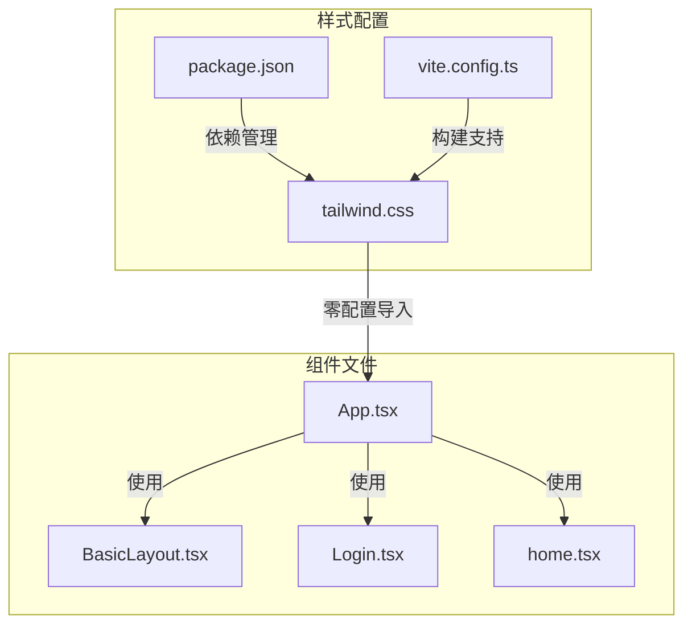
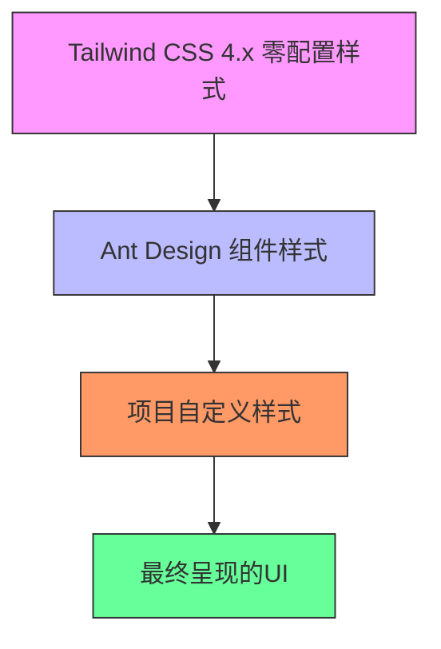
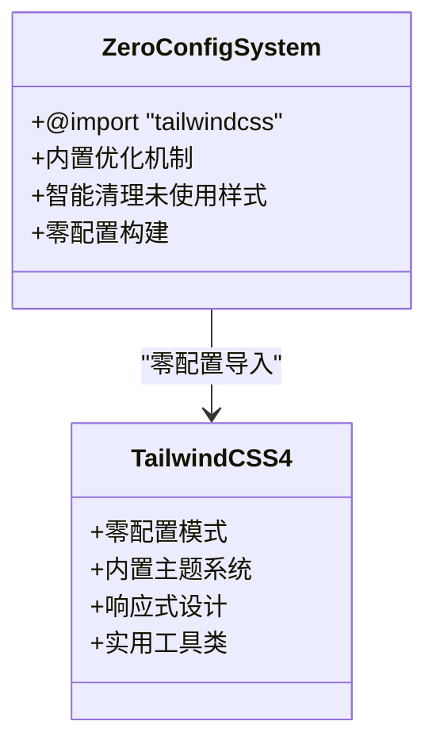
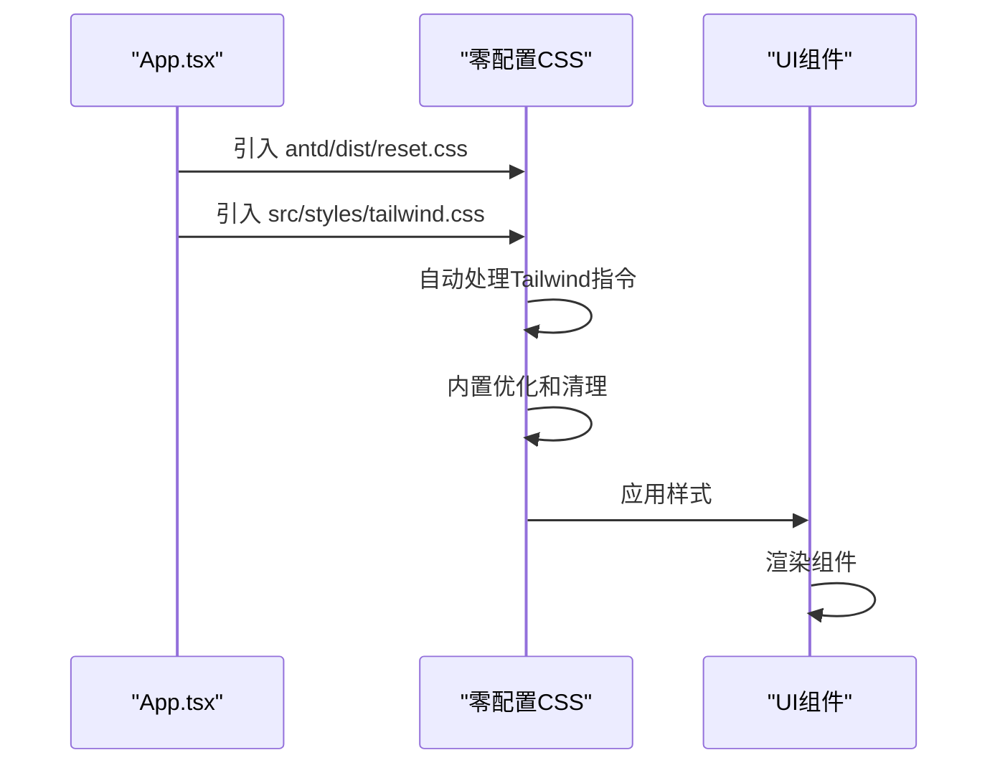
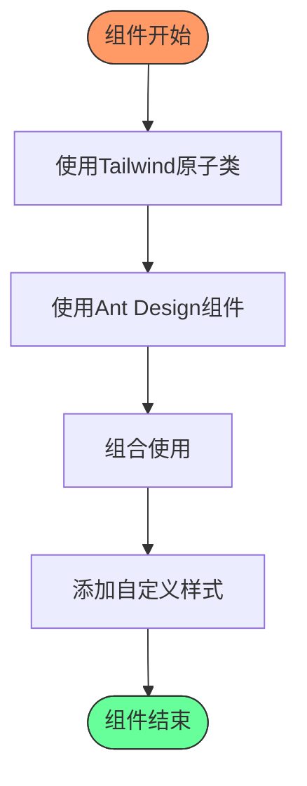

# 样式方案

<cite>
**本文档引用的文件**
- [tailwind.css](file://src/styles/tailwind.css)
- [package.json](file://package.json)
- [vite.config.ts](file://vite.config.ts)
- [App.tsx](file://src/App.tsx)
- [BasicLayout.tsx](file://src/layout/BasicLayout.tsx)
- [Login.tsx](file://src/pages/User/Login.tsx)
- [home.tsx](file://src/pages/home.tsx)
</cite>

## 更新摘要
**所做更改**
- 完全移除了 Tailwind CSS v2.1.2 配置系统和 PurgeCSS 优化
- 采用 Tailwind CSS 4.x 零配置模式
- 简化了样式架构，移除了复杂的配置文件
- 更新了性能优化策略，采用内置优化机制
- 调整了样式集成方式，直接导入零配置版本

## 目录
1. [简介](#简介)
2. [项目结构](#项目结构)
3. [核心组件](#核心组件)
4. [架构概览](#架构概览)
5. [详细组件分析](#详细组件分析)
6. [依赖分析](#依赖分析)
7. [性能考虑](#性能考虑)
8. [故障排除指南](#故障排除指南)
9. [结论](#结论)

## 简介
本文档详细阐述了项目中Tailwind CSS 4.x零配置模式的集成方式和使用方法。基于`src/styles/tailwind.css`中的零配置导入，解释了原子化CSS的工作原理和在项目中的实际应用。文档还描述了如何与Ant Design样式共存和定制，为开发者提供了样式编写的最佳实践，包括响应式设计、主题定制和性能优化。此外，还包括自定义样式扩展和CSS变量的使用方法。

**更新** 本版本完全移除了之前的Tailwind CSS v2.1.2配置系统，采用最新的4.x零配置模式，简化了样式架构并提升了开发体验。

## 项目结构
项目中的样式相关文件主要集中在`src/styles`目录下，采用简化的零配置模式。`tailwind.css`文件直接导入Tailwind CSS 4.x的核心功能，无需复杂的配置文件。这些文件与项目中的TSX文件协同工作，实现了原子化CSS与组件库样式的无缝集成。

```mermaid
graph TB
subgraph "样式配置"
tailwindCSS[tailwind.css]
packageJSON[package.json]
viteConfig[vite.config.ts]
end
subgraph "组件文件"
App[App.tsx]
Layout[BasicLayout.tsx]
Login[Login.tsx]
Home[home.tsx]
end
tailwindCSS --> |零配置导入| App
packageJSON --> |依赖管理| tailwindCSS
viteConfig --> |构建支持| tailwindCSS
App --> |使用| Layout
App --> |使用| Login
App --> |使用| Home
```

**图表来源**
- [tailwind.css](file://src/styles/tailwind.css)
- [package.json](file://package.json)
- [vite.config.ts](file://vite.config.ts)

**章节来源**
- [tailwind.css](file://src/styles/tailwind.css)
- [package.json](file://package.json)
- [vite.config.ts](file://vite.config.ts)

## 核心组件
项目中的核心样式组件包括Tailwind CSS 4.x零配置系统和Ant Design组件库的样式系统。两个系统通过简化的集成策略共存，既利用了原子化CSS的灵活性，又保留了组件库的完整功能。

**更新** 零配置模式消除了复杂的配置管理，直接使用Tailwind CSS 4.x的默认行为。

**章节来源**
- [tailwind.css](file://src/styles/tailwind.css)
- [App.tsx](file://src/App.tsx)

## 架构概览
项目的样式架构采用了简化的分层设计，底层是Tailwind CSS 4.x提供的零配置原子化样式系统，中层是Ant Design组件库的预设样式，上层是项目自定义的样式规则。这种架构既保证了样式的灵活性，又确保了UI的一致性，同时大幅简化了配置复杂度。

```mermaid
graph TD
A[Tailwind CSS 4.x 零配置样式] --> B[Ant Design 组件样式]
B --> C[项目自定义样式]
C --> D[最终呈现的UI]
style A fill:#f9f,stroke:#333
style B fill:#bbf,stroke:#333
style C fill:#f96,stroke:#333
style D fill:#6f9,stroke:#333
```

**图表来源**
- [tailwind.css](file://src/styles/tailwind.css)
- [App.tsx](file://src/App.tsx)

## 详细组件分析
### Tailwind CSS 4.x 零配置分析
Tailwind CSS 4.x采用零配置模式，通过简单的`@import "tailwindcss"`语句即可启用完整的原子化CSS功能。该版本内置了智能优化机制，无需手动配置PurgeCSS或其他优化工具。

```mermaid
classDiagram
class ZeroConfigSystem {
+@import "tailwindcss"
+内置优化机制
+智能清理未使用样式
+零配置构建
}
class TailwindCSS4 {
+零配置模式
+内置主题系统
+响应式设计
+实用工具类
}
ZeroConfigSystem --> TailwindCSS4 : "零配置导入"
```

**图表来源**
- [tailwind.css](file://src/styles/tailwind.css)

**章节来源**
- [tailwind.css](file://src/styles/tailwind.css)

### 样式集成分析
项目通过在`App.tsx`中引入样式文件，实现了Tailwind CSS与Ant Design的集成。Ant Design的样式重置文件确保了组件库样式的正确加载，而Tailwind的样式则通过零配置模式自动处理。

```mermaid
sequenceDiagram
participant App as "App.tsx"
participant CSS as "零配置CSS"
participant UI as "UI组件"
App->>CSS : 引入 antd/dist/reset.css
App->>CSS : 引入 src/styles/tailwind.css
CSS->>CSS : 自动处理Tailwind指令
CSS->>CSS : 内置优化和清理
CSS->>UI : 应用样式
UI->>UI : 渲染组件
```

**图表来源**
- [App.tsx](file://src/App.tsx)
- [tailwind.css](file://src/styles/tailwind.css)

**章节来源**
- [App.tsx](file://src/App.tsx)
- [tailwind.css](file://src/styles/tailwind.css)

### 组件样式应用分析
在具体组件中，如`Login.tsx`和`home.tsx`，开发者可以灵活使用Tailwind的原子化类名来快速构建界面，同时结合Ant Design的组件实现复杂交互。零配置模式使得样式编写更加直观和高效。

```mermaid
flowchart TD
Start([组件开始]) --> UseTailwind["使用Tailwind原子类"]
UseTailwind --> UseAntDesign["使用Ant Design组件"]
UseAntDesign --> Combine["组合使用"]
Combine --> CustomStyle["添加自定义样式"]
CustomStyle --> End([组件结束])
style Start fill:#f96,stroke:#333
style End fill:#6f9,stroke:#333
```

**图表来源**
- [Login.tsx](file://src/pages/User/Login.tsx)
- [home.tsx](file://src/pages/home.tsx)

**章节来源**
- [Login.tsx](file://src/pages/User/Login.tsx)
- [home.tsx](file://src/pages/home.tsx)

## 依赖分析
项目的样式系统依赖于简洁的依赖关系，主要包含Tailwind CSS 4.x核心库和Vite构建工具的支持。

```mermaid
graph LR
A[package.json] --> B[tailwindcss ^4.1.15]
B --> C[tailwind.css]
C --> D[App.tsx]
D --> E[所有组件]
style A fill:#f9f,stroke:#333
style B fill:#bbf,stroke:#333
style C fill:#9cf,stroke:#333
style D fill:#6f9,stroke:#333
style E fill:#9f9,stroke:#333
```

**图表来源**
- [package.json](file://package.json)
- [tailwind.css](file://src/styles/tailwind.css)
- [App.tsx](file://src/App.tsx)

**章节来源**
- [package.json](file://package.json)
- [tailwind.css](file://src/styles/tailwind.css)
- [App.tsx](file://src/App.tsx)

## 性能考虑
Tailwind CSS 4.x的零配置模式内置了智能优化机制，包括自动清理未使用样式、响应式优化和按需生成等功能。这些优化在构建时自动执行，无需手动配置，显著提升了开发效率和运行性能。

**更新** 移除了手动PurgeCSS配置，采用内置优化机制，简化了性能优化流程。

**章节来源**
- [tailwind.css](file://src/styles/tailwind.css)
- [package.json](file://package.json)

## 故障排除指南
当遇到样式问题时，由于采用了零配置模式，应首先检查Tailwind CSS 4.x的版本兼容性和Vite构建配置，确认样式文件的正确导入路径和依赖版本。

**更新** 故障排除重点转向零配置模式特有的问题，如版本兼容性和构建配置。

**章节来源**
- [tailwind.css](file://src/styles/tailwind.css)
- [package.json](file://package.json)
- [vite.config.ts](file://vite.config.ts)

## 结论
本项目成功实现了Tailwind CSS 4.x零配置模式与Ant Design的集成，通过移除复杂的v2.1.2配置系统，采用简化的零配置架构，既保持了原子化CSS的灵活性和性能优势，又大幅降低了配置复杂度。内置的智能优化机制确保了样式的高效生成和应用，开发者可以专注于业务逻辑而非样式配置，显著提升了开发体验和维护效率。