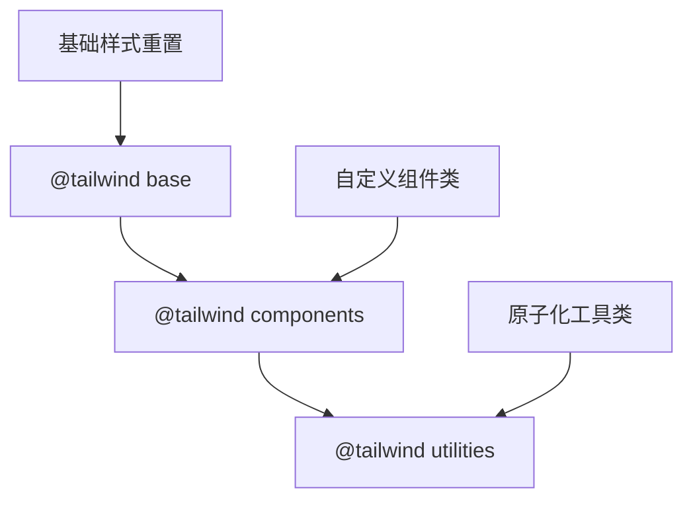
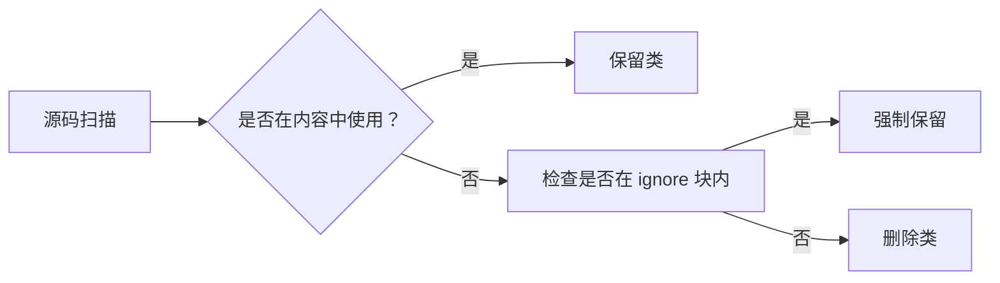
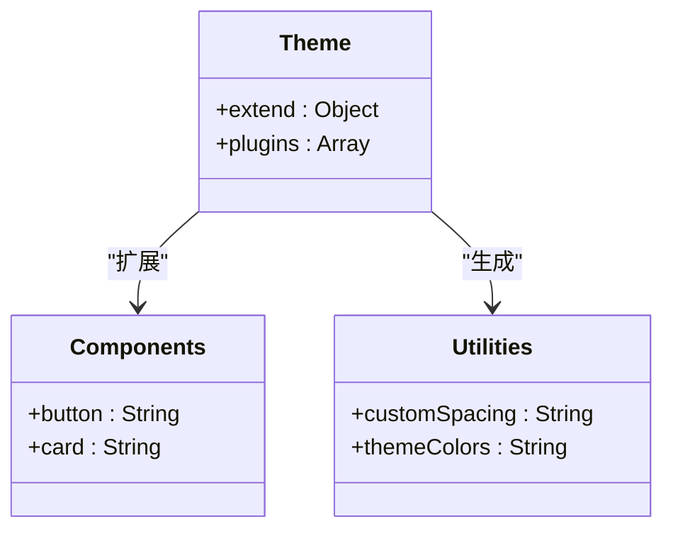
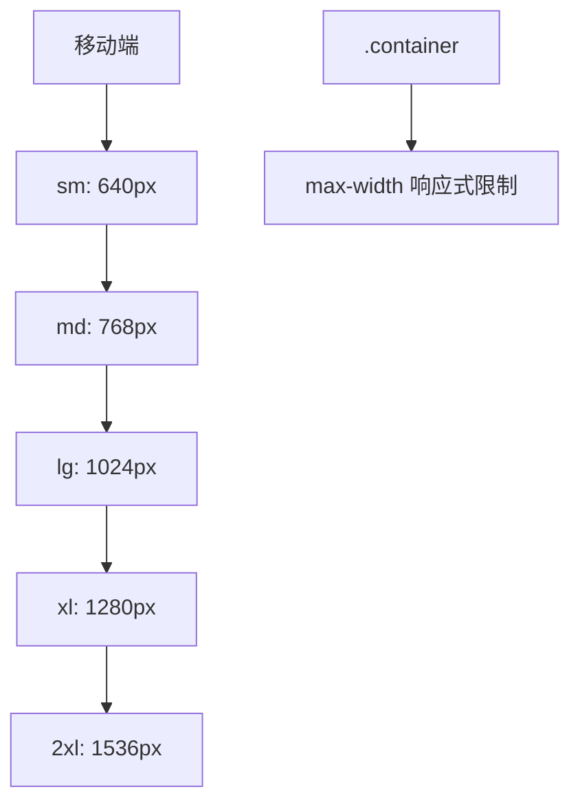

# 自定义样式

<cite>
**本文档中引用的文件**   
- [index.css](file://src/tailwind/index.css)
- [tailwind.config.js](file://src/tailwind/tailwind.config.js)
- [postcss.config.js](file://src/tailwind/postcss.config.js)
- [tailwind.css](file://src/tailwind/tailwind.css)
</cite>

## 目录
1. [简介](#简介)
2. [Tailwind 样式层结构](#tailwind-样式层结构)
3. [PurgeCSS 忽略机制](#purgecss-忽略机制)
4. [自定义组件类与工具类](#自定义组件类与工具类)
5. [全局样式与响应式断点](#全局样式与响应式断点)
6. [最佳实践建议](#最佳实践建议)

## 简介
本文档详细说明了项目中基于 Tailwind CSS 的自定义样式实现机制。重点分析 `index.css` 文件中如何通过 `@tailwind` 指令引入基础、组件和工具类三层结构，解释 `purgecss start ignore` 注释块的作用以防止关键样式被误删，并提供扩展 Tailwind 样式体系的最佳实践。

## Tailwind 样式层结构

项目通过 `@tailwind` 指令分层引入 Tailwind 的核心样式体系，确保样式加载顺序合理且功能完整。

**Diagram sources**
- [index.css](file://src/tailwind/index.css#L1-L6)

**Section sources**
- [index.css](file://src/tailwind/index.css#L1-L6)
- [tailwind.css](file://src/tailwind/tailwind.css#L0-L640)

## PurgeCSS 忽略机制

为防止 PurgeCSS 在生产环境中误删关键的基础样式，项目使用 `/* purgecss start ignore */` 和 `/* purgecss end ignore */` 注释块包裹 `@tailwind base` 和 `@tailwind components` 指令。

该机制确保即使某些基础类未在模板中显式使用，也能保留在最终的 CSS 文件中，避免页面渲染异常。

**Diagram sources**
- [index.css](file://src/tailwind/index.css#L1-L6)
- [postcss.config.js](file://src/tailwind/postcss.config.js#L1-L16)

**Section sources**
- [index.css](file://src/tailwind/index.css#L1-L6)
- [postcss.config.js](file://src/tailwind/postcss.config.js#L1-L16)

## 自定义组件类与工具类

项目通过 `tailwind.config.js` 配置文件扩展 Tailwind 的默认主题，支持安全地添加自定义组件类和组合式工具类。

虽然当前配置中 `theme.extend` 和 `plugins` 为空，但结构已预留扩展能力，可通过添加自定义样式或插件来创建可复用的 UI 组件。

**Diagram sources**
- [tailwind.config.js](file://src/tailwind/tailwind.config.js#L1-L12)
- [index.css](file://src/tailwind/index.css#L1-L6)

**Section sources**
- [tailwind.config.js](file://src/tailwind/tailwind.config.js#L1-L12)

## 全局样式与响应式断点

项目继承 Tailwind 的默认响应式断点设置（640px、768px、1024px、1280px、1536px），并通过 `.container` 类实现响应式布局容器。

全局样式基于现代 Normalize 策略进行重置，确保跨浏览器一致性，同时保留可继承的字体和行高设置。

**Diagram sources**
- [tailwind.css](file://src/tailwind/tailwind.css#L500-L594)
- [tailwind.config.js](file://src/tailwind/tailwind.config.js#L1-L12)

**Section sources**
- [tailwind.css](file://src/tailwind/tailwind.css#L500-L594)

## 最佳实践建议

1. **安全扩展样式**：在 `tailwind.config.js` 中使用 `theme.extend` 添加自定义颜色、间距或字体。
2. **组件抽象**：将重复使用的类组合抽象为组件类，写入 CSS 文件的 `@layer components` 段。
3. **避免直接修改基础层**：不建议直接修改 `@tailwind base` 生成的样式，应通过 `@layer base` 覆盖。
4. **PurgeCSS 配置验证**：确保 `postcss.config.js` 中的 `content` 路径覆盖所有模板文件，防止误删。
5. **变量统一管理**：如需 CSS 变量，建议在 `:root` 中定义并配合 Tailwind 插件使用。