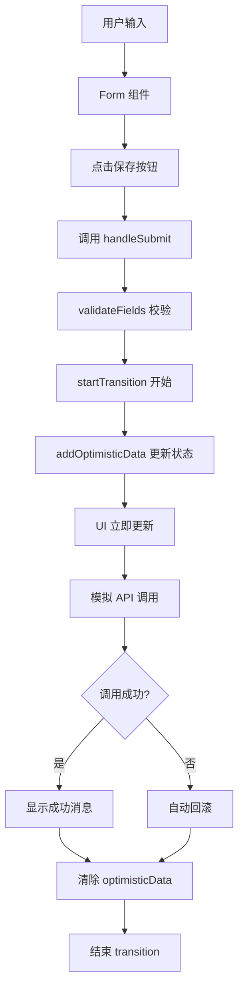
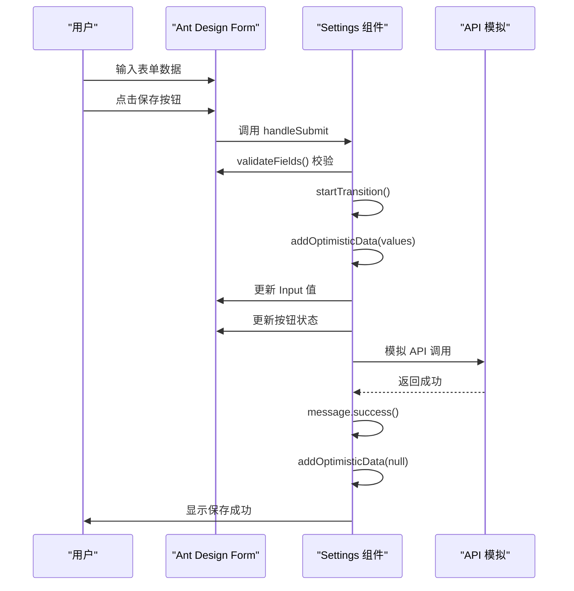
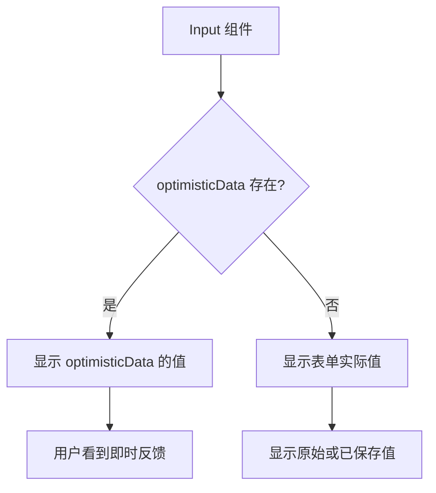

# 个人设置中的乐观更新

<cite>
**Referenced Files in This Document**   
- [index.tsx](file://src/pages/Settings/index.tsx)
- [README.md](file://README.md)
</cite>

## 目录
1. [简介](#简介)
2. [核心组件](#核心组件)
3. [架构概述](#架构概述)
4. [详细组件分析](#详细组件分析)
5. [依赖分析](#依赖分析)
6. [性能考虑](#性能考虑)
7. [故障排除指南](#故障排除指南)
8. [结论](#结论)

## 简介
本文档详细介绍了在个人设置页面中如何使用 React 19 的 `useOptimistic` Hook 实现乐观更新模式。通过分析 `Settings/index.tsx` 文件中的实现，展示了在表单场景下如何提供即时的用户反馈、优化用户体验，并确保数据一致性。文档重点阐述了乐观更新的核心概念、技术实现细节以及与 Ant Design 组件的集成方式。

## 核心组件

在个人设置页面中，`useOptimistic` Hook 被用于实现表单数据的乐观保存。当用户点击保存按钮后，系统会立即显示新值，同时更新按钮状态为"保存中..."并展示进度提示。`optimisticData` 状态用于暂存表单值，并在异步操作完成后清除。这种模式显著提升了用户体验，使界面响应更加即时和流畅。

**Section sources**
- [index.tsx](file://src/pages/Settings/index.tsx#L17-L121)

## 架构概述

个人设置页面采用 React 函数组件架构，结合 Ant Design 的 Form 组件和 React 19 的 `useOptimistic` Hook 实现乐观更新。整体架构分为三个主要部分：表单定义、乐观更新逻辑和 UI 状态管理。表单使用 Ant Design 的 Form 和 Input 组件构建，乐观更新逻辑通过 `useOptimistic` Hook 和 `startTransition` 实现，UI 状态则根据 `optimisticData` 的值动态更新。



**Diagram sources **
- [index.tsx](file://src/pages/Settings/index.tsx#L17-L121)

## 详细组件分析

### 表单乐观更新分析

#### 乐观更新状态管理
```mermaid
classDiagram
class Settings {
+form : FormInstance
+optimisticData : FormValues | null
+addOptimisticData : function
+handleSubmit() : Promise
}
class FormValues {
+displayName : string
+email : string
}
Settings --> FormValues : "包含"
Settings --> "useOptimistic" : "使用"
Settings --> "Form" : "集成"
```

**Diagram sources **
- [index.tsx](file://src/pages/Settings/index.tsx#L8-L17)

#### 表单提交流程


**Diagram sources **
- [index.tsx](file://src/pages/Settings/index.tsx#L46-L121)

#### 输入框条件渲染


**Diagram sources **
- [index.tsx](file://src/pages/Settings/index.tsx#L70-L86)

**Section sources**
- [index.tsx](file://src/pages/Settings/index.tsx#L17-L121)

## 依赖分析

个人设置页面依赖于多个核心库和组件，包括 React 19 的 `useOptimistic` 和 `startTransition`，Ant Design 的 Form、Input、Button 等 UI 组件，以及 `@ant-design/pro-components` 的 PageContainer。这些依赖共同实现了乐观更新模式，提供了完整的表单处理和用户体验优化功能。

```mermaid
graph TD
A[Settings 组件] --> B[React 19]
A --> C[Ant Design]
A --> D[@ant-design/pro-components]
B --> E[useOptimistic]
B --> F[startTransition]
C --> G[Form]
C --> H[Input]
C --> I[Button]
C --> J[Card]
C --> K[Space]
D --> L[PageContainer]
```

**Diagram sources **
- [index.tsx](file://src/pages/Settings/index.tsx#L1-L121)
- [README.md](file://README.md#L20-L93)

## 性能考虑

使用 `useOptimistic` 和 `startTransition` 不仅提升了用户体验，还优化了应用性能。通过将乐观更新操作包裹在 `startTransition` 中，React 能够优先处理用户交互，确保界面响应的即时性。同时，由于乐观更新状态的管理是轻量级的，不会对性能造成显著影响。在 API 调用期间，用户界面保持响应，避免了传统等待模式中的卡顿感。

## 故障排除指南

当乐观更新出现问题时，可以参考以下排查步骤：
1. 确认 `useOptimistic` 的初始状态是否正确设置
2. 检查 `startTransition` 是否正确包裹状态更新
3. 验证异步操作完成后是否正确清除乐观更新状态
4. 确保 UI 组件正确绑定 `optimisticData` 值
5. 检查错误处理逻辑是否完善，确保失败时能正确回滚

**Section sources**
- [index.tsx](file://src/pages/Settings/index.tsx#L46-L121)
- [README.md](file://README.md#L20-L93)

## 结论

通过在个人设置页面中应用 `useOptimistic` Hook，实现了高效的乐观更新模式。这种模式不仅提升了用户体验，使界面响应更加即时，还简化了异步操作的状态管理。开发者可以借鉴此模式，在其他表单场景中实现类似的乐观更新功能，从而创建更加流畅和响应迅速的应用程序。