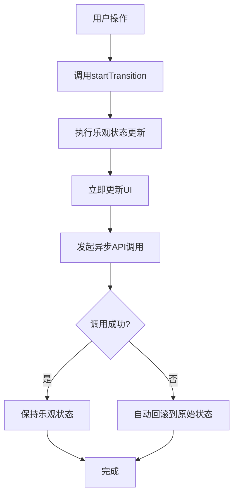
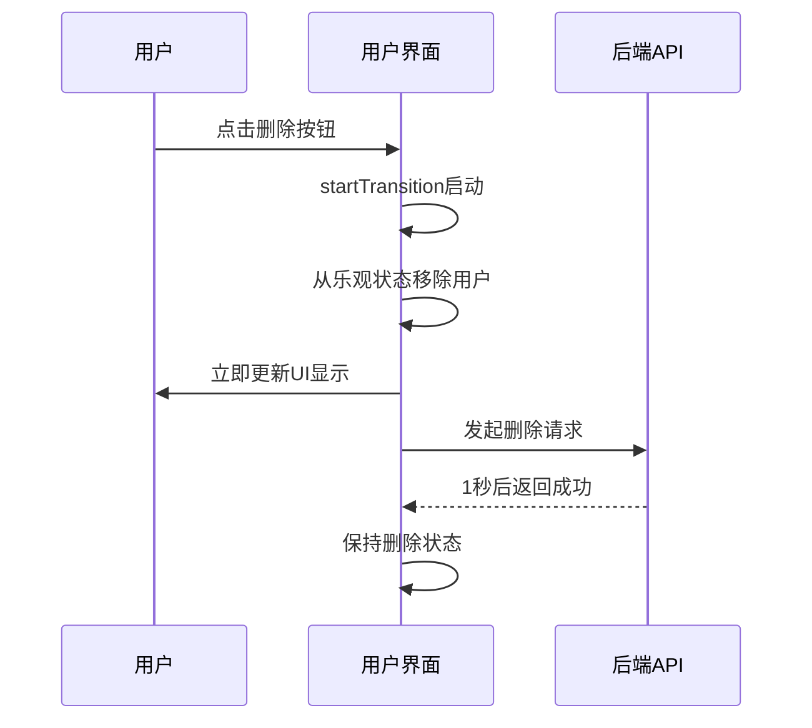
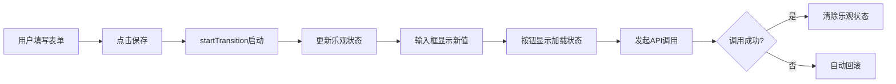
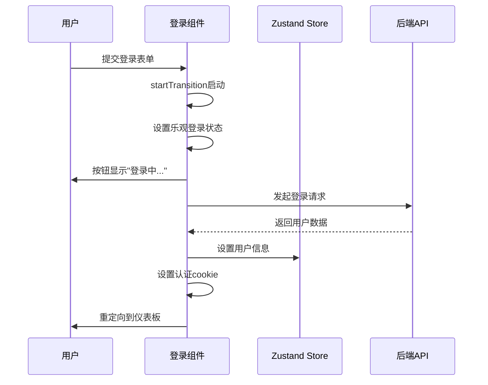

# 核心特性

<cite>
**Referenced Files in This Document**   
- [home.tsx](file://src/pages/home.tsx)
- [Settings/index.tsx](file://src/pages/Settings/index.tsx)
- [Login.tsx](file://src/pages/User/Login.tsx)
- [README.md](file://README.md)
</cite>

## 目录
1. [核心特性概述](#核心特性概述)
2. [useOptimistic Hook 机制解析](#useoptimistic-hook-机制解析)
3. [用户管理页面实现](#用户管理页面实现)
4. [设置页面实现](#设置页面实现)
5. [登录流程实现](#登录流程实现)
6. [错误处理与状态回滚](#错误处理与状态回滚)
7. [性能优化与用户体验](#性能优化与用户体验)
8. [开发实践建议](#开发实践建议)

## 核心特性概述

本项目作为 React 19 的现代化前端模板，重点展示了 `useOptimistic` Hook 在实际项目中的应用。该特性作为项目的主要卖点，通过乐观更新模式显著提升了用户体验。在用户管理、设置页面和登录流程中，`useOptimistic` Hook 实现了即时反馈、自动回滚和类型安全的并发更新。

**Section sources**
- [README.md](file://README.md#L27-L86)

## useOptimistic Hook 机制解析

`useOptimistic` 是 React 19 引入的新 Hook，用于实现乐观更新模式。其工作机制基于 `startTransition` API，允许在异步操作完成前立即更新 UI 状态。当 API 调用成功时，应用保持乐观更新后的状态；若调用失败，则自动回滚到原始状态，无需开发者手动管理状态恢复。

该 Hook 接收两个参数：初始状态和更新函数。返回值为当前乐观状态和状态更新函数。通过将状态更新包装在 `startTransition` 中，React 能够优先处理用户交互，确保界面响应性。

**Section sources**
- [home.tsx](file://src/pages/home.tsx#L20-L25)
- [Settings/index.tsx](file://src/pages/Settings/index.tsx#L15-L20)
- [Login.tsx](file://src/pages/User/Login.tsx#L10-L15)

**Diagram sources**
- [home.tsx](file://src/pages/home.tsx#L45-L82)
- [Settings/index.tsx](file://src/pages/Settings/index.tsx#L25-L46)

## 用户管理页面实现

在用户管理页面中，`useOptimistic` Hook 被用于用户添加和删除操作。当用户点击"删除"按钮时，系统立即从列表中移除目标用户，提供即时反馈；在"添加用户"操作中，新用户条目立即出现在列表顶部。这种实现方式消除了传统等待 API 响应的延迟感，使界面交互更加流畅。

页面通过显示乐观更新状态指示器，让用户清楚了解正在进行的操作数量，增强了界面的透明度和可预测性。

**Section sources**
- [home.tsx](file://src/pages/home.tsx#L45-L82)
- [home.tsx](file://src/pages/home.tsx#L203-L244)

**Diagram sources**
- [home.tsx](file://src/pages/home.tsx#L60-L82)

## 设置页面实现

设置页面利用 `useOptimistic` Hook 实现表单提交的乐观更新。当用户提交个人资料修改时，表单立即显示新值，按钮状态变为"保存中..."，提供清晰的反馈。这种实现方式特别适用于网络延迟较高的场景，让用户感觉操作已被立即接受。

通过将表单输入的值绑定到乐观状态，实现了输入的即时响应，即使在 API 调用期间也能保持良好的用户体验。

**Section sources**
- [Settings/index.tsx](file://src/pages/Settings/index.tsx#L25-L46)
- [Settings/index.tsx](file://src/pages/Settings/index.tsx#L50-L70)

**Diagram sources**
- [Settings/index.tsx](file://src/pages/Settings/index.tsx#L25-L46)

## 登录流程实现

登录页面通过 `useOptimistic` Hook 优化了认证流程。用户提交登录信息后，界面立即显示"登录中..."状态，按钮文本动态更新为加载状态。这种实现不仅提升了感知性能，还通过 Zustand 状态管理库实现了用户信息的持久化存储。

在成功登录后，系统设置用户信息到全局状态，并通过 cookie 存储认证令牌，最后重定向到仪表板页面。整个流程的乐观更新确保了即使在网络延迟情况下，用户也能获得流畅的登录体验。

**Section sources**
- [Login.tsx](file://src/pages/User/Login.tsx#L15-L40)
- [Login.tsx](file://src/pages/User/Login.tsx#L50-L80)

**Diagram sources**
- [Login.tsx](file://src/pages/User/Login.tsx#L20-L50)

## 错误处理与状态回滚

项目中的错误处理机制充分利用了 `useOptimistic` Hook 的自动回滚特性。在所有异步操作的 catch 块中，系统通过再次调用 `addOptimisticData` 并传入 null 或原始状态，确保界面能够正确恢复。这种设计简化了错误处理逻辑，避免了传统方式中复杂的状态管理代码。

通过将错误处理包装在 `startTransition` 中，确保了状态回滚也是非阻塞的，不会影响其他用户交互的响应性。

**Section sources**
- [home.tsx](file://src/pages/home.tsx#L75-L82)
- [Settings/index.tsx](file://src/pages/Settings/index.tsx#L40-L46)
- [Login.tsx](file://src/pages/User/Login.tsx#L35-L40)

## 性能优化与用户体验

`useOptimistic` Hook 的应用带来了显著的性能优化和用户体验提升。通过消除 API 调用等待期间的界面冻结，用户感知的响应时间几乎为零。在用户管理页面，即使网络延迟达到 1 秒，界面更新也是即时的，这符合人类对即时反馈的心理预期。

项目通过精心设计的视觉反馈（如状态指示器、按钮加载状态）增强了用户对系统状态的理解，减少了不确定性带来的焦虑感。

**Section sources**
- [home.tsx](file://src/pages/home.tsx#L203-L244)
- [Settings/index.tsx](file://src/pages/Settings/index.tsx#L80-L90)
- [Login.tsx](file://src/pages/User/Login.tsx#L100-L120)

## 开发实践建议

在实际项目中应用 `useOptimistic` Hook 时，建议遵循以下最佳实践：首先，明确识别适合乐观更新的操作类型，通常为高频、低风险的用户交互；其次，合理设计乐观状态的表示方式，确保用户能够理解当前状态；最后，完善错误处理机制，提供清晰的失败反馈。

对于复杂的状态更新，建议将乐观状态与持久化状态分离管理，通过 Zustand 等状态管理库协调不同状态源的一致性。

**Section sources**
- [README.md](file://README.md#L88-L110)
- [store/index.ts](file://src/store/index.ts)