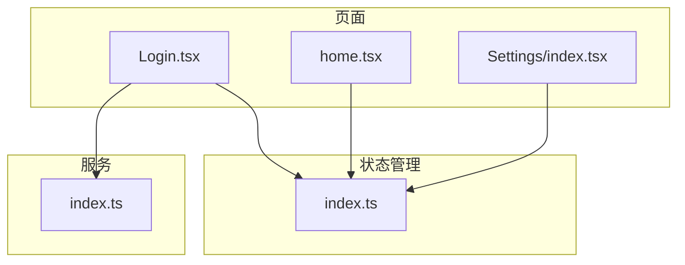
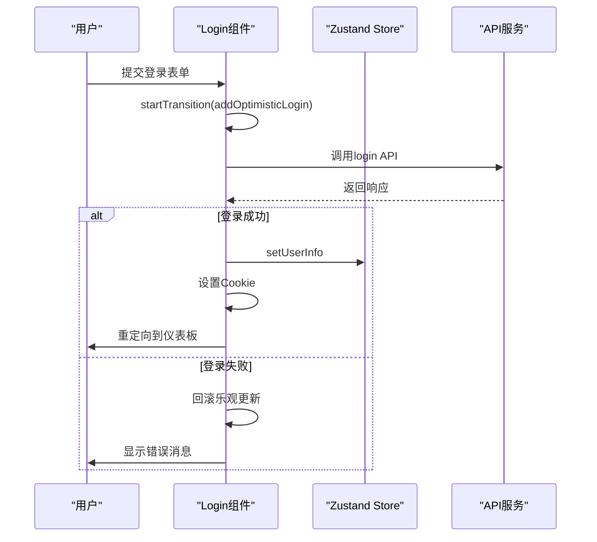
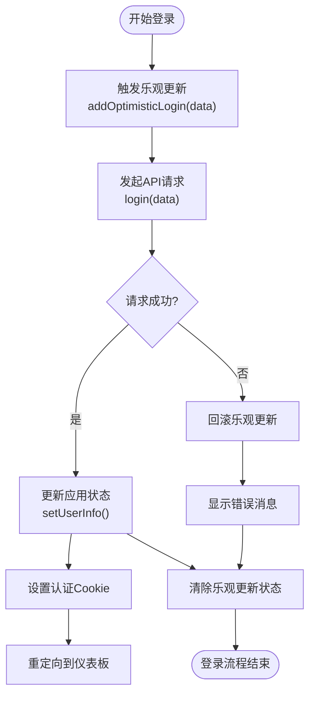
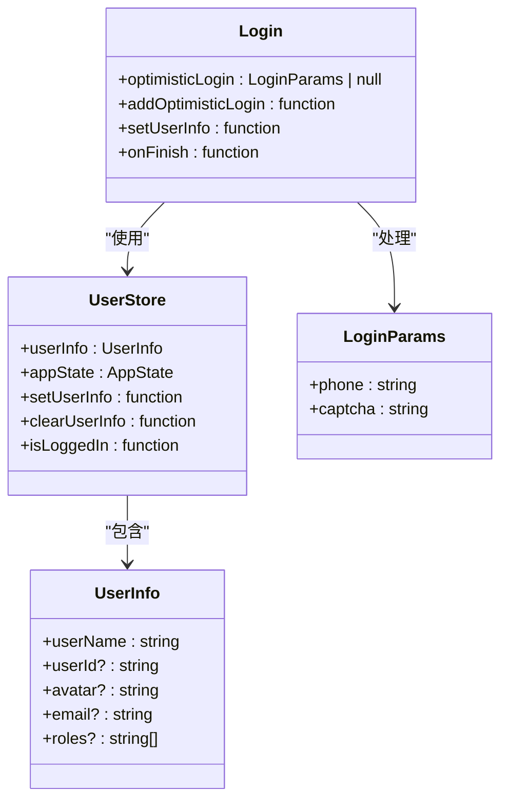
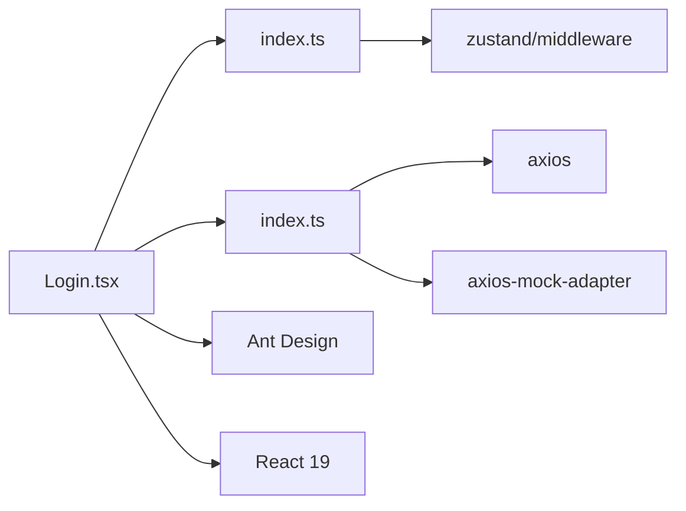

# 登录流程中的乐观更新

<cite>
**本文档引用的文件**   
- [Login.tsx](file://src/pages/User/Login.tsx)
- [index.ts](file://src/store/index.ts)
- [index.ts](file://src/services/index.ts)
</cite>

## 目录
1. [简介](#简介)
2. [项目结构](#项目结构)
3. [核心组件](#核心组件)
4. [架构概述](#架构概述)
5. [详细组件分析](#详细组件分析)
6. [依赖分析](#依赖分析)
7. [性能考虑](#性能考虑)
8. [故障排除指南](#故障排除指南)
9. [结论](#结论)

## 简介
本文档深入探讨了在登录页面中使用 `useOptimistic` Hook 实现乐观更新的机制。通过分析 `Login.tsx` 文件中的实现，详细说明了如何在表单提交时立即显示"登录中..."状态、禁用按钮和更新UI。文档还解释了 `addOptimisticLogin` 如何暂存登录参数，并在API调用成功或失败后清除或自动回滚。结合代码示例展示了与Zustand状态管理、Cookie认证的集成方式，以及错误处理机制，为开发者提供在认证流程中实施乐观更新的完整指南。

## 项目结构
本项目采用基于功能的文件组织方式，主要组件分布在 `src/pages` 目录下。登录功能位于 `src/pages/User/Login.tsx`，状态管理通过 `src/store/index.ts` 实现，API服务定义在 `src/services/index.ts`。这种结构清晰地分离了UI、状态和数据访问逻辑，便于维护和扩展。

**Diagram sources**
- [Login.tsx](file://src/pages/User/Login.tsx)
- [index.ts](file://src/store/index.ts)
- [index.ts](file://src/services/index.ts)

**Section sources**
- [Login.tsx](file://src/pages/User/Login.tsx)
- [index.ts](file://src/store/index.ts)
- [index.ts](file://src/services/index.ts)

## 核心组件
登录页面的核心是 `Login` 组件，它利用 React 19 的 `useOptimistic` Hook 实现了乐观更新模式。该组件通过 `useOptimistic` 管理登录状态，在用户提交表单时立即更新UI，提供即时反馈。同时，它集成了Zustand状态管理来持久化用户信息，并通过Cookie进行认证管理。

**Section sources**
- [Login.tsx](file://src/pages/User/Login.tsx#L14-L159)
- [index.ts](file://src/store/index.ts#L41-L120)

## 架构概述
登录流程的架构设计体现了现代前端应用的最佳实践。UI层通过ProForm组件处理用户输入，逻辑层使用useOptimistic实现乐观更新，状态管理层通过Zustand管理应用状态，数据访问层通过axios与后端API通信。这种分层架构确保了代码的可维护性和可测试性。

**Diagram sources**
- [Login.tsx](file://src/pages/User/Login.tsx#L14-L159)
- [index.ts](file://src/store/index.ts#L28-L28)
- [index.ts](file://src/services/index.ts#L204-L204)

## 详细组件分析

### 登录组件分析
`Login` 组件通过 `useOptimistic` Hook 实现了流畅的用户体验。当用户提交表单时，立即触发乐观更新，显示"登录中..."状态并禁用提交按钮，防止重复提交。

#### 乐观更新机制

**Diagram sources**
- [Login.tsx](file://src/pages/User/Login.tsx#L14-L159)

#### 状态管理集成

**Diagram sources**
- [Login.tsx](file://src/pages/User/Login.tsx#L21-L21)
- [index.ts](file://src/store/index.ts#L41-L120)

**Section sources**
- [Login.tsx](file://src/pages/User/Login.tsx#L14-L159)
- [index.ts](file://src/store/index.ts#L41-L120)

## 依赖分析
登录功能依赖于多个核心模块，形成了清晰的依赖链。`Login` 组件依赖于 `useUserStore` 进行状态管理，`useUserStore` 依赖于 `zustand/middleware` 进行状态持久化，同时 `Login` 组件直接调用 `login` 服务进行认证。

**Diagram sources**
- [Login.tsx](file://src/pages/User/Login.tsx)
- [index.ts](file://src/store/index.ts)
- [index.ts](file://src/services/index.ts)

**Section sources**
- [Login.tsx](file://src/pages/User/Login.tsx)
- [index.ts](file://src/store/index.ts)
- [index.ts](file://src/services/index.ts)

## 性能考虑
乐观更新模式显著提升了登录流程的感知性能。通过立即响应用户操作，减少了等待时间的心理感知。`startTransition` 的使用确保了UI更新的流畅性，避免了界面卡顿。此外，Zustand的状态持久化减少了重复的API调用，进一步优化了性能。

## 故障排除指南
当登录功能出现问题时，可以从以下几个方面进行排查：

1. **乐观更新未生效**：检查 `useOptimistic` 的使用是否正确，确保在 `startTransition` 中调用 `addOptimisticLogin`。
2. **状态未持久化**：验证 `zustand/persist` 配置是否正确，检查 `localStorage` 是否被正确写入。
3. **认证失败**：确认Cookie设置是否正确，检查响应拦截器中的错误处理逻辑。
4. **UI未更新**：确保组件正确订阅了状态变化，检查Zustand选择器的使用。

**Section sources**
- [Login.tsx](file://src/pages/User/Login.tsx#L48-L48)
- [index.ts](file://src/store/index.ts#L57-L105)
- [index.ts](file://src/services/index.ts#L204-L204)

## 结论
通过在登录页面中实施 `useOptimistic` 乐观更新模式，本项目实现了流畅的用户体验。该方案不仅提供了即时的视觉反馈，还通过自动回滚机制确保了状态的一致性。与Zustand状态管理和Cookie认证的集成，构建了一个健壮、可维护的认证流程。这种模式可以作为其他异步操作的参考实现，提升整个应用的用户体验。