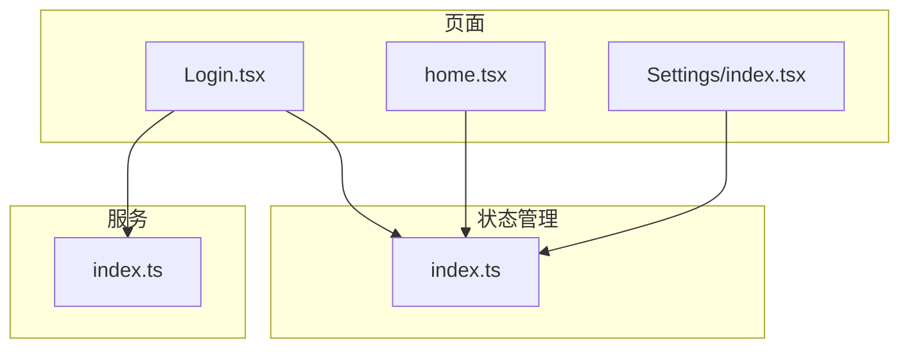
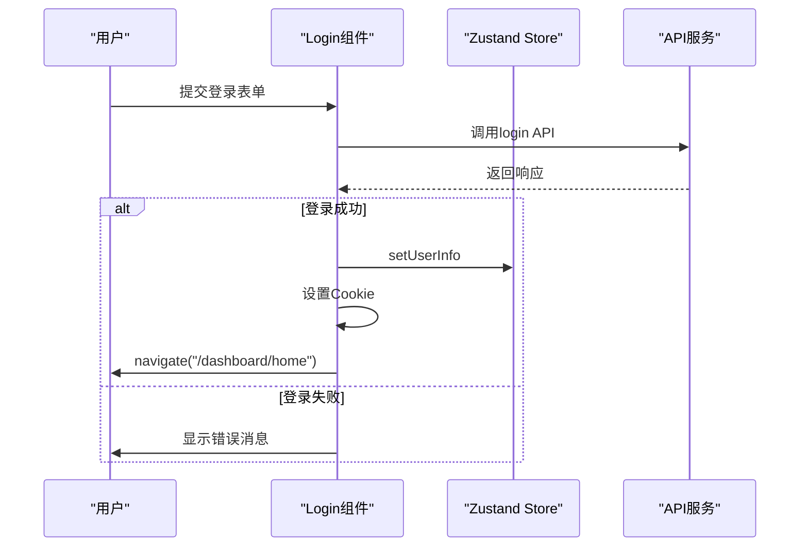
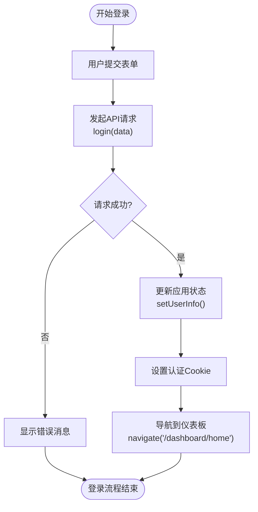
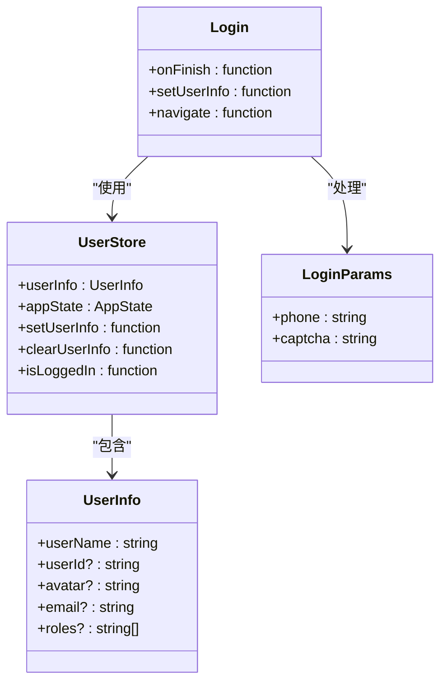
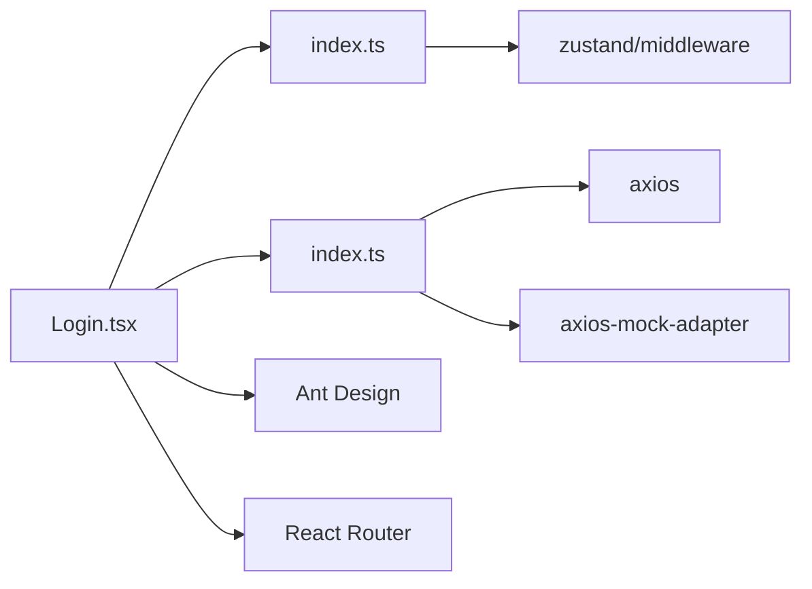

# 登录流程中的乐观更新

<cite>
**本文档引用的文件**   
- [Login.tsx](file://src/pages/User/Login.tsx)
- [index.ts](file://src/store/index.ts)
- [index.ts](file://src/services/index.ts)
- [Login.spec.tsx](file://src/pages/User/Login.spec.tsx)
</cite>

## 更新摘要
**变更内容**   
- 移除了原有的useOptimistic乐观更新实现
- 更新了登录流程为更简洁的useNavigate导航方式
- 删除了乐观状态管理和视觉反馈系统
- 简化了登录组件的实现逻辑

## 目录
1. [简介](#简介)
2. [项目结构](#项目结构)
3. [核心组件](#核心组件)
4. [架构概述](#架构概述)
5. [详细组件分析](#详细组件分析)
6. [依赖分析](#依赖分析)
7. [性能考虑](#性能考虑)
8. [故障排除指南](#故障排除指南)
9. [结论](#结论)

## 简介
本文档深入探讨了在登录页面中使用 `useNavigate` Hook 实现简洁导航的机制。通过分析 `Login.tsx` 文件中的实现，详细说明了如何在表单提交时直接进行页面导航，而不使用乐观更新模式。文档还解释了登录成功后的状态管理、Cookie认证设置，以及错误处理机制，为开发者提供在认证流程中实施简洁导航的完整指南。

**更新** 本版本反映了登录页面从useOptimistic乐观更新模式迁移到useNavigate导航方式的变更。

## 项目结构
本项目采用基于功能的文件组织方式，主要组件分布在 `src/pages` 目录下。登录功能位于 `src/pages/User/Login.tsx`，状态管理通过 `src/store/index.ts` 实现，API服务定义在 `src/services/index.ts`。这种结构清晰地分离了UI、状态和数据访问逻辑，便于维护和扩展。

```mermaid
graph TB
subgraph "页面"
Login[Login.tsx]
Home[home.tsx]
Settings[Settings/index.tsx]
end
subgraph "服务"
Services[index.ts]
end
subgraph "状态管理"
Store[index.ts]
end
Login --> Store
Login --> Services
Home --> Store
Settings --> Store
```

**Diagram sources**
- [Login.tsx](file://src/pages/User/Login.tsx)
- [index.ts](file://src/store/index.ts)
- [index.ts](file://src/services/index.ts)

**Section sources**
- [Login.tsx](file://src/pages/User/Login.tsx)
- [index.ts](file://src/store/index.ts)
- [index.ts](file://src/services/index.ts)

## 核心组件
登录页面的核心是 `Login` 组件，它利用 React Router 的 `useNavigate` Hook 实现了简洁的导航模式。该组件通过 `useNavigate` 在登录成功后直接重定向到仪表板页面，提供简单直接的用户体验。同时，它集成了Zustand状态管理来持久化用户信息，并通过Cookie进行认证管理。

**Section sources**
- [Login.tsx:15-50](file://src/pages/User/Login.tsx#L15-L50)
- [index.ts:41-120](file://src/store/index.ts#L41-L120)

## 架构概述
登录流程的架构设计体现了现代前端应用的最佳实践。UI层通过ProForm组件处理用户输入，逻辑层使用useNavigate实现页面导航，状态管理层通过Zustand管理应用状态，数据访问层通过axios与后端API通信。这种分层架构确保了代码的可维护性和可测试性。

```mermaid
sequenceDiagram
participant 用户 as "用户"
participant Login as "Login组件"
participant Store as "Zustand Store"
participant Service as "API服务"
用户->>Login : 提交登录表单
Login->>Service : 调用login API
Service-->>Login : 返回响应
alt 登录成功
Login->>Store : setUserInfo
Login->>Login : 设置Cookie
Login->>用户 : navigate("/dashboard/home")
else 登录失败
Login->>用户 : 显示错误消息
end
```

**Diagram sources**
- [Login.tsx:32-49](file://src/pages/User/Login.tsx#L32-L49)
- [index.ts:71-76](file://src/store/index.ts#L71-L76)
- [index.ts:204-205](file://src/services/index.ts#L204-L205)

## 详细组件分析

### 登录组件分析
`Login` 组件通过 `useNavigate` Hook 实现了简洁的导航体验。当用户提交表单时，组件直接调用API进行认证，成功后立即进行页面导航，提供即时的页面跳转反馈。

#### 简洁导航机制

```mermaid
flowchart TD
Start([开始登录]) --> FormSubmit["用户提交表单"]
FormSubmit --> APIRequest["发起API请求<br/>login(data)"]
APIRequest --> Success{"请求成功?"}
Success --> |是| UpdateState["更新应用状态<br/>setUserInfo()"]
UpdateState --> SetCookie["设置认证Cookie"]
SetCookie --> Navigate["导航到仪表板<br/>navigate('/dashboard/home')"]
Success --> |否| ShowError["显示错误消息"]
ShowError --> End([登录流程结束])
Navigate --> End
```

**Diagram sources**
- [Login.tsx:32-49](file://src/pages/User/Login.tsx#L32-L49)

#### 状态管理集成

```mermaid
classDiagram
class Login {
+onFinish : function
+setUserInfo : function
+navigate : function
}
class UserStore {
+userInfo : UserInfo
+appState : AppState
+setUserInfo : function
+clearUserInfo : function
+isLoggedIn : function
}
class LoginParams {
+phone : string
+captcha : string
}
Login --> UserStore : "使用"
Login --> LoginParams : "处理"
UserStore --> UserInfo : "包含"
class UserInfo {
+userName : string
+userId? : string
+avatar? : string
+email? : string
+roles? : string[]
}
```

**Diagram sources**
- [Login.tsx:16-19](file://src/pages/User/Login.tsx#L16-L19)
- [index.ts:41-120](file://src/store/index.ts#L41-L120)

**Section sources**
- [Login.tsx:15-50](file://src/pages/User/Login.tsx#L15-L50)
- [index.ts:41-120](file://src/store/index.ts#L41-L120)

## 依赖分析
登录功能依赖于多个核心模块，形成了清晰的依赖链。`Login` 组件依赖于 `useUserStore` 进行状态管理，`useUserStore` 依赖于 `zustand/middleware` 进行状态持久化，同时 `Login` 组件直接调用 `login` 服务进行认证。

```mermaid
graph LR
Login[Login.tsx] --> Store[index.ts]
Login --> Services[index.ts]
Store --> Zustand[zustand/middleware]
Services --> Axios[axios]
Services --> Mock[axios-mock-adapter]
Login --> AntDesign[Ant Design]
Login --> ReactRouter[React Router]
```

**Diagram sources**
- [Login.tsx](file://src/pages/User/Login.tsx)
- [index.ts](file://src/store/index.ts)
- [index.ts](file://src/services/index.ts)

**Section sources**
- [Login.tsx](file://src/pages/User/Login.tsx)
- [index.ts](file://src/store/index.ts)
- [index.ts](file://src/services/index.ts)

## 性能考虑
简洁导航模式显著简化了登录流程的实现复杂度。通过直接使用 `useNavigate`，减少了状态管理的开销，避免了乐观更新所需的额外状态同步。这种方式在大多数情况下提供了足够的用户体验，同时保持了代码的简洁性和可维护性。

## 故障排除指南
当登录功能出现问题时，可以从以下几个方面进行排查：

1. **导航未生效**：检查 `useNavigate` 的使用是否正确，确保在登录成功后调用 `navigate` 函数。
2. **状态未持久化**：验证 `zustand/persist` 配置是否正确，检查 `localStorage` 是否被正确写入。
3. **认证失败**：确认Cookie设置是否正确，检查响应拦截器中的错误处理逻辑。
4. **UI未更新**：确保组件正确订阅了状态变化，检查Zustand选择器的使用。

**Section sources**
- [Login.tsx:32-49](file://src/pages/User/Login.tsx#L32-L49)
- [index.ts:71-76](file://src/store/index.ts#L71-L76)
- [index.ts:204-205](file://src/services/index.ts#L204-L205)

## 结论
通过在登录页面中实施 `useNavigate` 简洁导航模式，本项目实现了简单直接的用户体验。该方案虽然移除了乐观更新的复杂性，但通过直接的页面跳转提供了清晰的流程反馈。与Zustand状态管理和Cookie认证的集成，构建了一个健壮、可维护的认证流程。这种模式适合大多数认证场景，为开发者提供了一个简洁可靠的参考实现。