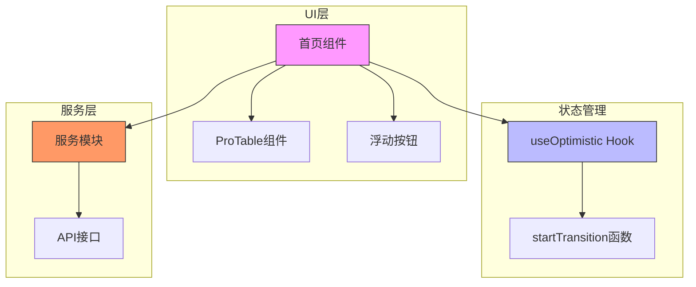
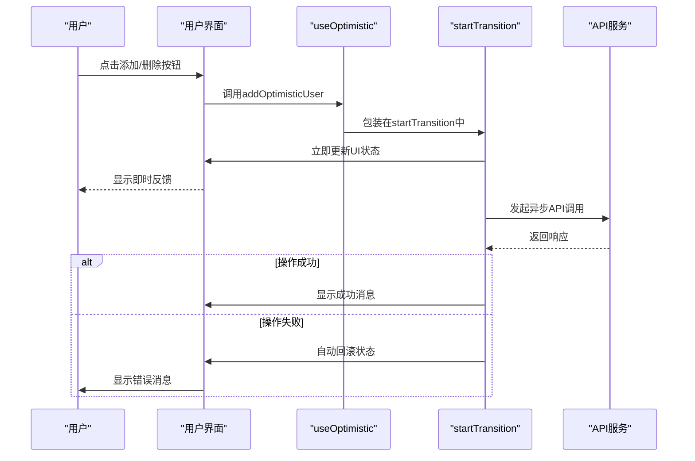
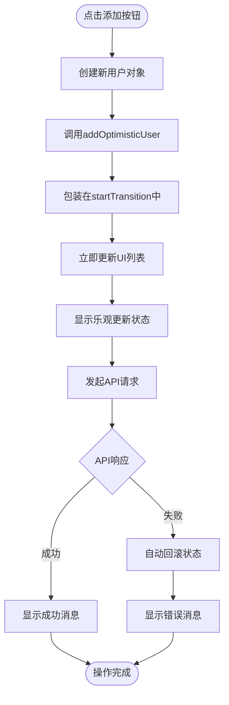
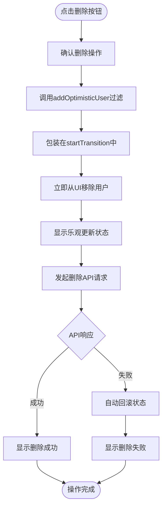
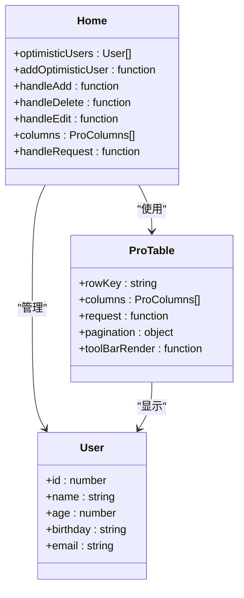
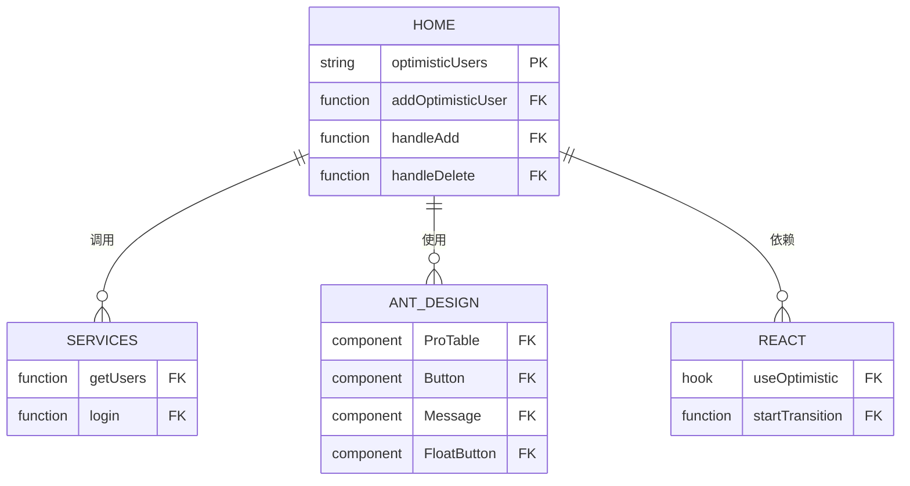

# 首页用户管理中的乐观更新

<cite>
**Referenced Files in This Document**   
- [home.tsx](file://src/pages/home.tsx)
- [index.ts](file://src/services/index.ts)
- [BasicLayout.tsx](file://src/layout/BasicLayout.tsx)
</cite>

## 目录
1. [简介](#简介)
2. [核心组件](#核心组件)
3. [架构概述](#架构概述)
4. [详细组件分析](#详细组件分析)
5. [依赖分析](#依赖分析)
6. [性能考虑](#性能考虑)
7. [故障排除指南](#故障排除指南)
8. [结论](#结论)

## 简介
本文档详细阐述了在React 19应用中使用`useOptimistic` Hook实现首页用户管理的乐观更新机制。通过`home.tsx`文件中的具体实现，展示了如何在ProTable组件中实现用户数据的乐观添加和删除操作。文档重点解释了`useOptimistic`与`startTransition`的协同工作机制，以及在`handleAdd`和`handleDelete`回调中如何立即更新UI并处理异步API响应。

## 核心组件

`useOptimistic` Hook是React 19引入的新特性，用于实现乐观更新（Optimistic Updates），提供更好的用户体验。它允许在异步操作（如API调用）完成之前立即更新UI，如果操作失败会自动回滚到原始状态。

在`home.tsx`文件中，`useOptimistic`被用于用户管理页面，实现了用户删除和添加操作的即时反馈。当用户点击删除按钮后，立即从列表中移除用户；点击添加按钮后，立即在列表中显示新用户。同时，页面还显示了乐观更新状态指示器，让用户了解当前正在进行的操作。

**Section sources**
- [home.tsx](file://src/pages/home.tsx#L27-L27)

## 架构概述

**Diagram sources **
- [home.tsx](file://src/pages/home.tsx#L1-L295)
- [index.ts](file://src/services/index.ts#L1-L212)

## 详细组件分析

### 用户管理组件分析

#### 乐观更新机制

**Diagram sources **
- [home.tsx](file://src/pages/home.tsx#L38-L82)

#### 添加用户流程

**Diagram sources **
- [home.tsx](file://src/pages/home.tsx#L59-L82)

#### 删除用户流程

**Diagram sources **
- [home.tsx](file://src/pages/home.tsx#L38-L56)

**Section sources**
- [home.tsx](file://src/pages/home.tsx#L38-L82)

### ProTable组件集成

ProTable组件与乐观更新机制的集成是本实现的关键。通过将乐观更新的状态与ProTable的数据源结合，实现了无缝的用户体验。

**Diagram sources **
- [home.tsx](file://src/pages/home.tsx#L246-L294)

**Section sources**
- [home.tsx](file://src/pages/home.tsx#L246-L294)

## 依赖分析

**Diagram sources **
- [home.tsx](file://src/pages/home.tsx#L1-L295)
- [index.ts](file://src/services/index.ts#L1-L212)

**Section sources**
- [home.tsx](file://src/pages/home.tsx#L1-L295)
- [index.ts](file://src/services/index.ts#L1-L212)

## 性能考虑

在实现乐观更新时，需要考虑以下性能因素：

1. **过渡动画优化**：`startTransition`确保乐观更新不会阻塞主线程，保持界面响应性
2. **状态更新效率**：使用不可变更新模式，避免不必要的重新渲染
3. **错误处理机制**：自动回滚机制减少了手动状态管理的复杂性
4. **用户反馈及时性**：即时UI更新提升了用户体验，减少了等待感知

虽然乐观更新会暂时增加内存中的状态数据（乐观状态），但这种权衡带来了显著的用户体验提升。在实际应用中，这种临时状态通常很快就会被清理。

## 故障排除指南

当乐观更新机制出现问题时，可以参考以下排查步骤：

1. **检查Hook依赖**：确保`useCallback`的依赖数组正确包含`addOptimisticUser`
2. **验证API调用**：确认服务层的API函数正确实现并返回预期格式
3. **调试过渡状态**：检查`startTransition`是否正确包装了状态更新
4. **查看错误处理**：验证失败时的回滚逻辑是否正常工作

**Section sources**
- [home.tsx](file://src/pages/home.tsx#L38-L82)
- [index.ts](file://src/services/index.ts#L1-L212)

## 结论

`useOptimistic` Hook为React应用提供了强大的乐观更新能力，特别是在数据表格场景下。通过与`startTransition`配合使用，开发者可以创建响应迅速、用户体验优秀的应用界面。在首页用户管理的实现中，我们展示了如何将这一机制应用于常见的CRUD操作，为用户提供即时反馈，同时保持数据一致性。这种模式特别适用于网络延迟较高的场景，能够显著提升应用的感知性能。