# 单元测试

<cite>
**本文档引用的文件**
- [jest.config.ts](file://jest.config.ts)
- [jest.setup.ts](file://jest.setup.ts)
- [src/__tests__/components/Home.test.tsx](file://src/__tests__/components/Home.test.tsx)
- [src/__tests__/services.test.tsx](file://src/__tests__/services.test.tsx)
- [src/__tests__/store.test.tsx](file://src/__tests__/store.test.tsx)
- [src/pages/home.tsx](file://src/pages/home.tsx)
- [src/services/index.ts](file://src/services/index.ts)
- [src/store/index.ts](file://src/store/index.ts)
</cite>

## 目录
1. [简介](#简介)
2. [测试环境配置](#测试环境配置)
3. [组件测试](#组件测试)
4. [服务层测试](#服务层测试)
5. [状态管理测试](#状态管理测试)
6. [测试工具与技术](#测试工具与技术)
7. [最佳实践](#最佳实践)
8. [测试运行与CI集成](#测试运行与ci集成)

## 简介
本项目采用Jest作为主要的单元测试框架，结合React Testing Library、Ant Design的测试工具和Axios Mock Adapter等技术，构建了完整的前端测试体系。测试覆盖了React组件、服务层API调用和Zustand状态管理等核心功能模块。通过合理的测试配置和模拟策略，确保了代码质量和功能稳定性。

## 测试环境配置

```mermaid
graph TD
A[Jest配置] --> B[transform配置]
A --> C[moduleNameMapper配置]
A --> D[testEnvironment配置]
A --> E[setupFilesAfterEnv配置]
B --> F[ts-jest处理TS/JS文件]
C --> G[@/别名映射到src目录]
C --> H[静态资源映射到jest-transform-stub]
D --> I[jsdom模拟浏览器环境]
E --> J[jest.setup.ts初始化测试环境]
```

**图示来源**
- [jest.config.ts](file://jest.config.ts#L1-L22)

**测试环境配置**
- [jest.config.ts](file://jest.config.ts#L1-L22)
- [jest.setup.ts](file://jest.setup.ts#L1-L106)

## 组件测试

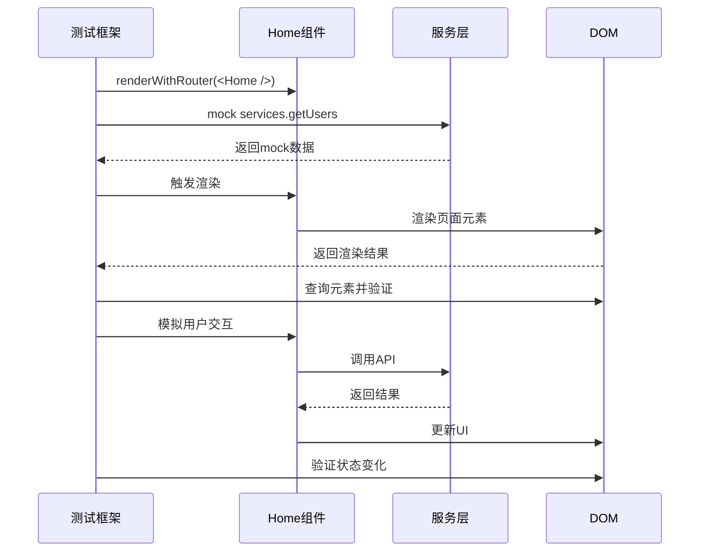

**图示来源**
- [src/__tests__/components/Home.test.tsx](file://src/__tests__/components/Home.test.tsx#L1-L248)
- [src/pages/home.tsx](file://src/pages/home.tsx#L1-L295)

### Home组件测试实现

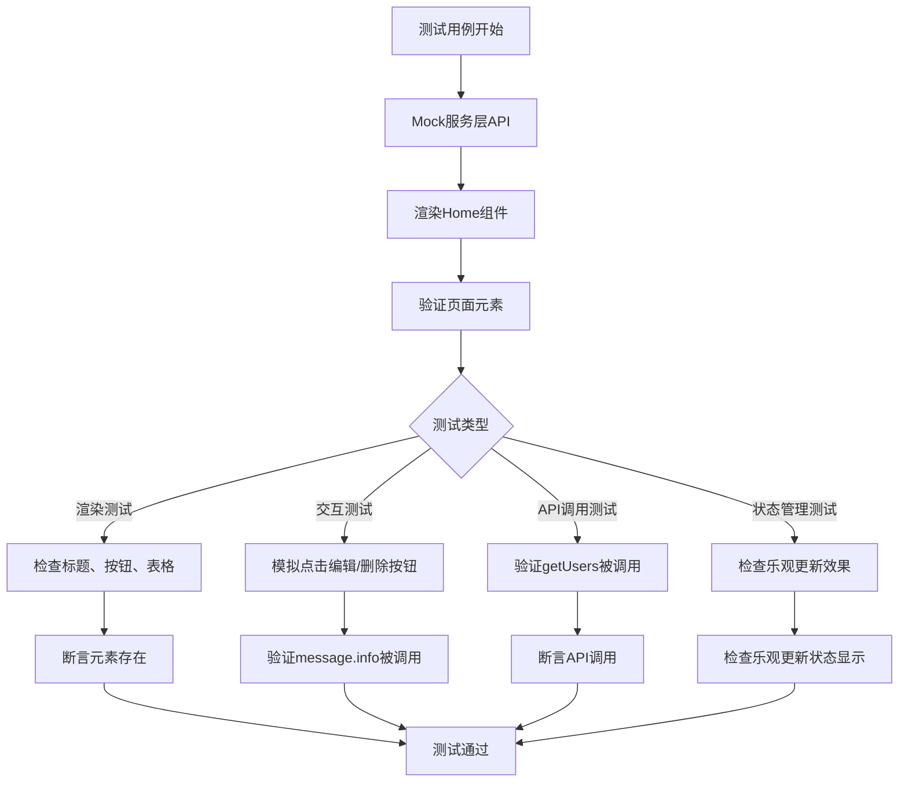

**图示来源**
- [src/__tests__/components/Home.test.tsx](file://src/__tests__/components/Home.test.tsx#L1-L248)
- [src/pages/home.tsx](file://src/pages/home.tsx#L1-L295)

**测试实现**
- [src/__tests__/components/Home.test.tsx](file://src/__tests__/components/Home.test.tsx#L1-L248)
- [src/pages/home.tsx](file://src/pages/home.tsx#L1-L295)

## 服务层测试

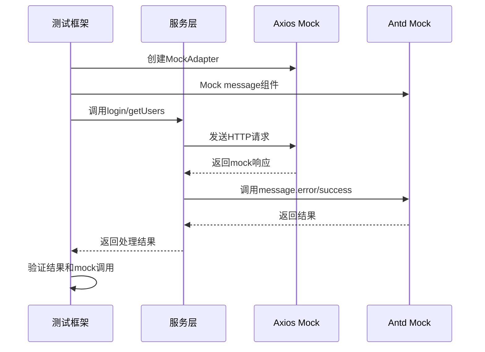

**图示来源**
- [src/__tests__/services.test.tsx](file://src/__tests__/services.test.tsx#L1-L354)
- [src/services/index.ts](file://src/services/index.ts#L1-L212)

### 服务层测试实现

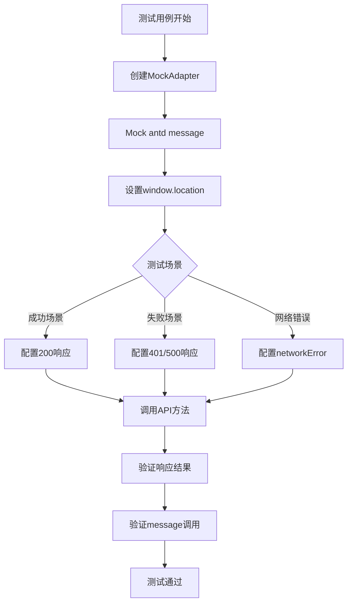

**图示来源**
- [src/__tests__/services.test.tsx](file://src/__tests__/services.test.tsx#L1-L354)
- [src/services/index.ts](file://src/services/index.ts#L1-L212)

**测试实现**
- [src/__tests__/services.test.tsx](file://src/__tests__/services.test.tsx#L1-L354)
- [src/services/index.ts](file://src/services/index.ts#L1-L212)

## 状态管理测试

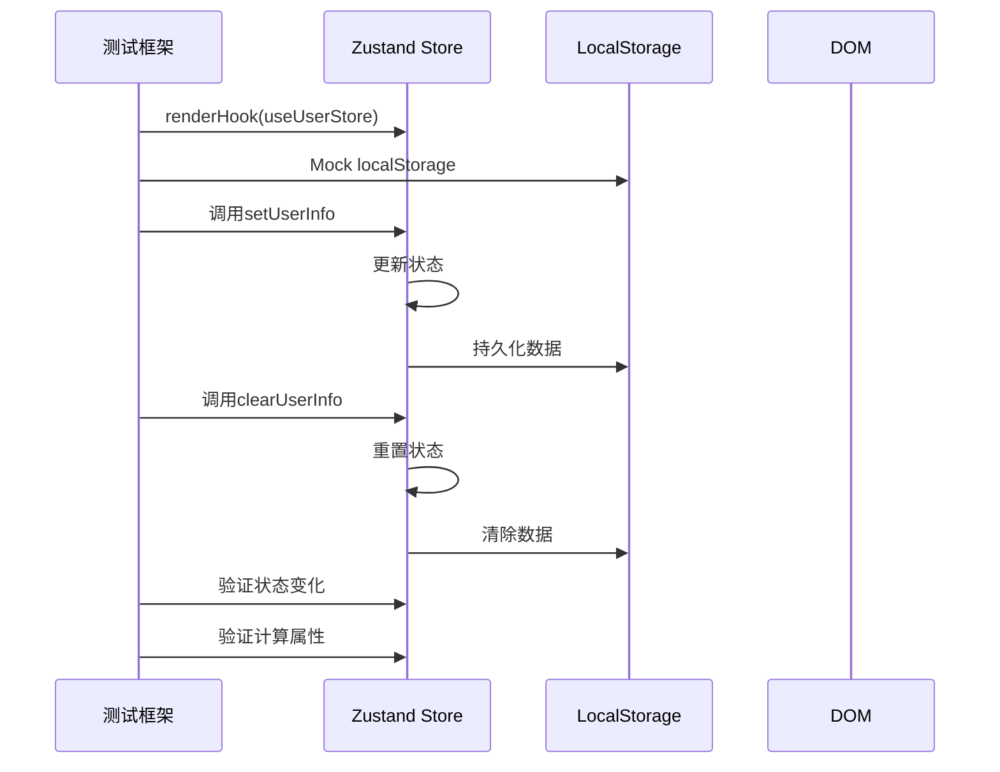

**图示来源**
- [src/__tests__/store.test.tsx](file://src/__tests__/store.test.tsx#L1-L227)
- [src/store/index.ts](file://src/store/index.ts#L1-L123)

### 状态管理测试实现

```mermaid
flowchart TD
A[测试用例开始] --> B[Mock localStorage]
B --> C[Mock document.cookie]
C --> D[renderHook(useUserStore)]
D --> E{测试模块}
E --> |用户信息管理| F[测试setUserInfo/clearUserInfo]
E --> |应用状态管理| G[测试setLoading/toggleTheme]
E --> |计算属性| H[测试isLoggedIn/displayName]
E --> |异步方法| I[测试getUserInfo]
F --> J[验证状态更新]
G --> J
H --> J
I --> J
J --> K[测试通过]
```

**图示来源**
- [src/__tests__/store.test.tsx](file://src/__tests__/store.test.tsx#L1-L227)
- [src/store/index.ts](file://src/store/index.ts#L1-L123)

**测试实现**
- [src/__tests__/store.test.tsx](file://src/__tests__/store.test.tsx#L1-L227)
- [src/store/index.ts](file://src/store/index.ts#L1-L123)

## 测试工具与技术

### 模块模拟技术

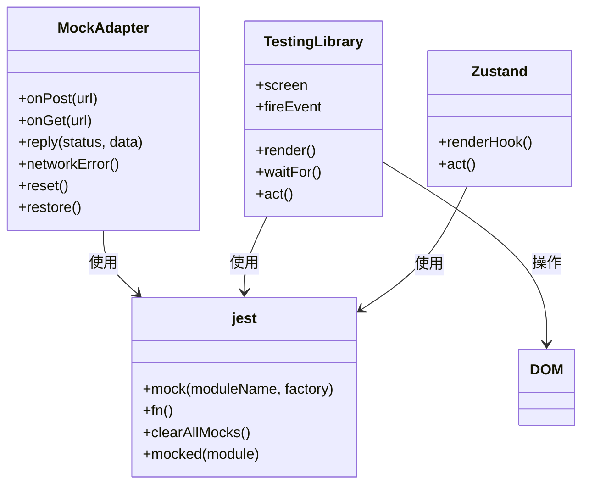

**图示来源**
- [src/__tests__/services.test.tsx](file://src/__tests__/services.test.tsx#L1-L354)
- [src/__tests__/components/Home.test.tsx](file://src/__tests__/components/Home.test.tsx#L1-L248)
- [src/__tests__/store.test.tsx](file://src/__tests__/store.test.tsx#L1-L227)

### API模拟实现

```mermaid
flowchart TD
A[创建MockAdapter] --> B[配置请求拦截]
B --> C[定义响应规则]
C --> D{响应类型}
D --> |成功响应| E[reply(200, data)]
D --> |错误响应| F[reply(401, errorData)]
D --> |网络错误| G[networkError()]
E --> H[服务层处理成功]
F --> H[服务层处理错误]
G --> H[服务层处理异常]
H --> I[验证结果]
```

**图示来源**
- [src/services/index.ts](file://src/services/index.ts#L1-L212)
- [src/__tests__/services.test.tsx](file://src/__tests__/services.test.tsx#L1-L354)

**模块模拟**
- [jest.setup.ts](file://jest.setup.ts#L1-L106)
- [src/__tests__/services.test.tsx](file://src/__tests__/services.test.tsx#L1-L354)
- [src/__tests__/components/Home.test.tsx](file://src/__tests__/components/Home.test.tsx#L1-L248)
- [src/__tests__/store.test.tsx](file://src/__tests__/store.test.tsx#L1-L227)

## 最佳实践

### 测试覆盖率要求

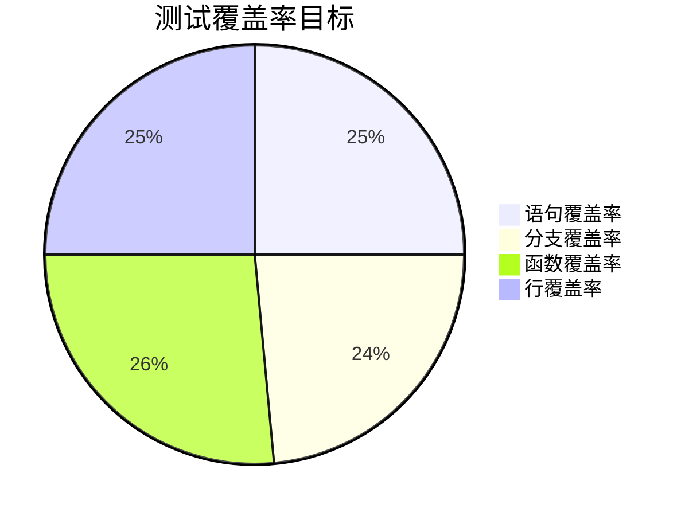

**覆盖率配置**
- [jest.config.ts](file://jest.config.ts#L3-L4)

### 异步测试处理

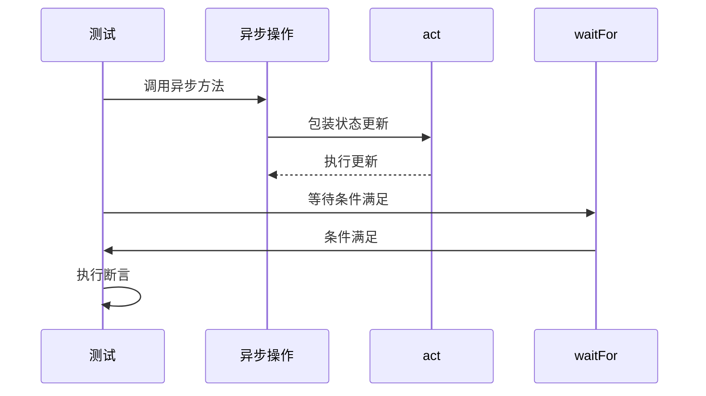

**异步测试实现**
- [src/__tests__/components/Home.test.tsx](file://src/__tests__/components/Home.test.tsx#L1-L248)
- [src/__tests__/store.test.tsx](file://src/__tests__/store.test.tsx#L1-L227)

### 快照测试使用

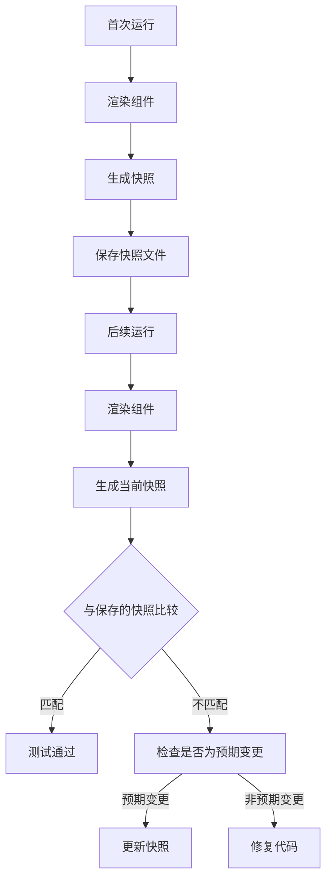

**快照测试配置**
- Jest默认支持
- [jest.config.ts](file://jest.config.ts#L1-L22)

**最佳实践**
- [jest.config.ts](file://jest.config.ts#L1-L22)
- [jest.setup.ts](file://jest.setup.ts#L1-L106)
- [src/__tests__/*](file://src/__tests__)

## 测试运行与CI集成

### 测试运行命令

```bash
# 运行所有测试
npm test

# 运行测试并生成覆盖率报告
npm test -- --coverage

# 监听模式运行测试
npm test -- --watch

# 运行特定测试文件
npm test Home.test.tsx

# 运行特定测试用例
npm test -- -t "应该正确渲染Home组件"
```

### 覆盖率报告生成

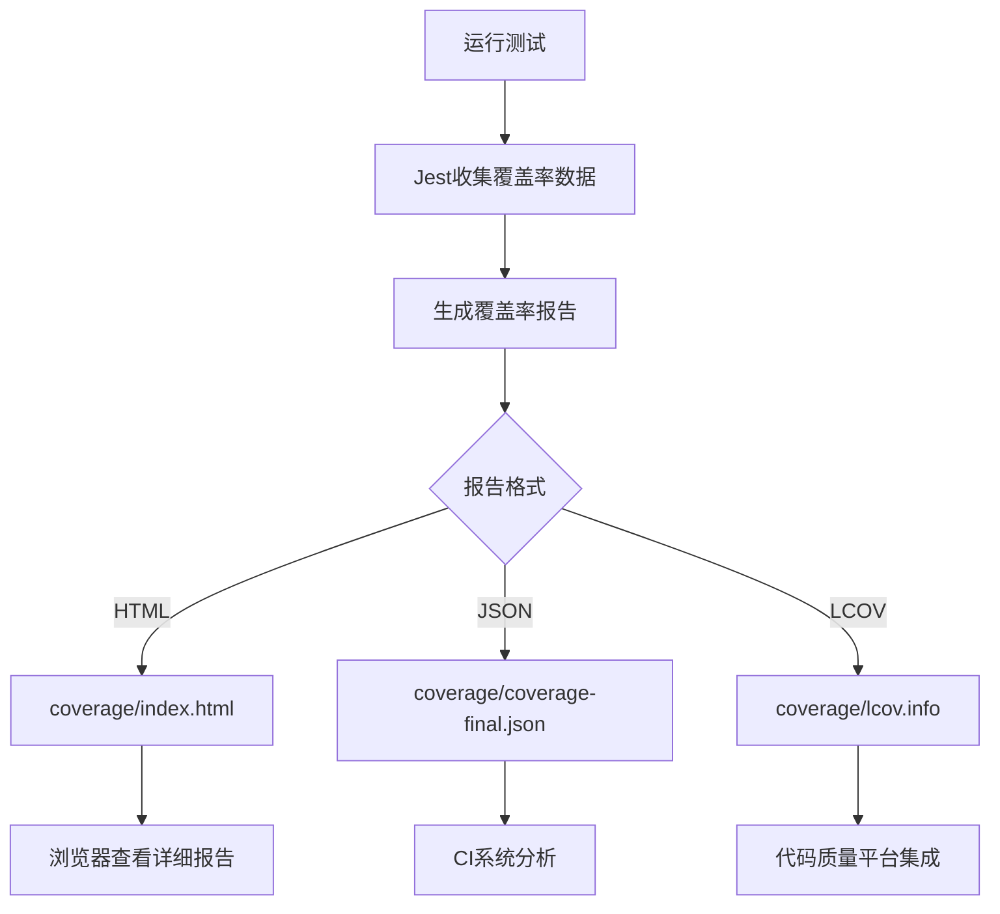

**覆盖率配置**
- [jest.config.ts](file://jest.config.ts#L3-L4)

### CI集成策略

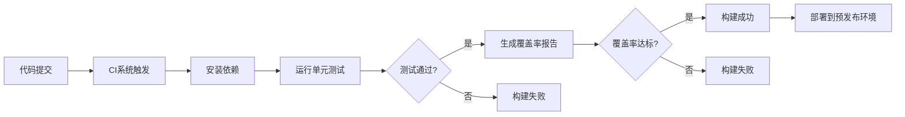

**CI集成配置**
- package.json scripts
- CI配置文件（未提供）

**测试运行**
- [package.json](file://package.json)
- [jest.config.ts](file://jest.config.ts#L1-L22)