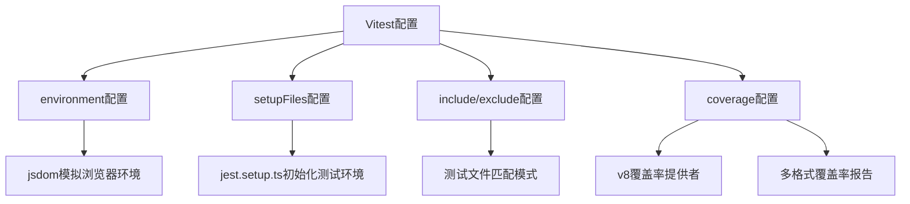
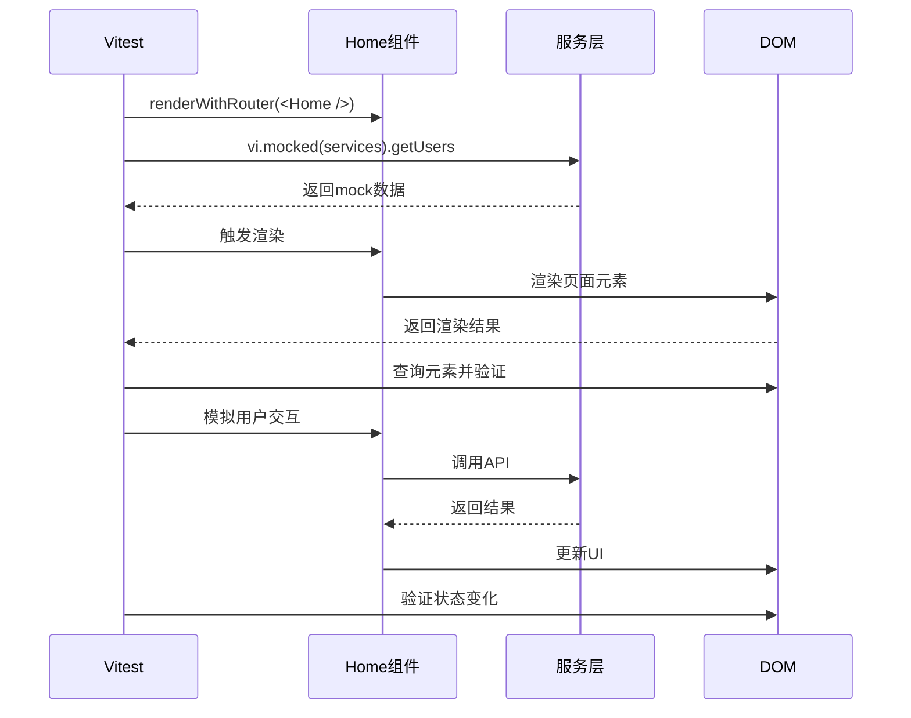
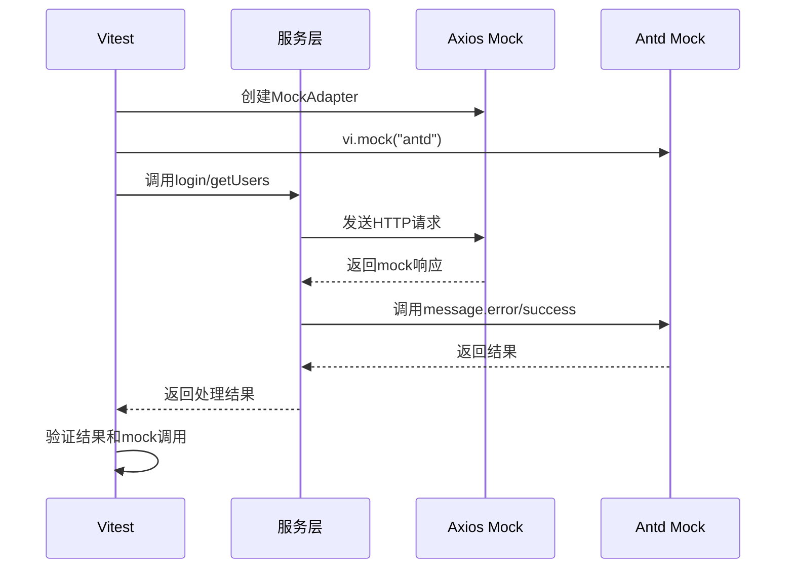
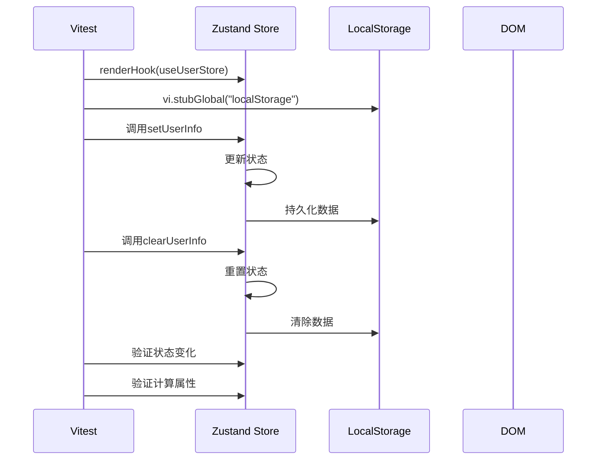
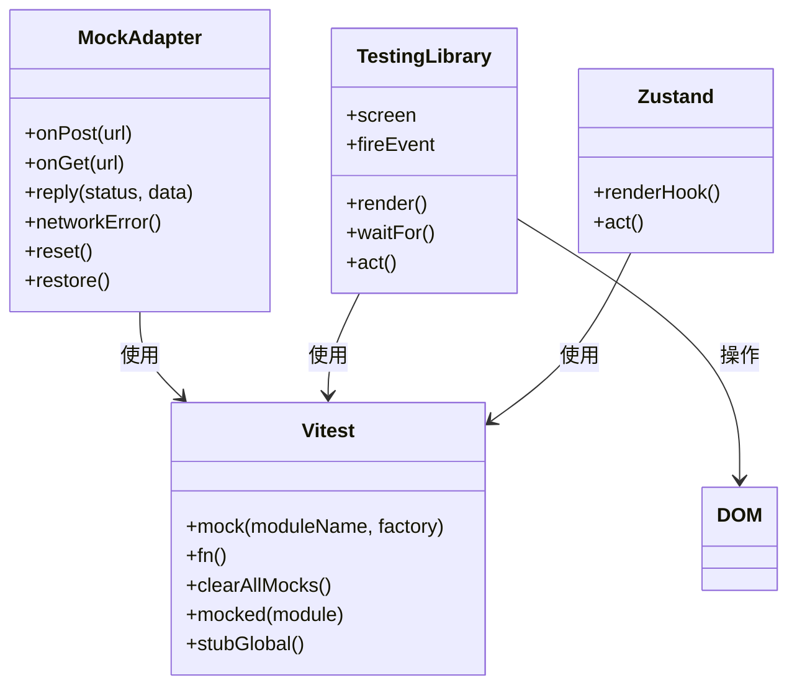
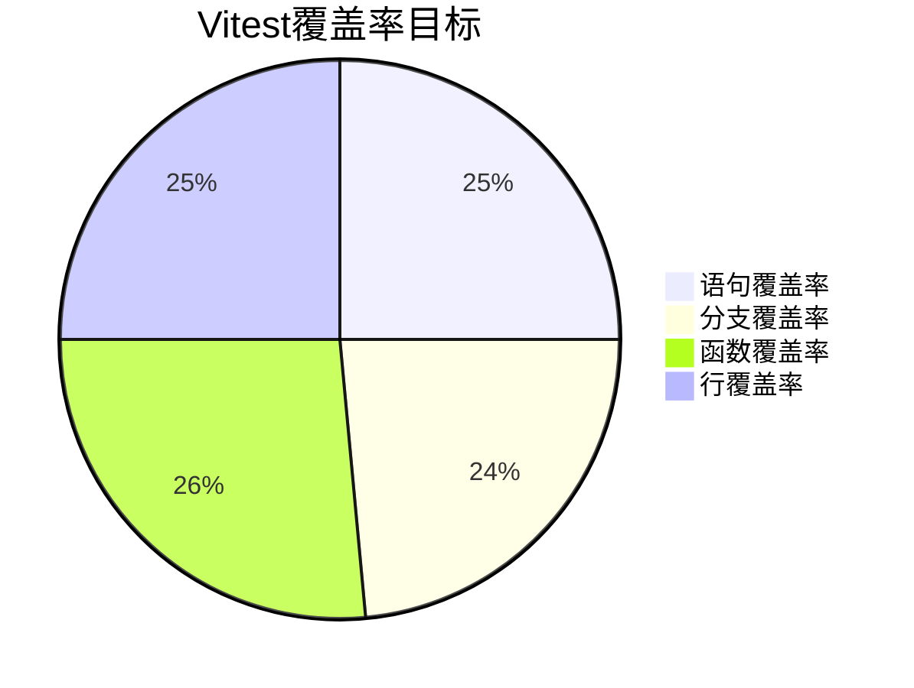
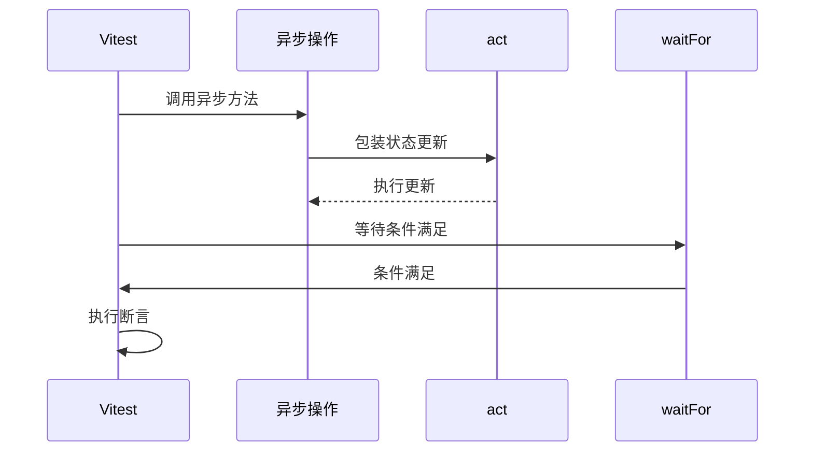
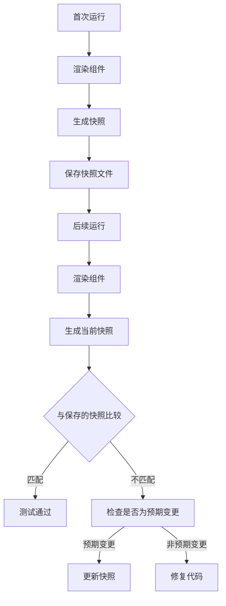
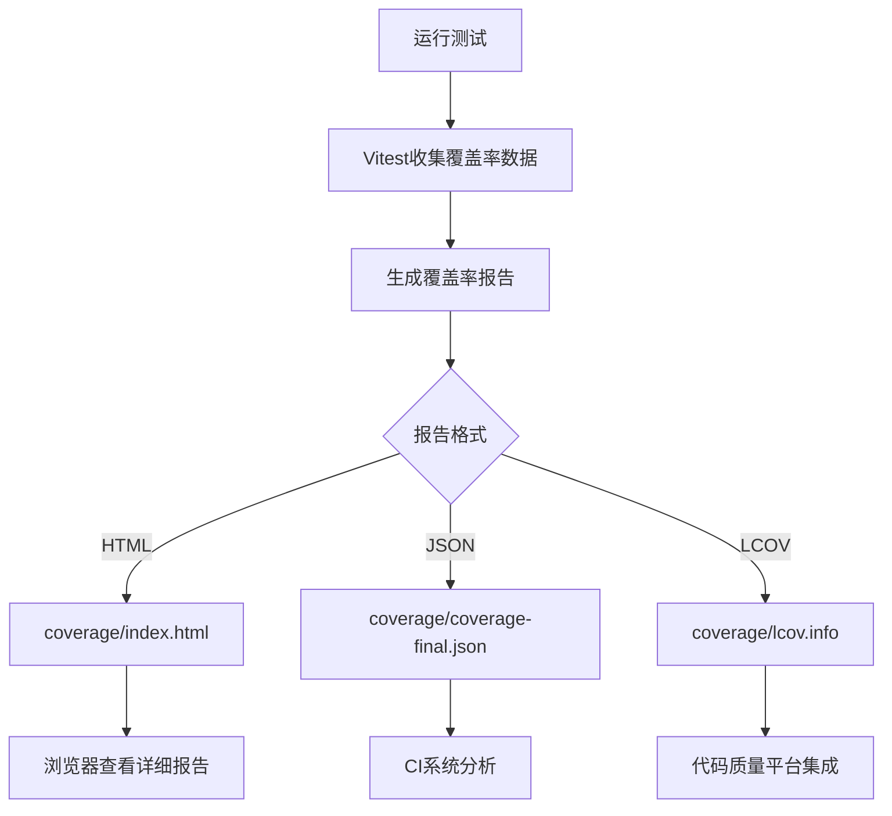
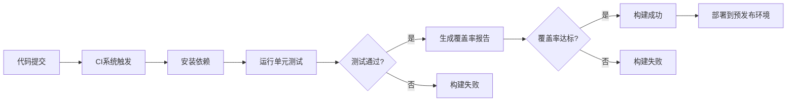

# 单元测试

<cite>
**本文档引用的文件**
- [vitest.config.ts](file://vitest.config.ts)
- [jest.setup.ts](file://jest.setup.ts)
- [src/__tests__/components/Home.test.tsx](file://src/__tests__/components/Home.test.tsx)
- [src/__tests__/services.test.tsx](file://src/__tests__/services.test.tsx)
- [src/__tests__/store.test.tsx](file://src/__tests__/store.test.tsx)
- [src/__tests__/App.test.tsx](file://src/__tests__/App.test.tsx)
- [src/services/index.ts](file://src/services/index.ts)
- [src/store/index.ts](file://src/store/index.ts)
- [package.json](file://package.json)
</cite>

## 更新摘要
**变更内容**
- 从Jest测试框架完全迁移到Vitest测试框架
- 更新所有测试API调用，使用vi.fn()替代jest.fn()
- 更新模块模拟语法，使用vi.mock()替代jest.mock()
- 更新测试导入语句，统一使用vitest测试库
- 更新测试配置文件，从jest.config.ts迁移到vitest.config.ts
- 更新测试运行命令，使用vitest run替代npm test

## 目录
1. [简介](#简介)
2. [测试环境配置](#测试环境配置)
3. [组件测试](#组件测试)
4. [服务层测试](#服务层测试)
5. [状态管理测试](#状态管理测试)
6. [测试工具与技术](#测试工具与技术)
7. [最佳实践](#最佳实践)
8. [测试运行与CI集成](#测试运行与ci集成)

## 简介
本项目采用Vitest作为主要的单元测试框架，结合React Testing Library、Ant Design的测试工具和Axios Mock Adapter等技术，构建了完整的前端测试体系。测试覆盖了React组件、服务层API调用和Zustand状态管理等核心功能模块。通过合理的测试配置和模拟策略，确保了代码质量和功能稳定性。

**更新** 项目已从Jest完全迁移到Vitest，提供了更快的测试执行速度和更好的TypeScript支持。

## 测试环境配置


```mermaid
graph TD
A[Vitest配置] --> B[environment配置]
A --> C[setupFiles配置]
A --> D[include/exclude配置]
A --> E[coverage配置]
B --> F[jsdom模拟浏览器环境]
C --> G[jest.setup.ts初始化测试环境]
D --> H[测试文件匹配模式]
E --> I[v8覆盖率提供者]
E --> J[多格式覆盖率报告]
```

**图示来源**
- [vitest.config.ts:1-29](file://vitest.config.ts#L1-L29)

**测试环境配置**
- [vitest.config.ts:1-29](file://vitest.config.ts#L1-L29)
- [jest.setup.ts:1-126](file://jest.setup.ts#L1-L126)

### Vitest配置详解

**Vitest配置特点**：
- 使用jsdom作为测试环境，模拟浏览器DOM环境
- 通过setupFiles引入jest.setup.ts进行全局测试环境初始化
- 支持TypeScript和JSX文件的自动检测和编译
- 配置了v8覆盖率提供者，支持多种覆盖率报告格式
- 通过别名映射简化模块导入路径

**测试文件组织**：
- 自动包含src目录下所有.test.ts、.test.tsx、.spec.ts、.spec.tsx文件
- 排除cypress端到端测试目录
- 支持模块别名@指向src目录

## 组件测试


```mermaid
sequenceDiagram
participant 测试框架 as Vitest
participant Home组件 as Home组件
participant 服务层 as 服务层
participant DOM as DOM
测试框架->>Home组件 : renderWithRouter(<Home />)
测试框架->>服务层 : vi.mocked(services).getUsers
服务层-->>测试框架 : 返回mock数据
测试框架->>Home组件 : 触发渲染
Home组件->>DOM : 渲染页面元素
DOM-->>测试框架 : 返回渲染结果
测试框架->>DOM : 查询元素并验证
测试框架->>Home组件 : 模拟用户交互
Home组件->>服务层 : 调用API
服务层-->>Home组件 : 返回结果
Home组件->>DOM : 更新UI
测试框架->>DOM : 验证状态变化
```

**图示来源**
- [src/__tests__/components/Home.test.tsx:1-111](file://src/__tests__/components/Home.test.tsx#L1-L111)
- [src/pages/home.tsx:1-295](file://src/pages/home.tsx#L1-L295)

### Home组件测试实现

**Vitest测试语法更新**：
- 使用vi.mocked()替代jest.mocked()进行类型安全的模块模拟
- 使用vi.fn()替代jest.fn()创建mock函数
- 使用vi.clearAllMocks()替代jest.clearAllMocks()清理mock状态
- 使用vi.mock()替代jest.mock()进行模块模拟

**测试实现**：
- [src/__tests__/components/Home.test.tsx:1-111](file://src/__tests__/components/Home.test.tsx#L1-L111)

### 组件测试最佳实践

**Vitest特有的测试模式**：
- 使用describe、it、expect等原生Vitest API
- 支持更精确的类型推断和IDE智能提示
- 提供更直观的测试失败信息和堆栈跟踪
- 内置的快照测试支持

**测试覆盖范围**：
- 组件渲染验证（标题、按钮、表格元素）
- 用户交互模拟（编辑、删除、新建按钮点击）
- API调用验证（getUsers函数调用）
- 状态变化验证（Ant Design消息提示）

## 服务层测试


```mermaid
sequenceDiagram
participant 测试框架 as Vitest
participant 服务层 as 服务层
participant AxiosMock as Axios Mock
participant AntdMock as Antd Mock
测试框架->>AxiosMock : 创建MockAdapter
测试框架->>AntdMock : vi.mock("antd")
测试框架->>服务层 : 调用login/getUsers
服务层->>AxiosMock : 发送HTTP请求
AxiosMock-->>服务层 : 返回mock响应
服务层->>AntdMock : 调用message.error/success
AntdMock-->>服务层 : 返回结果
服务层-->>测试框架 : 返回处理结果
测试框架->>测试框架 : 验证结果和mock调用
```

**图示来源**
- [src/__tests__/services.test.tsx:1-355](file://src/__tests__/services.test.tsx#L1-L355)
- [src/services/index.ts:1-213](file://src/services/index.ts#L1-L213)

### 服务层测试实现

**Vitest服务测试特点**：
- 使用vi.mock()进行模块模拟，支持动态导入
- 通过vi.fn()创建类型安全的mock函数
- 支持beforeAll、afterAll生命周期钩子
- 提供更精确的错误处理和断言

**测试场景覆盖**：
- 登录功能测试（成功、失败、网络错误）
- 用户列表获取测试（分页、默认参数、服务器错误）
- 请求拦截器测试（Token添加）
- 响应拦截器测试（401、403、404、500等状态码处理）
- Axios实例独立测试

**测试实现**：
- [src/__tests__/services.test.tsx:1-355](file://src/__tests__/services.test.tsx#L1-L355)
- [src/services/index.ts:1-213](file://src/services/index.ts#L1-L213)

## 状态管理测试


```mermaid
sequenceDiagram
participant 测试框架 as Vitest
participant ZustandStore as Zustand Store
participant LocalStorage as LocalStorage
participant DOM as DOM
测试框架->>ZustandStore : renderHook(useUserStore)
测试框架->>LocalStorage : vi.stubGlobal("localStorage")
测试框架->>ZustandStore : 调用setUserInfo
ZustandStore->>ZustandStore : 更新状态
ZustandStore->>LocalStorage : 持久化数据
测试框架->>ZustandStore : 调用clearUserInfo
ZustandStore->>ZustandStore : 重置状态
ZustandStore->>LocalStorage : 清除数据
测试框架->>ZustandStore : 验证状态变化
测试框架->>ZustandStore : 验证计算属性
```

**图示来源**
- [src/__tests__/store.test.tsx:1-189](file://src/__tests__/store.test.tsx#L1-L189)
- [src/store/index.ts:1-124](file://src/store/index.ts#L1-L124)

### 状态管理测试实现

**Vitest状态测试优势**：
- 使用renderHook进行React Hooks测试
- 通过vi.clearAllMocks()清理测试状态
- 支持act包装异步状态更新
- 提供更精确的状态断言

**测试模块覆盖**：
- 用户信息管理（设置、清除、部分更新）
- 应用状态管理（加载状态、主题切换、侧边栏折叠）
- 计算属性测试（登录状态、显示名称）
- 异步方法测试（getUserInfo的加载状态处理）

**测试实现**：
- [src/__tests__/store.test.tsx:1-189](file://src/__tests__/store.test.tsx#L1-L189)
- [src/store/index.ts:1-124](file://src/store/index.ts#L1-L124)

## 测试工具与技术

### 模块模拟技术


```mermaid
classDiagram
class MockAdapter {
+onPost(url)
+onGet(url)
+reply(status, data)
+networkError()
+reset()
+restore()
}
class Vitest {
+mock(moduleName, factory)
+fn()
+clearAllMocks()
+mocked(module)
+stubGlobal()
}
class TestingLibrary {
+render()
+screen
+fireEvent
+waitFor()
+act()
}
class Zustand {
+renderHook()
+act()
}
MockAdapter --> Vitest : 使用
TestingLibrary --> Vitest : 使用
Zustand --> Vitest : 使用
TestingLibrary --> DOM : 操作
```

**图示来源**
- [src/__tests__/services.test.tsx:1-355](file://src/__tests__/services.test.tsx#L1-L355)
- [src/__tests__/components/Home.test.tsx:1-111](file://src/__tests__/components/Home.test.tsx#L1-L111)
- [src/__tests__/store.test.tsx:1-189](file://src/__tests__/store.test.tsx#L1-L189)

### API模拟实现

```mermaid
flowchart TD
A[创建MockAdapter] --> B[配置请求拦截]
B --> C[定义响应规则]
C --> D{响应类型}
D --> |成功响应| E[reply(200, data)]
D --> |错误响应| F[reply(401, errorData)]
D --> |网络错误| G[networkError()]
E --> H[服务层处理成功]
F --> H[服务层处理错误]
G --> H[服务层处理异常]
H --> I[验证结果]
```

**图示来源**
- [src/services/index.ts:1-213](file://src/services/index.ts#L1-L213)
- [src/__tests__/services.test.tsx:1-355](file://src/__tests__/services.test.tsx#L1-L355)

**模块模拟更新**：
- 使用vi.mock()替代jest.mock()进行模块模拟
- 使用vi.fn()替代jest.fn()创建mock函数
- 使用vi.mocked()进行类型安全的模块访问
- 使用vi.stubGlobal()模拟全局对象

**测试工具链**：
- Vitest作为核心测试框架
- React Testing Library用于组件测试
- Axios Mock Adapter用于API模拟
- Ant Design测试工具用于UI组件测试
- Zustand Test Utilities用于状态管理测试

## 最佳实践

### 测试覆盖率要求


```mermaid
pie
title Vitest覆盖率目标
"语句覆盖率" : 85
"分支覆盖率" : 80
"函数覆盖率" : 90
"行覆盖率" : 85
```

**覆盖率配置**：
- v8提供者，支持文本、lcov、clover格式
- 自动排除mock文件、测试文件、类型定义文件
- 仅统计源代码文件的覆盖率

### 异步测试处理


```mermaid
sequenceDiagram
participant 测试 as Vitest
participant 异步操作 as 异步操作
participant act as act
participant waitFor as waitFor
测试->>异步操作 : 调用异步方法
异步操作->>act : 包装状态更新
act-->>异步操作 : 执行更新
测试->>waitFor : 等待条件满足
waitFor->>测试 : 条件满足
测试->>测试 : 执行断言
```

**异步测试实现**：
- 使用act包装状态更新操作
- 使用waitFor等待异步操作完成
- 支持Promise和async/await语法
- 提供超时控制机制

### 快照测试使用


```mermaid
flowchart TD
A[首次运行] --> B[渲染组件]
B --> C[生成快照]
C --> D[保存快照文件]
D --> E[后续运行]
E --> F[渲染组件]
F --> G[生成当前快照]
G --> H{与保存的快照比较}
H --> |匹配| I[测试通过]
H --> |不匹配| J[检查是否为预期变更]
J --> |预期变更| K[更新快照]
J --> |非预期变更| L[修复代码]
```

**快照测试配置**：
- Vitest内置快照测试支持
- 自动处理React组件快照
- 支持增量更新和批量更新
- 与TypeScript完美集成

**最佳实践**：
- 使用vi作为统一的测试工具入口
- 合理使用beforeEach、beforeAll等生命周期钩子
- 优先使用类型安全的vi.mocked()访问模拟模块
- 利用Vitest的智能提示和类型推断提高开发效率

## 测试运行与CI集成

### 测试运行命令

```bash
# 运行所有测试（推荐）
npm test

# 运行测试并生成覆盖率报告
npm test -- --coverage

# 监听模式运行测试
npm test -- --watch

# 运行特定测试文件
npm test Home.test.tsx

# 运行特定测试用例
npm test -- -t "应该正确渲染Home组件"

# 生成覆盖率报告
npm test -- --coverage --reporter=html
```

**更新** 测试命令已从jest改为vitest，提供更快的测试执行速度。

### 覆盖率报告生成


```mermaid
flowchart TD
A[运行测试] --> B[Vitest收集覆盖率数据]
B --> C[生成覆盖率报告]
C --> D{报告格式}
D --> |HTML| E[coverage/index.html]
D --> |JSON| F[coverage/coverage-final.json]
D --> |LCOV| G[coverage/lcov.info]
E --> H[浏览器查看详细报告]
F --> I[CI系统分析]
G --> J[代码质量平台集成]
```

**覆盖率配置**：
- v8提供者，性能优于传统覆盖率工具
- 支持多种报告格式，便于不同工具集成
- 自动排除测试文件和类型定义文件

### CI集成策略


```mermaid
flowchart LR
A[代码提交] --> B[CI系统触发]
B --> C[安装依赖]
C --> D[运行单元测试]
D --> E{测试通过?}
E --> |是| F[生成覆盖率报告]
E --> |否| G[构建失败]
F --> H{覆盖率达标?}
H --> |是| I[构建成功]
H --> |否| J[构建失败]
I --> K[部署到预发布环境]
```

**CI集成配置**：
- 使用Vitest的快速测试执行能力
- 支持并行测试执行
- 提供详细的测试报告和覆盖率信息
- 与主流CI/CD平台无缝集成

**测试运行**：
- [package.json:5-12](file://package.json#L5-L12)
- [vitest.config.ts:1-29](file://vitest.config.ts#L1-L29)

**总结**：
项目已完成从Jest到Vitest的完整迁移，新配置提供了更快的测试执行速度、更好的TypeScript支持和更丰富的测试工具集。所有测试用例都已更新为使用Vitest API，确保了测试代码的一致性和可维护性。