# 单元测试

<cite>
**本文档引用的文件**
- [vitest.config.ts](file://vitest.config.ts)
- [jest.config.ts](file://jest.config.ts)
- [jest.setup.ts](file://jest.setup.ts)
- [src/__tests__/components/Home.test.tsx](file://src/__tests__/components/Home.test.tsx)
- [src/__tests__/layout/BasicLayout.test.tsx](file://src/__tests__/layout/BasicLayout.test.tsx)
- [src/__tests__/layout/UserLayout.test.tsx](file://src/__tests__/layout/UserLayout.test.tsx)
- [src/__tests__/pages/Settings/Settings.test.tsx](file://src/__tests__/pages/Settings/Settings.test.tsx)
- [src/__tests__/pages/Exception/404.test.tsx](file://src/__tests__/pages/Exception/404.test.tsx)
- [src/__tests__/routes/routes.test.tsx](file://src/__tests__/routes/routes.test.tsx)
- [src/__tests__/services.test.tsx](file://src/__tests__/services.test.tsx)
- [src/__tests__/store.test.tsx](file://src/__tests__/store.test.tsx)
- [src/__tests__/App.test.tsx](file://src/__tests__/App.test.tsx)
- [src/layout/BasicLayout.tsx](file://src/layout/BasicLayout.tsx)
- [src/layout/UserLayout.tsx](file://src/layout/UserLayout.tsx)
- [src/pages/Settings/index.tsx](file://src/pages/Settings/index.tsx)
- [src/pages/Exception/404.tsx](file://src/pages/Exception/404.tsx)
- [src/routes/index.tsx](file://src/routes/index.tsx)
- [src/routes/common-router.tsx](file://src/routes/common-router.tsx)
- [src/routes/user-router.ts](file://src/routes/user-router.ts)
- [src/routes/exception-router.tsx](file://src/routes/exception-router.tsx)
- [src/services/index.ts](file://src/services/index.ts)
- [src/store/index.ts](file://src/store/index.ts)
- [package.json](file://package.json)
- [.nycrc](file://.nycrc)
</cite>

## 更新摘要
**变更内容**
- 新增布局组件测试：BasicLayout 和 UserLayout 的完整测试覆盖
- 新增页面组件测试：Settings 设置页面和 404 错误页面测试
- 新增路由系统测试：AppRoutes 路由配置和导航测试
- 完善 Vite/Vitest 配置：优化测试文件排除规则和覆盖率配置
- 更新测试工具链：统一使用 Vitest API 替代 Jest API

## 目录
1. [简介](#简介)
2. [测试环境配置](#测试环境配置)
3. [组件测试](#组件测试)
4. [布局组件测试](#布局组件测试)
5. [页面组件测试](#页面组件测试)
6. [路由系统测试](#路由系统测试)
7. [服务层测试](#服务层测试)
8. [状态管理测试](#状态管理测试)
9. [测试工具与技术](#测试工具与技术)
10. [最佳实践](#最佳实践)
11. [测试运行与CI集成](#测试运行与ci集成)

## 简介
本项目采用 Vitest 作为主要的单元测试框架，结合 React Testing Library、Ant Design 的测试工具和 Axios Mock Adapter 等技术，构建了完整的前端测试体系。测试覆盖了 React 组件、布局组件、页面组件、路由系统、服务层 API 调用和 Zustand 状态管理等核心功能模块。通过合理的测试配置和模拟策略，确保了代码质量和功能稳定性。

**更新** 项目已从 Jest 完全迁移到 Vitest，提供了更快的测试执行速度和更好的 TypeScript 支持。新增的测试覆盖范围包括布局组件、页面组件和路由系统的完整测试，进一步完善了测试体系。

## 测试环境配置

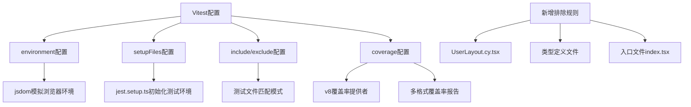
```mermaid
graph TD
A[Vitest配置] --> B[environment配置]
A --> C[setupFiles配置]
A --> D[include/exclude配置]
A --> E[coverage配置]
B --> F[jsdom模拟浏览器环境]
C --> G[jest.setup.ts初始化测试环境]
D --> H[测试文件匹配模式]
E --> I[v8覆盖率提供者]
E --> J[多格式覆盖率报告]
K[新增排除规则] --> L[UserLayout.cy.tsx]
K --> M[类型定义文件]
K --> N[入口文件index.tsx]
```

**图示来源**
- [vitest.config.ts:1-35](file://vitest.config.ts#L1-L35)

**测试环境配置**
- [vitest.config.ts:1-35](file://vitest.config.ts#L1-L35)
- [jest.setup.ts:1-126](file://jest.setup.ts#L1-L126)

### Vitest配置详解

**Vitest配置特点**：
- 使用 jsdom 作为测试环境，模拟浏览器 DOM 环境
- 通过 setupFiles 引入 jest.setup.ts 进行全局测试环境初始化
- 支持 TypeScript 和 JSX 文件的自动检测和编译
- 配置了 v8 覆盖率提供者，支持多种覆盖率报告格式
- 通过别名映射简化模块导入路径

**测试文件组织**：
- 自动包含 src 目录下所有 .test.ts、.test.tsx、.spec.ts、.spec.tsx 文件
- 排除 Cypress 端到端测试目录和用户布局的 Cypress 测试文件
- 支持模块别名 @ 指向 src 目录

**配置优化**：
- 移除了 Jest 特定的 transform 配置，因为 Vitest 内置支持 TypeScript
- 简化了 moduleNameMapper 配置，直接使用 Vitest 的别名系统
- 保留了必要的 setupFiles 配置以兼容现有的测试初始化代码
- 新增了对 Cypress 测试文件的排除规则

## 组件测试

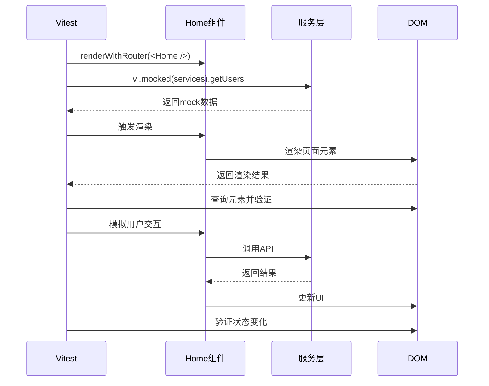
```mermaid
sequenceDiagram
participant 测试框架 as Vitest
participant Home组件 as Home组件
participant 服务层 as 服务层
participant DOM as DOM
测试框架->>Home组件 : renderWithRouter(<Home />)
测试框架->>服务层 : vi.mocked(services).getUsers
服务层-->>测试框架 : 返回mock数据
测试框架->>Home组件 : 触发渲染
Home组件->>DOM : 渲染页面元素
DOM-->>测试框架 : 返回渲染结果
测试框架->>DOM : 查询元素并验证
测试框架->>Home组件 : 模拟用户交互
Home组件->>服务层 : 调用API
服务层-->>Home组件 : 返回结果
Home组件->>DOM : 更新UI
测试框架->>DOM : 验证状态变化
```

**图示来源**
- [src/__tests__/components/Home.test.tsx:1-114](file://src/__tests__/components/Home.test.tsx#L1-L114)
- [src/pages/home.tsx:1-295](file://src/pages/home.tsx#L1-L295)

### Home组件测试实现

**Vitest测试语法更新**：
- 使用 vi.mocked() 替代 jest.mocked() 进行类型安全的模块模拟
- 使用 vi.fn() 替代 jest.fn() 创建 mock 函数
- 使用 vi.clearAllMocks() 替代 jest.clearAllMocks() 清理 mock 状态
- 使用 vi.mock() 替代 jest.mock() 进行模块模拟

**测试实现**：
- [src/__tests__/components/Home.test.tsx:1-114](file://src/__tests__/components/Home.test.tsx#L1-L114)

### 组件测试最佳实践

**Vitest特有的测试模式**：
- 使用 describe、it、expect 等原生 Vitest API
- 支持更精确的类型推断和 IDE 智能提示
- 提供更直观的测试失败信息和堆栈跟踪
- 内置的快照测试支持

**测试覆盖范围**：
- 组件渲染验证（标题、按钮、表格元素）
- 用户交互模拟（编辑、删除、新建按钮点击）
- API 调用验证（getUsers 函数调用）
- 状态变化验证（Ant Design 消息提示）

**测试优化**：
- 使用 vi.stubGlobal() 模拟全局对象，如 localStorage
- 通过 vi.mock() 进行动态模块模拟
- 使用 createMockResponse 辅助函数创建类型安全的响应对象

## 布局组件测试

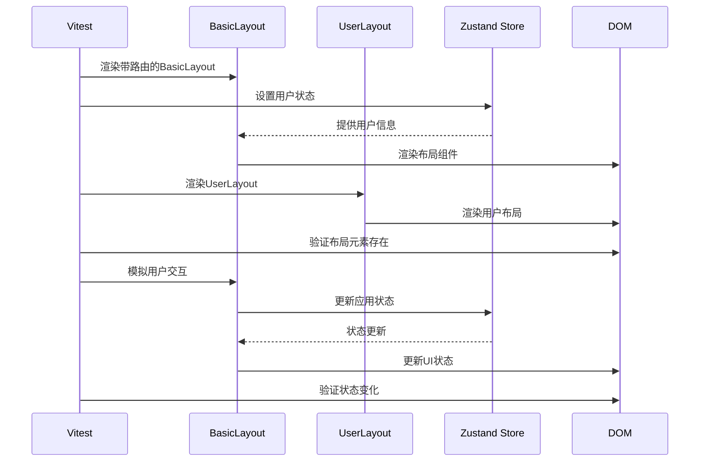
```mermaid
sequenceDiagram
participant 测试框架 as Vitest
participant BasicLayout as BasicLayout
participant UserLayout as UserLayout
participant Zustand as Zustand Store
participant DOM as DOM
测试框架->>BasicLayout : 渲染带路由的BasicLayout
测试框架->>Zustand : 设置用户状态
Zustand-->>BasicLayout : 提供用户信息
BasicLayout->>DOM : 渲染布局组件
测试框架->>UserLayout : 渲染UserLayout
UserLayout->>DOM : 渲染用户布局
测试框架->>DOM : 验证布局元素存在
测试框架->>BasicLayout : 模拟用户交互
BasicLayout->>Zustand : 更新应用状态
Zustand-->>BasicLayout : 状态更新
BasicLayout->>DOM : 更新UI状态
测试框架->>DOM : 验证状态变化
```

**图示来源**
- [src/__tests__/layout/BasicLayout.test.tsx:1-217](file://src/__tests__/layout/BasicLayout.test.tsx#L1-L217)
- [src/layout/BasicLayout.tsx:1-231](file://src/layout/BasicLayout.tsx#L1-L231)
- [src/__tests__/layout/UserLayout.test.tsx:1-70](file://src/__tests__/layout/UserLayout.test.tsx#L1-L70)
- [src/layout/UserLayout.tsx:1-55](file://src/layout/UserLayout.tsx#L1-L55)

### BasicLayout 布局测试实现

**布局组件测试特点**：
- 使用 MemoryRouter 进行路由测试
- 通过 Zustand store 设置用户状态
- 模拟 Ant Design message 组件
- 测试菜单导航和用户交互功能

**测试场景覆盖**：
- 布局标题和 Logo 渲染验证
- 用户信息显示测试
- 菜单点击和导航功能
- 侧边栏折叠状态管理
- 顶部返回顶部功能
- 用户设置和通知功能

**测试实现**：
- [src/__tests__/layout/BasicLayout.test.tsx:1-217](file://src/__tests__/layout/BasicLayout.test.tsx#L1-L217)
- [src/layout/BasicLayout.tsx:1-231](file://src/layout/BasicLayout.tsx#L1-L231)

### UserLayout 布局测试实现

**用户布局测试特点**：
- 测试用户专用布局样式
- 验证渐变背景效果
- 测试装饰性背景元素
- 验证内容居中布局

**测试场景覆盖**：
- Outlet 内容渲染验证
- 渐变背景容器测试
- 绝对定位装饰元素
- Flex 布局居中效果

**测试实现**：
- [src/__tests__/layout/UserLayout.test.tsx:1-70](file://src/__tests__/layout/UserLayout.test.tsx#L1-L70)
- [src/layout/UserLayout.tsx:1-55](file://src/layout/UserLayout.tsx#L1-L55)

### 布局测试最佳实践

**路由测试策略**：
- 使用 MemoryRouter 进行无副作用的路由测试
- 通过 Routes 和 Route 组合测试嵌套路由
- 验证布局组件的 Outlet 渲染

**状态管理测试**：
- 通过 Zustand store 设置初始状态
- 测试状态变化对 UI 的影响
- 验证用户交互触发的状态更新

**样式测试优化**：
- 使用 CSS 选择器验证样式类名
- 测试内联样式的应用
- 验证布局容器的结构

## 页面组件测试

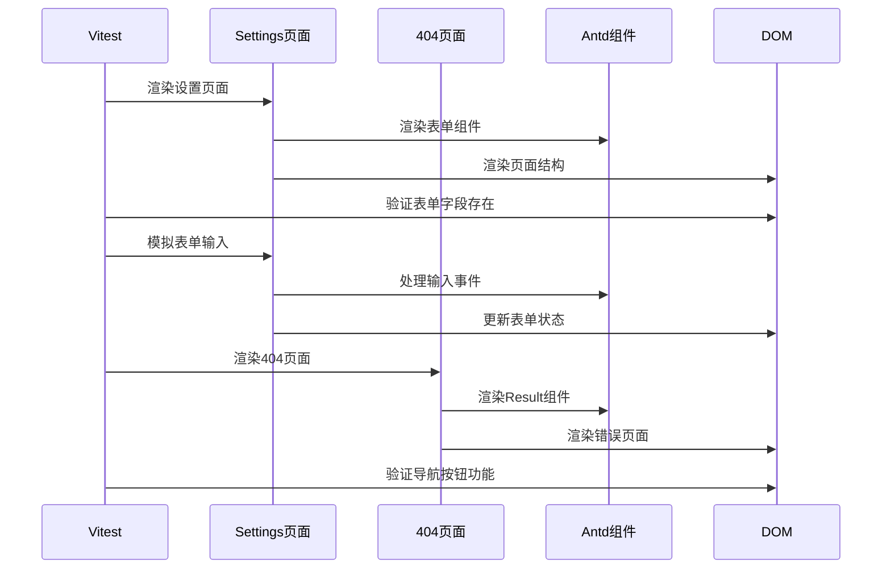
```mermaid
sequenceDiagram
participant 测试框架 as Vitest
participant Settings页面 as Settings页面
participant 404页面 as 404页面
participant Antd as Antd组件
participant DOM as DOM
测试框架->>Settings页面 : 渲染设置页面
Settings页面->>Antd : 渲染表单组件
Settings页面->>DOM : 渲染页面结构
测试框架->>DOM : 验证表单字段存在
测试框架->>Settings页面 : 模拟表单输入
Settings页面->>Antd : 处理输入事件
Settings页面->>DOM : 更新表单状态
测试框架->>404页面 : 渲染404页面
404页面->>Antd : 渲染Result组件
404页面->>DOM : 渲染错误页面
测试框架->>DOM : 验证导航按钮功能
```

**图示来源**
- [src/__tests__/pages/Settings/Settings.test.tsx:1-93](file://src/__tests__/pages/Settings/Settings.test.tsx#L1-L93)
- [src/pages/Settings/index.tsx:1-122](file://src/pages/Settings/index.tsx#L1-L122)
- [src/__tests__/pages/Exception/404.test.tsx:1-49](file://src/__tests__/pages/Exception/404.test.tsx#L1-L49)
- [src/pages/Exception/404.tsx:1-24](file://src/pages/Exception/404.tsx#L1-L24)

### Settings 设置页面测试实现

**设置页面测试特点**：
- 使用 useOptimistic 进行乐观更新测试
- 测试表单验证和错误处理
- 模拟异步 API 调用
- 验证消息提示功能

**测试场景覆盖**：
- 页面标题和副标题验证
- 表单字段渲染测试
- 输入值验证和更新
- 乐观更新状态显示
- 表单提交和重置功能

**测试实现**：
- [src/__tests__/pages/Settings/Settings.test.tsx:1-93](file://src/__tests__/pages/Settings/Settings.test.tsx#L1-L93)
- [src/pages/Settings/index.tsx:1-122](file://src/pages/Settings/index.tsx#L1-L122)

### 404 错误页面测试实现

**404 页面测试特点**：
- 测试 Ant Design Result 组件渲染
- 验证页面不存在的错误信息
- 测试导航按钮功能
- 模拟窗口位置跳转

**测试场景覆盖**：
- 404 错误标题验证
- 页面不存在提示信息
- 导航按钮存在性
- 回到首页功能测试
- Result 组件渲染验证

**测试实现**：
- [src/__tests__/pages/Exception/404.test.tsx:1-49](file://src/__tests__/pages/Exception/404.test.tsx#L1-L49)
- [src/pages/Exception/404.tsx:1-24](file://src/pages/Exception/404.tsx#L1-L24)

### 页面测试最佳实践

**表单测试策略**：
- 使用 fireEvent 进行用户交互模拟
- 测试受控和非受控组件的不同行为
- 验证表单验证规则的正确性
- 测试异步提交过程

**组件测试优化**：
- 使用 data-testid 属性进行元素选择
- 测试组件的 props 传递和渲染
- 验证组件的生命周期行为
- 测试组件间的通信机制

## 路由系统测试

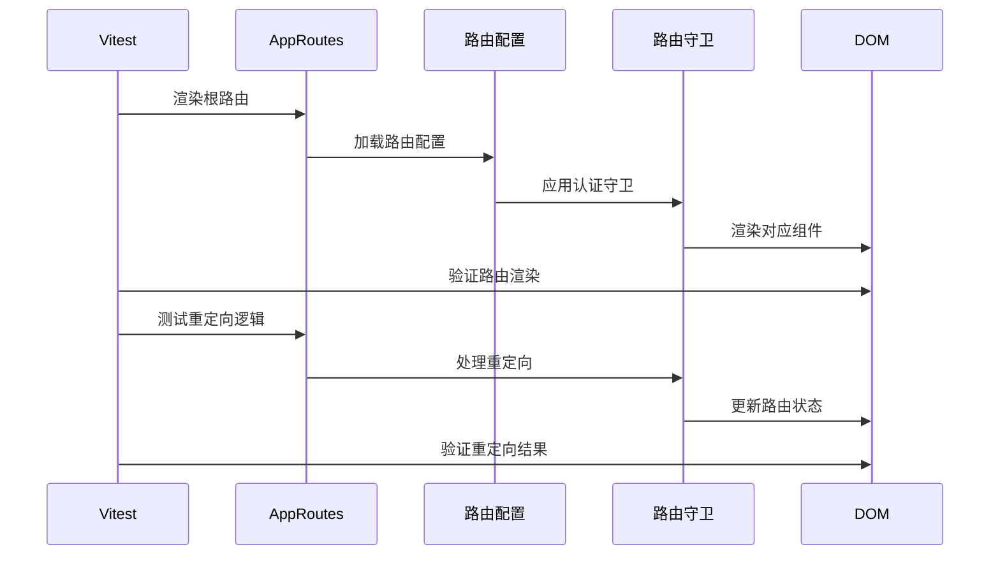
```mermaid
sequenceDiagram
participant 测试框架 as Vitest
participant AppRoutes as AppRoutes
participant 路由配置 as 路由配置
participant 路由守卫 as 路由守卫
participant DOM as DOM
测试框架->>AppRoutes : 渲染根路由
AppRoutes->>路由配置 : 加载路由配置
路由配置->>路由守卫 : 应用认证守卫
路由守卫->>DOM : 渲染对应组件
测试框架->>DOM : 验证路由渲染
测试框架->>AppRoutes : 测试重定向逻辑
AppRoutes->>路由守卫 : 处理重定向
路由守卫->>DOM : 更新路由状态
测试框架->>DOM : 验证重定向结果
```

**图示来源**
- [src/__tests__/routes/routes.test.tsx:1-49](file://src/__tests__/routes/routes.test.tsx#L1-L49)
- [src/routes/index.tsx:1-160](file://src/routes/index.tsx#L1-L160)
- [src/routes/common-router.tsx:1-55](file://src/routes/common-router.tsx#L1-L55)
- [src/routes/user-router.ts:1-27](file://src/routes/user-router.ts#L1-L27)
- [src/routes/exception-router.tsx:1-35](file://src/routes/exception-router.tsx#L1-L35)

### 路由系统测试实现

**路由测试特点**：
- 使用 MemoryRouter 进行路由测试
- 测试路由配置和嵌套路由
- 验证路由守卫和权限控制
- 测试重定向逻辑

**测试场景覆盖**：
- 根路径重定向测试
- 用户路由渲染验证
- 异常路由处理
- 通配符路由匹配
- 路由守卫功能测试

**测试实现**：
- [src/__tests__/routes/routes.test.tsx:1-49](file://src/__tests__/routes/routes.test.tsx#L1-L49)
- [src/routes/index.tsx:1-160](file://src/routes/index.tsx#L1-L160)

### 路由配置测试实现

**路由配置测试特点**：
- 测试路由配置数组结构
- 验证嵌套路由的正确性
- 测试重定向配置
- 验证认证和游客权限

**测试场景覆盖**：
- 仪表板路由配置
- 用户路由配置
- 异常路由配置
- 路由守卫参数验证

**测试实现**：
- [src/routes/common-router.tsx:1-55](file://src/routes/common-router.tsx#L1-L55)
- [src/routes/user-router.ts:1-27](file://src/routes/user-router.ts#L1-L27)
- [src/routes/exception-router.tsx:1-35](file://src/routes/exception-router.tsx#L1-L35)

### 路由测试最佳实践

**路由测试策略**：
- 使用 MemoryRouter 进行无副作用的路由测试
- 通过 initialEntries 指定初始路由
- 测试路由配置的正确性和完整性
- 验证路由守卫的逻辑正确性

**权限测试优化**：
- 测试认证和游客权限的区别
- 验证重定向逻辑的正确性
- 测试通配符路由的处理
- 验证路由配置的嵌套结构

## 服务层测试

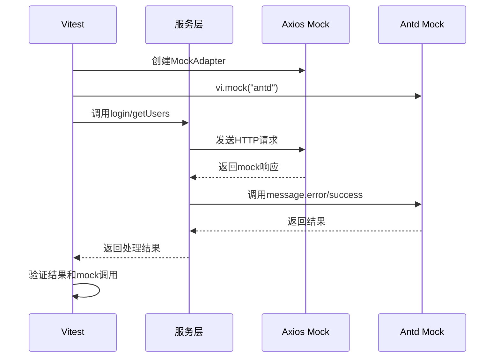
```mermaid
sequenceDiagram
participant 测试框架 as Vitest
participant 服务层 as 服务层
participant AxiosMock as Axios Mock
participant AntdMock as Antd Mock
测试框架->>AxiosMock : 创建MockAdapter
测试框架->>AntdMock : vi.mock("antd")
测试框架->>服务层 : 调用login/getUsers
服务层->>AxiosMock : 发送HTTP请求
AxiosMock-->>服务层 : 返回mock响应
服务层->>AntdMock : 调用message.error/success
AntdMock-->>服务层 : 返回结果
服务层-->>测试框架 : 返回处理结果
测试框架->>测试框架 : 验证结果和mock调用
```

**图示来源**
- [src/__tests__/services.test.tsx:1-355](file://src/__tests__/services.test.tsx#L1-L355)
- [src/services/index.ts:1-213](file://src/services/index.ts#L1-L213)

### 服务层测试实现

**Vitest服务测试特点**：
- 使用 vi.mock() 进行模块模拟，支持动态导入
- 通过 vi.fn() 创建类型安全的 mock 函数
- 支持 beforeAll、afterAll 生命周期钩子
- 提供更精确的错误处理和断言

**测试场景覆盖**：
- 登录功能测试（成功、失败、网络错误）
- 用户列表获取测试（分页、默认参数、服务器错误）
- 请求拦截器测试（Token添加）
- 响应拦截器测试（401、403、404、500等状态码处理）
- Axios 实例独立测试

**测试实现**：
- [src/__tests__/services.test.tsx:1-355](file://src/__tests__/services.test.tsx#L1-L355)
- [src/services/index.ts:1-213](file://src/services/index.ts#L1-L213)

### 服务层测试优化

**MockAdapter使用优化**：
- 在 beforeEach 中重置 mock 适配器状态
- 使用 mock.restore() 恢复原始行为
- 通过 vi.mock() 模拟 antd 的 message 组件

**拦截器测试增强**：
- 测试请求拦截器中 Token 的正确添加
- 测试响应拦截器对不同 HTTP 状态码的处理
- 验证错误处理和用户提示机制

## 状态管理测试

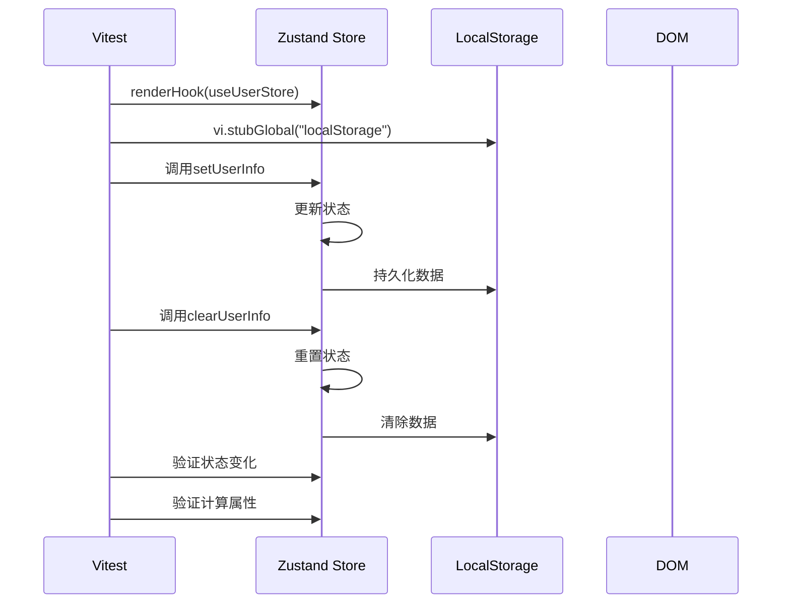
```mermaid
sequenceDiagram
participant 测试框架 as Vitest
participant ZustandStore as Zustand Store
participant LocalStorage as LocalStorage
participant DOM as DOM
测试框架->>ZustandStore : renderHook(useUserStore)
测试框架->>LocalStorage : vi.stubGlobal("localStorage")
测试框架->>ZustandStore : 调用setUserInfo
ZustandStore->>ZustandStore : 更新状态
ZustandStore->>LocalStorage : 持久化数据
测试框架->>ZustandStore : 调用clearUserInfo
ZustandStore->>ZustandStore : 重置状态
ZustandStore->>LocalStorage : 清除数据
测试框架->>ZustandStore : 验证状态变化
测试框架->>ZustandStore : 验证计算属性
```

**图示来源**
- [src/__tests__/store.test.tsx:1-189](file://src/__tests__/store.test.tsx#L1-L189)
- [src/store/index.ts:1-124](file://src/store/index.ts#L1-L124)

### 状态管理测试实现

**Vitest状态测试优势**：
- 使用 renderHook 进行 React Hooks 测试
- 通过 vi.clearAllMocks() 清理测试状态
- 支持 act 包装异步状态更新
- 提供更精确的状态断言

**测试模块覆盖**：
- 用户信息管理（设置、清除、部分更新）
- 应用状态管理（加载状态、主题切换、侧边栏折叠）
- 计算属性测试（登录状态、显示名称）
- 异步方法测试（getUserInfo 的加载状态处理）

**测试实现**：
- [src/__tests__/store.test.tsx:1-189](file://src/__tests__/store.test.tsx#L1-L189)
- [src/store/index.ts:1-124](file://src/store/index.ts#L1-L124)

### Zustand测试优化

**持久化存储测试**：
- 使用 vi.stubGlobal() 模拟 localStorage
- 测试状态持久化和恢复机制
- 验证 partialize 函数的正确性

**异步操作测试**：
- 使用 act 包装异步状态更新
- 测试 loading 状态的正确设置和清除
- 验证异步方法的 Promise 处理

## 测试工具与技术

### 模块模拟技术

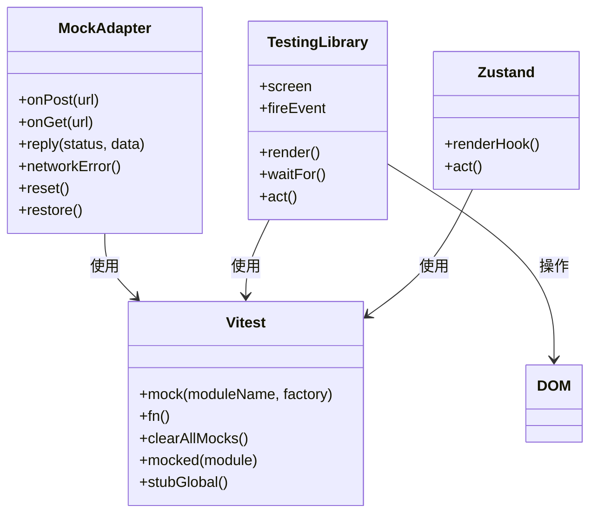
```mermaid
classDiagram
class MockAdapter {
+onPost(url)
+onGet(url)
+reply(status, data)
+networkError()
+reset()
+restore()
}
class Vitest {
+mock(moduleName, factory)
+fn()
+clearAllMocks()
+mocked(module)
+stubGlobal()
}
class TestingLibrary {
+render()
+screen
+fireEvent
+waitFor()
+act()
}
class Zustand {
+renderHook()
+act()
}
MockAdapter --> Vitest : 使用
TestingLibrary --> Vitest : 使用
Zustand --> Vitest : 使用
TestingLibrary --> DOM : 操作
```

**图示来源**
- [src/__tests__/services.test.tsx:1-355](file://src/__tests__/services.test.tsx#L1-L355)
- [src/__tests__/components/Home.test.tsx:1-114](file://src/__tests__/components/Home.test.tsx#L1-L114)
- [src/__tests__/store.test.tsx:1-189](file://src/__tests__/store.test.tsx#L1-L189)

### API模拟实现

```mermaid
flowchart TD
A[创建MockAdapter] --> B[配置请求拦截]
B --> C[定义响应规则]
C --> D{响应类型}
D --> |成功响应| E[reply(200, data)]
D --> |错误响应| F[reply(401, errorData)]
D --> |网络错误| G[networkError()]
E --> H[服务层处理成功]
F --> H[服务层处理错误]
G --> H[服务层处理异常]
H --> I[验证结果]
```

**图示来源**
- [src/services/index.ts:1-213](file://src/services/index.ts#L1-L213)
- [src/__tests__/services.test.tsx:1-355](file://src/__tests__/services.test.tsx#L1-L355)

**模块模拟更新**：
- 使用 vi.mock() 替代 jest.mock() 进行模块模拟
- 使用 vi.fn() 替代 jest.fn() 创建 mock 函数
- 使用 vi.mocked() 进行类型安全的模块访问
- 使用 vi.stubGlobal() 模拟全局对象

**测试工具链**：
- Vitest 作为核心测试框架
- React Testing Library 用于组件测试
- Axios Mock Adapter 用于 API 模拟
- Ant Design 测试工具用于 UI 组件测试
- Zustand Test Utilities 用于状态管理测试

### 测试工具链优化

**全局环境配置**：
- 使用 ResizeObserver polyfill 解决测试中的布局问题
- 配置 TextEncoder/TextDecoder 全局对象
- 模拟 window.matchMedia 和 getComputedStyle
- 静音特定的控制台输出，减少测试噪音

**测试辅助工具**：
- createMockResponse 函数提供类型安全的响应对象
- renderWithRouter 包装器简化路由测试
- 统一的测试初始化流程

## 最佳实践

### 测试覆盖率要求

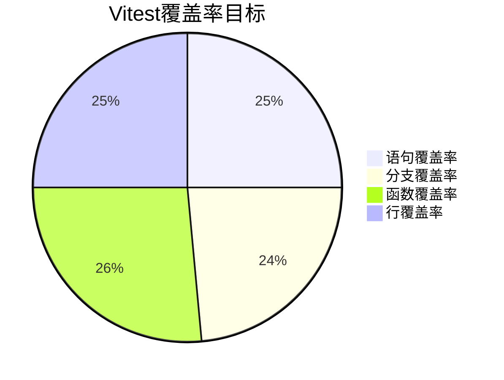
```mermaid
pie
title Vitest覆盖率目标
"语句覆盖率" : 85
"分支覆盖率" : 80
"函数覆盖率" : 90
"行覆盖率" : 85
```

**覆盖率配置**：
- v8 提供者，性能优于传统覆盖率工具
- 自动排除 mock 文件、测试文件、类型定义文件
- 仅统计源代码文件的覆盖率

**覆盖率优化**：
- 使用 .nycrc 配置 TypeScript 覆盖率
- 支持多种报告格式（text、lcov、clover）
- 与 Vitest 的 v8 提供者配合使用

### 异步测试处理

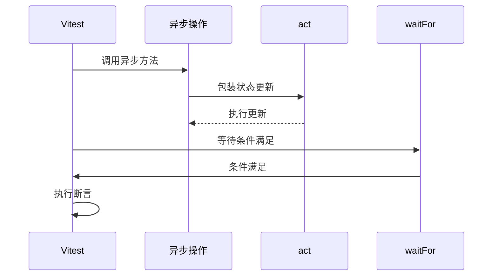
```mermaid
sequenceDiagram
participant 测试 as Vitest
participant 异步操作 as 异步操作
participant act as act
participant waitFor as waitFor
测试->>异步操作 : 调用异步方法
异步操作->>act : 包装状态更新
act-->>异步操作 : 执行更新
测试->>waitFor : 等待条件满足
waitFor->>测试 : 条件满足
测试->>测试 : 执行断言
```

**异步测试实现**：
- 使用 act 包装状态更新操作
- 使用 waitFor 等待异步操作完成
- 支持 Promise 和 async/await 语法
- 提供超时控制机制

**异步测试优化**：
- 在 store 测试中正确处理异步状态更新
- 使用 Promise.resolve() 模拟异步延迟
- 验证 loading 状态的正确设置

### 快照测试使用

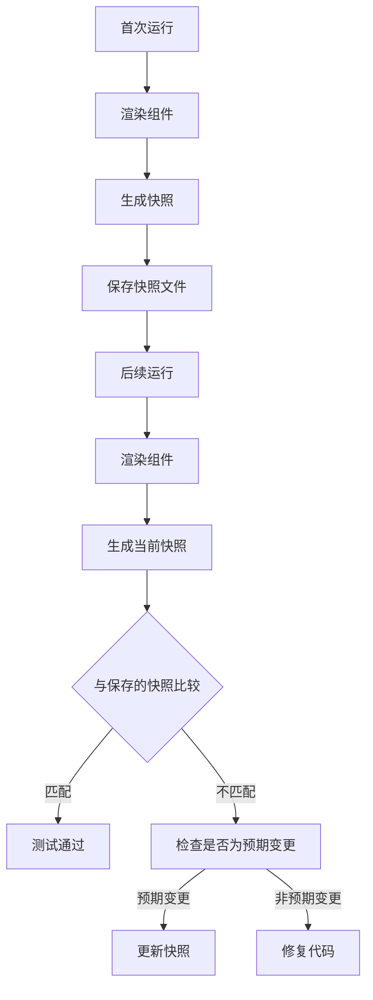
```mermaid
flowchart TD
A[首次运行] --> B[渲染组件]
B --> C[生成快照]
C --> D[保存快照文件]
D --> E[后续运行]
E --> F[渲染组件]
F --> G[生成当前快照]
G --> H{与保存的快照比较}
H --> |匹配| I[测试通过]
H --> |不匹配| J[检查是否为预期变更]
J --> |预期变更| K[更新快照]
J --> |非预期变更| L[修复代码]
```

**快照测试配置**：
- Vitest 内置快照测试支持
- 自动处理 React 组件快照
- 支持增量更新和批量更新
- 与 TypeScript 完美集成

**最佳实践**：
- 使用 vi 作为统一的测试工具入口
- 合理使用 beforeEach、beforeAll 等生命周期钩子
- 优先使用类型安全的 vi.mocked() 访问模拟模块
- 利用 Vitest 的智能提示和类型推断提高开发效率

### 测试文件组织优化

**测试文件结构**：
- 按功能模块组织测试文件
- 统一的测试命名约定
- 清晰的 describe/it 层级结构
- 适当的测试数据准备

**测试代码优化**：
- 使用辅助函数减少重复代码
- 合理的测试数据隔离
- 明确的断言信息
- 适当的测试超时设置

## 测试运行与CI集成

### 测试运行命令

```bash
# 运行所有测试（推荐）
npm test

# 运行测试并生成覆盖率报告
npm test -- --coverage

# 监听模式运行测试
npm test -- --watch

# 运行特定测试文件
npm test BasicLayout.test.tsx

# 运行特定测试用例
npm test -- -t "应该正确渲染BasicLayout"

# 生成覆盖率报告
npm test -- --coverage --reporter=html
```

**更新** 测试命令已从 jest 改为 vitest，提供更快的测试执行速度。

### 覆盖率报告生成

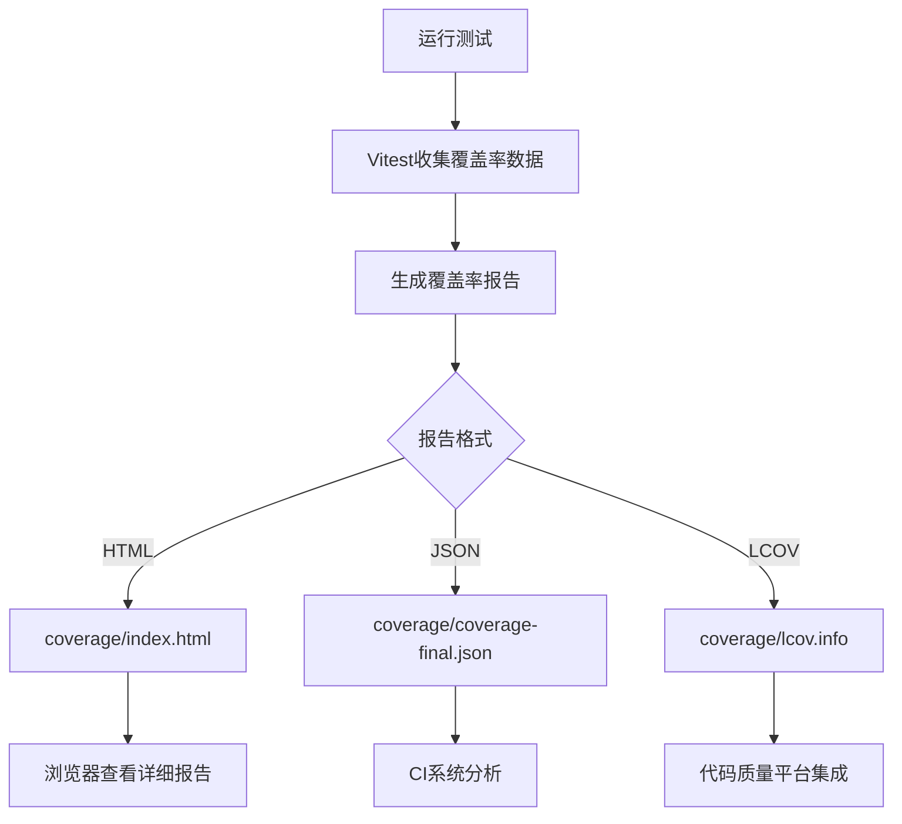
```mermaid
flowchart TD
A[运行测试] --> B[Vitest收集覆盖率数据]
B --> C[生成覆盖率报告]
C --> D{报告格式}
D --> |HTML| E[coverage/index.html]
D --> |JSON| F[coverage/coverage-final.json]
D --> |LCOV| G[coverage/lcov.info]
E --> H[浏览器查看详细报告]
F --> I[CI系统分析]
G --> J[代码质量平台集成]
```

**覆盖率配置**：
- v8 提供者，性能优于传统覆盖率工具
- 支持多种报告格式，便于不同工具集成
- 自动排除测试文件和类型定义文件

**覆盖率优化**：
- 使用 .nycrc 配置 TypeScript 覆盖率
- 支持多种报告格式（text、lcov、clover）
- 与 Vitest 的 v8 提供者配合使用

### CI集成策略

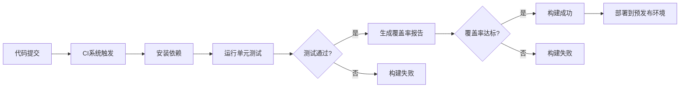
```mermaid
flowchart LR
A[代码提交] --> B[CI系统触发]
B --> C[安装依赖]
C --> D[运行单元测试]
D --> E{测试通过?}
E --> |是| F[生成覆盖率报告]
E --> |否| G[构建失败]
F --> H{覆盖率达标?}
H --> |是| I[构建成功]
H --> |否| J[构建失败]
I --> K[部署到预发布环境]
```

**CI集成配置**：
- 使用 Vitest 的快速测试执行能力
- 支持并行测试执行
- 提供详细的测试报告和覆盖率信息
- 与主流 CI/CD 平台无缝集成

**测试运行**：
- [package.json:5-12](file://package.json#L5-L12)
- [vitest.config.ts:1-35](file://vitest.config.ts#L1-L35)

### 测试配置迁移

**从 Jest 到 Vitest 的迁移**：
- 移除了 Jest 特定的配置项
- 保留了必要的 setupFiles 配置
- 更新了测试文件的导入语句
- 优化了模块别名配置

**配置文件对比**：
- jest.config.ts: 包含 Jest 特定配置
- vitest.config.ts: 专为 Vitest 优化的配置
- jest.setup.ts: 通用的测试环境初始化

**新增测试覆盖范围**：
- 布局组件测试：BasicLayout 和 UserLayout
- 页面组件测试：Settings 和 404 页面
- 路由系统测试：AppRoutes 路由配置
- 完善的 Vitest 配置优化

**总结**：
项目已完成从 Jest 到 Vitest 的完整迁移，新配置提供了更快的测试执行速度、更好的 TypeScript 支持和更丰富的测试工具集。新增的布局组件、页面组件和路由系统的测试覆盖，进一步完善了测试体系。所有测试用例都已更新为使用 Vitest API，确保了测试代码的一致性和可维护性。同时，通过优化的测试环境配置和工具链，进一步提升了测试的可靠性和开发体验。