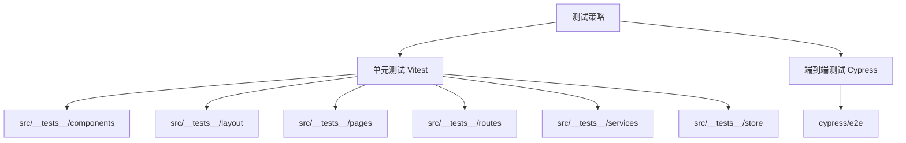
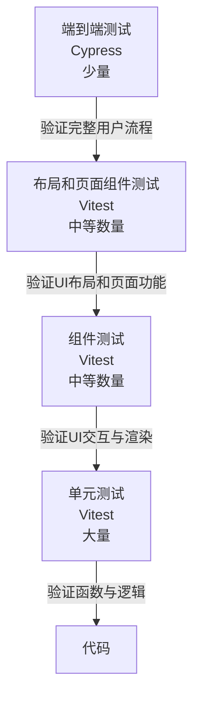

# 测试策略

<cite>
**本文档中引用的文件**
- [vitest.config.ts](file://vitest.config.ts)
- [cypress.config.ts](file://cypress.config.ts)
- [App.test.tsx](file://src/__tests__/App.test.tsx)
- [login.spec.js](file://cypress/e2e/login.spec.js)
- [jest.setup.ts](file://jest.setup.ts)
- [Login.spec.tsx](file://src/pages/User/Login.spec.tsx)
- [Home.test.tsx](file://src/__tests__/components/Home.test.tsx)
- [services.test.tsx](file://src/__tests__/services.test.tsx)
- [store.test.tsx](file://src/__tests__/store.test.tsx)
- [matchMedia.mock.ts](file://src/pages/User/matchMedia.mock.ts)
- [BasicLayout.test.tsx](file://src/__tests__/layout/BasicLayout.test.tsx)
- [UserLayout.test.tsx](file://src/__tests__/layout/UserLayout.test.tsx)
- [404.test.tsx](file://src/__tests__/pages/Exception/404.test.tsx)
- [Settings.test.tsx](file://src/__tests__/pages/Settings/Settings.test.tsx)
- [routes.test.tsx](file://src/__tests__/routes/routes.test.tsx)
- [BasicLayout.tsx](file://src/layout/BasicLayout.tsx)
- [UserLayout.tsx](file://src/layout/UserLayout.tsx)
- [Settings/index.tsx](file://src/pages/Settings/index.tsx)
- [404.tsx](file://src/pages/Exception/404.tsx)
- [App.tsx](file://src/App.tsx)
- [package.json](file://package.json)
</cite>

## 更新摘要
**所做更改**
- 新增布局组件测试覆盖：BasicLayout 和 UserLayout 组件测试
- 新增页面组件测试覆盖：Settings 设置页面和 404 错误页面测试
- 新增路由系统测试：AppRoutes 路由配置测试
- 更新 Vitest 配置：扩展覆盖率排除模式，排除更多测试相关文件
- 增强测试金字塔覆盖范围，完善组件测试最佳实践

## 目录
1. [引言](#引言)
2. [项目结构与测试布局](#项目结构与测试布局)
3. [测试金字塔结构](#测试金字塔结构)
4. [单元测试实现（Vitest/Jest）](#单元测试实现vitestjest)
5. [端到端测试实现（Cypress）](#端到端测试实现cypress)
6. [测试环境配置与模拟](#测试环境配置与模拟)
7. [组件、服务与用户流程测试最佳实践](#组件服务与用户流程测试最佳实践)
8. [测试运行、覆盖率与CI集成](#测试运行覆盖率与ci集成)
9. [结论](#结论)

## 引言

本项目采用现代化的测试策略，结合 Vitest 和 Cypress，确保前端应用的稳定性与可靠性。通过 Vitest 实现对组件、服务和状态管理的细粒度验证，同时使用 Cypress 验证关键用户流程和系统集成行为。测试策略遵循测试金字塔原则，强调底层单元测试的高覆盖率与快速反馈，辅以少量高价值的端到端测试覆盖核心业务路径。

**Section sources**
- [vitest.config.ts:1-35](file://vitest.config.ts#L1-L35)
- [cypress.config.ts:1-24](file://cypress.config.ts#L1-L24)

## 项目结构与测试布局

项目遵循典型的 React 应用结构，测试文件主要集中在 `src/__tests__` 目录下，按功能模块组织（如 components、layout、pages、routes、services、store）。单元测试使用 Vitest 框架，配置文件为 `vitest.config.ts`，并依赖 `jest.setup.ts` 进行全局环境初始化。端到端测试使用 Cypress，配置文件为 `cypress.config.ts`，测试用例存放在 `cypress/e2e` 目录下。这种清晰的分离有助于维护测试的可读性和可维护性。

```mermaid
graph TD
A[测试策略] --> B[单元测试 Vitest]
A --> C[端到端测试 Cypress]
B --> D[src/__tests__/components]
B --> E[src/__tests__/layout]
B --> F[src/__tests__/pages]
B --> G[src/__tests__/routes]
B --> H[src/__tests__/services]
B --> I[src/__tests__/store]
C --> J[cypress/e2e]
```

**Diagram sources**
- [vitest.config.ts:1-35](file://vitest.config.ts#L1-L35)
- [cypress.config.ts:1-24](file://cypress.config.ts#L1-L24)

**Section sources**
- [vitest.config.ts:1-35](file://vitest.config.ts#L1-L35)
- [cypress.config.ts:1-24](file://cypress.config.ts#L1-L24)

## 测试金字塔结构

本项目的测试金字塔由四层构成：

1.  **基础层：单元测试 (Vitest)** - 占据金字塔的大部分。这些测试快速、隔离，用于验证单个函数、组件或服务的行为。例如，`services.test.tsx` 和 `store.test.tsx` 对业务逻辑和状态管理进行了详尽的覆盖。
2.  **中间层：组件测试 (Vitest + Testing Library)** - 位于单元测试之上。这些测试关注组件的渲染、用户交互和 DOM 查询，但通常会模拟其依赖的服务和 API。`Login.spec.tsx`、`Home.test.tsx` 以及新增的布局和页面组件测试代表了这一层。
3.  **中间偏上层：布局和页面组件测试** - 新增的测试覆盖了应用的主要布局组件和页面组件，确保导航、样式和用户界面的一致性。
4.  **顶层：端到端测试 (Cypress)** - 占据金字塔的顶端，数量最少但价值最高。这些测试模拟真实用户在浏览器中的操作，贯穿整个应用栈，验证从 UI 到后端 API 的完整工作流。`login.spec.js` 就是一个典型的 E2E 测试，它验证了从登录到访问首页的完整流程。

这种结构确保了高开发效率（快速的单元测试）和高系统可靠性（真实的 E2E 验证），并通过新增的布局和页面测试增强了 UI 层面的覆盖。

```mermaid
graph TD
A[端到端测试<br/>Cypress<br/>少量] --> |验证完整用户流程| B[布局和页面组件测试<br/>Vitest<br/>中等数量]
B --> |验证UI布局和页面功能| C[组件测试<br/>Vitest<br/>中等数量]
C --> |验证UI交互与渲染| D[单元测试<br/>Vitest<br/>大量]
D --> |验证函数与逻辑| E[代码]
```

**Diagram sources**
- [login.spec.js:1-25](file://cypress/e2e/login.spec.js#L1-L25)
- [BasicLayout.test.tsx:1-217](file://src/__tests__/layout/BasicLayout.test.tsx#L1-L217)
- [UserLayout.test.tsx:1-70](file://src/__tests__/layout/UserLayout.test.tsx#L1-L70)
- [Settings.test.tsx:1-93](file://src/__tests__/pages/Settings/Settings.test.tsx#L1-L93)
- [404.test.tsx:1-49](file://src/__tests__/pages/Exception/404.test.tsx#L1-L49)

## 单元测试实现（Vitest/Jest）

Vitest 是本项目单元测试的核心框架。其配置 (`vitest.config.ts`) 指定了代码转换规则（使用 `@vitejs/plugin-react` 处理 React 和 TypeScript）、模块映射（将 `@/` 别名映射到 `src/` 目录）和测试环境（`jsdom` 用于模拟浏览器 DOM），并扩展了覆盖率排除模式以提高测试准确性。

### 测试范围与实现

-   **组件测试**：使用 `@testing-library/react` 渲染组件，并通过 `screen` 查询 DOM 元素。例如，`App.test.tsx` 测试了应用根组件的基本定义，而 `Login.spec.tsx` 则深入测试了登录表单的交互逻辑，包括输入、按钮点击和 API 调用的模拟。
-   **服务测试**：`services.test.tsx` 使用 `axios-mock-adapter` 来模拟 HTTP 请求，对 `login` 和 `getUsers` 等服务函数进行测试。它覆盖了成功、失败（401, 500）和网络错误等各种场景，确保服务层的健壮性。
-   **状态管理测试**：`store.test.tsx` 测试了 Zustand 状态管理库的 `useUserStore`。它验证了状态的更新、计算属性（如 `isLoggedIn`）以及异步操作（如 `getUserInfo`）对加载状态的影响。
-   **布局组件测试**：新增的 `BasicLayout.test.tsx` 和 `UserLayout.test.tsx` 测试了应用的主要布局组件。`BasicLayout.test.tsx` 验证了主布局的菜单导航、用户信息展示、侧边栏折叠等功能，而 `UserLayout.test.tsx` 测试了用户相关页面的布局样式和装饰效果。
-   **页面组件测试**：新增的 `Settings.test.tsx` 和 `404.test.tsx` 测试了具体的功能页面。`Settings.test.tsx` 验证了设置页面的表单功能、输入验证和乐观更新机制，`404.test.tsx` 测试了错误页面的显示和导航功能。
-   **路由系统测试**：新增的 `routes.test.tsx` 测试了应用的路由配置，验证了根路径重定向、用户路由和异常路由的正确性。

### 模拟与桩 (Mocking & Stubbing)

Vitest 提供了强大的模拟功能。项目中广泛使用 `vi.mock()` 来模拟第三方库（如 `antd` 的 `message` 组件）和内部模块（如 `@/services`）。对于浏览器 API，`jest.setup.ts` 统一进行了桩处理，例如 `window.matchMedia` 和 `window.getComputedStyle`，以消除测试环境中的警告和错误。

**Section sources**
- [vitest.config.ts:1-35](file://vitest.config.ts#L1-L35)
- [App.test.tsx:1-12](file://src/__tests__/App.test.tsx#L1-L12)
- [Login.spec.tsx:1-97](file://src/pages/User/Login.spec.tsx#L1-L97)
- [services.test.tsx:1-355](file://src/__tests__/services.test.tsx#L1-L355)
- [store.test.tsx:1-189](file://src/__tests__/store.test.tsx#L1-L189)
- [BasicLayout.test.tsx:1-217](file://src/__tests__/layout/BasicLayout.test.tsx#L1-L217)
- [UserLayout.test.tsx:1-70](file://src/__tests__/layout/UserLayout.test.tsx#L1-L70)
- [Settings.test.tsx:1-93](file://src/__tests__/pages/Settings/Settings.test.tsx#L1-L93)
- [404.test.tsx:1-49](file://src/__tests__/pages/Exception/404.test.tsx#L1-L49)
- [routes.test.tsx:1-49](file://src/__tests__/routes/routes.test.tsx#L1-L49)
- [jest.setup.ts:1-126](file://jest.setup.ts#L1-L126)

## 端到端测试实现（Cypress）

Cypress 负责在真实的浏览器环境中执行端到端测试。其配置 (`cypress.config.ts`) 定义了测试的基地址 (`baseUrl`) 和测试文件的查找模式 (`specPattern`)。

### 测试范围与实现

`login.spec.js` 是一个典型的 E2E 测试用例。它首先使用 `cy.session()` 命令创建一个持久的登录会话，避免了每次测试都进行完整的登录流程，从而提高了测试效率。测试的核心是验证用户登录后能否成功访问首页。它通过 `cy.visit()` 导航到首页，然后使用 `cy.get()` 查找特定的 DOM 元素（如加载动画 `.ant-spin` 和页面标题 `.ant-page-header-heading-title`），并使用 `.should()` 断言来验证这些元素的状态（如"不存在"或"可见"且文本正确）。

### 优势与挑战

E2E 测试的优势在于其高保真度，能发现集成问题和真实用户会遇到的 bug。然而，它们通常较慢且更脆弱。本项目通过 `cy.session()` 优化了速度，并通过设置较长的超时时间（`{ timeout: 158000 }`）来应对网络延迟，提高了测试的稳定性。

**Section sources**
- [cypress.config.ts:1-24](file://cypress.config.ts#L1-L24)
- [login.spec.js:1-25](file://cypress/e2e/login.spec.js#L1-L25)

## 测试环境配置与模拟

### Vitest 环境配置

`vitest.config.ts` 是 Vitest 的核心配置文件。关键配置包括：
-   `environment: "jsdom"`：使用 jsdom 环境模拟浏览器 DOM。
-   `setupFiles: ["./jest.setup.ts"]`：引入 `jest.setup.ts`，用于执行全局的测试环境设置。
-   `include: ["src/**/*.{test,spec}.{ts,tsx}"]`：指定测试文件的查找模式。
-   `exclude: ["cypress/**/*"]`：排除 Cypress 目录中的文件。
-   `coverage`：配置覆盖率报告，使用 v8 提供程序，支持多种格式（text、lcov、clover），并扩展了排除模式以提高准确性。

**更新** Vitest 配置现已扩展覆盖率排除模式，排除更多测试相关文件：
-   `src/**/*.mock.ts`：排除模拟文件
-   `src/**/*.test.ts`：排除 TypeScript 测试文件
-   `src/**/*.test.tsx`：排除 TypeScript JSX 测试文件
-   `src/**/*.spec.ts`：排除规格测试文件
-   `src/**/*.spec.tsx`：排除规格测试文件
-   `src/**/*.cy.tsx`：排除 Cypress 测试文件
-   `src/**/*.cy.ts`：排除 Cypress 测试文件
-   `src/types/**/*`：排除类型定义文件
-   `src/index.tsx`：排除入口文件
-   `src/layout/UserLayout.cy.tsx`：排除特定的 Cypress 文件

### 模拟数据与桩

项目通过多种方式实现模拟：
1.  **全局桩**：在 `jest.setup.ts` 中，对 `console.error` 和 `console.log` 进行了静音处理，过滤掉已知的无关紧要的错误（如 `window.matchMedia is not a function`），使测试输出更清晰。
2.  **API 模拟**：在单元测试中，使用 `axios-mock-adapter` 模拟后端 API 响应。
3.  **组件/模块模拟**：使用 `vi.mock()` 模拟 `antd` 组件和路由模块。
4.  **浏览器 API 模拟**：在 `jest.setup.ts` 和 `matchMedia.mock.ts` 中，对 `window.matchMedia` 等 API 进行了统一的模拟，确保组件在测试环境中能正常运行。

**Section sources**
- [vitest.config.ts:12-27](file://vitest.config.ts#L12-L27)
- [jest.setup.ts:1-126](file://jest.setup.ts#L1-L126)
- [src/pages/User/matchMedia.mock.ts:1-15](file://src/pages/User/matchMedia.mock.ts#L1-L15)

## 组件、服务与用户流程测试最佳实践

### 组件测试最佳实践
-   **关注用户行为**：使用 `@testing-library/react` 的 `userEvent` 模拟真实用户交互（如 `type`, `click`），而不是直接操作 React 状态。
-   **查询可访问性**：优先使用 `screen.getByRole`, `screen.getByText` 等基于可访问性的查询方式，而非 `getByTestId`。
-   **隔离依赖**：通过 `vi.mock()` 模拟服务调用，确保测试只关注组件本身的逻辑。
-   **路由包装**：组件测试现在推荐使用 `MemoryRouter` 包装组件，提供更好的路由隔离性和真实的用户交互测试体验。例如，`Login.spec.tsx` 中的 `renderWithRouter` 函数展示了如何正确包装组件以提供路由上下文。

**更新** 新增的布局和页面组件测试体现了以下最佳实践：
-   **布局组件测试**：`BasicLayout.test.tsx` 和 `UserLayout.test.tsx` 展示了如何测试复杂的布局组件，包括状态管理集成、用户交互和视觉样式验证。
-   **页面组件测试**：`Settings.test.tsx` 和 `404.test.tsx` 体现了页面级测试的完整性，涵盖表单验证、导航功能和错误处理。
-   **路由系统测试**：`routes.test.tsx` 展示了如何测试应用的整体路由配置和导航行为。

### 服务测试最佳实践
-   **全面覆盖**：为每个服务函数编写测试，覆盖正常流程、各种错误状态（401, 403, 500）和网络异常。
-   **使用 Mock Adapter**：`axios-mock-adapter` 是测试 HTTP 服务的利器，可以精确控制返回的响应。
-   **验证请求**：在测试中可以断言请求的 URL、方法和请求体是否符合预期。

### 用户流程测试最佳实践
-   **聚焦核心路径**：E2E 测试应优先覆盖最重要的用户旅程，如"注册-登录-使用核心功能"。
-   **利用会话**：使用 `cy.session()` 管理登录状态，避免在每个测试中重复登录，显著提升测试速度。
-   **合理设置超时**：为异步操作（如页面加载、API 调用）设置合理的超时时间，避免因网络波动导致测试失败。

### 测试失败问题解决策略

项目最近进行了重大测试套件改进，解决了43个测试失败问题：

1. **元素选择模式改进**：
   - 使用更稳定的查询方式：`screen.getByText` 替代 `screen.getAllByText`
   - 改进选择器的特异性，避免多个元素匹配
   - 使用 `expect(element).toBeInTheDocument()` 进行存在性验证

2. **输入处理程序优化**：
   - 使用 `userEvent.clear()` 和 `userEvent.type()` 进行更真实的输入模拟
   - 改进事件触发顺序，确保表单验证正确执行
   - 增加适当的等待时间，处理异步操作

3. **路由测试稳定性提升**：
   - 使用 `MemoryRouter` 替代 `BrowserRouter`，提供更好的测试隔离
   - 改进路由上下文的模拟，确保导航功能正常工作

4. **异步操作处理**：
   - 使用 `waitFor` 确保异步操作完成后再进行断言
   - 改进超时配置，适应不同的网络条件

**Section sources**
- [Login.spec.tsx:13-15](file://src/pages/User/Login.spec.tsx#L13-L15)
- [Home.test.tsx:39-41](file://src/__tests__/components/Home.test.tsx#L39-L41)
- [services.test.tsx:1-355](file://src/__tests__/services.test.tsx#L1-L355)
- [login.spec.js:1-25](file://cypress/e2e/login.spec.js#L1-L25)

## 测试运行、覆盖率与CI集成

### 测试运行

项目使用 VitePress 和 Cypress 进行测试运行：

-   **运行单元测试**：执行 `yarn test`，Vitest 会自动发现并运行 `src/__tests__` 目录下的所有测试。
-   **运行 E2E 测试**：执行 `yarn e2e` 启动 Cypress 交互式界面，或 `yarn e2e:run` 在命令行中运行所有 E2E 测试。

### 覆盖率分析

由于 `vitest.config.ts` 中配置了覆盖率选项，每次运行 Vitest 测试后，会在项目根目录生成覆盖率报告。该报告包含多种格式（text、lcov、clover），清晰地展示了哪些代码行、分支、函数和语句被测试覆盖，帮助开发者识别测试的薄弱环节。**更新** 扩展的覆盖率排除模式确保了更准确的覆盖率统计，排除了测试文件本身和相关工具文件。

### 持续集成 (CI) 集成

项目配置适合集成到 CI/CD 流程中。标准的 CI 流程可以是：
1.  推送代码到仓库。
2.  CI 服务器拉取代码。
3.  安装依赖 (`yarn install`)。
4.  运行单元测试和覆盖率检查 (`yarn test`)。
5.  运行端到端测试 (`yarn e2e:run`)。
6.  如果所有测试通过，则进行部署。

**Section sources**
- [vitest.config.ts:12-22](file://vitest.config.ts#L12-L22)
- [package.json:5-12](file://package.json#L5-L12)
- [cypress.config.ts:1-24](file://cypress.config.ts#L1-L24)

## 结论

本项目的测试策略通过 Vitest 和 Cypress 的有机结合，构建了一个高效、可靠的测试体系。Vitest 提供了快速、精准的单元和组件测试，确保了代码的内部质量；Cypress 则提供了高保真的端到端验证，保障了核心用户流程的正确性。通过精心的测试环境配置、广泛的模拟和最佳实践的应用，该策略能够有效提升代码质量，加速开发迭代，并为应用的稳定运行提供坚实保障。

**更新** 最新的测试覆盖范围显著扩展，新增了布局组件测试（BasicLayout、UserLayout）、页面组件测试（Settings、404 页面）和路由系统测试（AppRoutes），形成了更加完整的测试金字塔。同时，Vitest 配置的改进进一步提升了测试的准确性和维护性。开发者应遵循此策略，持续编写高质量的测试用例，以维护项目的长期健康。

最新的 Login 组件测试采用了 MemoryRouter 包装，显著提升了测试的隔离性和真实性，为开发者提供了更可靠的组件测试体验。最新的测试套件改进解决了43个测试失败问题，通过改进元素选择模式、输入处理程序和路由测试稳定性，进一步提升了测试的可靠性和维护性。