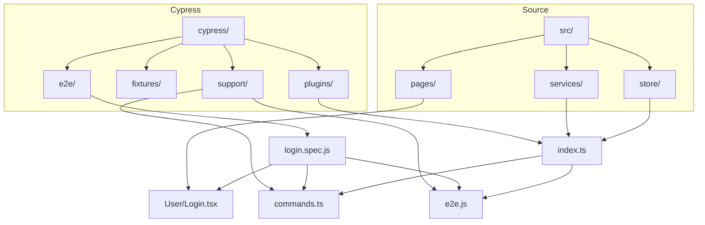
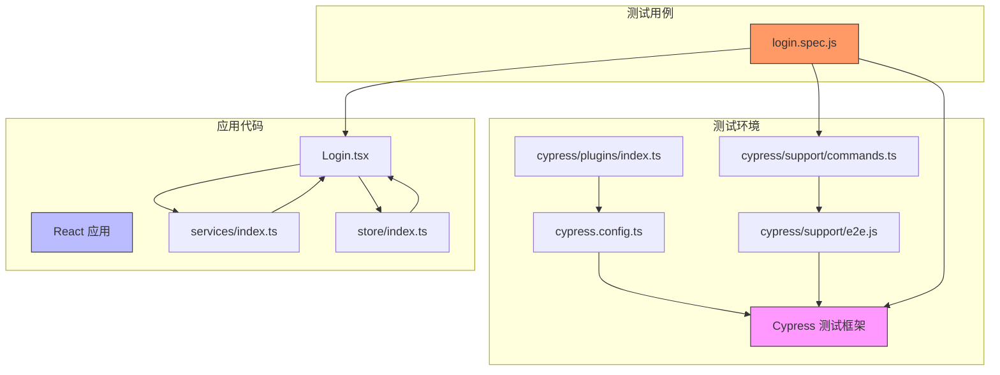
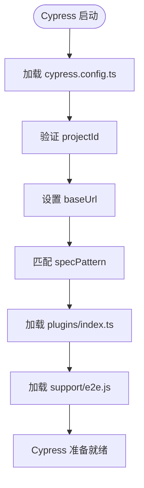
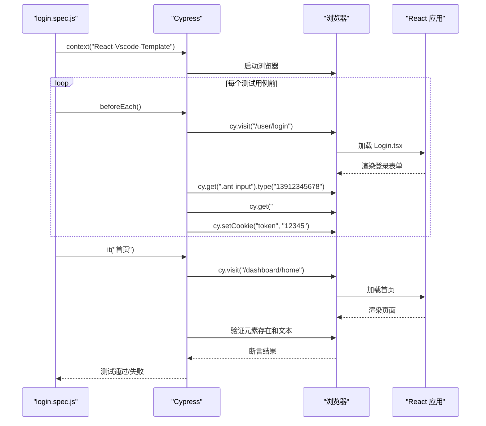
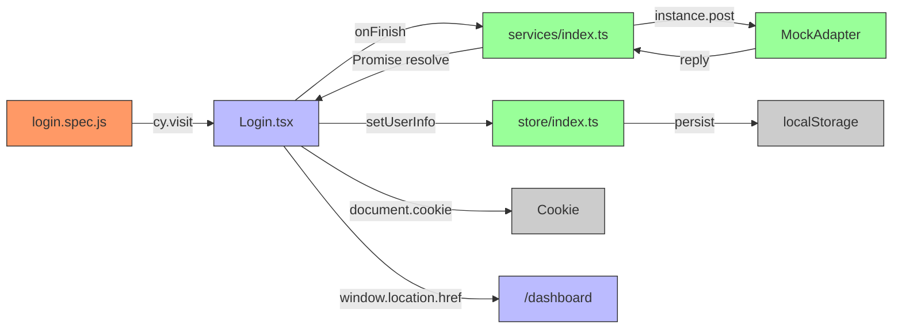
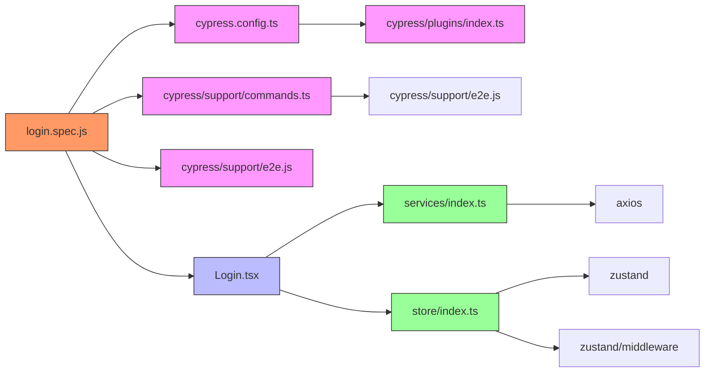

# 端到端测试

<cite>
**Referenced Files in This Document**   
- [cypress.config.ts](file://cypress.config.ts)
- [login.spec.js](file://cypress/e2e/login.spec.js)
- [Login.tsx](file://src/pages/User/Login.tsx)
- [index.ts](file://src/services/index.ts)
- [index.ts](file://src/store/index.ts)
- [commands.ts](file://cypress/support/commands.ts)
- [e2e.js](file://cypress/support/e2e.js)
- [index.ts](file://cypress/plugins/index.ts)
</cite>

## 目录
1. [简介](#简介)
2. [项目结构](#项目结构)
3. [核心组件](#核心组件)
4. [架构概述](#架构概述)
5. [详细组件分析](#详细组件分析)
6. [依赖分析](#依赖分析)
7. [性能考虑](#性能考虑)
8. [故障排除指南](#故障排除指南)
9. [结论](#结论)

## 简介
本文档详细介绍了在React-Vscode-Template项目中如何使用Cypress进行端到端（E2E）测试。基于`cypress.config.ts`中的配置和`login.spec.js`测试用例，文档将说明Cypress的集成与使用方法，包括测试编写、页面导航、元素选择、用户交互模拟和断言验证等关键方面。同时，文档还将探讨Cypress的配置选项、测试组织结构、会话管理（cy.session）和Cookie处理等高级特性，并提供编写可靠E2E测试的最佳实践。

## 项目结构



**Diagram sources**
- [cypress.config.ts](file://cypress.config.ts#L1-L23)
- [login.spec.js](file://cypress/e2e/login.spec.js#L1-L25)

**Section sources**
- [cypress.config.ts](file://cypress.config.ts#L1-L23)
- [login.spec.js](file://cypress/e2e/login.spec.js#L1-L25)

## 核心组件

本文档的核心组件包括Cypress配置文件、E2E测试用例、登录页面组件、用户服务和状态管理。`cypress.config.ts`定义了Cypress的全局配置，包括基础URL、测试文件模式和节点事件设置。`login.spec.js`是具体的E2E测试用例，验证用户登录流程和页面跳转。`Login.tsx`是被测试的登录页面组件，包含表单输入和提交逻辑。`services/index.ts`提供了登录API的实现和Mock数据，而`store/index.ts`则管理用户状态和持久化。

**Section sources**
- [cypress.config.ts](file://cypress.config.ts#L1-L23)
- [login.spec.js](file://cypress/e2e/login.spec.js#L1-L25)
- [Login.tsx](file://src/pages/User/Login.tsx#L1-L163)
- [index.ts](file://src/services/index.ts#L1-L213)
- [index.ts](file://src/store/index.ts#L1-L124)

## 架构概述



**Diagram sources**
- [cypress.config.ts](file://cypress.config.ts#L1-L23)
- [login.spec.js](file://cypress/e2e/login.spec.js#L1-L25)
- [Login.tsx](file://src/pages/User/Login.tsx#L1-L163)

## 详细组件分析

### Cypress配置分析

Cypress配置文件`cypress.config.ts`定义了测试运行时的关键参数。`projectId`用于在Cypress Dashboard中标识项目，`baseUrl`设置为`http://localhost:3123`，这是测试时应用的本地开发服务器地址。`specPattern`指定了测试文件的匹配模式，确保`cypress/e2e/`目录下所有`.js`、`.jsx`、`.ts`和`.tsx`文件都被识别为测试用例。`setupNodeEvents`函数导入了插件配置，允许在Node.js环境中扩展Cypress功能。



**Diagram sources**
- [cypress.config.ts](file://cypress.config.ts#L1-L23)
- [index.ts](file://cypress/plugins/index.ts#L1-L9)
- [e2e.js](file://cypress/support/e2e.js#L1-L21)

**Section sources**
- [cypress.config.ts](file://cypress.config.ts#L1-L23)
- [index.ts](file://cypress/plugins/index.ts#L1-L9)
- [e2e.js](file://cypress/support/e2e.js#L1-L21)

### 登录测试用例分析

`login.spec.js`测试用例使用Cypress的BDD风格语法组织测试。`context`块定义了测试套件，`beforeEach`钩子在每个测试用例执行前运行，使用`cy.session`保持登录状态以提高测试效率。测试用例通过`cy.visit`导航到登录页面，使用`cy.get`选择表单元素，`cy.type`模拟用户输入，最后通过`cy.setCookie`设置认证令牌。主测试用例`it("首页")`验证登录后跳转到首页，并检查页面标题是否正确。



**Diagram sources**
- [login.spec.js](file://cypress/e2e/login.spec.js#L1-L25)
- [Login.tsx](file://src/pages/User/Login.tsx#L1-L163)

**Section sources**
- [login.spec.js](file://cypress/e2e/login.spec.js#L1-L25)

### 登录页面组件分析

`Login.tsx`组件使用Ant Design Pro的`ProForm`构建登录表单，包含手机号和验证码输入字段。组件通过`useOptimistic`实现乐观更新，在提交时立即显示"登录中..."状态，提升用户体验。表单提交调用`login`服务函数，成功后通过`useUserStore`的`setUserInfo`方法更新Zustand状态，并设置Cookie和重定向到仪表板页面。组件还处理错误情况，显示错误消息并回滚乐观更新状态。

```mermaid
classDiagram
class Login {
+optimisticLogin : LoginParams | null
+setUserInfo : function
+onFinish(data : LoginParams) : Promise~void~
+render() : JSX.Element
}
class ProForm {
+onFinish : function
+submitter : object
}
class ProFormText {
+name : string
+placeholder : string
+rules : array
}
class ProFormCaptcha {
+name : string
+placeholder : string
+onGetCaptcha : function
}
class useOptimistic {
+addOptimisticLogin : function
}
Login --> ProForm : "使用"
ProForm --> ProFormText : "包含"
ProForm --> ProFormCaptcha : "包含"
Login --> useOptimistic : "使用"
Login --> useUserStore : "使用"
Login --> login : "调用"
note right of Login
使用乐观更新提升用户体验
表单验证通过Ant Design Pro组件
状态管理使用Zustand
end note
```

**Diagram sources**
- [Login.tsx](file://src/pages/User/Login.tsx#L1-L163)
- [index.ts](file://src/services/index.ts#L1-L213)
- [index.ts](file://src/store/index.ts#L1-L124)

**Section sources**
- [Login.tsx](file://src/pages/User/Login.tsx#L1-L163)

### 服务与状态管理分析

`services/index.ts`文件定义了`login` API函数，使用Axios与后端通信。文件还配置了Mock适配器，为`/login`和`/users`端点提供模拟响应，使E2E测试可以在无后端依赖的情况下运行。`store/index.ts`使用Zustand创建用户状态存储，通过`persist`中间件将用户信息持久化到localStorage。`useUserStore`提供`setUserInfo`和`clearUserInfo`等操作方法，`login`组件在登录成功后调用这些方法更新应用状态。



**Diagram sources**
- [login.spec.js](file://cypress/e2e/login.spec.js#L1-L25)
- [Login.tsx](file://src/pages/User/Login.tsx#L1-L163)
- [index.ts](file://src/services/index.ts#L1-L213)
- [index.ts](file://src/store/index.ts#L1-L124)

**Section sources**
- [index.ts](file://src/services/index.ts#L1-L213)
- [index.ts](file://src/store/index.ts#L1-L124)

## 依赖分析



**Diagram sources**
- [login.spec.js](file://cypress/e2e/login.spec.js#L1-L25)
- [cypress.config.ts](file://cypress.config.ts#L1-L23)
- [commands.ts](file://cypress/support/commands.ts#L1-L37)
- [e2e.js](file://cypress/support/e2e.js#L1-L21)
- [index.ts](file://cypress/plugins/index.ts#L1-L9)
- [Login.tsx](file://src/pages/User/Login.tsx#L1-L163)
- [index.ts](file://src/services/index.ts#L1-L213)
- [index.ts](file://src/store/index.ts#L1-L124)

**Section sources**
- [login.spec.js](file://cypress/e2e/login.spec.js#L1-L25)
- [cypress.config.ts](file://cypress.config.ts#L1-L23)
- [commands.ts](file://cypress/support/commands.ts#L1-L37)
- [e2e.js](file://cypress/support/e2e.js#L1-L21)
- [index.ts](file://cypress/plugins/index.ts#L1-L9)
- [Login.tsx](file://src/pages/User/Login.tsx#L1-L163)
- [index.ts](file://src/services/index.ts#L1-L213)
- [index.ts](file://src/store/index.ts#L1-L124)

## 性能考虑
在E2E测试中，性能主要体现在测试执行速度和资源消耗上。使用`cy.session`可以显著提高测试效率，避免在每个测试用例中重复执行登录流程。合理设置超时时间（如`{ timeout: 158000 }`）可以防止测试因网络延迟而失败，但过长的超时会增加整体测试时间。建议在CI/CD环境中使用更短的超时，并确保测试环境的网络稳定性。

## 故障排除指南
当E2E测试失败时，首先检查Cypress可视化调试器中的执行步骤，查看具体在哪个操作失败。常见问题包括元素选择器不匹配、页面加载超时、API响应不符合预期等。对于元素选择问题，确保选择器在DOM中唯一且稳定；对于超时问题，检查网络连接和服务器响应时间；对于API问题，验证Mock数据是否正确配置。使用`cy.log`添加调试日志，可以帮助定位问题。

## 结论
本文档全面介绍了React-Vscode-Template项目中Cypress E2E测试的集成与使用。通过分析配置文件、测试用例和相关组件，展示了如何编写可靠的端到端测试来验证用户登录流程。Cypress的`cy.session`、丰富的选择器和断言功能，结合项目中的Zustand状态管理和Axios Mock，为前端应用提供了强大的测试保障。遵循文档中的最佳实践，可以确保测试的稳定性、可维护性和高效性。