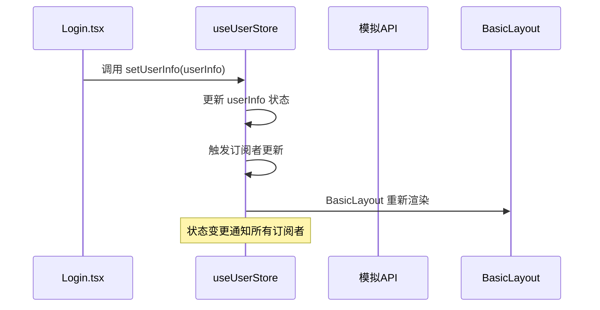

# Store 设计与实现

<cite>
**Referenced Files in This Document**   
- [src/store/index.ts](file://src/store/index.ts)
- [src/layout/BasicLayout.tsx](file://src/layout/BasicLayout.tsx)
- [src/pages/User/Login.tsx](file://src/pages/User/Login.tsx)
- [src/__tests__/store.test.tsx](file://src/__tests__/store.test.tsx)
</cite>

## 目录
1. [简介](#简介)
2. [状态类型定义](#状态类型定义)
3. [核心 Actions](#核心-actions)
4. [计算属性](#计算属性)
5. [在组件中使用 Store](#在组件中使用-store)
6. [中间件详解](#中间件详解)
7. [最佳实践](#最佳实践)
8. [结论](#结论)

## 简介
本项目采用 Zustand 作为状态管理解决方案，通过 `src/store/index.ts` 文件实现了一个集中式的用户状态管理器。该 store 负责管理用户信息、应用状态以及相关的业务逻辑，为整个应用提供统一的状态访问和更新机制。设计上遵循了模块化、类型安全和可维护性的原则，结合了持久化和选择性订阅等高级特性，以优化性能和用户体验。

## 状态类型定义

`src/store/index.ts` 中定义了两个核心接口：`UserInfo` 和 `AppState`，它们共同构成了应用的状态基础。

`UserInfo` 接口用于描述用户的身份信息，包含必填的 `userName` 字段和可选的 `userId`、`avatar`、`email` 及 `roles` 字段。这种设计允许 store 在用户未完全登录或信息不完整时也能保持有效状态，提高了应用的健壮性。

`AppState` 接口则定义了应用的全局状态，包括 `loading`（加载状态）、`theme`（主题模式，支持明暗两种）和 `collapsed`（侧边栏折叠状态）。这些状态直接影响用户界面的展示，是实现动态 UI 的关键。

**Section sources**
- [src/store/index.ts](file://src/store/index.ts#L4-L10)
- [src/store/index.ts](file://src/store/index.ts#L13-L17)

## 核心 Actions

Store 通过一系列 actions 提供了对状态的安全更新机制。这些 actions 封装了状态变更的逻辑，确保了状态的一致性和可预测性。

`setUserInfo` action 接收一个 `Partial<UserInfo>` 类型的参数，允许部分更新用户信息。其实现利用了 Zustand 的 `set` 函数和对象展开运算符，将新信息与现有信息合并，避免了直接修改状态带来的副作用。

`clearUserInfo` action 用于用户登出时重置用户信息。除了将 `userInfo` 重置为初始状态外，该 action 还负责清除名为 `token` 的 cookie，实现了状态清理与安全退出的联动。

`toggleTheme` action 实现了主题切换功能。通过读取当前的 `theme` 值并取反，实现了明暗主题的无缝切换。此功能通常与 CSS 变量或 Tailwind CSS 的暗色模式结合使用，以改变整个应用的视觉风格。

**Section sources**
- [src/store/index.ts](file://src/store/index.ts#L67-L71)
- [src/store/index.ts](file://src/store/index.ts#L73-L77)
- [src/store/index.ts](file://src/store/index.ts#L91-L96)

## 计算属性

Store 中定义了两个重要的计算属性：`isLoggedIn` 和 `displayName`。它们并非独立的状态，而是基于现有状态（主要是 `userInfo`）动态计算得出的值。

`isLoggedIn` 通过检查 `userInfo.userName` 是否存在来判断用户是否已登录。这种设计避免了在状态中维护一个单独的 `isLogin` 字段，减少了状态冗余，体现了“单一数据源”的设计原则。

`displayName` 则根据 `userInfo.userName` 的值返回用户显示名称，若用户未登录则返回“未登录”作为占位符。这为 UI 组件提供了统一的用户名称展示逻辑，简化了视图层的条件判断。

**Section sources**
- [src/store/index.ts](file://src/store/index.ts#L112-L114)
- [src/store/index.ts](file://src/store/index.ts#L116-L118)

## 在组件中使用 Store

在 React 组件中，通过导入 `useUserStore` hook 并使用选择器（selector）来访问 store 中的状态和 actions。例如，在 `Login.tsx` 组件中，通过 `useUserStore((state) => state.setUserInfo)` 获取 `setUserInfo` action，以便在登录成功后更新用户信息。

在 `BasicLayout.tsx` 中，多个选择器被同时使用，分别获取 `userInfo`、`appState` 和 `displayName` 等数据，用于渲染布局组件。这种按需订阅的模式确保了只有当所依赖的状态发生变化时，组件才会重新渲染，从而优化了性能。

**Diagram sources**
- [src/store/index.ts](file://src/store/index.ts#L67-L71)
- [src/pages/User/Login.tsx](file://src/pages/User/Login.tsx#L21)
- [src/layout/BasicLayout.tsx](file://src/layout/BasicLayout.tsx#L33)

**Section sources**
- [src/pages/User/Login.tsx](file://src/pages/User/Login.tsx#L21)
- [src/layout/BasicLayout.tsx](file://src/layout/BasicLayout.tsx#L33-L37)

## 中间件详解

`src/store/index.ts` 的实现中，巧妙地组合使用了两个 Zustand 中间件：`persist` 和 `subscribeWithSelector`。

`persist` 中间件负责将 store 的状态持久化到 `localStorage`。通过配置 `name` 参数，指定了存储的键名；通过 `partialize` 函数，实现了选择性持久化，仅将 `userInfo` 持久化，而 `appState`（如 loading 状态）则不被保存。这避免了应用重启后出现不一致的 UI 状态。

`subscribeWithSelector` 中间件是实现高效更新的关键。它允许组件订阅 store 中的特定部分（通过选择器函数），而不是整个 store。当 store 状态更新时，中间件会智能地比较选择器的返回值，仅当值发生变化时才通知订阅的组件进行重新渲染。这极大地减少了不必要的组件重渲染，提升了应用性能。

**Section sources**
- [src/store/index.ts](file://src/store/index.ts#L41-L120)

## 最佳实践

1.  **避免不必要的渲染**：始终使用选择器函数从 store 中提取所需的状态，而不是直接订阅整个 store。例如，使用 `useUserStore((state) => state.userInfo.userName)` 而不是 `useUserStore()`。

2.  **处理异步操作**：对于异步操作（如 `getUserInfo`），应在 action 内部管理加载状态（`setLoading`），并在 `try...finally` 块中确保加载状态能被正确重置，无论操作成功或失败。

3.  **状态更新的不可变性**：在 `set` 函数中，始终返回一个新对象，而不是修改现有状态。利用对象展开运算符（`...`）是保证不可变性的推荐做法。

4.  **计算属性的使用**：将基于状态的派生数据定义为计算属性，而不是在组件中重复计算，这有助于保持逻辑的集中和一致性。

## 结论

`src/store/index.ts` 中的 Zustand store 设计精良，通过清晰的类型定义、合理的 action 划分、高效的计算属性以及中间件的协同工作，为应用提供了一个强大且易于维护的状态管理方案。其结合持久化和选择性订阅的模式，不仅保证了用户体验的连续性，也确保了应用的高性能。遵循文档中提到的最佳实践，可以进一步发挥该 store 的潜力，构建出响应迅速、稳定可靠的前端应用。