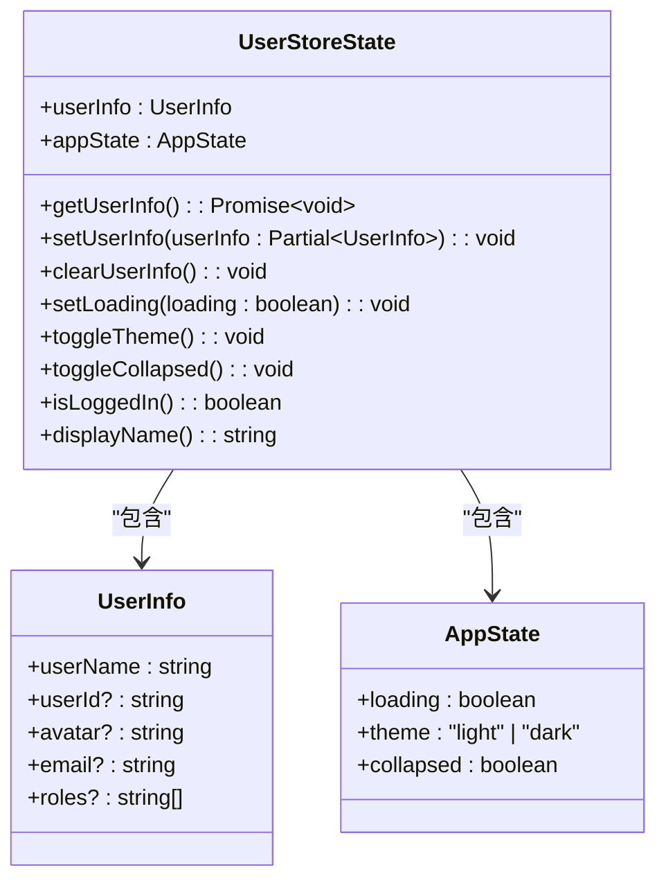
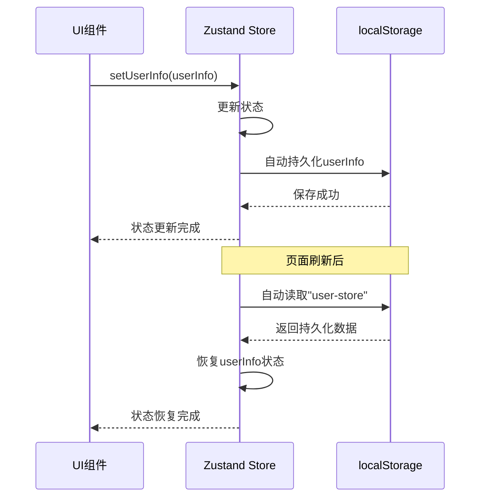
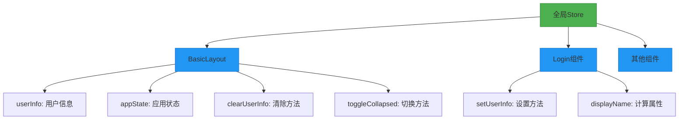
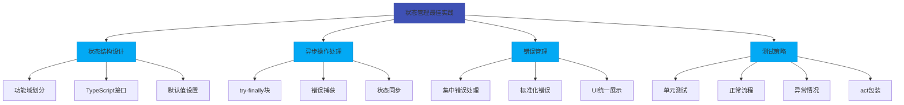

# 状态管理

<cite>
**Referenced Files in This Document**   
- [src/store/index.ts](file://src/store/index.ts)
- [src/layout/BasicLayout.tsx](file://src/layout/BasicLayout.tsx)
- [src/pages/User/Login.tsx](file://src/pages/User/Login.tsx)
- [src/__tests__/store.test.tsx](file://src/__tests__/store.test.tsx)
</cite>

## 目录
1. [状态管理](#状态管理)
2. [核心状态结构](#核心状态结构)
3. [状态持久化配置](#状态持久化配置)
4. [跨组件状态共享](#跨组件状态共享)
5. [状态更新与性能优化](#状态更新与性能优化)
6. [最佳实践](#最佳实践)

## 核心状态结构

在项目中，状态管理通过Zustand库实现，定义了清晰的类型接口来组织应用状态。`UserStoreState`接口定义了完整的状态结构，包含用户信息、应用状态、操作方法和计算属性。

状态结构分为两个主要部分：`userInfo`和`appState`。`userInfo`接口定义了用户相关数据，包括用户名、用户ID、头像、邮箱和角色等字段。`appState`接口则管理应用级别的状态，如加载状态、主题模式和侧边栏折叠状态。



**Diagram sources**
- [src/store/index.ts](file://src/store/index.ts#L4-L38)

**Section sources**
- [src/store/index.ts](file://src/store/index.ts#L4-L38)

## 状态持久化配置

状态持久化通过Zustand的`persist`中间件实现，确保用户状态在页面刷新后能够保持。持久化配置指定了存储键名为"user-store"，并使用`partialize`函数选择性地持久化状态。

关键配置是只持久化`userInfo`部分，而`appState`等临时状态不进行持久化。这种设计既保证了用户登录状态的连续性，又避免了不必要的状态残留。当用户登录时，用户信息会自动保存到localStorage中；当用户退出登录时，除了清除store中的状态，还会清除相关的cookie。



**Diagram sources**
- [src/store/index.ts](file://src/store/index.ts#L110-L120)

**Section sources**
- [src/store/index.ts](file://src/store/index.ts#L110-L120)

## 跨组件状态共享

状态共享通过创建全局store实例`useUserStore`实现，各个组件可以通过选择器函数访问所需的状态片段。这种模式避免了状态提升的复杂性，使得状态管理更加直观和高效。

在`BasicLayout`组件中，多个状态和方法被同时订阅，包括用户信息、应用状态、清除用户信息和切换折叠状态等方法。每个选择器函数只订阅特定的状态片段，确保组件只在相关状态变化时重新渲染。



**Diagram sources**
- [src/layout/BasicLayout.tsx](file://src/layout/BasicLayout.tsx#L33-L37)
- [src/pages/User/Login.tsx](file://src/pages/User/Login.tsx#L21-L21)

**Section sources**
- [src/layout/BasicLayout.tsx](file://src/layout/BasicLayout.tsx#L33-L37)
- [src/pages/User/Login.tsx](file://src/pages/User/Login.tsx#L21-L21)

## 状态更新与性能优化

状态更新采用不可变方式，通过`set`函数返回新的状态对象，确保状态变更的可预测性。对于对象类型的更新，使用展开运算符进行浅拷贝，保持未修改字段的引用不变，这有助于React的diff算法优化渲染性能。

为避免不必要的重新渲染，组件使用选择器函数订阅store中的特定状态片段。例如，`BasicLayout`组件分别订阅`userInfo`、`appState`等独立状态，而不是订阅整个store。这种精细化的订阅机制确保只有当组件关心的状态发生变化时才会触发重新渲染。

异步操作如`getUserInfo`方法通过`try-finally`块管理加载状态，确保无论操作成功或失败都能正确更新`loading`状态。计算属性`isLoggedIn`和`displayName`基于当前状态动态计算，提供了一种声明式的方式来派生状态。

```mermaid
flowchart LR
A[状态更新] --> B{更新类型}
B --> |同步更新| C["set(state => newState)"]
B --> |异步更新| D["try-finally管理加载状态"]
C --> E[不可变更新]
C --> F[浅拷贝保持引用]
D --> G[开始: setLoading(true)]
D --> H[执行异步操作]
D --> I[结束: setLoading(false)]
J[性能优化] --> K[选择器函数]
J --> L[精细化订阅]
J --> M[避免全量订阅]
style A fill:#FF9800,stroke:#F57C00
style B fill:#FFC107,stroke:#FFA000
style C fill:#8BC34A,stroke:#689F38
style D fill:#8BC34A,stroke:#689F38
style J fill:#9C27B0,stroke:#7B1FA2
```

**Diagram sources**
- [src/store/index.ts](file://src/store/index.ts#L65-L105)

**Section sources**
- [src/store/index.ts](file://src/store/index.ts#L65-L105)

## 最佳实践

### 状态结构设计
状态结构应按照功能域进行划分，如用户信息和应用状态分离。使用TypeScript接口明确定义状态结构，提供类型安全和代码可维护性。初始状态应设置合理的默认值，确保应用在任何情况下都有可用的状态。

### 异步操作处理
异步操作应包含完整的错误处理和状态管理。使用`try-catch`捕获异常，并在`finally`块中重置加载状态，确保状态机的完整性。对于API调用，建议在成功后更新本地状态，实现数据同步。

### 错误管理
错误管理应集中在store层面处理，避免在UI组件中直接处理业务逻辑错误。通过返回标准化的错误信息或使用专门的错误状态字段，让UI组件能够统一处理各种错误情况。

### 测试策略
通过单元测试验证状态管理的正确性，包括状态更新、异步操作和计算属性。测试应覆盖正常流程和异常情况，确保状态机的健壮性。使用`act`包装状态变更操作，确保测试的准确性。



**Diagram sources**
- [src/__tests__/store.test.tsx](file://src/__tests__/store.test.tsx#L0-L227)

**Section sources**
- [src/__tests__/store.test.tsx](file://src/__tests__/store.test.tsx#L0-L227)