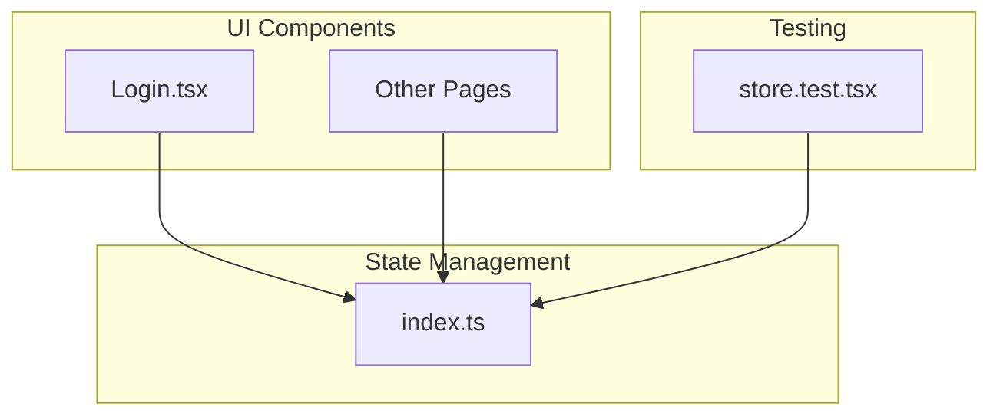
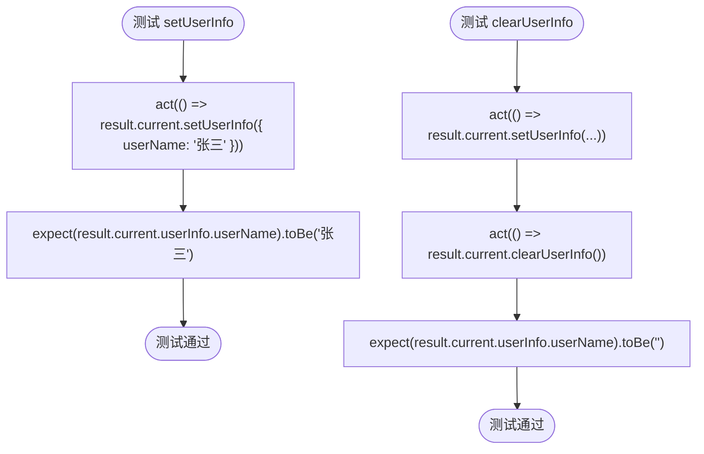
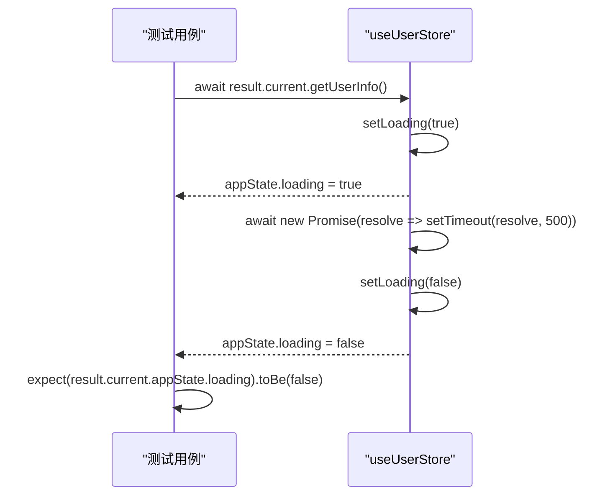
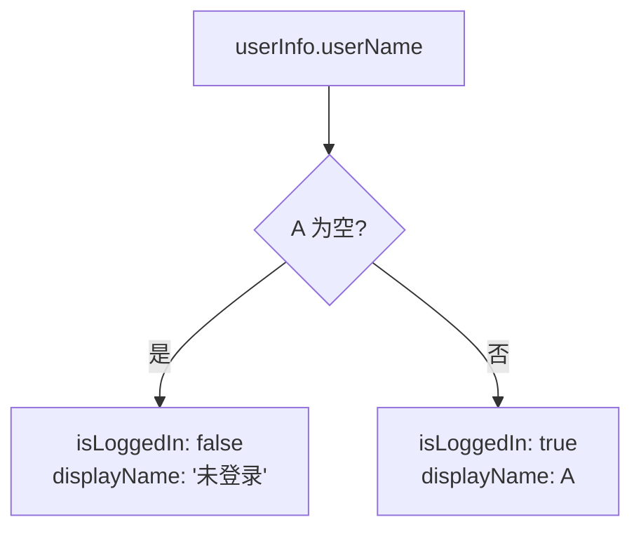
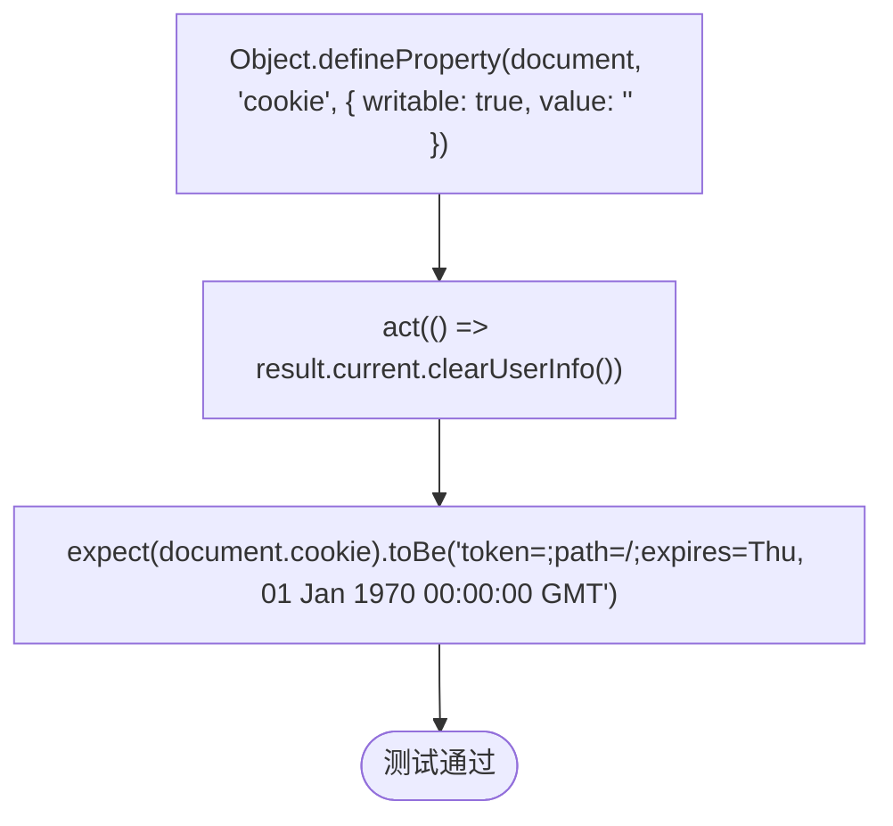

# 状态管理测试

<cite>
**Referenced Files in This Document**   
- [store.test.tsx](file://src/__tests__/store.test.tsx)
- [index.ts](file://src/store/index.ts)
- [jest.config.ts](file://jest.config.ts)
- [jest.setup.ts](file://jest.setup.ts)
- [Login.tsx](file://src/pages/User/Login.tsx)
</cite>

## 目录
1. [简介](#简介)
2. [项目结构](#项目结构)
3. [核心组件](#核心组件)
4. [架构概述](#架构概述)
5. [详细组件分析](#详细组件分析)
6. [依赖分析](#依赖分析)
7. [性能考量](#性能考量)
8. [故障排除指南](#故障排除指南)
9. [结论](#结论)

## 简介
本文档旨在为 Zustand 状态管理库的单元测试提供一份详尽的指南。基于 `src/__tests__/store.test.tsx` 文件中的测试用例，我们将深入探讨如何对状态变更、action 执行以及异步逻辑进行有效测试。文档将涵盖使用 Jest 模拟异步行为（如 `getUserInfo` 中的延时操作）的方法，并验证状态更新的正确性。此外，还将介绍如何在测试 `clearUserInfo` 时对 cookie 操作进行断言，以及如何测试计算属性 `isLoggedIn` 和 `displayName` 的返回值。最后，文档会指出测试中常见的陷阱，如状态重置和测试间状态污染，并提供最佳实践建议。

## 项目结构
项目采用典型的 React + TypeScript + Vite 架构，测试文件位于 `src/__tests__` 目录下。状态管理逻辑通过 Zustand 库在 `src/store/index.ts` 中实现，并在 `src/__tests__/store.test.tsx` 文件中进行单元测试。Jest 测试框架的配置文件 `jest.config.ts` 和初始化文件 `jest.setup.ts` 位于项目根目录，为测试环境提供了必要的配置和全局 mock。

**Section sources**
- [store.test.tsx](file://src/__tests__/store.test.tsx#L1-L10)
- [index.ts](file://src/store/index.ts#L1-L10)

## 核心组件
核心组件包括 Zustand store 的定义文件 `index.ts` 和其对应的测试文件 `store.test.tsx`。`index.ts` 文件定义了用户信息（`UserInfo`）、应用状态（`AppState`）和完整的状态管理接口（`UserStoreState`），并使用 `persist` 和 `subscribeWithSelector` 中间件来实现状态持久化和细粒度订阅。`store.test.tsx` 文件则使用 `@testing-library/react` 提供的 `renderHook` 工具来测试该 store 的所有功能。

**Section sources**
- [index.ts](file://src/store/index.ts#L1-L124)
- [store.test.tsx](file://src/__tests__/store.test.tsx#L1-L228)

## 架构概述
系统架构围绕 Zustand store 构建，该 store 是一个集中式的状态容器，管理着用户信息和应用状态。UI 组件（如 `Login.tsx`）通过 `useUserStore` Hook 订阅和修改状态。测试架构则依赖于 Jest 和 `@testing-library/react`，通过 `renderHook` 来渲染和测试自定义 Hook，确保其行为符合预期。



**Diagram sources**
- [index.ts](file://src/store/index.ts#L41-L120)
- [Login.tsx](file://src/pages/User/Login.tsx#L20-L25)
- [store.test.tsx](file://src/__tests__/store.test.tsx#L1-L228)

## 详细组件分析

### 状态变更测试
此部分分析如何测试 Zustand store 的状态变更。

#### 用户信息管理
测试用例验证了 `setUserInfo` 和 `clearUserInfo` 方法的正确性。`setUserInfo` 支持部分更新，即可以只更新 `userName` 而不覆盖 `userId`。`clearUserInfo` 会将 `userName` 重置为空字符串，并清除 `userId` 等字段。



**Diagram sources**
- [index.ts](file://src/store/index.ts#L75-L80)
- [store.test.tsx](file://src/__tests__/store.test.tsx#L30-L60)

**Section sources**
- [index.ts](file://src/store/index.ts#L75-L80)
- [store.test.tsx](file://src/__tests__/store.test.tsx#L30-L60)

### 异步逻辑测试
此部分分析如何测试 Zustand store 中的异步方法。

#### getUserInfo 方法测试
`getUserInfo` 是一个异步方法，它会先设置 `loading` 状态为 `true`，模拟一个 500ms 的 API 调用，然后在 `finally` 块中将 `loading` 状态重置为 `false`。测试的关键在于验证加载状态的转换。



**Diagram sources**
- [index.ts](file://src/store/index.ts#L55-L65)
- [store.test.tsx](file://src/__tests__/store.test.tsx#L180-L200)

**Section sources**
- [index.ts](file://src/store/index.ts#L55-L65)
- [store.test.tsx](file://src/__tests__/store.test.tsx#L180-L200)

### 计算属性测试
此部分分析如何测试 Zustand store 中的计算属性。

#### isLoggedIn 和 displayName
`isLoggedIn` 和 `displayName` 是基于 `userInfo.userName` 的计算属性。`isLoggedIn` 在 `userName` 存在时返回 `true`，否则返回 `false`。`displayName` 返回 `userName` 的值，如果 `userName` 为空则返回 "未登录"。



**Diagram sources**
- [index.ts](file://src/store/index.ts#L105-L110)
- [store.test.tsx](file://src/__tests__/store.test.tsx#L140-L160)

**Section sources**
- [index.ts](file://src/store/index.ts#L105-L110)
- [store.test.tsx](file://src/__tests__/store.test.tsx#L140-L160)

### Cookie 操作断言
此部分分析如何在测试中对 cookie 操作进行断言。

#### clearUserInfo 中的 Cookie 清除
`clearUserInfo` 方法不仅会重置 store 中的用户信息，还会通过 `document.cookie` 操作清除名为 `token` 的 cookie。在测试中，需要对 `document.cookie` 进行 mock，并验证其值是否被正确设置。



**Diagram sources**
- [index.ts](file://src/store/index.ts#L85-L87)
- [store.test.tsx](file://src/__tests__/store.test.tsx#L10-L15)

**Section sources**
- [index.ts](file://src/store/index.ts#L85-L87)
- [store.test.tsx](file://src/__tests__/store.test.tsx#L10-L15)

## 依赖分析
`store.test.tsx` 依赖于 `@testing-library/react` 的 `renderHook` 和 `act`，以及 Jest 的 `jest.fn()` 来创建 mock。`index.ts` 依赖于 `zustand` 库及其 `persist` 和 `subscribeWithSelector` 中间件。`Login.tsx` 页面组件依赖于 `useUserStore` 来获取 `setUserInfo` 方法。

```mermaid
graph LR
A[store.test.tsx] --> B[@testing-library/react]
A --> C[Jest]
D[index.ts] --> E[zustand]
D --> F[zustand/middleware]
G[Login.tsx] --> D
```

**Diagram sources**
- [store.test.tsx](file://src/__tests__/store.test.tsx#L1-L5)
- [index.ts](file://src/store/index.ts#L1-L5)
- [Login.tsx](file://src/pages/User/Login.tsx#L1-L5)

**Section sources**
- [store.test.tsx](file://src/__tests__/store.test.tsx#L1-L5)
- [index.ts](file://src/store/index.ts#L1-L5)
- [Login.tsx](file://src/pages/User/Login.tsx#L1-L5)

## 性能考量
Zustand 本身是一个轻量级的状态管理库，性能开销很小。`persist` 中间件会在状态变化时自动将数据同步到 `localStorage`，这可能会带来轻微的 I/O 开销，但对于大多数应用来说可以忽略不计。在测试中，`getUserInfo` 方法模拟了 500ms 的延时，这有助于测试加载状态的 UI 反馈，但在生产环境中应确保实际的 API 调用是高效的。

## 故障排除指南
在编写 Zustand 测试时，常见的陷阱包括：
1.  **状态污染**：多个测试用例之间可能会共享状态。解决方案是在 `beforeEach` 钩子中使用 `act(() => useUserStore.setState(...))` 重置 store 状态。
2.  **异步测试**：忘记使用 `await` 和 `act` 会导致测试在异步操作完成前就结束。务必使用 `await act(async () => {...})` 来包裹异步操作。
3.  **Mock 未定义**：如果未正确 mock `localStorage` 或 `document.cookie`，测试可能会访问真实的浏览器 API。确保在测试文件顶部正确设置这些 mock。

**Section sources**
- [store.test.tsx](file://src/__tests__/store.test.tsx#L15-L25)
- [jest.setup.ts](file://jest.setup.ts#L1-L107)

## 结论
通过对 `src/__tests__/store.test.tsx` 文件的分析，我们建立了一套完整的 Zustand 状态管理测试指南。该指南涵盖了状态变更、异步逻辑、计算属性和副作用（如 cookie 操作）的测试方法。遵循这些最佳实践，可以确保状态管理逻辑的健壮性和可靠性，为应用的稳定运行提供保障。