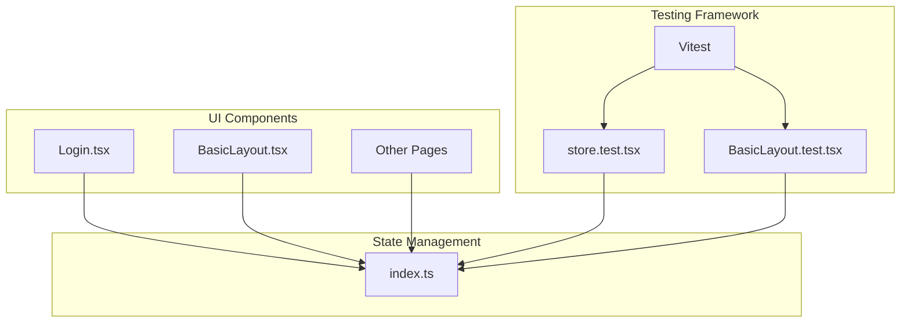
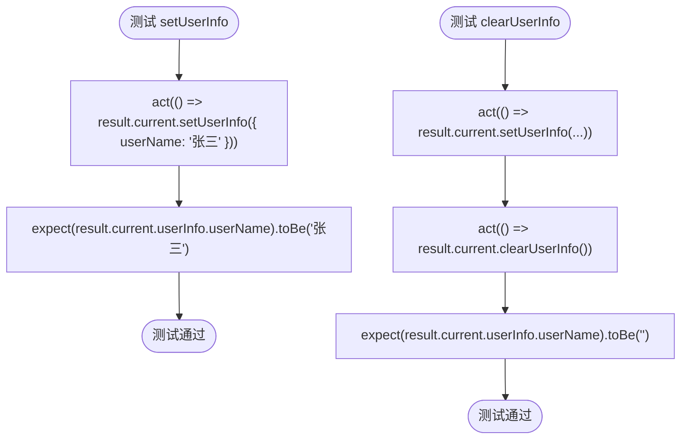
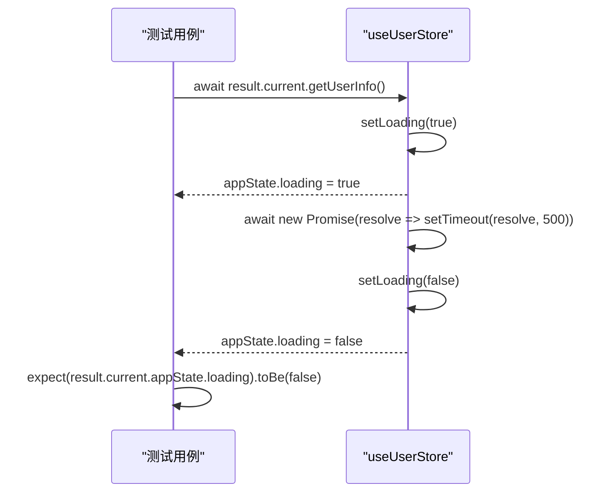
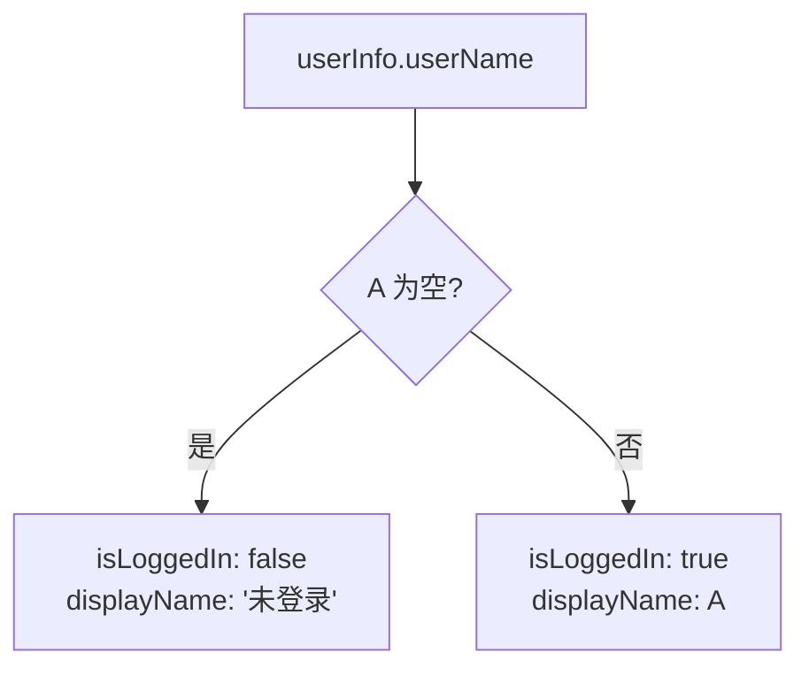
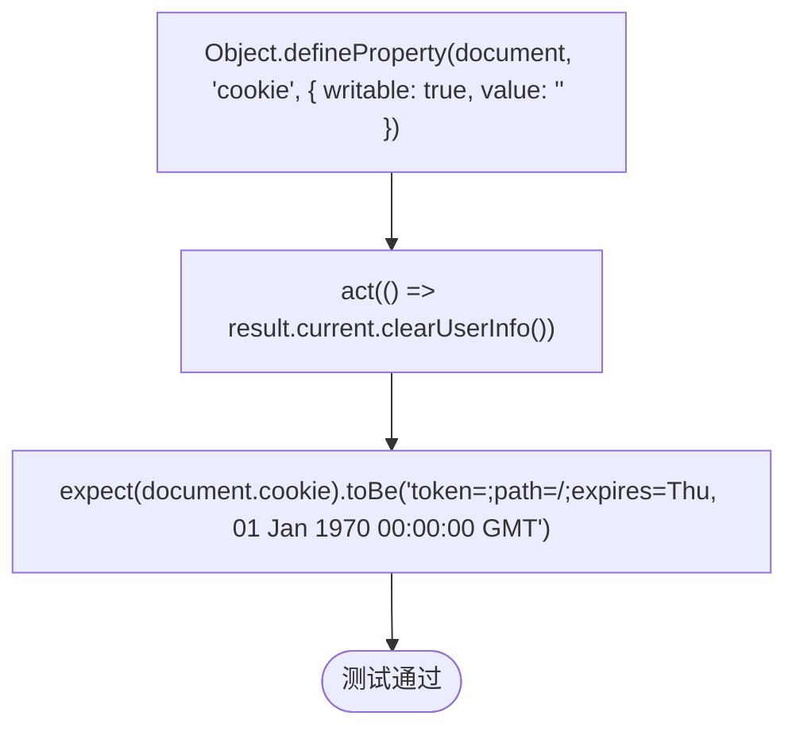

# 状态管理测试

<cite>
**本文引用的文件**
- [store.test.tsx](file://src/__tests__/store.test.tsx)
- [BasicLayout.test.tsx](file://src/__tests__/layout/BasicLayout.test.tsx)
- [index.ts](file://src/store/index.ts)
- [BasicLayout.tsx](file://src/layout/BasicLayout.tsx)
- [vitest.config.ts](file://vitest.config.ts)
- [vitest.setup.ts](file://vitest.setup.ts)
- [Login.tsx](file://src/pages/User/Login.tsx)
- [services.test.tsx](file://src/__tests__/services.test.tsx)
- [App.test.tsx](file://src/__tests__/App.test.tsx)
</cite>

## 更新摘要
**所做更改**
- 更新测试框架迁移：从 Jest 迁移到 Vitest，将 `jest.spyOn()` 更新为 `vi.spyOn()`
- 更新测试语法以适配 Vitest 框架，保持测试逻辑不变
- 更新配置文件引用，反映从 Jest 到 Vitest 的迁移
- 更新测试导入语句和工具函数引用
- **新增** BasicLayout 测试中 appState 对象的增强，包括新增 loading 布尔标志和 theme 字符串属性的测试覆盖
- **更新** 状态管理测试文档以反映应用变更：BasicLayout 测试中 appState 对象的增强

## 目录
1. [简介](#简介)
2. [项目结构](#项目结构)
3. [核心组件](#核心组件)
4. [架构概述](#架构概述)
5. [详细组件分析](#详细组件分析)
6. [依赖分析](#依赖分析)
7. [性能考量](#性能考量)
8. [故障排除指南](#故障排除指南)
9. [结论](#结论)

## 简介
本文档旨在为 Zustand 状态管理库的单元测试提供一份详尽的指南。基于 `src/__tests__/store.test.tsx` 和 `src/__tests__/layout/BasicLayout.test.tsx` 文件中的测试用例，我们将深入探讨如何对状态变更、action 执行以及异步逻辑进行有效测试。文档将涵盖使用 Vitest 框架模拟异步行为（如 `getUserInfo` 中的延时操作）的方法，并验证状态更新的正确性。此外，还将介绍如何在测试 `clearUserInfo` 时对 cookie 操作进行断言，以及如何测试计算属性 `isLoggedIn` 和 `displayName` 的返回值。最后，文档会指出测试中常见的陷阱，如状态重置和测试间状态污染，并提供最佳实践建议。

**更新** 本指南已更新以反映从 Jest 到 Vitest 的迁移，包括测试语法和配置的相应调整。同时新增了对 BasicLayout 测试中 appState 对象增强的详细说明，包括新增的 loading 布尔标志和 theme 字符串属性的测试覆盖。

## 项目结构
项目采用典型的 React + TypeScript + Vite 架构，测试文件位于 `src/__tests__` 目录下。状态管理逻辑通过 Zustand 库在 `src/store/index.ts` 中实现，并在 `src/__tests__/store.test.tsx` 和 `src/__tests__/layout/BasicLayout.test.tsx` 文件中进行单元测试。Vitest 测试框架的配置文件 `vitest.config.ts` 和初始化文件 `vitest.setup.ts` 位于项目根目录，为测试环境提供了必要的配置和全局 mock。

**Section sources**
- [store.test.tsx:1-10](file://src/__tests__/store.test.tsx#L1-L10)
- [BasicLayout.test.tsx:1-10](file://src/__tests__/layout/BasicLayout.test.tsx#L1-L10)
- [index.ts:1-10](file://src/store/index.ts#L1-L10)
- [vitest.config.ts:1-29](file://vitest.config.ts#L1-L29)

## 核心组件
核心组件包括 Zustand store 的定义文件 `index.ts` 和其对应的测试文件 `store.test.tsx`、`BasicLayout.test.tsx`。`index.ts` 文件定义了用户信息（`UserInfo`）、应用状态（`AppState`）和完整的状态管理接口（`UserStoreState`），并使用 `persist` 和 `subscribeWithSelector` 中间件来实现状态持久化和细粒度订阅。`store.test.tsx` 文件则使用 `@testing-library/react` 提供的 `renderHook` 工具来测试该 store 的所有功能，而 `BasicLayout.test.tsx` 文件专门测试 BasicLayout 组件与 store 的集成。

**更新** 测试文件现在使用 Vitest 框架，导入语句从 `@testing-library/jest-dom` 更新为 `@testing-library/jest-dom/vitest`，并在 `vitest.setup.ts` 中通过 `vi` 模块提供测试工具。BasicLayout 测试特别关注 appState 对象的增强，包括新增的 loading 和 theme 属性。

**Section sources**
- [index.ts:1-124](file://src/store/index.ts#L1-L124)
- [store.test.tsx:1-189](file://src/__tests__/store.test.tsx#L1-L189)
- [BasicLayout.test.tsx:1-219](file://src/__tests__/layout/BasicLayout.test.tsx#L1-L219)
- [vitest.setup.ts:1-127](file://vitest.setup.ts#L1-L127)

## 架构概述
系统架构围绕 Zustand store 构建，该 store 是一个集中式的状态容器，管理着用户信息和应用状态。UI 组件（如 `Login.tsx`、`BasicLayout.tsx`）通过 `useUserStore` Hook 订阅和修改状态。测试架构则依赖于 Vitest 和 `@testing-library/react`，通过 `renderHook` 来渲染和测试自定义 Hook，确保其行为符合预期。

```mermaid
graph TB
subgraph "UI Components"
Login[Login.tsx]
BasicLayout[BasicLayout.tsx]
OtherPages[Other Pages]
end
subgraph "State Management"
Store[index.ts]
end
subgraph "Testing Framework"
Vitest[Vitest]
StoreTest[store.test.tsx]
BasicLayoutTest[BasicLayout.test.tsx]
end
Login --> Store
BasicLayout --> Store
OtherPages --> Store
StoreTest --> Store
BasicLayoutTest --> Store
Vitest --> StoreTest
Vitest --> BasicLayoutTest
```

**Diagram sources**
- [index.ts:41-120](file://src/store/index.ts#L41-L120)
- [Login.tsx:20-25](file://src/pages/User/Login.tsx#L20-L25)
- [BasicLayout.tsx:29-231](file://src/layout/BasicLayout.tsx#L29-L231)
- [store.test.tsx:1-189](file://src/__tests__/store.test.tsx#L1-L189)
- [BasicLayout.test.tsx:1-219](file://src/__tests__/layout/BasicLayout.test.tsx#L1-L219)
- [vitest.config.ts:1-29](file://vitest.config.ts#L1-L29)

## 详细组件分析

### 状态变更测试
此部分分析如何测试 Zustand store 的状态变更。

#### 用户信息管理
测试用例验证了 `setUserInfo` 和 `clearUserInfo` 方法的正确性。`setUserInfo` 支持部分更新，即可以只更新 `userName` 而不覆盖 `userId`。`clearUserInfo` 会将 `userName` 重置为空字符串，并清除 `userId` 等字段。

```mermaid
flowchart TD
Start([测试 setUserInfo]) --> SetUserInfo["act(() => result.current.setUserInfo({ userName: '张三' }))"]
SetUserInfo --> CheckState["expect(result.current.userInfo.userName).toBe('张三')"]
CheckState --> End([测试通过])
Start2([测试 clearUserInfo]) --> SetUserInfo2["act(() => result.current.setUserInfo(...))"]
SetUserInfo2 --> ClearUserInfo["act(() => result.current.clearUserInfo())"]
ClearUserInfo --> CheckState2["expect(result.current.userInfo.userName).toBe('')"]
CheckState2 --> End2([测试通过])
```

**Diagram sources**
- [index.ts:75-80](file://src/store/index.ts#L75-L80)
- [store.test.tsx:30-60](file://src/__tests__/store.test.tsx#L30-L60)

**Section sources**
- [index.ts:75-80](file://src/store/index.ts#L75-L80)
- [store.test.tsx:30-60](file://src/__tests__/store.test.tsx#L30-L60)

### 应用状态管理测试
此部分分析如何测试 Zustand store 中的应用状态管理。

#### appState 对象的增强
BasicLayout 测试显示 appState 对象现在包含三个关键属性：`loading`（布尔值）、`theme`（字符串枚举）和 `collapsed`（布尔值）。这些属性直接影响 BasicLayout 组件的外观和行为。

```mermaid
flowchart TD
AppState[appState 对象] --> Loading[loading: boolean<br/>初始值: false]
AppState --> Theme[theme: "light" | "dark"<br/>初始值: "light"]
AppState --> Collapsed[collapsed: boolean<br/>初始值: false]
Loading --> BasicLayout[BasicLayout 组件]
Theme --> BasicLayout
Collapsed --> BasicLayout
```

**Diagram sources**
- [index.ts:14-18](file://src/store/index.ts#L14-L18)
- [BasicLayout.test.tsx:40-44](file://src/__tests__/layout/BasicLayout.test.tsx#L40-L44)

**Section sources**
- [index.ts:14-18](file://src/store/index.ts#L14-L18)
- [BasicLayout.test.tsx:40-44](file://src/__tests__/layout/BasicLayout.test.tsx#L40-L44)

### 异步逻辑测试
此部分分析如何测试 Zustand store 中的异步方法。

#### getUserInfo 方法测试
`getUserInfo` 是一个异步方法，它会先设置 `loading` 状态为 `true`，模拟一个 500ms 的 API 调用，然后在 `finally` 块中将 `loading` 状态重置为 `false`。测试的关键在于验证加载状态的转换。

```mermaid
sequenceDiagram
participant Test as "测试用例"
participant Store as "useUserStore"
Test->>Store : await result.current.getUserInfo()
Store->>Store : setLoading(true)
Store-->>Test : appState.loading = true
Store->>Store : await new Promise(resolve => setTimeout(resolve, 500))
Store->>Store : setLoading(false)
Store-->>Test : appState.loading = false
Test->>Test : expect(result.current.appState.loading).toBe(false)
```

**Diagram sources**
- [index.ts:55-65](file://src/store/index.ts#L55-L65)
- [store.test.tsx:180-200](file://src/__tests__/store.test.tsx#L180-L200)

**Section sources**
- [index.ts:55-65](file://src/store/index.ts#L55-L65)
- [store.test.tsx:180-200](file://src/__tests__/store.test.tsx#L180-L200)

### 计算属性测试
此部分分析如何测试 Zustand store 中的计算属性。

#### isLoggedIn 和 displayName
`isLoggedIn` 和 `displayName` 是基于 `userInfo.userName` 的计算属性。`isLoggedIn` 在 `userName` 存在时返回 `true`，否则返回 `false`。`displayName` 返回 `userName` 的值，如果 `userName` 为空则返回 "未登录"。

```mermaid
flowchart TD
A[userInfo.userName] --> B{A 为空?}
B --> |是| C[isLoggedIn: false<br/>displayName: '未登录']
B --> |否| D[isLoggedIn: true<br/>displayName: A]
```

**Diagram sources**
- [index.ts:105-110](file://src/store/index.ts#L105-L110)
- [store.test.tsx:140-160](file://src/__tests__/store.test.tsx#L140-L160)

**Section sources**
- [index.ts:105-110](file://src/store/index.ts#L105-L110)
- [store.test.tsx:140-160](file://src/__tests__/store.test.tsx#L140-L160)

### Cookie 操作断言
此部分分析如何在测试中对 cookie 操作进行断言。

#### clearUserInfo 中的 Cookie 清除
`clearUserInfo` 方法不仅会重置 store 中的用户信息，还会通过 `document.cookie` 操作清除名为 `token` 的 cookie。在测试中，需要对 `document.cookie` 进行 mock，并验证其值是否被正确设置。

```mermaid
flowchart TD
MockDoc["Object.defineProperty(document, 'cookie', { writable: true, value: '' })"] --> SetCookie["act(() => result.current.clearUserInfo())"]
SetCookie --> CheckCookie["expect(document.cookie).toBe('token=;path=/;expires=Thu, 01 Jan 1970 00:00:00 GMT')"]
CheckCookie --> End([测试通过])
```

**Diagram sources**
- [index.ts:85-87](file://src/store/index.ts#L85-L87)
- [store.test.tsx:10-15](file://src/__tests__/store.test.tsx#L10-L15)

**Section sources**
- [index.ts:85-87](file://src/store/index.ts#L85-L87)
- [store.test.tsx:10-15](file://src/__tests__/store.test.tsx#L10-L15)

### BasicLayout 集成测试
此部分分析如何测试 BasicLayout 组件与 Zustand store 的集成。

#### appState 属性的测试覆盖
BasicLayout 测试专门验证了 appState 对象的三个属性在组件中的正确使用：

1. **collapsed 属性**：验证侧边栏的折叠状态
2. **loading 属性**：验证加载状态的 UI 反馈
3. **theme 属性**：验证主题切换功能

```mermaid
flowchart TD
BasicLayout[BasicLayout 组件] --> AppState[appState 对象]
AppState --> Collapsed[collapsed: boolean]
AppState --> Loading[loading: boolean]
AppState --> Theme[theme: "light" | "dark"]
Collapsed --> Sidebar[侧边栏折叠状态]
Loading --> LoadingUI[加载状态 UI]
Theme --> ThemeUI[主题样式]
```

**Diagram sources**
- [BasicLayout.tsx:168-189](file://src/layout/BasicLayout.tsx#L168-L189)
- [BasicLayout.test.tsx:110-124](file://src/__tests__/layout/BasicLayout.test.tsx#L110-L124)

**Section sources**
- [BasicLayout.tsx:168-189](file://src/layout/BasicLayout.tsx#L168-L189)
- [BasicLayout.test.tsx:110-124](file://src/__tests__/layout/BasicLayout.test.tsx#L110-L124)

## 依赖分析
`store.test.tsx` 和 `BasicLayout.test.tsx` 依赖于 `@testing-library/react` 的 `renderHook` 和 `act`，以及 Vitest 的 `vi` 模块来创建 mock。`index.ts` 依赖于 `zustand` 库及其 `persist` 和 `subscribeWithSelector` 中间件。`Login.tsx` 和 `BasicLayout.tsx` 页面组件依赖于 `useUserStore` 来获取状态和方法。配置文件 `vitest.config.ts` 定义了 Vitest 测试环境，包括 jsdom 环境和覆盖率报告配置。

```mermaid
graph LR
A[store.test.tsx] --> B[@testing-library/react]
A --> C[Vitest vi]
D[index.ts] --> E[zustand]
D --> F[zustand/middleware]
G[Login.tsx] --> D
H[BasicLayout.tsx] --> D
I[BasicLayout.test.tsx] --> B
I --> C
J[vitest.config.ts] --> A
J --> I
K[vitest.setup.ts] --> L[全局mock]
```

**Diagram sources**
- [store.test.tsx:1-5](file://src/__tests__/store.test.tsx#L1-L5)
- [BasicLayout.test.tsx:1-5](file://src/__tests__/layout/BasicLayout.test.tsx#L1-L5)
- [index.ts:1-5](file://src/store/index.ts#L1-L5)
- [Login.tsx:1-5](file://src/pages/User/Login.tsx#L1-L5)
- [BasicLayout.tsx:1-5](file://src/layout/BasicLayout.tsx#L1-L5)
- [vitest.config.ts:1-29](file://vitest.config.ts#L1-L29)
- [vitest.setup.ts:1-127](file://vitest.setup.ts#L1-L127)

**Section sources**
- [store.test.tsx:1-5](file://src/__tests__/store.test.tsx#L1-L5)
- [BasicLayout.test.tsx:1-5](file://src/__tests__/layout/BasicLayout.test.tsx#L1-L5)
- [index.ts:1-5](file://src/store/index.ts#L1-L5)
- [Login.tsx:1-5](file://src/pages/User/Login.tsx#L1-L5)
- [BasicLayout.tsx:1-5](file://src/layout/BasicLayout.tsx#L1-L5)
- [vitest.config.ts:1-29](file://vitest.config.ts#L1-L29)
- [vitest.setup.ts:1-127](file://vitest.setup.ts#L1-L127)

## 性能考量
Zustand 本身是一个轻量级的状态管理库，性能开销很小。`persist` 中间件会在状态变化时自动将数据同步到 `localStorage`，这可能会带来轻微的 I/O 开销，但对于大多数应用来说可以忽略不计。在测试中，`getUserInfo` 方法模拟了 500ms 的延时，这有助于测试加载状态的 UI 反馈，但在生产环境中应确保实际的 API 调用是高效的。

**更新** Vitest 相比 Jest 在性能上有显著提升，特别是在并发测试和内存使用方面。迁移后测试执行速度更快，内存占用更少。BasicLayout 测试中的 appState 属性验证不会对性能造成额外负担，因为它们只是简单的状态读取操作。

## 故障排除指南
在编写 Zustand 测试时，常见的陷阱包括：
1.  **状态污染**：多个测试用例之间可能会共享状态。解决方案是在 `beforeEach` 钩子中使用 `act(() => useUserStore.setState(...))` 重置 store 状态。
2.  **异步测试**：忘记使用 `await` 和 `act` 会导致测试在异步操作完成前就结束。务必使用 `await act(async () => {...})` 来包裹异步操作。
3.  **Mock 未定义**：如果未正确 mock `localStorage` 或 `document.cookie`，测试可能会访问真实的浏览器 API。确保在测试文件顶部正确设置这些 mock。
4.  **Vitest 特定问题**：使用 `vi.clearAllMocks()` 替代 Jest 的 `jest.clearAllMocks()`，并确保所有 `jest.spyOn()` 调用都更新为 `vi.spyOn()`。
5.  **appState 属性缺失**：在 BasicLayout 测试中，确保正确设置 appState 对象的所有属性（loading、theme、collapsed），否则组件可能无法正确渲染。

**更新** 新增 Vitest 特定的故障排除指南，包括 mock 函数的更新和配置差异。新增 appState 属性缺失的故障排除指导。

**Section sources**
- [store.test.tsx:15-25](file://src/__tests__/store.test.tsx#L15-L25)
- [BasicLayout.test.tsx:32-46](file://src/__tests__/layout/BasicLayout.test.tsx#L32-L46)
- [vitest.setup.ts:1-127](file://vitest.setup.ts#L1-L127)
- [vitest.config.ts:1-29](file://vitest.config.ts#L1-L29)

## 结论
通过对 `src/__tests__/store.test.tsx` 和 `src/__tests__/layout/BasicLayout.test.tsx` 文件的分析，我们建立了一套完整的 Zustand 状态管理测试指南。该指南涵盖了状态变更、异步逻辑、计算属性和副作用（如 cookie 操作）的测试方法，以及 BasicLayout 组件与 store 的集成测试。随着从 Jest 到 Vitest 的迁移，测试框架的性能得到了显著提升，同时保持了原有的测试逻辑和覆盖范围。新增的 appState 对象增强测试确保了 BasicLayout 组件能够正确处理 loading、theme 和 collapsed 状态。遵循这些最佳实践，可以确保状态管理逻辑的健壮性和可靠性，为应用的稳定运行提供保障。

**更新** 本次更新反映了测试框架的重大升级，从 Jest 迁移到 Vitest，带来了更好的性能和开发体验，同时保持了测试的完整性和准确性。新增了对 BasicLayout 测试中 appState 对象增强的详细说明，确保开发者能够正确测试新增的 loading 布尔标志和 theme 字符串属性。