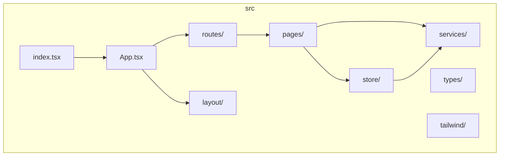
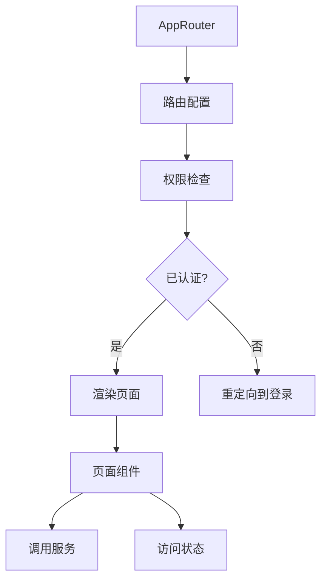
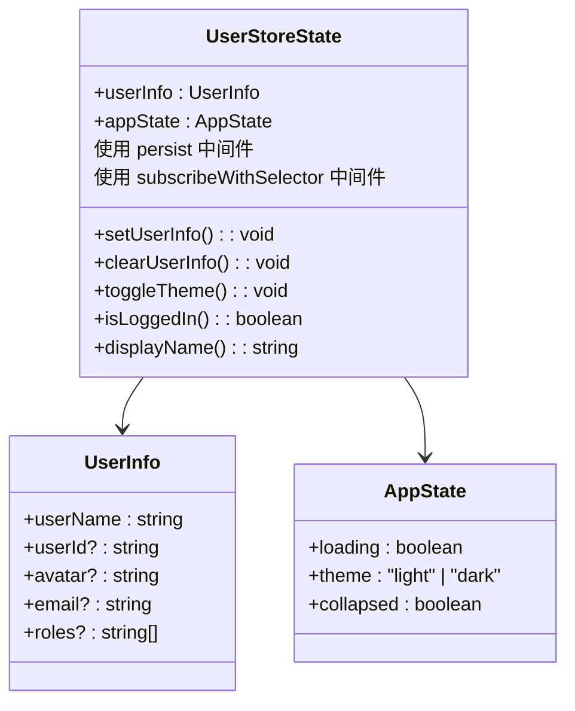
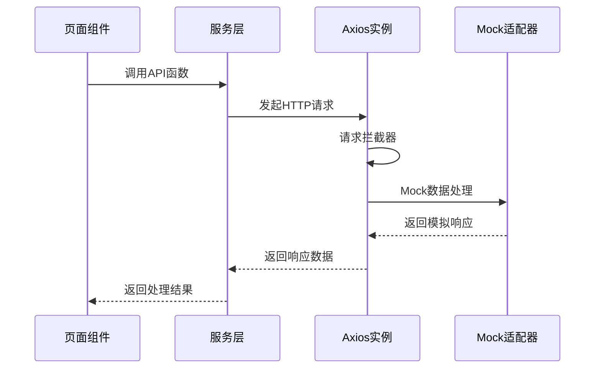
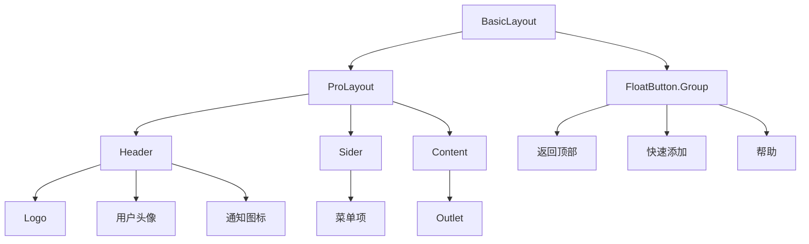

# 目录结构

<cite>
**本文档中引用的文件**  
- [README.md](file://README.md)
- [src/App.tsx](file://src/App.tsx)
- [src/index.tsx](file://src/index.tsx)
- [src/pages/home.tsx](file://src/pages/home.tsx)
- [src/routes/index.tsx](file://src/routes/index.tsx)
- [src/store/index.ts](file://src/store/index.ts)
- [src/services/index.ts](file://src/services/index.ts)
- [src/layout/BasicLayout.tsx](file://src/layout/BasicLayout.tsx)
</cite>

## 目录

1. [项目结构概览](#项目结构概览)
2. [核心目录职责](#核心目录职责)
3. [入口文件与应用初始化](#入口文件与应用初始化)
4. [路由系统组织](#路由系统组织)
5. [状态管理设计](#状态管理设计)
6. [服务与API层](#服务与api层)
7. [布局组件](#布局组件)
8. [测试结构](#测试结构)
9. [样式与配置](#样式与配置)
10. [文件命名与模块化](#文件命名与模块化)

## 项目结构概览

本项目采用基于功能模块划分的现代化React项目结构，结合TypeScript和Vite构建工具，实现了清晰的职责分离和高效的开发体验。项目结构遵循约定优于配置的原则，便于新开发者快速理解和上手。

**Diagram sources**  
- [README.md](file://README.md#L145-L155)
- [project_structure](file://project_structure)

## 核心目录职责

### 页面目录 (src/pages)
`src/pages` 目录存放所有页面级组件，每个页面对应一个独立的功能模块。该目录采用扁平化与嵌套结合的组织方式：

- `home.tsx`: 用户管理主页面，展示React 19 useOptimistic特性的实际应用
- `Settings/`: 设置页面模块，包含index.tsx
- `User/`: 用户相关页面，如登录页Login.tsx

页面组件通常包含业务逻辑、UI展示和用户交互处理，是路由系统直接加载的组件。

**Section sources**  
- [README.md](file://README.md#L148-L152)
- [src/pages/home.tsx](file://src/pages/home.tsx#L1-L20)

### 路由目录 (src/routes)
`src/routes` 目录集中管理所有路由配置，实现路由与页面的解耦：

- `index.tsx`: 主路由配置文件，整合所有路由模块
- `common-router.tsx`: 通用页面路由
- `exception-router.tsx`: 异常页面路由
- `user-router.ts`: 用户相关路由

路由配置采用声明式方式，支持权限控制、重定向和嵌套路由。

**Section sources**  
- [README.md](file://README.md#L153-L154)
- [src/routes/index.tsx](file://src/routes/index.tsx#L1-L30)

### 状态管理目录 (src/store)
`src/store` 目录使用Zustand实现全局状态管理：

- `index.ts`: 核心状态存储，包含用户信息和应用状态
- 支持持久化存储，仅持久化用户信息
- 提供类型安全的API，包含actions和computed属性

状态管理设计遵循单一状态树原则，便于状态追踪和调试。

**Section sources**  
- [README.md](file://README.md#L155-L156)
- [src/store/index.ts](file://src/store/index.ts#L1-L20)

### 服务目录 (src/services)
`src/services` 目录封装所有API服务和数据访问逻辑：

- `index.ts`: 统一的服务入口，导出所有API函数
- 基于axios实现HTTP客户端
- 包含请求/响应拦截器，处理认证和错误
- 集成Mock数据，支持开发和测试

服务层与页面组件解耦，提供一致的API调用接口。

**Section sources**  
- [README.md](file://README.md#L157-L158)
- [src/services/index.ts](file://src/services/index.ts#L1-L30)

### 布局目录 (src/layout)
`src/layout` 目录存放应用级布局组件：

- `BasicLayout.tsx`: 主应用布局，包含导航、侧边栏和全局UI元素
- `UserLayout.tsx`: 用户相关页面布局
- 使用Ant Design ProComponents实现专业布局

布局组件通过Outlet提供内容插槽，实现布局与内容的分离。

**Section sources**  
- [src/layout/BasicLayout.tsx](file://src/layout/BasicLayout.tsx#L1-L20)
- [src/layout/UserLayout.tsx](file://src/layout/UserLayout.tsx#L1-L10)

## 入口文件与应用初始化

### 主入口 (src/index.tsx)
`src/index.tsx` 是应用的最外层入口点，负责：

- 获取DOM根节点
- 创建React Root
- 渲染根组件App
- 导入全局样式

该文件临时禁用了StrictMode以兼容Ant Design的已知问题。

**Section sources**  
- [src/index.tsx](file://src/index.tsx#L1-L11)

### 根组件 (src/App.tsx)
`src/App.tsx` 是应用的根组件，提供全局上下文：

- 配置Ant Design的国际化（中文）
- 设置dayjs日期库为中文
- 包裹ErrorBoundary错误边界
- 配置BrowserRouter路由
- 注入全局配置Provider

根组件作为所有功能模块的集成点，构建应用的整体架构。

**Section sources**  
- [src/App.tsx](file://src/App.tsx#L1-L25)

## 路由系统组织

本项目采用基于react-router-dom的声明式路由系统，具有以下特点：

**Diagram sources**  
- [src/routes/index.tsx](file://src/routes/index.tsx#L1-L128)
- [src/App.tsx](file://src/App.tsx#L1-L25)

路由系统通过`checkAuth`函数实现权限控制，未认证用户将被重定向到登录页面。路由配置支持嵌套和动态加载，通过Suspense实现优雅的加载状态。

## 状态管理设计

状态管理采用Zustand库，具有轻量、类型安全和中间件支持的优势：

**Diagram sources**  
- [src/store/index.ts](file://src/store/index.ts#L15-L123)

状态设计包含用户信息和应用状态两个主要部分，通过中间件实现持久化和选择性订阅。计算属性如`isLoggedIn`和`displayName`提供便捷的状态访问。

## 服务与API层

服务层采用分层架构设计，确保网络请求的一致性和可维护性：

**Diagram sources**  
- [src/services/index.ts](file://src/services/index.ts#L1-L213)

服务层包含完整的请求/响应拦截机制，自动处理认证token、错误提示和异常跳转。集成MockAdapter支持无后端开发和测试。

## 布局组件

布局组件实现应用的视觉结构和全局交互：

**Diagram sources**  
- [src/layout/BasicLayout.tsx](file://src/layout/BasicLayout.tsx#L1-L225)

主布局组件使用Ant Design ProComponents的ProLayout，提供企业级布局能力。包含浮动按钮组、水印、主题切换等高级功能，通过Zustand状态管理实现交互响应。

## 测试结构

测试结构遵循源码目录对应原则，确保可维护性：

- `cypress/`: E2E测试，包含登录等关键流程
- `src/__tests__/`: 单元测试，与源码同级
  - 组件测试
  - 服务测试
  - 状态管理测试
  - 应用测试

测试配置包含jest.config.ts和cypress.config.ts，支持单元测试和端到端测试的完整工作流。

**Section sources**  
- [project_structure](file://project_structure)
- [README.md](file://README.md#L138-L140)

## 样式与配置

样式系统采用Tailwind CSS原子化框架：

- `tailwind/`: Tailwind相关配置
  - `tailwind.config.js`: 主配置文件
  - `postcss.config.js`: PostCSS配置
  - `index.css`: 入口样式文件
  - `tailwind.css`: 主样式表

项目配置文件包含：
- `tsconfig.json`: TypeScript配置
- `vite.config.ts`: Vite构建配置
- `eslint.config.mjs`: ESLint代码规范
- `jest.config.ts`: Jest测试配置

**Section sources**  
- [project_structure](file://project_structure)
- [README.md](file://README.md#L130-L137)

## 文件命名与模块化

项目遵循一致的文件命名约定：
- **页面组件**: `PascalCase.tsx` 或 `kebab-case.tsx`
- **布局组件**: `PascalCase.tsx`
- **服务文件**: `index.ts`
- **路由文件**: `*-router.tsx`
- **测试文件**: `*.test.tsx`

模块化设计原则：
1. **单一职责**: 每个文件只负责一个明确的功能
2. **高内聚低耦合**: 功能相关的代码组织在一起
3. **显式导出**: 使用`export default`导出主要组件
4. **类型优先**: TypeScript接口和类型定义先行
5. **路径别名**: 使用`@/`别名简化模块导入

这种组织方式支持高效的代码复用和团队协作，符合现代化前端工程实践。

**Section sources**  
- [README.md](file://README.md#L160-L173)
- [project_structure](file://project_structure)