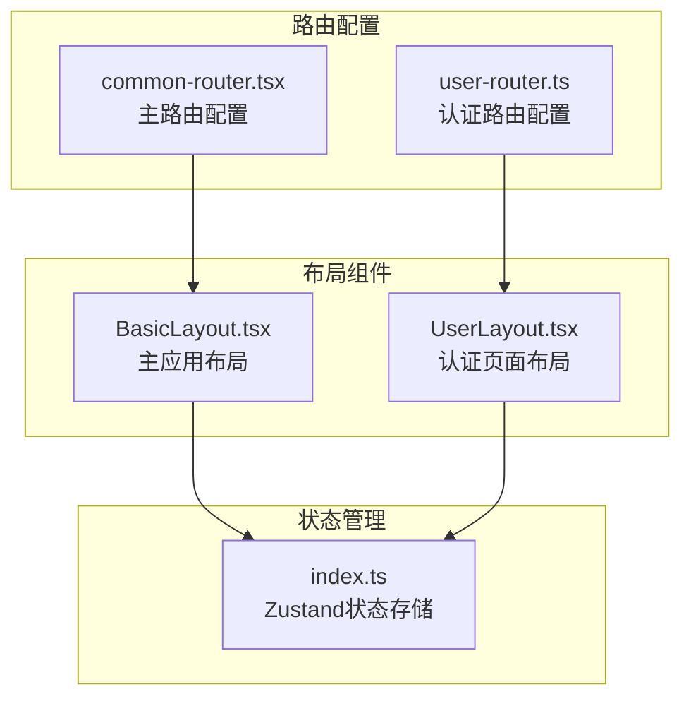
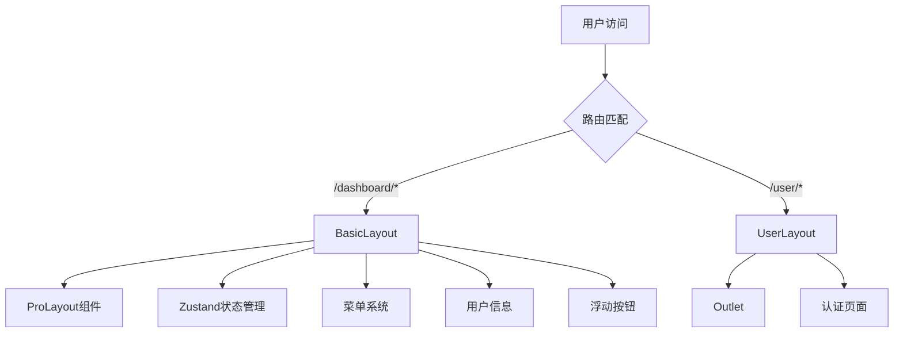
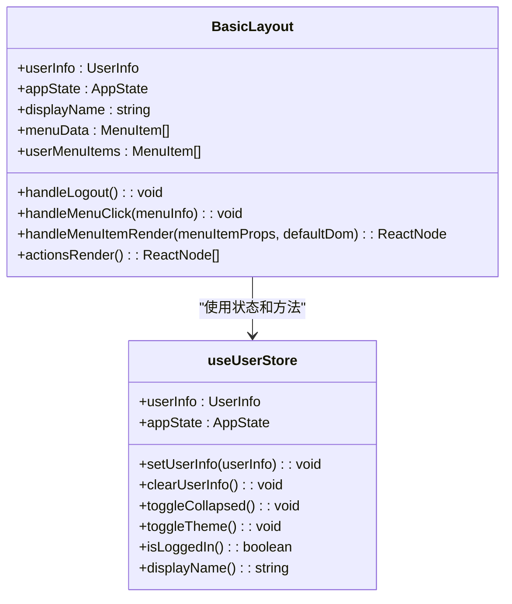
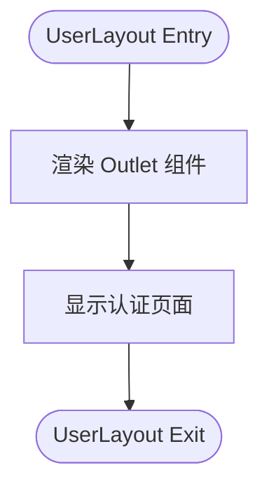
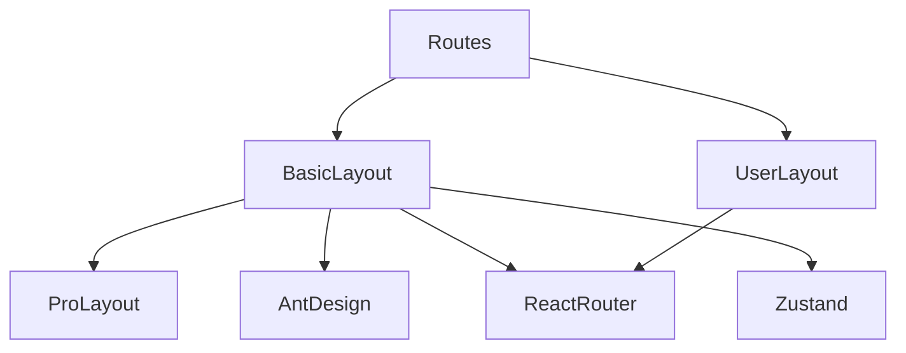

# 布局组件

<cite>
**Referenced Files in This Document**   
- [BasicLayout.tsx](file://src/layout/BasicLayout.tsx)
- [UserLayout.tsx](file://src/layout/UserLayout.tsx)
- [index.ts](file://src/store/index.ts)
- [common-router.tsx](file://src/routes/common-router.tsx)
- [user-router.ts](file://src/routes/user-router.ts)
</cite>

## Table of Contents
1. [简介](#简介)
2. [项目结构](#项目结构)
3. [核心组件](#核心组件)
4. [架构概述](#架构概述)
5. [详细组件分析](#详细组件分析)
6. [依赖分析](#依赖分析)
7. [性能考虑](#性能考虑)
8. [故障排除指南](#故障排除指南)
9. [结论](#结论)

## 简介
本文档详细分析了React应用中的两种主要布局组件：BasicLayout和UserLayout。BasicLayout作为已登录用户的主工作区布局，集成了ProLayout、菜单系统、用户信息展示和浮动操作按钮组，并与Zustand状态管理深度集成。UserLayout则作为用户认证页面的极简布局，专注于登录/注册等认证流程。文档将深入探讨两种布局组件的职责分离、响应式设计实现、状态消费机制和最佳实践。

## 项目结构
项目布局组件位于`src/layout`目录下，包含BasicLayout.tsx和UserLayout.tsx两个核心文件。BasicLayout用于主应用工作区，而UserLayout用于认证流程。路由配置文件（common-router.tsx和user-router.ts）定义了两种布局的使用场景，通过路由系统将它们与相应的页面组件关联。

**Diagram sources**
- [BasicLayout.tsx](file://src/layout/BasicLayout.tsx)
- [UserLayout.tsx](file://src/layout/UserLayout.tsx)
- [common-router.tsx](file://src/routes/common-router.tsx)
- [user-router.ts](file://src/routes/user-router.ts)

**Section sources**
- [src/layout](file://src/layout)
- [src/routes](file://src/routes)

## 核心组件
本文档的核心是分析BasicLayout和UserLayout两个布局组件的设计理念和实现方式。BasicLayout通过集成Ant Design Pro的ProLayout组件，提供了丰富的功能特性，包括可折叠的侧边栏、顶部导航、用户信息展示和浮动操作按钮组。UserLayout则遵循极简设计原则，仅包含路由出口(Outlet)，为认证页面提供最基础的容器。两种布局通过Zustand状态管理实现状态共享和响应式更新。

**Section sources**
- [BasicLayout.tsx](file://src/layout/BasicLayout.tsx)
- [UserLayout.tsx](file://src/layout/UserLayout.tsx)

## 架构概述
应用采用基于路由的布局架构，通过不同的路由配置使用不同的布局组件。当用户访问`/dashboard/*`路径时，系统使用BasicLayout作为容器；当访问`/user`路径时，则使用UserLayout。这种设计实现了清晰的职责分离：BasicLayout负责已登录用户的主工作区体验，而UserLayout专注于认证流程的简洁性。

**Diagram sources**
- [common-router.tsx](file://src/routes/common-router.tsx#L8-L53)
- [user-router.ts](file://src/routes/user-router.ts#L5-L24)

## 详细组件分析

### BasicLayout分析
BasicLayout是应用的主布局组件，为已登录用户提供完整的应用工作区。它通过ProLayout组件构建了专业的管理界面，集成了侧边栏菜单、顶部导航栏、水印和浮动操作按钮组等特性。

#### 状态集成与消费
BasicLayout通过Zustand状态管理库与应用状态进行深度集成。组件使用`useUserStore` Hook订阅用户信息和应用状态，包括用户详情、登录状态、侧边栏折叠状态等。这种状态管理方式实现了跨组件的状态共享和响应式更新。

**Diagram sources**
- [BasicLayout.tsx](file://src/layout/BasicLayout.tsx#L15-L224)
- [index.ts](file://src/store/index.ts#L41-L120)

#### 菜单系统与导航
BasicLayout实现了动态菜单系统，通过`menuData`数组定义了导航菜单项。每个菜单项包含键值、名称、路径和图标等属性。组件通过`handleMenuClick`和`handleMenuItemRender`方法处理菜单点击事件，实现页面导航功能。

**Section sources**
- [BasicLayout.tsx](file://src/layout/BasicLayout.tsx#L60-L100)

#### 用户信息与操作栏
组件在右上角渲染了用户信息和操作栏，包括通知按钮、用户下拉菜单等。用户下拉菜单提供了个人设置和退出登录等功能。这些UI元素通过`actionsRender`回调函数动态生成，实现了灵活的界面定制。

**Section sources**
- [BasicLayout.tsx](file://src/layout/BasicLayout.tsx#L130-L160)

#### 浮动操作按钮组
BasicLayout集成了浮动操作按钮组，提供快速访问常用功能的入口。按钮组包含"返回顶部"、"快速添加"和"帮助"三个功能按钮，通过`FloatButton.Group`组件实现悬停触发的交互效果。

**Section sources**
- [BasicLayout.tsx](file://src/layout/BasicLayout.tsx#L200-L220)

### UserLayout分析
UserLayout是认证流程的专用布局组件，设计极为简洁，仅包含一个`<Outlet />`组件作为路由出口。

#### 极简设计原则
UserLayout遵循极简设计原则，不包含任何导航、菜单或用户信息展示元素。这种设计确保了认证页面的专注性和简洁性，避免了不必要的干扰元素，提升了用户完成登录或注册流程的效率。

**Diagram sources**
- [UserLayout.tsx](file://src/layout/UserLayout.tsx#L2-L6)

#### 路由出口使用
`<Outlet />`组件是React Router提供的特殊组件，用于在父路由组件中渲染其子路由对应的页面。UserLayout作为父路由组件，通过`<Outlet />`动态渲染其子路由（如登录、注册页面）的内容，实现了路由嵌套和内容动态加载。

**Section sources**
- [UserLayout.tsx](file://src/layout/UserLayout.tsx#L4-L5)

### 布局对比分析
两种布局组件体现了清晰的职责分离设计模式。BasicLayout面向已登录用户，提供完整的应用工作区；UserLayout面向未登录用户，专注于认证流程。

| 特性 | BasicLayout | UserLayout |
|------|-----------|----------|
| **使用场景** | 已登录用户的主工作区 | 登录/注册等认证流程 |
| **复杂度** | 高，包含完整UI框架 | 极简，仅包含路由出口 |
| **状态依赖** | 依赖用户登录状态 | 不依赖用户状态 |
| **导航功能** | 完整的菜单系统 | 无导航功能 |
| **用户交互** | 丰富的用户操作 | 专注于表单交互 |
| **响应式设计** | 支持侧边栏折叠 | 固定布局 |

**Section sources**
- [BasicLayout.tsx](file://src/layout/BasicLayout.tsx)
- [UserLayout.tsx](file://src/layout/UserLayout.tsx)

## 依赖分析
布局组件与多个核心模块存在依赖关系。BasicLayout依赖ProLayout组件库、Ant Design UI组件、React Router和Zustand状态管理。UserLayout仅依赖React Router的核心功能。路由配置文件定义了布局组件的使用场景，实现了布局与页面的解耦。

**Diagram sources**
- [BasicLayout.tsx](file://src/layout/BasicLayout.tsx#L1-L10)
- [UserLayout.tsx](file://src/layout/UserLayout.tsx#L1-L2)
- [common-router.tsx](file://src/routes/common-router.tsx#L1-L5)
- [user-router.ts](file://src/routes/user-router.ts#L1-L5)

## 性能考虑
布局组件的设计考虑了性能优化。BasicLayout使用`memo`进行组件记忆化，避免不必要的重新渲染。路由配置采用懒加载(lazy)方式，实现代码分割和按需加载，减少初始加载时间。Zustand状态管理的细粒度订阅确保只有相关组件会在状态变化时重新渲染。

## 故障排除指南
当布局组件出现问题时，应首先检查路由配置是否正确引用了布局组件。对于BasicLayout，需确认Zustand store的状态是否正确初始化，以及ProLayout的配置属性是否设置正确。对于UserLayout，主要检查`<Outlet />`是否正确渲染了子路由内容。

**Section sources**
- [common-router.tsx](file://src/routes/common-router.tsx)
- [user-router.ts](file://src/routes/user-router.ts)

## 结论
BasicLayout和UserLayout两种布局组件通过清晰的职责分离，为应用提供了专业的工作区体验和简洁的认证流程。BasicLayout通过集成ProLayout和Zustand，实现了功能丰富且响应式的主界面；UserLayout则通过极简设计，确保了认证流程的高效性。这种布局设计模式值得在类似的应用中推广使用。