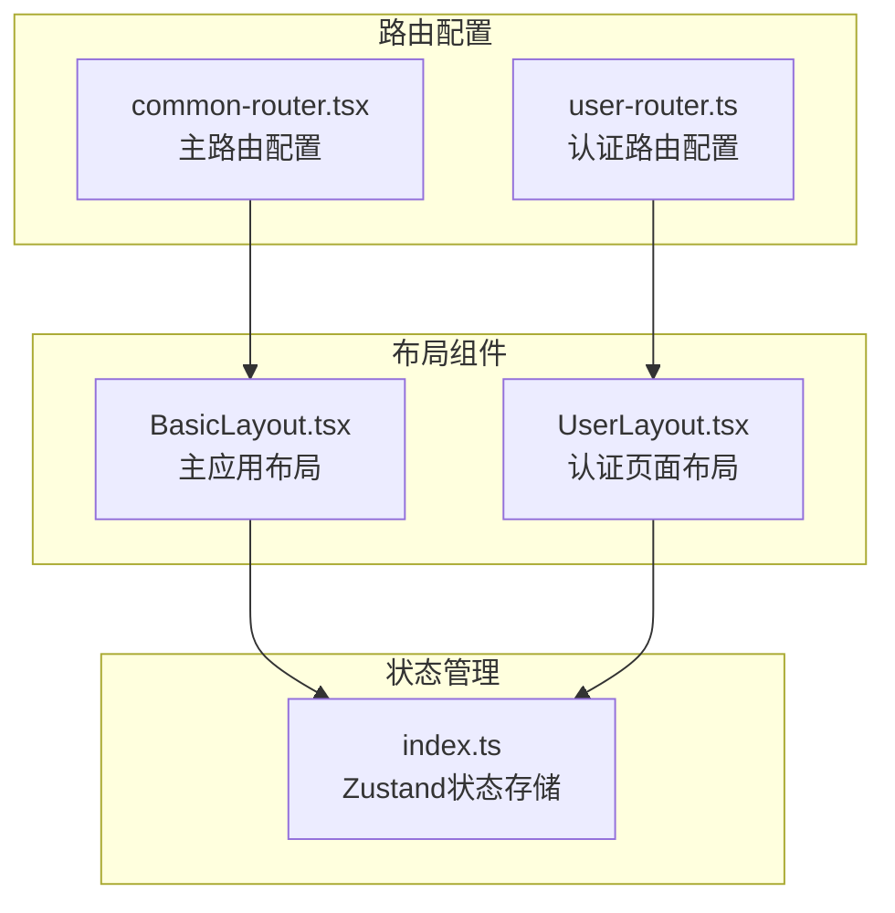
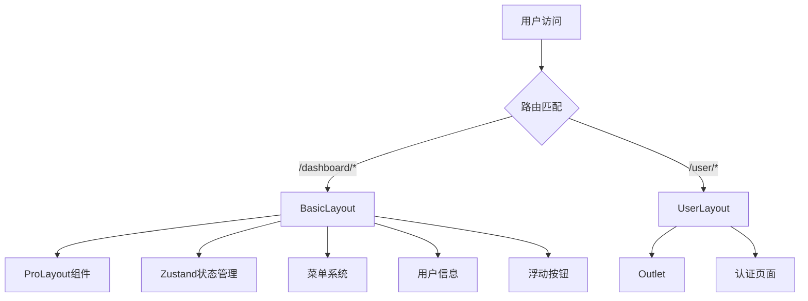
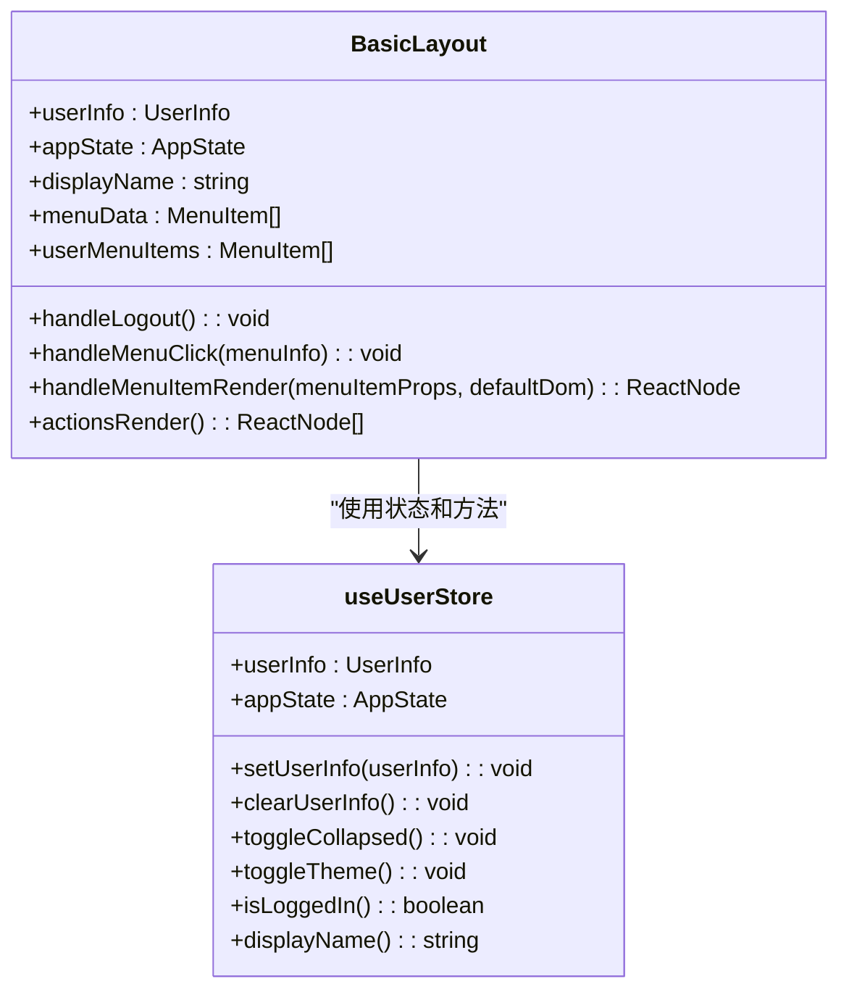
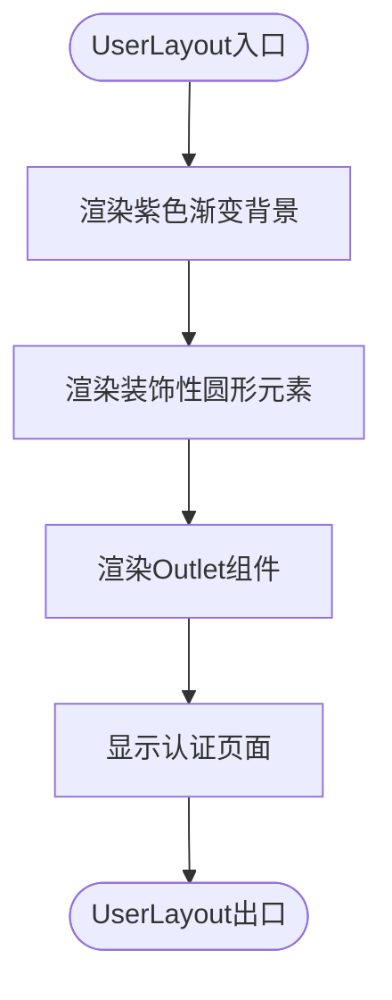
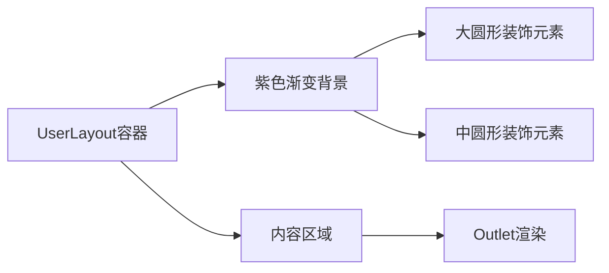
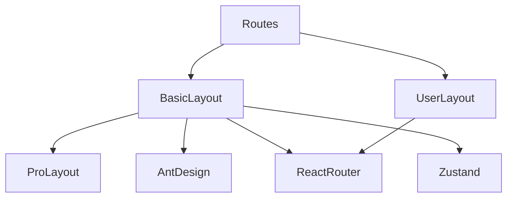

# 布局组件

<cite>
**本文引用的文件**
- [BasicLayout.tsx](file://src/layout/BasicLayout.tsx)
- [UserLayout.tsx](file://src/layout/UserLayout.tsx)
- [index.ts](file://src/store/index.ts)
- [common-router.tsx](file://src/routes/common-router.tsx)
- [user-router.ts](file://src/routes/user-router.ts)
</cite>

## 更新摘要
**变更内容**
- 更新了UserLayout的主题设计分析，包含新的紫色渐变背景和装饰性圆形元素
- 补充了BasicLayout用户头像按钮的渐变配色方案说明
- 强调了两种布局组件在视觉设计上的一致性原则
- 更新了布局组件的色彩设计方案和用户体验分析

## 目录
1. [简介](#简介)
2. [项目结构](#项目结构)
3. [核心组件](#核心组件)
4. [架构概述](#架构概述)
5. [详细组件分析](#详细组件分析)
6. [视觉设计与主题系统](#视觉设计与主题系统)
7. [依赖分析](#依赖分析)
8. [性能考虑](#性能考虑)
9. [故障排除指南](#故障排除指南)
10. [结论](#结论)

## 简介
本文档详细分析了React应用中的两种主要布局组件：BasicLayout和UserLayout。BasicLayout作为已登录用户的主工作区布局，集成了ProLayout、菜单系统、用户信息展示和浮动操作按钮组，并与Zustand状态管理深度集成。UserLayout则作为用户认证页面的极简布局，专注于登录/注册等认证流程。文档将深入探讨两种布局组件的职责分离、响应式设计实现、状态消费机制和最佳实践，特别关注最新的视觉设计统一性改进。

## 项目结构
项目布局组件位于`src/layout`目录下，包含BasicLayout.tsx和UserLayout.tsx两个核心文件。BasicLayout用于主应用工作区，而UserLayout用于认证流程。路由配置文件（common-router.tsx和user-router.ts）定义了两种布局的使用场景，通过路由系统将它们与相应的页面组件关联。

```mermaid
graph TB
subgraph "布局组件"
BasicLayout["BasicLayout.tsx<br/>主应用布局"]
UserLayout["UserLayout.tsx<br/>认证页面布局"]
end
subgraph "路由配置"
CommonRouter["common-router.tsx<br/>主路由配置"]
UserRouter["user-router.ts<br/>认证路由配置"]
end
subgraph "状态管理"
Store["index.ts<br/>Zustand状态存储"]
end
CommonRouter --> BasicLayout
UserRouter --> UserLayout
BasicLayout --> Store
UserLayout --> Store
```

**图表来源**
- [BasicLayout.tsx](file://src/layout/BasicLayout.tsx)
- [UserLayout.tsx](file://src/layout/UserLayout.tsx)
- [common-router.tsx](file://src/routes/common-router.tsx)
- [user-router.ts](file://src/routes/user-router.ts)

**章节来源**
- [src/layout](file://src/layout)
- [src/routes](file://src/routes)

## 核心组件
本文档的核心是分析BasicLayout和UserLayout两个布局组件的设计理念和实现方式。BasicLayout通过集成Ant Design Pro的ProLayout组件，提供了丰富的功能特性，包括可折叠的侧边栏、顶部导航、用户信息展示和浮动操作按钮组。UserLayout则遵循极简设计原则，仅包含路由出口(Outlet)，为认证页面提供最基础的容器。两种布局通过Zustand状态管理实现状态共享和响应式更新。

**章节来源**
- [BasicLayout.tsx](file://src/layout/BasicLayout.tsx)
- [UserLayout.tsx](file://src/layout/UserLayout.tsx)

## 架构概述
应用采用基于路由的布局架构，通过不同的路由配置使用不同的布局组件。当用户访问`/dashboard/*`路径时，系统使用BasicLayout作为容器；当访问`/user`路径时，则使用UserLayout。这种设计实现了清晰的职责分离：BasicLayout负责已登录用户的主工作区体验，而UserLayout专注于认证流程的简洁性。

```mermaid
graph TD
A[用户访问] --> B{路由匹配}
B --> |/dashboard/*| C[BasicLayout]
B --> |/user/*| D[UserLayout]
C --> E[ProLayout组件]
C --> F[Zustand状态管理]
C --> G[菜单系统]
C --> H[用户信息]
C --> I[浮动按钮]
D --> J[Outlet]
D --> K[认证页面]
```

**图表来源**
- [common-router.tsx:8-53](file://src/routes/common-router.tsx#L8-L53)
- [user-router.ts:5-24](file://src/routes/user-router.ts#L5-L24)

## 详细组件分析

### BasicLayout分析
BasicLayout是应用的主布局组件，为已登录用户提供完整的应用工作区。它通过ProLayout组件构建了专业的管理界面，集成了侧边栏菜单、顶部导航栏、水印和浮动操作按钮组等特性。

#### 状态集成与消费
BasicLayout通过Zustand状态管理库与应用状态进行深度集成。组件使用`useUserStore` Hook订阅用户信息和应用状态，包括用户详情、登录状态、侧边栏折叠状态等。这种状态管理方式实现了跨组件的状态共享和响应式更新。

```mermaid
classDiagram
class useUserStore {
+userInfo : UserInfo
+appState : AppState
+setUserInfo(userInfo) : void
+clearUserInfo() : void
+toggleCollapsed() : void
+toggleTheme() : void
+isLoggedIn() : boolean
+displayName() : string
}
class BasicLayout {
+userInfo : UserInfo
+appState : AppState
+displayName : string
+menuData : MenuItem[]
+userMenuItems : MenuItem[]
+handleLogout() : void
+handleMenuClick(menuInfo) : void
+handleMenuItemRender(menuItemProps, defaultDom) : ReactNode
+actionsRender() : ReactNode[]
}
BasicLayout --> useUserStore : "使用状态和方法"
```

**图表来源**
- [BasicLayout.tsx:15-224](file://src/layout/BasicLayout.tsx#L15-L224)
- [index.ts:41-120](file://src/store/index.ts#L41-L120)

#### 菜单系统与导航
BasicLayout实现了动态菜单系统，通过`menuData`数组定义了导航菜单项。每个菜单项包含键值、名称、路径和图标等属性。组件通过`handleMenuClick`和`handleMenuItemRender`方法处理菜单点击事件，实现页面导航功能。

**章节来源**
- [BasicLayout.tsx:60-100](file://src/layout/BasicLayout.tsx#L60-L100)

#### 用户信息与操作栏
组件在右上角渲染了用户信息和操作栏，包括通知按钮、用户下拉菜单等。用户下拉菜单提供了个人设置和退出登录等功能。这些UI元素通过`actionsRender`回调函数动态生成，实现了灵活的界面定制。

**章节来源**
- [BasicLayout.tsx:130-160](file://src/layout/BasicLayout.tsx#L130-L160)

#### 浮动操作按钮组
BasicLayout集成了浮动操作按钮组，提供快速访问常用功能的入口。按钮组包含"返回顶部"、"快速添加"和"帮助"三个功能按钮，通过`FloatButton.Group`组件实现悬停触发的交互效果。

**章节来源**
- [BasicLayout.tsx:200-220](file://src/layout/BasicLayout.tsx#L200-L220)

### UserLayout分析
UserLayout是认证流程的专用布局组件，设计极为简洁，仅包含一个`<Outlet />`组件作为路由出口。

#### 极简设计原则
UserLayout遵循极简设计原则，不包含任何导航、菜单或用户信息展示元素。这种设计确保了认证页面的专注性和简洁性，避免了不必要的干扰元素，提升了用户完成登录或注册流程的效率。

```mermaid
flowchart TD
Start([UserLayout入口]) --> RenderBackground["渲染紫色渐变背景"]
RenderBackground --> RenderDecorations["渲染装饰性圆形元素"]
RenderDecorations --> RenderOutlet["渲染Outlet组件"]
RenderOutlet --> DisplayPage["显示认证页面"]
DisplayPage --> End([UserLayout出口])
```

**图表来源**
- [UserLayout.tsx:3-52](file://src/layout/UserLayout.tsx#L3-L52)

#### 主题设计与装饰元素
UserLayout采用了全新的紫色渐变主题设计，使用`linear-gradient(135deg, #667eea 0%, #764ba2 100%)`创建了优雅的视觉背景。同时包含多个装饰性圆形背景元素，通过不同大小和透明度的圆形实现层次感和视觉深度。

**章节来源**
- [UserLayout.tsx:5-49](file://src/layout/UserLayout.tsx#L5-L49)

#### 路由出口使用
`<Outlet />`组件是React Router提供的特殊组件，用于在父路由组件中渲染其子路由对应的页面。UserLayout作为父路由组件，通过`<Outlet />`动态渲染其子路由（如登录、注册页面）的内容，实现了路由嵌套和内容动态加载。

**章节来源**
- [UserLayout.tsx:47-49](file://src/layout/UserLayout.tsx#L47-L49)

### 布局对比分析
两种布局组件体现了清晰的职责分离设计模式。BasicLayout面向已登录用户，提供完整的应用工作区；UserLayout面向未登录用户，专注于认证流程。

| 特性 | BasicLayout | UserLayout |
|------|-----------|----------|
| **使用场景** | 已登录用户的主工作区 | 登录/注册等认证流程 |
| **复杂度** | 高，包含完整UI框架 | 极简，仅包含路由出口 |
| **状态依赖** | 依赖用户登录状态 | 不依赖用户状态 |
| **导航功能** | 完整的菜单系统 | 无导航功能 |
| **用户交互** | 丰富的用户操作 | 专注于表单交互 |
| **响应式设计** | 支持侧边栏折叠 | 固定布局 |
| **视觉设计** | 专业工作区界面 | 紫色渐变主题 |

**章节来源**
- [BasicLayout.tsx](file://src/layout/BasicLayout.tsx)
- [UserLayout.tsx](file://src/layout/UserLayout.tsx)

## 视觉设计与主题系统

### 设计一致性原则
两种布局组件在视觉设计上体现了统一的主题系统，特别是在色彩方案上的协调一致。这种设计策略确保了用户在不同页面间的视觉连贯性，增强了品牌识别度。

#### 色彩方案统一
- **主色调**：统一采用紫色渐变（#667eea 到 #764ba2）
- **渐变效果**：135度对角线渐变，营造现代感和科技感
- **透明度控制**：通过不同透明度的白色覆盖层创造层次感
- **阴影效果**：配合卡片式设计，增强立体感

#### 装饰元素设计
UserLayout的装饰性圆形元素设计体现了以下特点：
- **大圆形元素**：半径600px，透明度0.1，位于右上角
- **中圆形元素**：半径400px，透明度0.08，位于左下角
- **相对定位**：使用绝对定位确保背景元素不影响主要内容布局
- **层级控制**：通过z-index确保装饰元素位于内容下方

```mermaid
graph LR
A[UserLayout容器] --> B[紫色渐变背景]
B --> C[大圆形装饰元素]
B --> D[中圆形装饰元素]
A --> E[内容区域]
E --> F[Outlet渲染]
```

**图表来源**
- [UserLayout.tsx:5-49](file://src/layout/UserLayout.tsx#L5-L49)

### 用户体验优化
- **视觉焦点**：装饰元素不会分散用户注意力，保持认证表单的视觉焦点
- **响应式适配**：圆形元素在不同屏幕尺寸下保持比例和效果
- **性能考虑**：CSS渐变和简单几何图形确保渲染性能
- **无障碍设计**：颜色对比度符合基本的可访问性要求

**章节来源**
- [UserLayout.tsx:11-49](file://src/layout/UserLayout.tsx#L11-L49)

## 依赖分析
布局组件与多个核心模块存在依赖关系。BasicLayout依赖ProLayout组件库、Ant Design UI组件、React Router和Zustand状态管理。UserLayout仅依赖React Router的核心功能。路由配置文件定义了布局组件的使用场景，实现了布局与页面的解耦。

```mermaid
graph TD
BasicLayout --> ProLayout
BasicLayout --> AntDesign
BasicLayout --> ReactRouter
BasicLayout --> Zustand
UserLayout --> ReactRouter
Routes --> BasicLayout
Routes --> UserLayout
```

**图表来源**
- [BasicLayout.tsx:1-10](file://src/layout/BasicLayout.tsx#L1-L10)
- [UserLayout.tsx:1-2](file://src/layout/UserLayout.tsx#L1-L2)
- [common-router.tsx:1-5](file://src/routes/common-router.tsx#L1-L5)
- [user-router.ts:1-5](file://src/routes/user-router.ts#L1-L5)

## 性能考虑
布局组件的设计考虑了性能优化。BasicLayout使用`memo`进行组件记忆化，避免不必要的重新渲染。路由配置采用懒加载(lazy)方式，实现代码分割和按需加载，减少初始加载时间。Zustand状态管理的细粒度订阅确保只有相关组件会在状态变化时重新渲染。

## 故障排除指南
当布局组件出现问题时，应首先检查路由配置是否正确引用了布局组件。对于BasicLayout，需确认Zustand store的状态是否正确初始化，以及ProLayout的配置属性是否设置正确。对于UserLayout，主要检查`<Outlet />`是否正确渲染了子路由内容，以及CSS样式是否正确应用。

**章节来源**
- [common-router.tsx](file://src/routes/common-router.tsx)
- [user-router.ts](file://src/routes/user-router.ts)

## 结论
BasicLayout和UserLayout两种布局组件通过清晰的职责分离，为应用提供了专业的工作区体验和简洁的认证流程。BasicLayout通过集成ProLayout和Zustand，实现了功能丰富且响应式的主界面；UserLayout则通过极简设计和统一的紫色渐变主题，确保了认证流程的高效性和视觉一致性。最新的视觉设计改进进一步强化了品牌识别度，两种布局在色彩方案和设计语言上的统一为用户提供了连贯的使用体验。这种布局设计模式值得在类似的应用中推广使用。