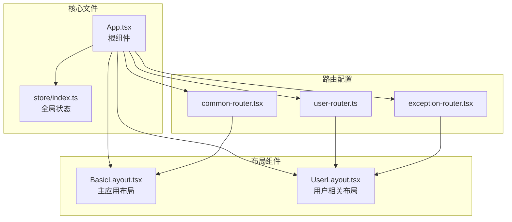
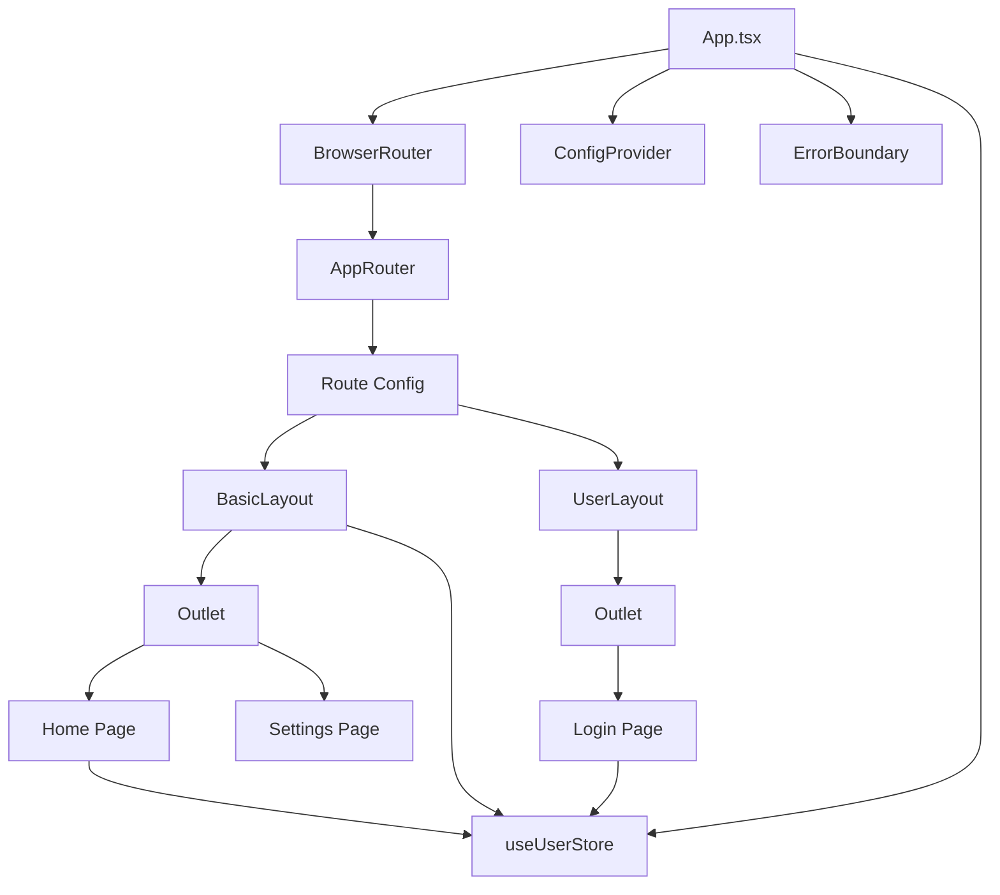
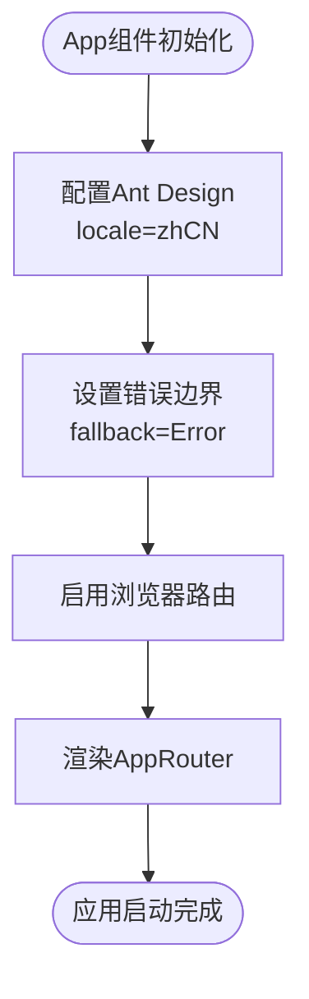
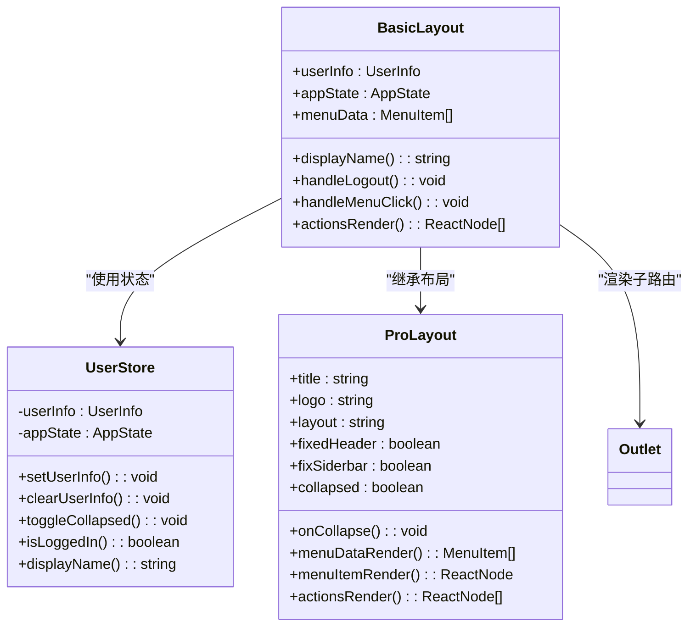
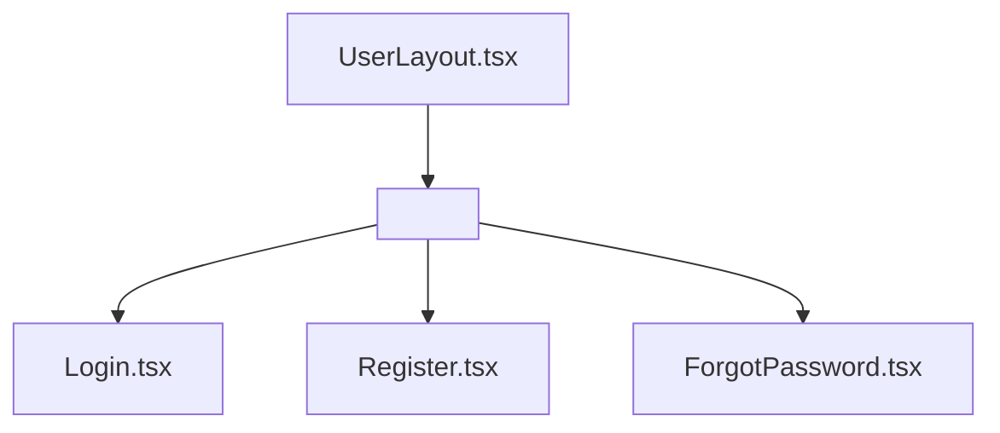
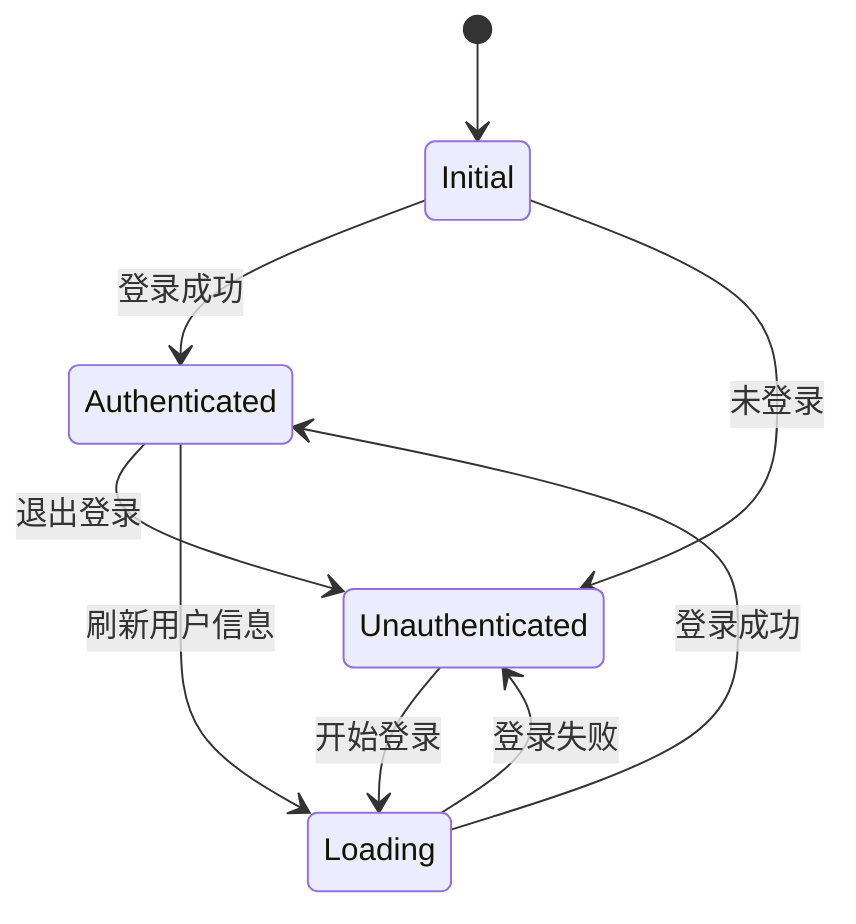

# 组件架构

<cite>
**本文档中引用的文件**  
- [App.tsx](file://src/App.tsx)
- [BasicLayout.tsx](file://src/layout/BasicLayout.tsx)
- [UserLayout.tsx](file://src/layout/UserLayout.tsx)
- [common-router.tsx](file://src/routes/common-router.tsx)
- [user-router.ts](file://src/routes/user-router.ts)
- [exception-router.tsx](file://src/routes/exception-router.tsx)
- [index.tsx](file://src/routes/index.tsx)
- [index.ts](file://src/store/index.ts)
</cite>

## 目录
1. [介绍](#介绍)
2. [项目结构](#项目结构)
3. [核心组件](#核心组件)
4. [架构概览](#架构概览)
5. [详细组件分析](#详细组件分析)
6. [依赖分析](#依赖分析)
7. [性能考虑](#性能考虑)
8. [故障排除指南](#故障排除指南)
9. [结论](#结论)

## 介绍
本项目采用现代化的React组件架构，结合Zustand状态管理、React Router路由控制和Ant Design Pro组件库，构建了一个可扩展、可维护的企业级前端应用。文档将深入分析根组件App.tsx如何集成路由与状态管理，探讨BasicLayout.tsx和UserLayout.tsx两种布局组件的设计模式与使用场景，并阐述组件层次结构、props传递、状态提升等核心概念在实际项目中的应用。

## 项目结构
项目采用功能模块化组织方式，主要分为以下几个目录：
- `layout/`：存放全局布局组件，如BasicLayout和UserLayout
- `pages/`：存放页面级组件，如登录页、首页、设置页等
- `routes/`：集中管理路由配置，实现路由与布局的解耦
- `store/`：使用Zustand实现全局状态管理
- `services/`：封装API服务调用

这种结构清晰地分离了关注点，提高了代码的可维护性和可测试性。



**Diagram sources**
- [App.tsx](file://src/App.tsx#L1-L25)
- [BasicLayout.tsx](file://src/layout/BasicLayout.tsx#L28-L219)
- [UserLayout.tsx](file://src/layout/UserLayout.tsx#L2-L4)
- [common-router.tsx](file://src/routes/common-router.tsx#L8-L53)
- [user-router.ts](file://src/routes/user-router.ts#L5-L24)
- [exception-router.tsx](file://src/routes/exception-router.tsx#L5-L33)

**Section sources**
- [App.tsx](file://src/App.tsx#L1-L25)
- [layout/](file://src/layout/)
- [routes/](file://src/routes/)

## 核心组件
App.tsx作为应用的根组件，负责集成全局依赖和初始化应用环境。它通过ConfigProvider配置Ant Design的全局行为，使用ErrorBoundary提供错误边界保护，并通过BrowserRouter启用客户端路由功能。最关键的是，它将路由配置`router`作为子元素渲染，实现了路由系统的注入。

BasicLayout.tsx是主应用的布局容器，包含侧边栏、顶部导航、用户信息、浮动按钮等复杂UI元素，适用于已登录用户的主工作区。UserLayout.tsx则是一个极简布局，仅包含一个`<Outlet />`占位符，适用于登录、注册等轻量级页面。

**Section sources**
- [App.tsx](file://src/App.tsx#L12-L22)
- [BasicLayout.tsx](file://src/layout/BasicLayout.tsx#L28-L219)
- [UserLayout.tsx](file://src/layout/UserLayout.tsx#L2-L4)

## 架构概览
整个应用采用分层架构设计，从外到内依次为：
1. **路由层**：由React Router驱动，通过嵌套路由实现页面组织
2. **布局层**：由BasicLayout和UserLayout构成，决定页面的整体结构
3. **状态管理层**：由Zustand store统一管理用户信息和应用状态
4. **业务逻辑层**：由各个页面组件实现具体功能



**Diagram sources**
- [App.tsx](file://src/App.tsx#L1-L25)
- [index.tsx](file://src/routes/index.tsx#L1-L127)
- [BasicLayout.tsx](file://src/layout/BasicLayout.tsx#L28-L219)
- [UserLayout.tsx](file://src/layout/UserLayout.tsx#L2-L4)
- [index.ts](file://src/store/index.ts#L41-L120)

## 详细组件分析

### App组件分析
App组件是整个应用的入口点，它通过组合多个高阶组件来构建应用的基础框架。其主要职责包括：
- 配置Ant Design的全局语言为中文
- 设置dayjs日期库的本地化
- 提供错误边界保护
- 初始化路由系统



**Diagram sources**
- [App.tsx](file://src/App.tsx#L1-L25)

**Section sources**
- [App.tsx](file://src/App.tsx#L1-L25)

### 布局组件分析

#### BasicLayout组件
BasicLayout是一个功能完整的应用布局，其设计体现了职责分离原则：
- 使用ProLayout提供高级布局能力
- 通过useUserStore从全局状态获取用户信息和应用状态
- 实现菜单渲染、用户下拉菜单、操作按钮等交互功能
- 包含浮动按钮组提供快捷操作



**Diagram sources**
- [BasicLayout.tsx](file://src/layout/BasicLayout.tsx#L28-L219)
- [index.ts](file://src/store/index.ts#L41-L120)

#### UserLayout组件
UserLayout是一个极简布局组件，仅包含最基本的路由出口。这种设计模式适用于用户认证相关的页面，如登录、注册、找回密码等，这些页面通常不需要复杂的导航结构。



**Diagram sources**
- [UserLayout.tsx](file://src/layout/UserLayout.tsx#L2-L4)

**Section sources**
- [UserLayout.tsx](file://src/layout/UserLayout.tsx#L2-L4)

### 状态管理分析
项目使用Zustand实现全局状态管理，相比Redux更加轻量且易于使用。useUserStore包含了用户信息、应用状态以及相应的操作方法，通过中间件persist实现了状态持久化。



**Diagram sources**
- [index.ts](file://src/store/index.ts#L41-L120)

**Section sources**
- [index.ts](file://src/store/index.ts#L41-L120)

## 依赖分析
项目通过路由配置文件实现了布局组件与路由的解耦。common-router.tsx引用BasicLayout用于主应用区域，而user-router.ts和exception-router.tsx引用UserLayout用于用户认证和异常页面。

```mermaid
erDiagram
ROUTER_CONFIG {
string path PK
string key
component component
boolean auth
string redirect
}
LAYOUT_COMPONENT {
string name PK
string description
}
ROUTER_CONFIG ||--o{ LAYOUT_COMPONENT : "使用"
ROUTER_CONFIG {
"common-router" "BasicLayout"
"user-router" "UserLayout"
"exception-router" "UserLayout"
}
```

**Diagram sources**
- [common-router.tsx](file://src/routes/common-router.tsx#L8-L53)
- [user-router.ts](file://src/routes/user-router.ts#L5-L24)
- [exception-router.tsx](file://src/routes/exception-router.tsx#L5-L33)

**Section sources**
- [common-router.tsx](file://src/routes/common-router.tsx#L8-L53)
- [user-router.ts](file://src/routes/user-router.ts#L5-L24)
- [exception-router.tsx](file://src/routes/exception-router.tsx#L5-L33)

## 性能考虑
- 使用React.memo对布局组件进行记忆化，避免不必要的重渲染
- 采用lazy加载路由组件，实现代码分割和按需加载
- 使用useMemo和useCallback优化性能关键路径
- 通过Zustand的select模式精确订阅状态变化

## 故障排除指南
- **页面空白**：检查路由配置是否正确，确保组件路径无误
- **状态不持久**：确认persist中间件配置正确，检查localStorage键名
- **样式丢失**：确保Ant Design的reset.css已正确引入
- **路由不生效**：检查BrowserRouter是否包裹了所有路由组件

**Section sources**
- [App.tsx](file://src/App.tsx#L1-L25)
- [index.ts](file://src/store/index.ts#L114-L114)

## 结论
该项目展示了现代化React应用的组件架构最佳实践。通过合理的组件分层、清晰的职责划分和有效的状态管理，构建了一个可扩展、可维护的应用框架。BasicLayout和UserLayout的双布局模式灵活应对不同场景需求，而Zustand状态管理提供了简洁高效的状态解决方案。这种架构为后续功能扩展和团队协作奠定了良好基础。