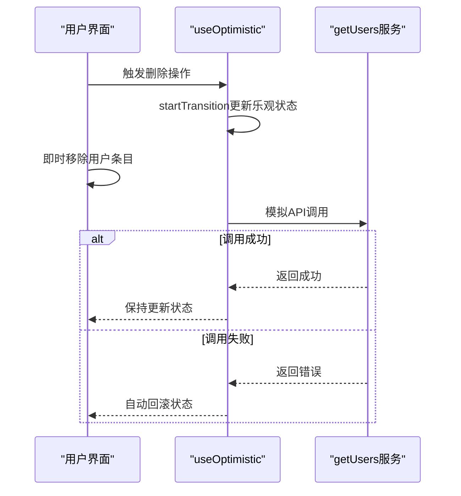
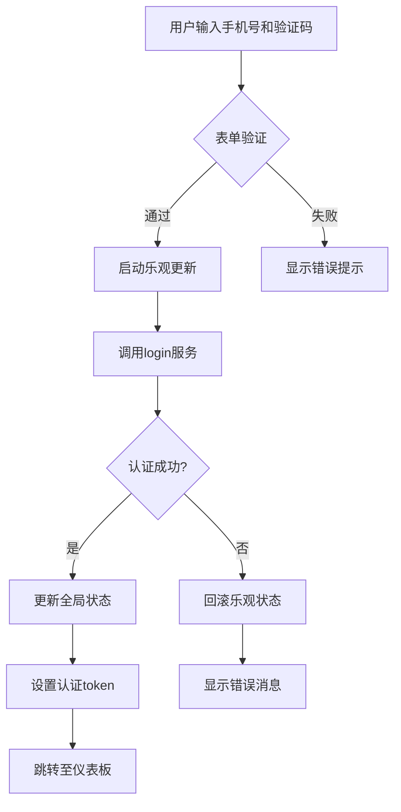
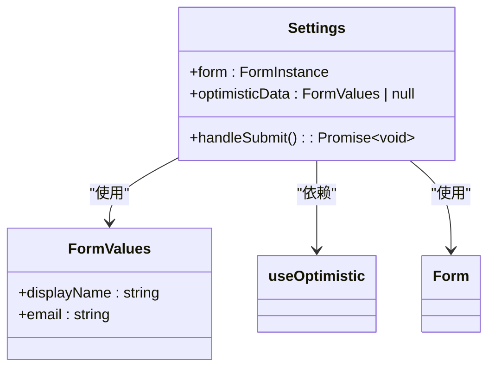
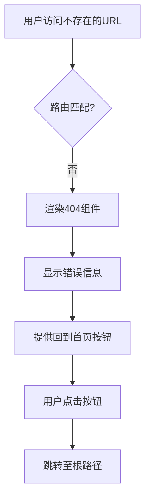

# 页面组件

<cite>
**Referenced Files in This Document**   
- [home.tsx](file://src/pages/home.tsx)
- [Login.tsx](file://src/pages/User/Login.tsx)
- [index.tsx](file://src/pages/Settings/index.tsx)
- [404.tsx](file://src/pages/Exception/404.tsx)
- [index.ts](file://src/store/index.ts)
- [index.ts](file://src/services/index.ts)
</cite>

## 目录
1. [首页组件](#首页组件)
2. [登录组件](#登录组件)
3. [个人设置页面](#个人设置页面)
4. [异常页面](#异常页面)
5. [最佳实践总结](#最佳实践总结)

## 首页组件

`home.tsx` 作为应用的首页组件，实现了基于 `useOptimistic` Hook 的用户列表乐观更新机制。该组件通过 ProTable 展示用户数据，利用 `getUsers` 服务进行数据加载，并通过 `useOptimistic` 实现了删除和添加用户的即时UI反馈。

组件通过 `useOptimistic<User[]>` 创建乐观更新状态，初始值为空数组。当用户触发删除操作时，`handleDelete` 回调立即通过 `startTransition` 更新乐观状态，从列表中移除目标用户，实现即时的UI响应。随后模拟API调用，若成功则保持状态，若失败则自动回滚到原始状态。添加用户操作采用相同模式，先在乐观状态中添加新用户，再进行异步API调用。

表格操作列中的删除按钮绑定 `handleDelete` 回调，编辑按钮绑定 `handleEdit` 回调（当前为占位实现）。工具栏的"新建用户"按钮和浮动按钮均绑定 `handleAdd` 回调，提供多入口创建功能。组件还通过条件渲染展示乐观更新状态提示，增强用户体验。

**Diagram sources**
- [home.tsx](file://src/pages/home.tsx#L45-L100)
- [index.ts](file://src/services/index.ts#L206-L206)

**Section sources**
- [home.tsx](file://src/pages/home.tsx#L1-L295)

## 登录组件

`Login.tsx` 组件实现了完整的表单验证、登录状态管理和路由跳转逻辑。该组件使用 ProForm 构建登录表单，包含手机号和验证码输入字段，并通过内置规则进行格式验证。

组件通过 `useOptimistic<LoginParams | null>` 创建乐观更新状态，初始值为 null。当用户提交表单时，`onFinish` 回调首先启动乐观更新，将表单数据设置为乐观状态，立即更新UI显示"登录中..."状态。随后调用 `login` 服务进行身份验证。认证成功后，通过 `useUserStore` 的 `setUserInfo` 方法更新全局状态，将用户信息持久化到 localStorage，并设置认证token，最后跳转至仪表板页面。

组件的提交按钮通过 `submitButtonProps.loading` 和 `submitter.searchConfig.submitText` 动态绑定乐观状态，实现加载指示。登录状态提示区域根据 `optimisticLogin` 是否为 null 来决定是否显示"正在登录中..."的消息，提供清晰的反馈。

**Diagram sources**
- [Login.tsx](file://src/pages/User/Login.tsx#L15-L162)
- [index.ts](file://src/store/index.ts#L41-L120)

**Section sources**
- [Login.tsx](file://src/pages/User/Login.tsx#L1-L162)
- [index.ts](file://src/store/index.ts#L20-L122)

## 个人设置页面

`Settings/index.tsx` 组件展示了结构化的设计模式和功能预留机制。该组件采用卡片式布局，包含显示名称和邮箱两个可编辑字段，通过 Form 组件进行表单管理和验证。

组件使用 `useOptimistic<FormValues | null>` 实现表单的乐观更新。当用户点击保存时，`handleSubmit` 回调首先验证表单，然后启动乐观更新，将当前值设置为乐观状态。这使得输入框能立即显示新值，即使API调用尚未完成。同时，保存按钮的文本和加载状态也绑定到乐观状态，显示"保存中..."。

该组件的设计模式体现了功能预留思想：虽然当前仅实现基础表单，但其结构支持轻松扩展更多设置项。`FormValues` 接口可扩展以包含新字段，`useOptimistic` 模式可应用于所有设置项的更新，确保一致的用户体验。错误处理机制已预留，尽管当前仅依赖antd的内置验证。

**Diagram sources**
- [index.tsx](file://src/pages/Settings/index.tsx#L1-L121)

**Section sources**
- [index.tsx](file://src/pages/Settings/index.tsx#L1-L121)

## 异常页面

`Exception/404.tsx` 组件实现了路由兜底机制和用户体验设计。该组件作为应用的404错误页面，当用户访问不存在的路由时被渲染。

组件使用 Ant Design 的 Result 组件展示标准化的错误信息，包含状态码"404"、标题"对不起，您访问的页面不存在"和操作按钮。"回到首页"按钮绑定点击事件，通过修改 `window.location.href` 实现页面跳转，提供明确的恢复路径。

该组件的设计体现了用户体验优先原则：简洁明了的错误信息避免用户困惑，醒目的操作按钮提供明确的下一步指引，整体布局符合Ant Design的设计规范。作为路由系统的一部分，它与 `routes/exception-router.tsx` 配合，确保所有未匹配的路由都能被优雅处理。

**Diagram sources**
- [404.tsx](file://src/pages/Exception/404.tsx#L1-L23)

**Section sources**
- [404.tsx](file://src/pages/Exception/404.tsx#L1-L23)

## 最佳实践总结

本项目中的页面组件展示了现代React应用开发的多项最佳实践。首先，`useOptimistic` Hook 的广泛应用实现了流畅的用户体验，通过即时UI反馈减少用户等待感知。其次，Zustand 状态管理库与持久化中间件的结合，实现了用户状态的跨会话保持，提升了应用的可用性。

组件设计遵循单一职责原则，每个页面组件专注于特定功能域。错误处理机制完善，包括表单验证、API错误拦截和用户友好的错误提示。代码结构清晰，类型定义完整，增强了可维护性。服务层与组件层分离，通过 `services/index.ts` 统一管理API调用，支持Mock数据配置，便于开发和测试。

这些实践共同构建了一个响应迅速、用户体验良好、可维护性强的React应用架构，为类似项目提供了有价值的参考。

**Section sources**
- [home.tsx](file://src/pages/home.tsx#L1-L295)
- [Login.tsx](file://src/pages/User/Login.tsx#L1-L162)
- [index.tsx](file://src/pages/Settings/index.tsx#L1-L121)
- [404.tsx](file://src/pages/Exception/404.tsx#L1-L23)
- [index.ts](file://src/store/index.ts#L1-L123)
- [index.ts](file://src/services/index.ts#L1-L212)