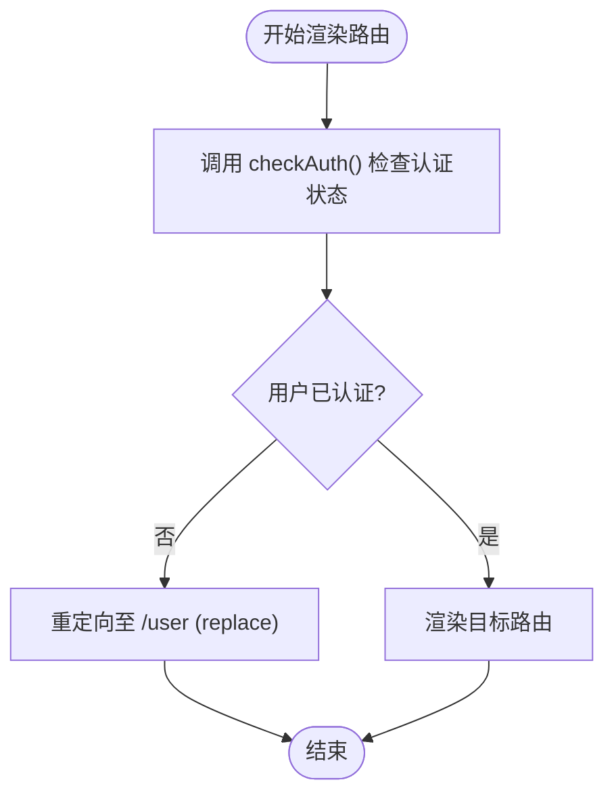

# 权限控制机制

<cite>
**Referenced Files in This Document**  
- [index.tsx](file://src/routes/index.tsx)
- [common-router.tsx](file://src/routes/common-router.tsx)
- [user-router.ts](file://src/routes/user-router.ts)
- [Login.tsx](file://src/pages/User/Login.tsx)
- [App.tsx](file://src/App.tsx)
</cite>

## 目录
1. [权限检查函数](#权限检查函数)
2. [路由渲染与权限拦截](#路由渲染与权限拦截)
3. [权限守卫实现逻辑](#权限守卫实现逻辑)
4. [权限路由定义方式](#权限路由定义方式)
5. [自定义权限策略扩展](#自定义权限策略扩展)
6. [安全风险与改进方向](#安全风险与改进方向)

## 权限检查函数

`checkAuth` 函数通过解析 `document.cookie` 来判断用户的认证状态。该函数首先将浏览器的 cookie 字符串按分号分割，然后使用正则表达式提取键值对，并通过 `decodeURIComponent` 解码，最终利用 `Object.fromEntries` 构造一个 cookie 对象。函数返回 `!!cookies.token`，即当存在名为 `token` 的 cookie 时返回 `true`，表示用户已认证；否则返回 `false`。

此机制依赖于客户端存储的 token 信息，实现简单但需注意安全性问题。

**Section sources**  
- [index.tsx](file://src/routes/index.tsx#L29-L34)

## 路由渲染与权限拦截

`renderRoutes` 函数负责根据路由配置中的 `auth` 字段进行权限拦截。在遍历路由配置时，若某条路由设置了 `auth: true` 且当前用户未通过 `checkAuth()` 认证，则会返回一个 `<Navigate to="/user" replace />` 元素，将用户重定向至登录页。

该逻辑确保只有经过身份验证的用户才能访问受保护的页面，如仪表盘等核心功能区域。对于未设置 `auth` 或 `auth: false` 的路由（如登录页本身），则允许直接访问。

**Section sources**  
- [index.tsx](file://src/routes/index.tsx#L36-L89)

## 权限守卫实现逻辑

权限守卫的实现结合了条件渲染、`Navigate` 组件的 `replace` 模式以及 `Suspense` 边界内的状态同步机制。

- **条件渲染**：在 `renderRoutes` 中通过 `if (config.auth && !isAuthenticated)` 判断是否需要拦截。
- **Navigate 组件的 replace 模式**：使用 `replace` 属性防止用户通过浏览器后退按钮绕过登录页，确保认证流程的完整性。
- **Suspense 边界**：`AppRouter` 组件外层包裹 `<Suspense fallback={...}>`，在异步组件加载期间显示加载动画（Spin），提升用户体验并避免白屏。

整个流程在 `AppRouter` 中统一处理，保证了路由跳转和状态管理的一致性。



**Diagram sources**  
- [index.tsx](file://src/routes/index.tsx#L92-L124)

**Section sources**  
- [index.tsx](file://src/routes/index.tsx#L92-L124)

## 权限路由定义方式

权限路由通过在路由配置对象中添加 `auth: true` 字段来定义。例如，在 `common-router.tsx` 中，`/dashboard/*` 路由及其子路由均设置 `auth: true`，表示这些页面需要登录后才能访问：

```ts
{
  path: "/dashboard/*",
  key: "dashboard",
  component: BasicLayout,
  auth: true,
  children: [...]
}
```

而 `user-router.ts` 中的 `/user` 路由则设置 `auth: false`，允许未登录用户访问登录页面。

这种集中式配置方式便于维护和扩展，所有权限规则一目了然。

**Section sources**  
- [common-router.tsx](file://src/routes/common-router.tsx#L10-L15)
- [user-router.ts](file://src/routes/user-router.ts#L7-L10)

## 自定义权限策略扩展

当前权限系统基于简单的 token 存在性判断，可进一步扩展为更精细的权限控制策略：

1. **角色/权限码校验**：解析 token 中的用户角色或权限列表，实现基于角色的访问控制（RBAC）。
2. **动态权限加载**：从服务端获取用户权限配置，避免前端硬编码。
3. **细粒度路由守卫**：支持 `auth: "admin"` 等字符串值，匹配不同权限级别。
4. **路由级加载状态**：为每个异步路由提供独立的 loading 组件，提升用户体验。

通过抽象 `checkAuth` 函数为可配置的权限检查器，可以轻松集成上述扩展。

**Section sources**  
- [index.tsx](file://src/routes/index.tsx#L29-L34)

## 安全风险与改进方向

当前客户端 cookie 验证机制存在以下潜在安全风险：

- **XSS 攻击**：若存在跨站脚本漏洞，攻击者可窃取 cookie 中的 token。
- **CSRF 攻击**：缺乏 CSRF Token 防护，可能被用于伪造请求。
- **Token 明文存储**：cookie 未设置 `HttpOnly` 和 `Secure` 标志，易受中间人攻击。

### 改进方向：

1. **服务端验证**：每次请求都应由后端验证 token 的有效性（如 JWT 签名验证）。
2. **HttpOnly Cookie**：设置 `document.cookie = "token=abcde;path=/;HttpOnly;Secure"` 防止 JavaScript 访问。
3. **Token 刷新机制**：结合 refresh token 实现自动续期，减少长期暴露风险。
4. **多因素认证支持**：在关键操作前增加二次验证步骤。

通过前后端协同防护，构建更健壮的身份认证体系。

**Section sources**  
- [Login.tsx](file://src/pages/User/Login.tsx#L68-L70)
- [index.tsx](file://src/routes/index.tsx#L29-L34)