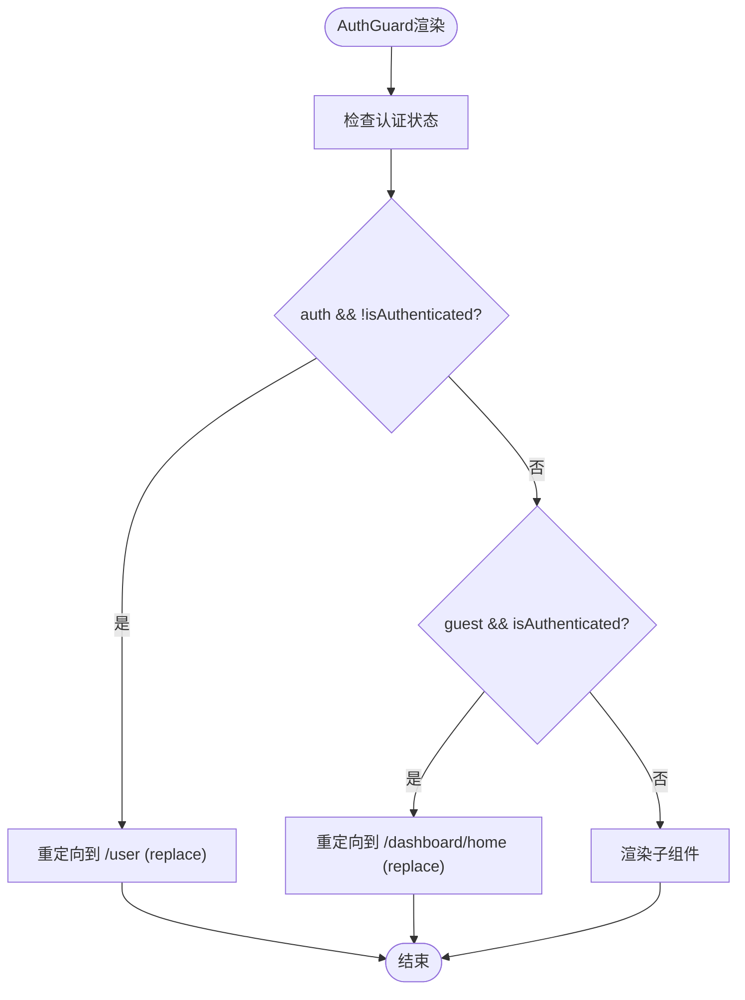
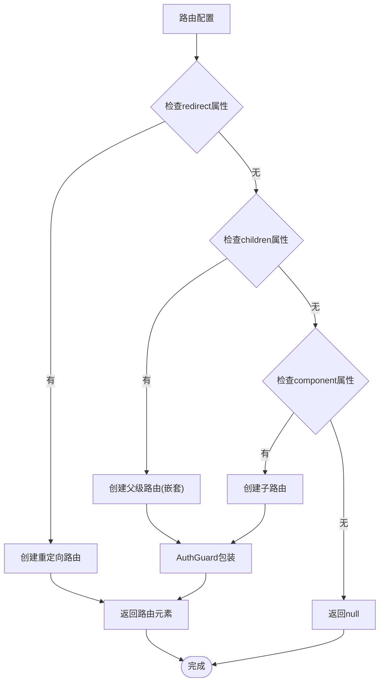

# 权限控制机制

<cite>
**本文引用的文件**
- [index.tsx](file://src/routes/index.tsx)
- [common-router.tsx](file://src/routes/common-router.tsx)
- [user-router.ts](file://src/routes/user-router.ts)
- [exception-router.tsx](file://src/routes/exception-router.tsx)
- [Login.tsx](file://src/pages/User/Login.tsx)
- [App.tsx](file://src/App.tsx)
- [BasicLayout.tsx](file://src/layout/BasicLayout.tsx)
</cite>

## 更新摘要
**所做更改**
- 新增AuthGuard组件系统，替代原有的简单认证检查
- 引入游客模式(guest)支持，已登录用户自动跳转
- 增强路由配置的权限控制能力
- 完善404错误页面处理机制
- 优化路由守卫的实现逻辑

## 目录
1. [AuthGuard组件系统](#authguard组件系统)
2. [路由渲染与权限拦截](#路由渲染与权限拦截)
3. [权限守卫实现逻辑](#权限守卫实现逻辑)
4. [权限路由定义方式](#权限路由定义方式)
5. [游客模式与标准认证](#游客模式与标准认证)
6. [自定义权限策略扩展](#自定义权限策略扩展)
7. [安全风险与改进方向](#安全风险与改进方向)

## AuthGuard组件系统

新的AuthGuard组件系统提供了更灵活和强大的路由权限控制机制。该组件接收`auth`和`guest`两个关键属性：

- **auth属性**：控制标准认证需求，需要登录才能访问
- **guest属性**：控制游客模式，已登录用户会被自动跳转

AuthGuard组件的核心实现逻辑：
1. 每次渲染都直接读取cookie，确保获取最新认证状态
2. 检查`auth && !isAuthenticated`条件，决定是否重定向到登录页
3. 检查`guest && isAuthenticated`条件，决定是否重定向到首页
4. 如果都不满足，返回children作为正常渲染


```mermaid
flowchart TD
Start([AuthGuard渲染]) --> CheckAuth["检查认证状态"]
CheckAuth --> AuthCheck{"auth && !isAuthenticated?"}
AuthCheck --> |是| RedirectLogin["重定向到 /user (replace)"]
AuthCheck --> |否| GuestCheck{"guest && isAuthenticated?"}
GuestCheck --> |是| RedirectHome["重定向到 /dashboard/home (replace)"]
GuestCheck --> |否| RenderChildren["渲染子组件"]
RedirectLogin --> End([结束])
RedirectHome --> End
RenderChildren --> End
```

**图表来源**
- [index.tsx:47-64](file://src/routes/index.tsx#L47-L64)

**章节来源**
- [index.tsx:40-64](file://src/routes/index.tsx#L40-L64)

## 路由渲染与权限拦截

`renderRoutes`函数现在通过AuthGuard组件包装所有路由，实现了统一的权限控制：


```mermaid
flowchart TD
RouteConfig["路由配置"] --> CheckRedirect{"检查redirect属性"}
CheckRedirect --> |有| CreateRedirect["创建重定向路由"]
CheckRedirect --> |无| CheckChildren{"检查children属性"}
CheckChildren --> |有| CreateParent["创建父级路由(嵌套)"]
CheckChildren --> |无| CheckComponent{"检查component属性"}
CreateParent --> WrapAuthGuard["AuthGuard包装"]
CreateRedirect --> ReturnRoute["返回路由元素"]
WrapAuthGuard --> ReturnRoute
CheckComponent --> |有| CreateChild["创建子路由"]
CreateChild --> WrapAuthGuard
CheckComponent --> |无| NullReturn["返回null"]
ReturnRoute --> End([完成])
NullReturn --> End
```

**图表来源**
- [index.tsx:66-121](file://src/routes/index.tsx#L66-L121)

**章节来源**
- [index.tsx:66-121](file://src/routes/index.tsx#L66-L121)

## 权限守卫实现逻辑

权限守卫的实现结合了条件渲染、`Navigate`组件的`replace`模式以及`Suspense`边界内的状态同步机制：

- **条件渲染**：在AuthGuard中通过`if (config.auth && !isAuthenticated)`和`if (config.guest && isAuthenticated)`判断是否需要拦截
- **Navigate组件的replace模式**：使用`replace`属性防止用户通过浏览器后退按钮绕过登录页，确保认证流程的完整性
- **Suspense边界**：`AppRouter`组件外层包裹`<Suspense fallback={...}>`，在异步组件加载期间显示加载动画，提升用户体验并避免白屏
- **状态同步**：使用`useMemo`确保路由切换时重新计算认证状态

整个流程在`AppRouter`中统一处理，保证了路由跳转和状态管理的一致性。

**章节来源**
- [index.tsx:124-157](file://src/routes/index.tsx#L124-L157)

## 权限路由定义方式

权限路由通过在路由配置对象中添加`auth`和`guest`字段来定义：

### 标准认证路由（auth: true）
在`common-router.tsx`中，`/dashboard/*`路由及其子路由均设置`auth: true`，表示这些页面需要登录后才能访问：

```ts
{
  path: "/dashboard/*",
  key: "dashboard",
  component: BasicLayout,
  auth: true,
  children: [
    {
      index: true,
      redirect: "home",
    },
    {
      name: "首页",
      path: "home",
      key: "home",
      icon: <HomeOutlined />,
      component: Home,
    },
    // ...其他子路由
  ],
}
```

### 游客模式路由（guest: true）
在`user-router.ts`中，`/user/login`路由设置`guest: true`，允许未登录用户访问登录页面，但已登录用户会被自动跳转：

```ts
{
  name: "登录",
  path: "login",
  key: "login",
  component: Login,
  guest: true, // 标记为游客页面，已登录用户自动跳转
}
```

### 例外路由处理
`exception-router.tsx`提供了404错误页面的处理机制，区分已登录和未登录用户的404页面：

```ts
{
  name: "404",
  path: "/exception/404",
  key: "404-standalone",
  component: NotFound,
  auth: false,
}
```

**章节来源**
- [common-router.tsx:9-54](file://src/routes/common-router.tsx#L9-L54)
- [user-router.ts:6-26](file://src/routes/user-router.ts#L6-L26)
- [exception-router.tsx:6-34](file://src/routes/exception-router.tsx#L6-L34)

## 游客模式与标准认证

新的AuthGuard系统支持两种认证模式：

### 标准认证模式（auth: true）
- 未登录用户访问：重定向到`/user`登录页
- 已登录用户访问：正常渲染目标路由
- 适用于仪表板、设置等核心功能页面

### 游客模式（guest: true）
- 未登录用户访问：正常渲染登录页面
- 已登录用户访问：重定向到`/dashboard/home`首页
- 适用于登录页、注册页等游客专用页面

### 认证状态检查
`checkAuth`函数通过解析`document.cookie`来判断用户的认证状态：

```ts
const checkAuth = (): boolean => {
  const cookies = Object.fromEntries(
    document.cookie.split("; ").map((x) => x.split(/=(.*)$/, 2).map(decodeURIComponent)),
  );
  return !!cookies.token;
};
```

**章节来源**
- [index.tsx:32-38](file://src/routes/index.tsx#L32-L38)
- [index.tsx:47-64](file://src/routes/index.tsx#L47-L64)

## 自定义权限策略扩展

当前权限系统基于AuthGuard组件，可进一步扩展为更精细的权限控制策略：

### 角色/权限码校验
```ts
// 扩展AuthGuard接口
interface AdvancedAuthGuardProps {
  children: React.ReactNode;
  auth: boolean;
  guest: boolean;
  roles?: string[]; // 角色权限
  permissions?: string[]; // 功能权限
}

// 在AuthGuard中实现角色检查
if (roles && !hasRole(userRoles, roles)) {
  return <Navigate to="/unauthorized" replace />;
}
```

### 动态权限加载
```ts
// 从服务端获取用户权限配置
const userPermissions = await fetchUserPermissions(token);
useUserStore.setState({ permissions: userPermissions });
```

### 细粒度路由守卫
支持`auth: "admin"`等字符串值，匹配不同权限级别：

```ts
// 在AuthGuard中实现字符串权限检查
if (typeof config.auth === 'string') {
  if (!hasPermission(userPermissions, config.auth)) {
    return <Navigate to="/unauthorized" replace />;
  }
}
```

### 路由级加载状态
为每个异步路由提供独立的loading组件，提升用户体验。

通过抽象`checkAuth`函数为可配置的权限检查器，可以轻松集成上述扩展。

**章节来源**
- [index.tsx:40-64](file://src/routes/index.tsx#L40-L64)

## 安全风险与改进方向

当前客户端cookie验证机制存在以下潜在安全风险：

### 当前安全机制
- **XSS攻击**：若存在跨站脚本漏洞，攻击者可窃取cookie中的token
- **CSRF攻击**：缺乏CSRF Token防护，可能被用于伪造请求
- **Token明文存储**：cookie未设置`HttpOnly`和`Secure`标志，易受中间人攻击

### 改进方向

#### 服务端验证
每次请求都应由后端验证token的有效性（如JWT签名验证），实现真正的双向认证。

#### 安全Cookie配置
```ts
// 设置HttpOnly和Secure标志
document.cookie = "token=abcde;path=/;HttpOnly;Secure;SameSite=strict";
```

#### Token刷新机制
结合refresh token实现自动续期，减少长期暴露风险：

```ts
// 实现token刷新逻辑
const refreshToken = async () => {
  const response = await fetch('/api/refresh-token', {
    method: 'POST',
    credentials: 'include'
  });
  return response.json();
};
```

#### 多因素认证支持
在关键操作前增加二次验证步骤，如短信验证码、邮箱验证等。

#### 前后端协同防护
通过前后端协同防护，构建更健壮的身份认证体系，确保即使前端被攻破，后端仍有有效的安全防护。

**章节来源**
- [Login.tsx:44-45](file://src/pages/User/Login.tsx#L44-L45)
- [index.tsx:32-38](file://src/routes/index.tsx#L32-L38)