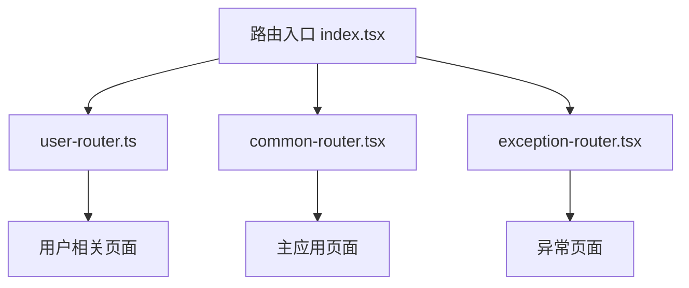
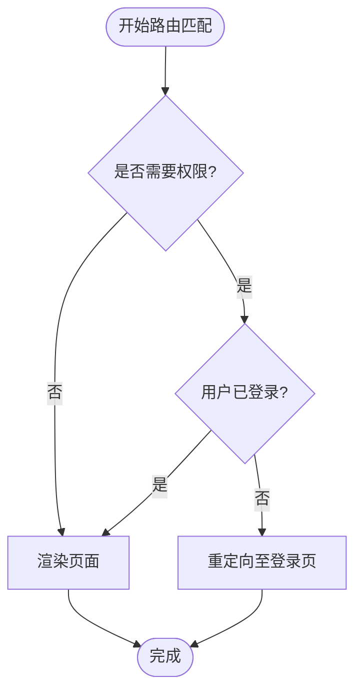
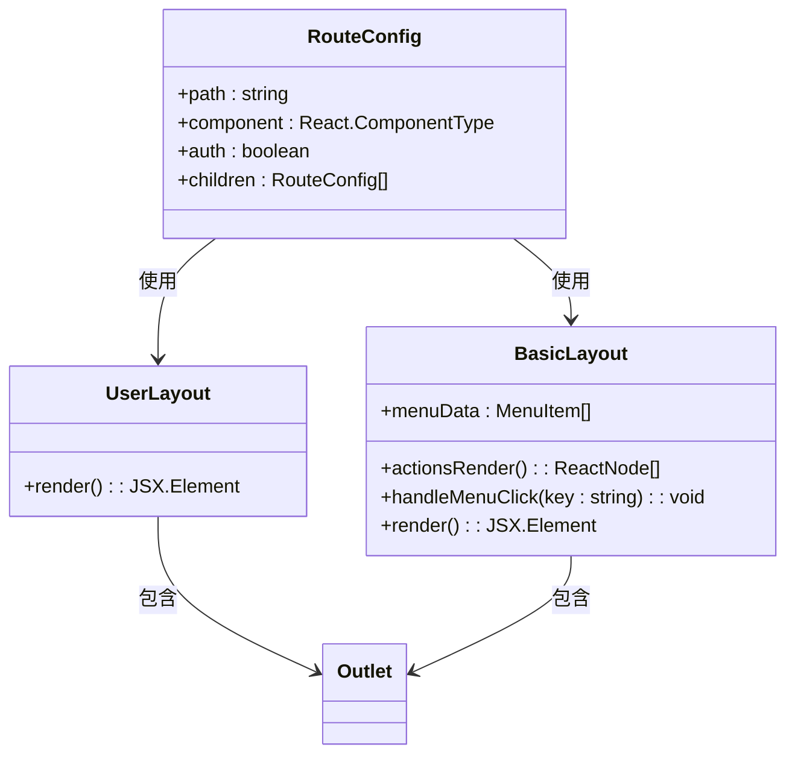

# 路由系统

<cite>
**本文档中引用的文件**  
- [index.tsx](file://src/routes/index.tsx)
- [user-router.ts](file://src/routes/user-router.ts)
- [common-router.tsx](file://src/routes/common-router.tsx)
- [BasicLayout.tsx](file://src/layout/BasicLayout.tsx)
- [UserLayout.tsx](file://src/layout/UserLayout.tsx)
- [404.tsx](file://src/pages/Exception/404.tsx)
- [App.tsx](file://src/App.tsx)
</cite>

## 目录
1. [简介](#简介)
2. [项目结构与路由组织](#项目结构与路由组织)
3. [核心路由配置分析](#核心路由配置分析)
4. [路由权限控制机制](#路由权限控制机制)
5. [嵌套路由与布局组件](#嵌套路由与布局组件)
6. [错误边界与404路由处理](#错误边界与404路由处理)
7. [路由懒加载实现](#路由懒加载实现)
8. [动态路由与导航实践](#动态路由与导航实践)
9. [最佳实践建议](#最佳实践建议)
10. [总结](#总结)

## 简介
本文档详细说明了项目中基于 React Router DOM 的路由系统实现方式。通过分析 `index.tsx`、`user-router.ts` 和 `common-router.tsx` 等核心文件，全面阐述了路由配置的结构设计、权限控制逻辑、嵌套路由模式以及各模块的职责划分。同时为开发者提供关于路由定义、导航控制和路由守卫的最佳实践指导。

## 项目结构与路由组织
项目的路由系统采用模块化设计，将不同功能区域的路由分离到独立文件中，提升可维护性与清晰度。



**Diagram sources**  
- [index.tsx](file://src/routes/index.tsx#L1-L127)
- [user-router.ts](file://src/routes/user-router.ts#L1-L25)
- [common-router.tsx](file://src/routes/common-router.tsx#L1-L54)

**Section sources**  
- [index.tsx](file://src/routes/index.tsx#L1-L127)
- [user-router.ts](file://src/routes/user-router.ts#L1-L25)
- [common-router.tsx](file://src/routes/common-router.tsx#L1-L54)

## 核心路由配置分析
路由系统通过合并多个配置数组（`exceptionRouterConfig`、`userRouterConfig`、`commonRouterConfig`）构建完整的路由表。每条路由配置包含路径、组件、权限标识、重定向规则等字段。

路由配置采用统一接口 `RouteConfig` 定义，支持嵌套子路由、权限校验、懒加载组件等功能。主路由渲染函数 `renderRoutes` 递归处理所有配置项，并根据条件生成对应的 `<Route>` 元素。

**Section sources**  
- [index.tsx](file://src/routes/index.tsx#L1-L127)

## 路由权限控制机制
系统通过 `checkAuth()` 函数实现基于 Cookie 的身份验证。该函数解析文档 cookie 并检查是否存在 `token` 字段来判断用户是否已登录。

在 `renderRoutes` 函数中，若某路由设置了 `auth: true`，则会进行权限拦截：未认证用户将被重定向至 `/user` 登录页。此机制确保受保护页面只能由已登录用户访问。



**Diagram sources**  
- [index.tsx](file://src/routes/index.tsx#L15-L127)

**Section sources**  
- [index.tsx](file://src/routes/index.tsx#L15-L127)

## 嵌套路由与布局组件
系统使用嵌套路由实现多级布局结构。通过在路由配置中设置 `children` 字段，实现父级布局组件包裹子路由内容的模式。

### 用户路由（UserRouter）
`/user` 路由使用 `UserLayout` 作为布局容器，其内部通过 `<Outlet />` 渲染子路由（如登录页）。该布局无额外UI装饰，适用于登录等独立页面。

### 主应用路由（CommonRouter）
`/dashboard/*` 路由使用 `BasicLayout` 作为主布局，集成侧边栏菜单、顶部导航栏、浮动按钮等功能。子路由如“首页”、“个人设置”均在此布局内展示。



**Diagram sources**  
- [user-router.ts](file://src/routes/user-router.ts#L1-L25)
- [common-router.tsx](file://src/routes/common-router.tsx#L1-L54)
- [UserLayout.tsx](file://src/layout/UserLayout.tsx#L1-L8)
- [BasicLayout.tsx](file://src/layout/BasicLayout.tsx#L1-L224)

**Section sources**  
- [user-router.ts](file://src/routes/user-router.ts#L1-L25)
- [common-router.tsx](file://src/routes/common-router.tsx#L1-L54)
- [UserLayout.tsx](file://src/layout/UserLayout.tsx#L1-L8)
- [BasicLayout.tsx](file://src/layout/BasicLayout.tsx#L1-L224)

## 错误边界与404路由处理
系统通过通配符路由 `*` 捕获所有未匹配的路径请求，并根据用户登录状态重定向至相应的404页面：

- 已登录用户：跳转至 `/dashboard/404`
- 未登录用户：跳转至 `/exception/404`

404页面使用 Ant Design 的 `Result` 组件展示友好提示，并提供返回首页的按钮。该机制确保用户体验的一致性，避免空白页面或错误暴露。

**Section sources**  
- [index.tsx](file://src/routes/index.tsx#L115-L125)
- [404.tsx](file://src/pages/Exception/404.tsx#L1-L23)

## 路由懒加载实现
所有页面组件均通过 `React.lazy()` 实现懒加载，结合动态 `import()` 语法按需加载模块，有效减少初始包体积。

例如：
```ts
const Login = lazy(() => import("@/pages/User/Login"));
```

配合 `Suspense` 组件，在加载过程中显示旋转动画（`Spin`），提升用户体验。整个应用的路由渲染被包裹在 `Suspense` 中，统一处理加载状态。

**Section sources**  
- [index.tsx](file://src/routes/index.tsx#L1-L127)
- [user-router.ts](file://src/routes/user-router.ts#L1-L25)
- [common-router.tsx](file://src/routes/common-router.tsx#L1-L54)

## 动态路由与导航实践
系统通过 `useNavigate` 和 `useLocation` Hook 实现编程式导航与路径监听。`BasicLayout` 中的菜单点击事件调用 `navigate(path)` 实现页面跳转。

路由配置中的 `key` 字段用于唯一标识路由项，便于菜单状态同步。`redirect` 字段支持索引重定向（`index: true`）和路径重定向，实现默认子路由跳转逻辑。

**Section sources**  
- [BasicLayout.tsx](file://src/layout/BasicLayout.tsx#L1-L224)
- [index.tsx](file://src/routes/index.tsx#L1-L127)

## 最佳实践建议
1. **模块化路由配置**：按功能拆分路由文件，提高可维护性。
2. **统一类型定义**：使用 `RouteConfig` 接口规范路由结构，增强类型安全。
3. **权限集中管理**：将认证逻辑封装为独立函数，便于扩展与测试。
4. **懒加载所有页面**：减少首屏加载时间，优化性能。
5. **合理使用嵌套路由**：利用布局组件复用UI结构，避免重复代码。
6. **完善404处理**：区分不同场景下的未匹配路由，提供一致的错误体验。
7. **避免硬编码路径**：使用常量或配置管理路由路径，降低耦合度。

**Section sources**  
- [index.tsx](file://src/routes/index.tsx#L1-L127)
- [user-router.ts](file://src/routes/user-router.ts#L1-L25)
- [common-router.tsx](file://src/routes/common-router.tsx#L1-L54)

## 总结
本项目通过模块化、类型化的方式构建了健壮的前端路由系统。结合 React Router DOM 的嵌套路由、懒加载、重定向等特性，实现了清晰的路由结构与良好的用户体验。权限控制机制保障了应用安全性，而统一的404处理和布局设计提升了整体一致性。该架构为后续功能扩展提供了良好的基础。