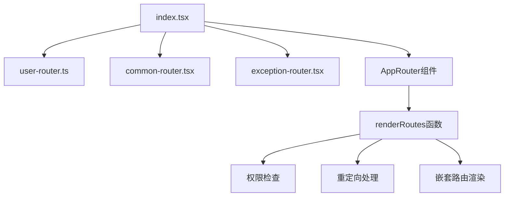
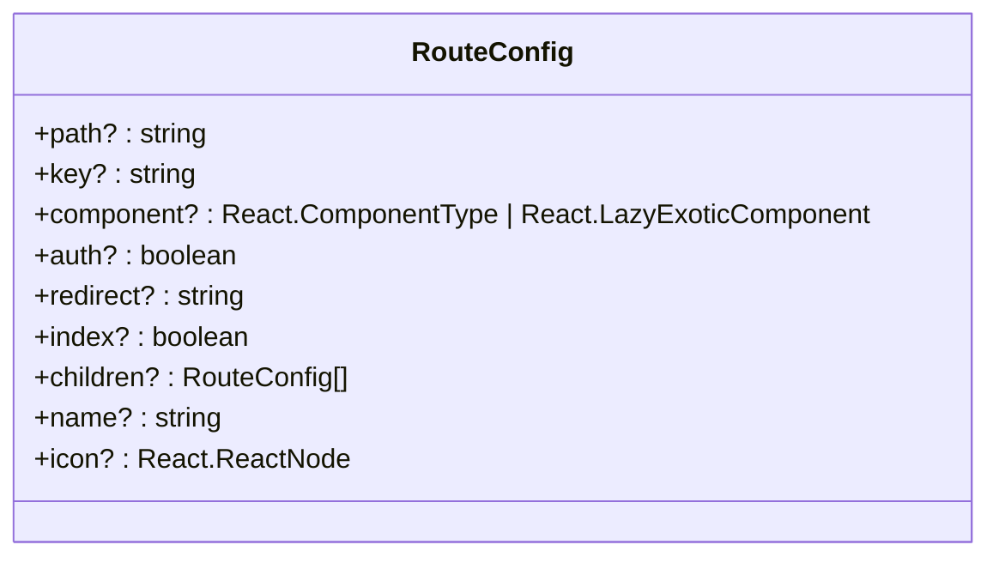
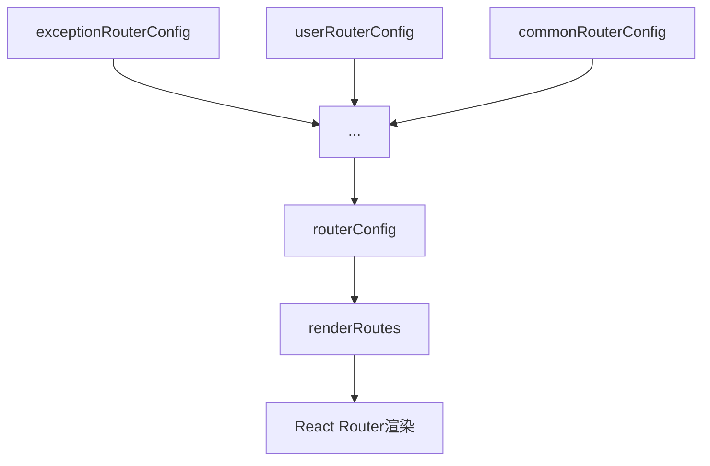
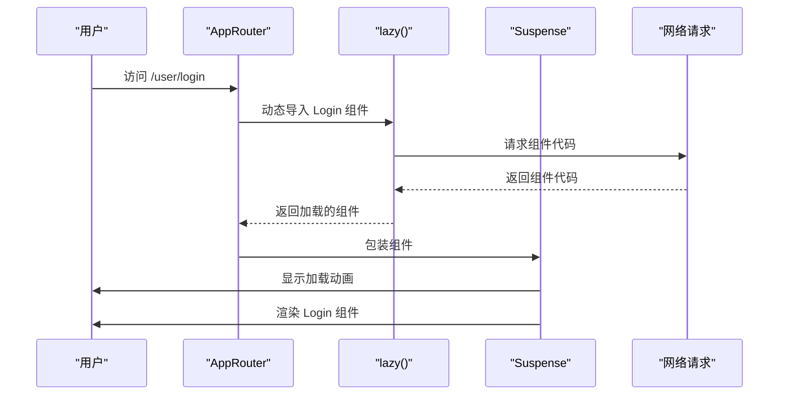

# 路由配置

<cite>
**Referenced Files in This Document**   
- [index.tsx](file://src/routes/index.tsx)
- [user-router.ts](file://src/routes/user-router.ts)
- [common-router.tsx](file://src/routes/common-router.tsx)
- [BasicLayout.tsx](file://src/layout/BasicLayout.tsx)
- [UserLayout.tsx](file://src/layout/UserLayout.tsx)
- [home.tsx](file://src/pages/home.tsx)
- [Login.tsx](file://src/pages/User/Login.tsx)
</cite>

## 目录
1. [路由配置结构设计](#路由配置结构设计)
2. [RouteConfig接口详解](#routeconfig接口详解)
3. [路由合并机制](#路由合并机制)
4. [路由懒加载实现](#路由懒加载实现)
5. [嵌套路由与索引路由](#嵌套路由与索引路由)
6. [路由重定向配置](#路由重定向配置)
7. [权限控制机制](#权限控制机制)
8. [最佳实践总结](#最佳实践总结)

## 路由配置结构设计

项目采用模块化路由配置方式，将路由定义分散在多个文件中，通过`index.tsx`统一管理。核心路由配置文件包括`user-router.ts`、`common-router.tsx`和`exception-router.tsx`，分别处理用户认证、常规页面和异常页面的路由。

这种设计实现了路由配置的职责分离，`user-router.ts`专注于用户登录等认证相关路由，`common-router.tsx`管理主应用的常规页面路由，而`index.tsx`作为路由配置的入口文件，负责整合所有路由配置并提供统一的路由渲染机制。



**Diagram sources**
- [index.tsx](file://src/routes/index.tsx#L1-L127)
- [user-router.ts](file://src/routes/user-router.ts#L1-L25)
- [common-router.tsx](file://src/routes/common-router.tsx#L1-L54)

**Section sources**
- [index.tsx](file://src/routes/index.tsx#L1-L127)
- [user-router.ts](file://src/routes/user-router.ts#L1-L25)
- [common-router.tsx](file://src/routes/common-router.tsx#L1-L54)

## RouteConfig接口详解

`RouteConfig`接口定义了路由配置的元信息结构，包含路径、组件、权限、重定向等关键属性。该接口采用可选属性设计，提供了极大的灵活性，允许根据具体需求配置不同的路由特性。

接口中的`component`属性支持两种类型：普通React组件和懒加载组件，这为实现路由懒加载提供了类型支持。`children`属性的递归定义支持无限层级的嵌套路由结构，`auth`属性用于标识路由是否需要权限验证，`redirect`属性用于配置路由重定向目标。



**Diagram sources**
- [index.tsx](file://src/routes/index.tsx#L14-L26)

**Section sources**
- [index.tsx](file://src/routes/index.tsx#L14-L26)

## 路由合并机制

路由合并机制通过数组扩展运算符(`...`)将多个路由配置数组拼接成一个统一的`routerConfig`数组。这种设计模式实现了路由配置的模块化和可扩展性，允许在不修改核心路由文件的情况下添加新的路由模块。

路由合并的顺序至关重要，它决定了路由匹配的优先级。在当前实现中，异常路由配置优先级最高，其次是用户路由，最后是常规路由。这种顺序确保了特定路由能够优先于通配符路由被匹配，避免了路由冲突。



**Diagram sources**
- [index.tsx](file://src/routes/index.tsx#L10-L12)

**Section sources**
- [index.tsx](file://src/routes/index.tsx#L10-L12)

## 路由懒加载实现

路由懒加载通过React的`lazy`函数和`Suspense`组件实现。在`user-router.ts`和`common-router.tsx`中，所有页面组件都使用`lazy(() => import(...))`语法进行动态导入，这使得组件代码只有在路由被访问时才会加载。

`AppRouter`组件中的`Suspense`提供了加载状态的fallback UI，在组件加载期间显示旋转动画，提升了用户体验。这种实现方式显著减少了应用的初始加载时间，实现了按需加载，优化了性能。



**Diagram sources**
- [index.tsx](file://src/routes/index.tsx#L92-L124)
- [user-router.ts](file://src/routes/user-router.ts#L3-L6)
- [common-router.tsx](file://src/routes/common-router.tsx#L3-L6)

**Section sources**
- [index.tsx](file://src/routes/index.tsx#L92-L124)
- [user-router.ts](file://src/routes/user-router.ts#L3-L6)
- [common-router.tsx](file://src/routes/common-router.tsx#L3-L6)

## 嵌套路由与索引路由

嵌套路由通过`children`属性实现，允许创建层级化的路由结构。在`common-router.tsx`中，`/dashboard/*`路由包含多个子路由，如`home`、`settings`等，这些子路由在`BasicLayout`组件的`Outlet`中渲染。

索引路由通过`index: true`属性配置，用于匹配父路由的精确路径。例如，`/dashboard`路径没有对应的独立组件，而是通过索引路由重定向到`/dashboard/home`，这种设计简化了路由配置，避免了为每个父路径创建空组件。

```mermaid
graph TB
A[/dashboard/*] --> B[BasicLayout]
B --> C[Outlet]
A --> D{children}
D --> E[index: true]
E --> F[redirect: /dashboard/home]
D --> G[path: home]
G --> H[Home组件]
D --> I[path: settings]
I --> J[Settings组件]
```

**Diagram sources**
- [common-router.tsx](file://src/routes/common-router.tsx#L10-L38)
- [BasicLayout.tsx](file://src/layout/BasicLayout.tsx#L1-L224)

**Section sources**
- [common-router.tsx](file://src/routes/common-router.tsx#L10-L38)
- [BasicLayout.tsx](file://src/layout/BasicLayout.tsx#L1-L224)

## 路由重定向配置

路由重定向通过`redirect`属性实现，支持两种重定向模式：路径重定向和索引重定向。路径重定向用于将特定路径的请求重定向到另一个路径，而索引重定向专门用于处理父路由的默认重定向。

在`user-router.ts`中，`/user`路径通过索引重定向到`/user/login`，确保用户访问用户模块根路径时自动跳转到登录页面。在`common-router.tsx`中，根路径`/`重定向到`/dashboard`，实现了应用的默认入口配置。

```mermaid
flowchart LR
A[/user] --> |index redirect| B[/user/login]
C[/] --> |path redirect| D[/dashboard]
E[/dashboard] --> |index redirect| F[/dashboard/home]
G[/dashboard/*] --> |wildcard redirect| H[/dashboard/404]
```

**Diagram sources**
- [user-router.ts](file://src/routes/user-router.ts#L8-L10)
- [common-router.tsx](file://src/routes/common-router.tsx#L7-L9)
- [common-router.tsx](file://src/routes/common-router.tsx#L20-L23)

**Section sources**
- [user-router.ts](file://src/routes/user-router.ts#L8-L10)
- [common-router.ts](file://src/routes/common-router.ts#L7-L9)
- [common-router.ts](file://src/routes/common-router.ts#L20-L23)

## 权限控制机制

权限控制通过`checkAuth`函数和`auth`属性实现。`checkAuth`函数检查cookie中的token是否存在，以此判断用户是否已登录。在`renderRoutes`函数中，如果路由配置了`auth: true`但用户未登录，则自动重定向到用户登录页面。

这种集中式的权限控制机制避免了在每个页面组件中重复实现权限检查逻辑，提高了代码的可维护性。权限检查在路由渲染阶段完成，确保了未授权用户无法访问受保护的路由。

```mermaid
flowchart TD
A[访问路由] --> B{auth属性?}
B --> |true| C[checkAuth()]
B --> |false| D[直接渲染]
C --> E{已登录?}
E --> |是| F[渲染组件]
E --> |否| G[重定向到 /user]
F --> H[完成]
G --> H
D --> H
```

**Diagram sources**
- [index.tsx](file://src/routes/index.tsx#L28-L30)
- [index.tsx](file://src/routes/index.tsx#L33-L37)

**Section sources**
- [index.tsx](file://src/routes/index.tsx#L28-L37)

## 最佳实践总结

路由配置的最佳实践包括模块化组织、类型安全、懒加载和集中式权限控制。通过将路由配置分散到多个文件，实现了关注点分离和易于维护。`RouteConfig`接口提供了类型安全，减少了配置错误。

路由懒加载优化了性能，而`renderRoutes`递归函数统一处理了各种路由场景，包括权限检查、重定向和嵌套路由渲染。这种设计模式具有良好的扩展性，可以轻松添加新的路由模块而无需修改核心路由逻辑。

**Section sources**
- [index.tsx](file://src/routes/index.tsx#L1-L127)
- [user-router.ts](file://src/routes/user-router.ts#L1-L25)
- [common-router.tsx](file://src/routes/common-router.tsx#L1-L54)