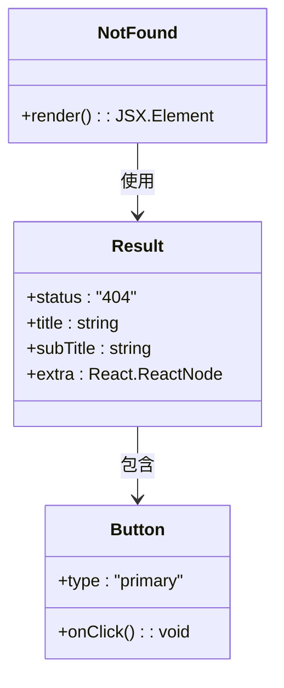

# 错误路由与404处理

<cite>
**Referenced Files in This Document**   
- [index.tsx](file://src/routes/index.tsx)
- [common-router.tsx](file://src/routes/common-router.tsx)
- [exception-router.tsx](file://src/routes/exception-router.tsx)
- [404.tsx](file://src/pages/Exception/404.tsx)
</cite>

## 目录
1. [引言](#引言)
2. [通配符路由与全局404处理](#通配符路由与全局404处理)
3. [已登录区域的嵌套404路由](#已登录区域的嵌套404路由)
4. [404页面组件实现](#404页面组件实现)
5. [动态路由配置与多场景展示](#动态路由配置与多场景展示)
6. [用户体验优化建议](#用户体验优化建议)
7. [结论](#结论)

## 引言
本文档详细说明了项目中错误路由和404页面的处理机制。系统通过通配符路由捕获未匹配的路径，并根据用户登录状态重定向到不同的404页面。文档将深入分析路由配置、组件实现和用户体验优化策略，为开发者提供完整的错误页面处理方案。

## 通配符路由与全局404处理

在 `index.tsx` 文件中，系统通过通配符路由 `path='*'` 捕获所有未匹配的路径请求。该路由位于路由配置的末尾，作为兜底路由确保任何未定义的路径都能被捕获。

路由根据用户的登录状态进行智能重定向：已登录用户被重定向到 `/dashboard/404`，未登录用户则被重定向到 `/exception/404`。这种差异化处理提供了更精准的用户体验，使错误页面能够与当前用户状态保持一致。


**Diagram sources**
- [index.tsx](file://src/routes/index.tsx#L115-L122)

**Section sources**
- [index.tsx](file://src/routes/index.tsx#L92-L124)

## 已登录区域的嵌套404路由

`common-router.tsx` 文件为已登录区域（`/dashboard/*`）配置了专门的404处理机制。该配置包含两个关键部分：404子路由和通配符重定向路由。

404子路由 `path='404'` 定义了在 `/dashboard` 命名空间下显示的404页面，确保已登录用户访问错误路径时能够看到与当前应用风格一致的错误提示。同时，通配符路由 `path='*'` 配置了重定向到 `/dashboard/404`，实现了对 `/dashboard` 下所有未匹配子路径的统一处理。

这种嵌套路由设计确保了应用在不同状态下的错误处理一致性，同时保持了路由结构的清晰性。

```mermaid
flowchart TD
A[/dashboard/*] --> B{子路径是否存在?}
B --> |是| C[正常渲染子页面]
B --> |否| D[检查是否为/404]
D --> |是| E[显示404页面]
D --> |否| F[重定向到/dashboard/404]
F --> G[显示已登录404页面]
```

**Diagram sources**
- [common-router.tsx](file://src/routes/common-router.tsx#L25-L53)

**Section sources**
- [common-router.tsx](file://src/routes/common-router.tsx#L8-L53)

## 404页面组件实现

`404.tsx` 文件实现了统一的NotFound组件，该组件使用Ant Design的Result组件展示404错误状态。页面包含标准的404标题、描述性副标题以及一个"回到首页"按钮，为用户提供清晰的错误信息和导航指引。

组件通过懒加载方式引入，确保在实际需要时才加载相关代码，优化了应用的初始加载性能。在Suspense边界下，当404页面被触发时，用户会先看到加载状态，然后平滑过渡到完整的错误页面，提供了良好的加载体验。



**Diagram sources**
- [404.tsx](file://src/pages/Exception/404.tsx#L2-L20)

**Section sources**
- [404.tsx](file://src/pages/Exception/404.tsx#L2-L22)

## 动态路由配置与多场景展示

系统通过动态路由配置实现了多场景的错误页面展示。`exception-router.tsx` 文件定义了未登录状态下的404路由，与已登录状态的404路由形成互补。

路由配置中的 `auth` 属性控制着路由的访问权限，结合 `checkAuth` 函数实现登录状态检查。`renderRoutes` 函数递归处理路由配置，支持嵌套路由、重定向和权限拦截等多种功能，为复杂的路由逻辑提供了灵活的解决方案。

这种配置方式允许开发者轻松扩展错误处理机制，通过添加新的路由配置即可支持更多场景的错误页面展示。

```mermaid
graph TB
subgraph "路由配置"
A[index.tsx]
B[common-router.tsx]
C[exception-router.tsx]
end
subgraph "404页面"
D[/dashboard/404]
E[/exception/404]
end
A --> D
A --> E
B --> D
C --> E
```

**Diagram sources**
- [index.tsx](file://src/routes/index.tsx#L1-L127)
- [exception-router.tsx](file://src/routes/exception-router.tsx#L1-L34)

**Section sources**
- [index.tsx](file://src/routes/index.tsx#L1-L127)
- [exception-router.tsx](file://src/routes/exception-router.tsx#L1-L34)

## 用户体验优化建议

基于现有实现，建议进一步优化404页面的用户体验。可以在错误页面中添加错误日志上报功能，当用户访问404页面时自动上报错误信息，帮助开发团队发现和修复链接问题。

此外，可以增强导航功能，在404页面中提供最近访问页面列表或站点地图，帮助用户快速找到所需内容。对于频繁访问的错误路径，系统可以实现智能重定向，将用户引导到最可能的目标页面。

性能监控也是重要的一环，建议记录404错误的频率和来源，分析用户行为模式，持续优化网站结构和导航设计。

**Section sources**
- [404.tsx](file://src/pages/Exception/404.tsx#L2-L20)
- [index.tsx](file://src/routes/index.tsx#L29-L34)

## 结论

本文档详细阐述了项目中错误路由和404页面的完整处理方案。通过通配符路由、条件重定向和嵌套路由配置，系统实现了智能化的错误处理机制。结合懒加载组件和Suspense边界，确保了良好的性能和用户体验。该方案具有良好的扩展性，可轻松适应未来更多的错误处理需求。