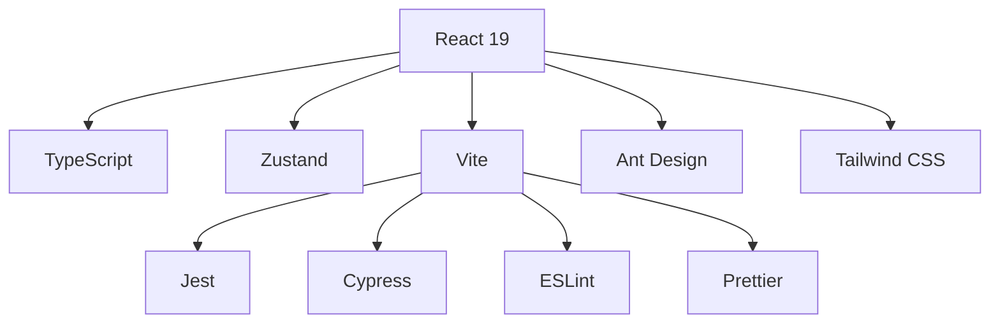
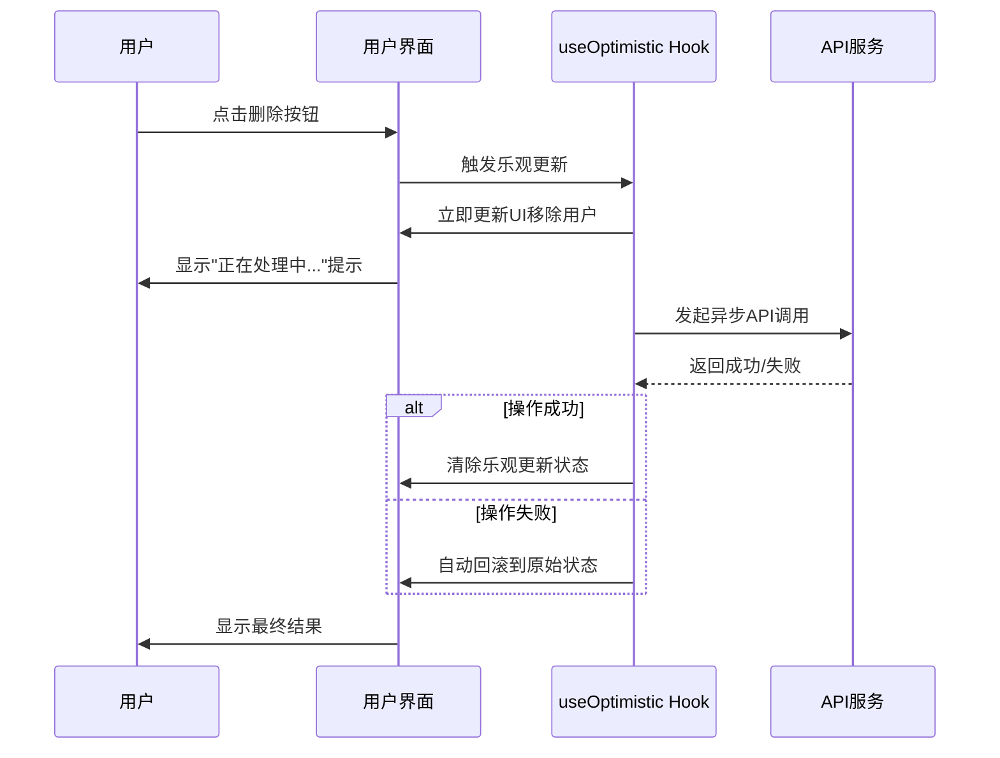
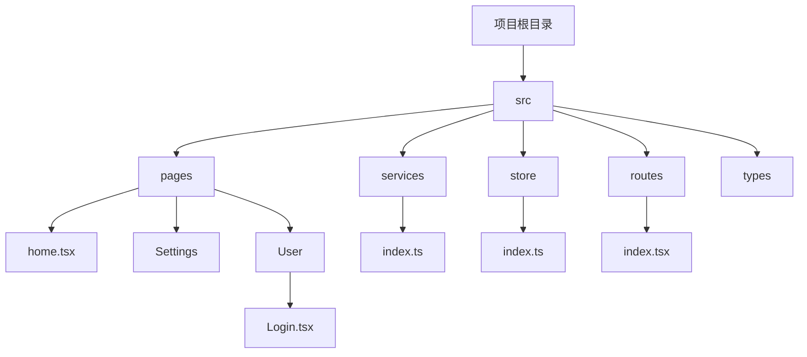

# 项目概述

<cite>
**Referenced Files in This Document**   
- [README.md](file://README.md)
- [package.json](file://package.json)
- [vite.config.ts](file://vite.config.ts)
- [tsconfig.json](file://tsconfig.json)
- [src/pages/home.tsx](file://src/pages/home.tsx)
- [src/pages/Settings/index.tsx](file://src/pages/Settings/index.tsx)
- [src/pages/User/Login.tsx](file://src/pages/User/Login.tsx)
- [src/services/index.ts](file://src/services/index.ts)
- [src/store/index.ts](file://src/store/index.ts)
- [src/routes/index.tsx](file://src/routes/index.tsx)
</cite>

## 目录
1. [项目概述](#项目概述)
2. [核心价值主张](#核心价值主张)
3. [技术栈与架构](#技术栈与架构)
4. [useOptimistic Hook 应用](#useoptimistic-hook-应用)
5. [项目架构与设计哲学](#项目架构与设计哲学)
6. [主要功能特性](#主要功能特性)
7. [开发与构建流程](#开发与构建流程)
8. [适用场景](#适用场景)

## 项目概述

react-vscode-template 是一个基于 React 19 的现代化前端项目模板，旨在为开发者提供一个开箱即用的开发环境。该项目集成了最新的技术栈和开发工具，为构建现代化的 Web 应用程序提供了坚实的基础。项目通过展示 React 19 的新特性，特别是 `useOptimistic` Hook 的实际应用，帮助开发者快速掌握最新的前端技术。

项目通过集成 CircleCI 和 Codacy 等持续集成和代码质量工具，确保了代码的质量和稳定性。MIT 许可证的采用使得该项目可以自由地用于个人和商业项目，促进了开源社区的发展和技术创新。

**Section sources**
- [README.md](file://README.md)

## 核心价值主张

react-vscode-template 的核心价值在于提供一个现代化、高效且易于使用的前端开发模板。该项目通过集成 React 19、TypeScript、Vite 等最新技术栈，为开发者提供了一个开箱即用的开发环境。`useOptimistic` Hook 的应用展示了如何实现乐观更新，提供更好的用户体验。

项目的设计哲学是"约定优于配置"，通过预设最佳实践和配置，减少开发者的配置负担，使他们能够专注于业务逻辑的实现。这种设计使得项目不仅适合初学者快速上手，也满足了经验丰富的开发者对技术深度的需求。

**Section sources**
- [README.md](file://README.md)

## 技术栈与架构

react-vscode-template 采用了现代化的技术栈，包括 React 19、TypeScript、Zustand、Vite、Ant Design、Tailwind CSS 等。这些技术的组合为项目提供了强大的功能和良好的开发体验。

### 技术栈详情

- **React 19.0.0**：最新版本的 React，支持并发特性和新的 Hooks
- **TypeScript**：提供类型安全的 JavaScript 开发体验
- **Zustand**：轻量级状态管理库，简化状态管理
- **Vite**：快速的构建工具，提供极快的开发服务器启动和热模块替换
- **Ant Design**：企业级 UI 组件库，提供丰富的组件和设计系统
- **Tailwind CSS**：原子化 CSS 框架，实现高效的样式开发
- **Jest + Testing Library**：全面的测试框架，确保代码质量
- **Cypress**：端到端测试工具，验证应用的整体行为
- **ESLint + Prettier**：代码规范和格式化工具，保持代码风格一致



**Diagram sources**
- [package.json](file://package.json)
- [vite.config.ts](file://vite.config.ts)
- [tsconfig.json](file://tsconfig.json)

**Section sources**
- [README.md](file://README.md)
- [package.json](file://package.json)

## useOptimistic Hook 应用

`useOptimistic` 是 React 19 引入的新 Hook，用于实现乐观更新（Optimistic Updates），提供更好的用户体验。该 Hook 允许在异步操作（如 API 调用）完成之前立即更新 UI，如果操作失败会自动回滚到原始状态。

### 在项目中的应用

#### 用户管理页面 (src/pages/home.tsx)

在用户管理页面中，`useOptimistic` Hook 被用于实现用户删除和添加操作的乐观更新：

- **用户删除操作**：点击删除按钮后立即从列表中移除用户，提供即时反馈
- **用户添加操作**：点击添加按钮后立即在列表中显示新用户，提升用户体验
- **显示乐观更新状态指示器**：通过 UI 提示用户当前正在进行的操作

#### 设置页面 (src/pages/Settings/index.tsx)

在设置页面中，`useOptimistic` Hook 被用于表单提交：

- **表单提交**：提交后立即显示新的表单值，减少用户等待时间
- **按钮状态**：动态显示"保存中..."状态，提供清晰的反馈

#### 登录页面 (src/pages/User/Login.tsx)

在登录页面中，`useOptimistic` Hook 被用于登录表单：

- **登录表单**：提交后立即显示登录状态，提升用户体验
- **按钮文本**：动态显示"登录中..."状态，提供即时反馈



**Diagram sources**
- [src/pages/home.tsx](file://src/pages/home.tsx)
- [src/pages/Settings/index.tsx](file://src/pages/Settings/index.tsx)
- [src/pages/User/Login.tsx](file://src/pages/User/Login.tsx)

**Section sources**
- [README.md](file://README.md)
- [src/pages/home.tsx](file://src/pages/home.tsx)
- [src/pages/Settings/index.tsx](file://src/pages/Settings/index.tsx)
- [src/pages/User/Login.tsx](file://src/pages/User/Login.tsx)

## 项目架构与设计哲学

react-vscode-template 采用了清晰的项目架构和现代化的设计哲学，为开发者提供了良好的开发体验。

### 项目结构

项目的目录结构清晰，遵循了常见的前端项目组织方式：

```
src/
├── pages/           # 页面组件
│   ├── home.tsx     # 用户管理页面 (useOptimistic 示例)
│   ├── Settings/    # 设置页面 (useOptimistic 示例)
│   └── User/        # 用户相关页面
│       └── Login.tsx # 登录页面 (useOptimistic 示例)
├── services/        # API 服务
├── store/          # Zustand 状态管理
├── routes/         # 路由配置
└── types/          # TypeScript 类型定义
```

### 设计哲学

项目的设计哲学体现了现代化前端开发的最佳实践：

1. **组件化**：将 UI 拆分为可重用的组件，提高代码的可维护性和可复用性
2. **类型安全**：通过 TypeScript 提供完整的类型检查，减少运行时错误
3. **状态管理**：使用 Zustand 进行轻量级状态管理，简化复杂应用的状态处理
4. **样式现代化**：结合 Ant Design 和 Tailwind CSS，实现高效且一致的样式开发
5. **测试驱动**：集成 Jest 和 Cypress，确保代码质量和应用稳定性



**Diagram sources**
- [src/pages/home.tsx](file://src/pages/home.tsx)
- [src/services/index.ts](file://src/services/index.ts)
- [src/store/index.ts](file://src/store/index.ts)
- [src/routes/index.tsx](file://src/routes/index.tsx)

**Section sources**
- [README.md](file://README.md)
- [src/pages/home.tsx](file://src/pages/home.tsx)
- [src/services/index.ts](file://src/services/index.ts)
- [src/store/index.ts](file://src/store/index.ts)
- [src/routes/index.tsx](file://src/routes/index.tsx)

## 主要功能特性

react-vscode-template 提供了丰富的功能特性，涵盖了现代前端开发的各个方面。

### 核心功能

1. **React 19 支持**：完整支持 React 19 的新特性和 API
2. **TypeScript 集成**：提供完整的类型安全和开发体验
3. **Vite 构建**：利用 Vite 的快速构建和开发服务器
4. **Ant Design UI**：集成企业级 UI 组件库
5. **Tailwind CSS**：提供原子化 CSS 开发体验
6. **Zustand 状态管理**：轻量级的状态管理解决方案
7. **useOptimistic Hook**：展示 React 19 新 Hook 的实际应用

### 开发工具

1. **ESLint + Prettier**：代码规范和格式化
2. **Jest**：单元测试框架
3. **Cypress**：端到端测试工具
4. **Git 提交规范**：遵循约定式提交规范

### API 服务

项目通过 `src/services/index.ts` 文件提供了完整的 API 服务集成：

- **axios 实例配置**：包括 baseURL、超时设置、请求头等
- **请求拦截器**：自动添加认证 token
- **响应拦截器**：统一处理错误和业务状态码
- **Mock 数据**：使用 axios-mock-adapter 提供开发和测试用的 Mock 数据

**Section sources**
- [README.md](file://README.md)
- [package.json](file://package.json)
- [src/services/index.ts](file://src/services/index.ts)

## 开发与构建流程

react-vscode-template 提供了简洁的开发与构建流程，使开发者能够快速上手和部署应用。

### 快速开始

```bash
# 安装依赖
yarn install

# 开发模式
yarn start

# 构建生产版本
yarn build

# 运行测试
yarn test

# 运行E2E测试
yarn e2e
```

### 构建配置

Vite 配置 (`vite.config.ts`) 提供了以下特性：

- **React 插件**：支持 React 19 的新特性
- **路径别名**：使用 `@` 别名指向 `src` 目录
- **Ant Design 按需加载**：通过 `vite-plugin-imp` 实现 Ant Design 组件的按需加载
- **开发服务器配置**：端口设置为 3123

TypeScript 配置 (`tsconfig.json`) 提供了严格的类型检查和现代化的编译选项，包括：

- **严格类型检查**：启用所有严格模式选项
- **路径映射**：支持 `@/*` 等路径别名
- **JSX 配置**：支持 React 19 的新 JSX 转换

**Section sources**
- [README.md](file://README.md)
- [vite.config.ts](file://vite.config.ts)
- [tsconfig.json](file://tsconfig.json)

## 适用场景

react-vscode-template 适用于多种前端开发场景，为不同类型的项目提供了坚实的基础。

### 适合的项目类型

1. **企业级应用**：得益于 Ant Design 的企业级 UI 组件和 Zustand 的状态管理
2. **管理后台**：丰富的表格、表单组件和路由配置适合构建复杂的管理界面
3. **单页应用(SPA)**：React Router 和现代化的构建工具支持 SPA 开发
4. **快速原型开发**：开箱即用的配置和组件库加速原型开发

### 目标用户

1. **初学者**：清晰的项目结构和文档帮助快速上手 React 开发
2. **经验丰富的开发者**：现代化的技术栈和最佳实践提供技术深度
3. **团队开发**：统一的代码规范和测试框架促进团队协作
4. **开源贡献者**：MIT 许可证和清晰的贡献指南鼓励社区参与

项目通过集成最新的前端技术，为开发者提供了一个现代化、高效且易于使用的开发环境，无论是个人项目还是团队协作，都能从中受益。

**Section sources**
- [README.md](file://README.md)